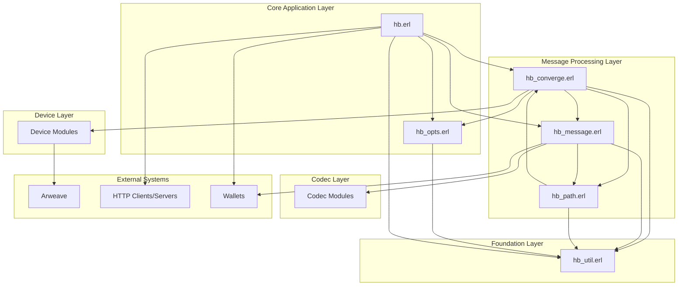

# HyperBEAM Core Infrastructure Summary

## Overview

After analyzing the six core infrastructure modules of HyperBEAM, we have gained a comprehensive understanding of the system's architectural foundations. This document synthesizes these findings to present a cohesive view of how these components work together to implement the Converge Protocol on top of Arweave.

HyperBEAM is a decentralized node based system that provides a computation layer on top of Arweave's permanent storage layer. The system enables:

1. **Verifiable Computation**: Execution of computation on stored data with signed attestations of correctness
2. **Message-Based Architecture**: All operations are expressed as messages that can be transformed
3. **Cryptographic Verification**: Computational history is traceable and verifiable
4. **Flexibility**: Support for different message formats, protocols, and devices

## Core Components and Their Relationships

### 1. Utility Functions (`hb_util.erl`)

- **Purpose**: Provides foundational utilities used throughout the system
- **Key Capabilities**: Type conversion, ID handling, debugging tools, message utilities
- **Relationship to Other Modules**: 
  - Used by nearly all other modules (49 dependents)
  - Primary provider of low-level operations like type conversion and ID handling

### 2. Converge Protocol (`hb_converge.erl`)

- **Purpose**: Implements the core resolution mechanism for the Converge Protocol
- **Key Capabilities**: Message resolution, path traversal, cryptographic operations, device dispatch
- **Relationship to Other Modules**:
  - Core of message processing, used by 49 dependents
  - Interfaces with device modules for specialized message handling
  - Works with `hb_path` for resolution path management

### 3. Configuration (`hb_opts.erl`)

- **Purpose**: Manages system configuration across all components
- **Key Capabilities**: Default settings, configuration overrides, environment integration
- **Relationship to Other Modules**:
  - Referenced by 42 modules for configuration needs
  - Provides device registry mapping device names to Erlang modules
  - Configures core subsystems like storage and HTTP

### 4. Messaging Core (`hb_message.erl`)

- **Purpose**: Handles message format conversion and cryptographic operations
- **Key Capabilities**: Format conversion, attestation, verification, message matching
- **Relationship to Other Modules**:
  - Used by 39 other modules
  - Works with codec modules to translate between message formats
  - Provides message signing/verification used by `hb_converge`

### 5. Path Management (`hb_path.erl`)

- **Purpose**: Manages request paths and cryptographic history paths
- **Key Capabilities**: Path parsing, HashPath generation and verification, path manipulation
- **Relationship to Other Modules**:
  - Works closely with `hb_converge` for message resolution
  - Integrates with cryptographic modules for history verification
  - Provides path operations used in message processing

### 6. Core Application (`hb.erl`)

- **Purpose**: Entry point and orchestration of system components
- **Key Capabilities**: System initialization, server startup, wallet management, debugging
- **Relationship to Other Modules**:
  - Top-level module that coordinates other components
  - Configures and starts the HTTP server
  - Provides debugging infrastructure used across the system

## Architecture Diagram

## Key Architectural Patterns

From our analysis of the core infrastructure, several key architectural patterns emerge:

### 1. Layered Architecture

HyperBEAM follows a clean layered architecture:
- **Foundation Layer**: Common utilities and functions (`hb_util`)
- **Message Processing Layer**: Core protocol implementation
- **Device Layer**: Pluggable modules for specific message handling
- **Application Layer**: System orchestration and entry points

### 2. Message-Centric Design

All operations in HyperBEAM are expressed as messages:
- Messages are the primary unit of data and computation
- All messages can be serialized, signed, and verified
- Message resolution follows a consistent pattern across the system

### 3. Cryptographic Verification Chain

The system maintains cryptographic chains of message transformations:
- HashPaths track the history of message transformations
- Message IDs incorporate transformation history
- Multiple verification algorithms are supported

### 4. Extensible Device System

Computation logic is implemented through pluggable "devices":
- Each device implements specific message processing logic
- Devices are registered centrally and loaded dynamically
- Different devices can be stacked and composed

### 5. Format-Agnostic Message Processing

The system can handle multiple message formats:
- Type Annotated Binary Messages (TABM) serve as an intermediate representation
- Multiple codecs convert between formats
- Messages maintain semantic equivalence across format conversions

## Implications for Further Analysis

Based on our analysis of the core infrastructure, we can identify several implications for our continued exploration of HyperBEAM's architecture:

1. **Device Layer Dynamics**: The device system appears central to HyperBEAM's extensibility. The Phase 2.3 analysis of the device and process management subsystem will be critical to understanding how computation is actually performed.

2. **Storage Integration**: The interaction between the message processing layer and the storage subsystem (Phase 2.1) will be important to understand how messages persist and flow through the system.

3. **Network Protocol**: The HTTP subsystem (Phase 2.2) appears to be the primary interface for external interactions, including how messages enter and exit the system.

4. **Codec Flexibility**: The codec system (Phase 2.4) shows a clear separation between message semantics and representation, which will be important for understanding cross-system compatibility.

5. **Arweave Integration**: The specific mechanisms of Arweave integration (Phase 2.5) will be critical to understanding how HyperBEAM leverages the underlying storage layer.

## Open Questions

Several important questions emerge from our analysis:

1. **Distributed Consensus**: How does the system ensure consensus when multiple nodes are processing the same messages?

2. **Scalability Approach**: What mechanisms exist for scaling computation across nodes?

3. **Device Security Model**: How are devices verified and trusted, especially when loaded from external sources?

4. **Error Handling**: How does the system handle errors in message processing, particularly in a distributed context?

5. **Update Mechanisms**: How does the system handle updates to devices and protocols?

These questions will guide our continued analysis in Phases 2-4.
