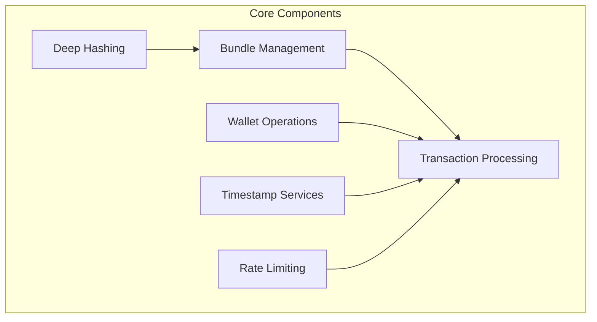
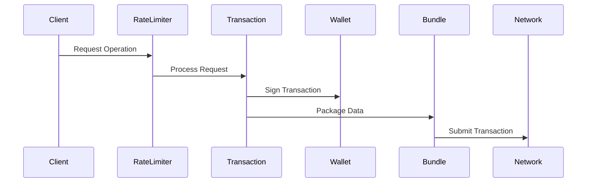
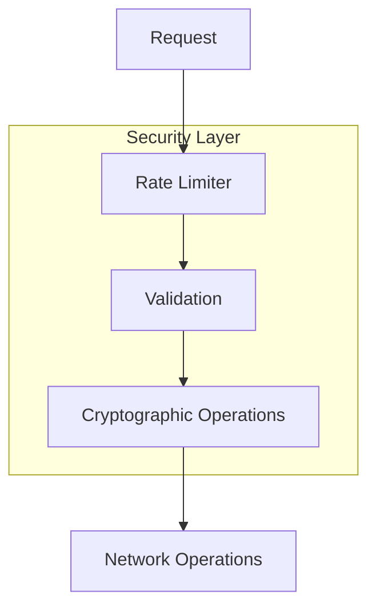

# Arweave Integration Overview

The Arweave integration layer in HyperBEAM represents a sophisticated and carefully architected system that bridges HyperBEAM's core functionality with the Arweave blockchain network. This integration enables seamless interaction with Arweave's permanent storage capabilities while maintaining the robustness and efficiency expected in a distributed system.

## System Architecture

The Arweave integration in HyperBEAM consists of six core modules that work together to provide comprehensive Arweave blockchain functionality. Each module is designed with specific responsibilities and clear interfaces, enabling a modular yet cohesive system that can handle complex blockchain operations while maintaining high performance and reliability:



## Module Responsibilities

### 1. Deep Hashing (ar_deep_hash)
- Implements cryptographic hashing for data structures using advanced algorithms optimized for blockchain data
- Provides consistent data representation across the network through deterministic hashing
- Ensures data integrity through cryptographic verification chains
- Supports transaction verification with multi-level hash trees
- Implements Arweave's specific deep hash algorithm for compatibility

### 2. Bundle Management (ar_bundles)
- Handles data bundling operations with optimized memory usage
- Manages bundle creation and parsing with support for large data sets
- Implements bundle validation with comprehensive integrity checks
- Coordinates data item handling with efficient binary processing
- Provides streaming capabilities for large bundle operations

### 3. Transaction Processing (ar_tx)
- Manages complete transaction lifecycle from creation to confirmation
- Implements cryptographic signing and verification with multiple algorithms
- Handles transaction validation with comprehensive rule checking
- Provides JSON serialization with efficient binary encoding
- Supports advanced transaction types and formats

### 4. Wallet Operations (ar_wallet)
- Manages cryptographic keys with secure generation and storage
- Implements comprehensive wallet functionality including backup
- Handles key storage with encryption and secure practices
- Provides signing operations with multiple algorithm support
- Implements secure key derivation and management

### 5. Timestamp Services (ar_timestamp)
- Maintains accurate network time with drift compensation
- Provides efficient timestamp caching with automatic updates
- Ensures time synchronization across distributed systems
- Manages timestamp servers with failover support
- Implements precise timing for transaction validation

### 6. Rate Limiting (ar_rate_limiter)
- Controls request rates with adaptive algorithms
- Implements intelligent throttling based on system load
- Manages exemptions with configurable rules
- Ensures network stability through predictive limiting
- Provides detailed metrics for monitoring and tuning

## Integration Flow



## Key Features

### 1. Transaction Management
- Comprehensive transaction creation
- Robust validation system
- Multiple signature types
- JSON format support

### 2. Security Features
- Strong cryptographic operations
- Secure key management
- Protected wallet storage
- Rate limiting protection

### 3. Network Integration
- Efficient data bundling
- Rate-controlled access
- Timestamp synchronization
- Transaction broadcasting

## Data Flow


## Component Interactions

### 1. Internal Communication
- Clear module boundaries
- Well-defined interfaces
- Standardized data formats
- Efficient state management

### 2. External Integration
- Network protocol compliance
- Format standardization
- Error handling
- Resource management

## Performance Considerations

### 1. Optimization Strategies
- Efficient caching
- Rate control
- Resource management
- Process isolation

### 2. Resource Management
- Memory optimization
- Process control
- File handling
- State persistence

## Security Architecture



## Implementation Details

### 1. Code Organization
- Modular structure
- Clear dependencies
- Consistent patterns
- Clean interfaces

### 2. Error Handling
- Comprehensive validation
- Clear error messages
- Recovery mechanisms
- Logging support

## Future Directions

### 1. Planned Enhancements
- Performance optimization
- Enhanced security
- Extended functionality
- Improved monitoring

### 2. Maintenance Focus
- Code quality
- Documentation
- Testing coverage
- Performance metrics

## Best Practices

### 1. Development Guidelines
- Clear documentation
- Consistent patterns
- Error handling
- Resource management

### 2. Operational Guidelines
- Monitoring setup
- Performance tracking
- Security updates
- Maintenance procedures

## Integration Guidelines

### 1. Usage Patterns
```erlang
% Transaction Creation
TX = ar_tx:new(Target, Reward, Quantity, LastTX),
SignedTX = ar_wallet:sign(TX, WalletKey),
ok = ar_rate_limiter:throttle(Peer, Path, Opts),
Result = submit_transaction(SignedTX).
```

### 2. Configuration
```erlang
% System Configuration
Config = #{
    rate_limit => #{
        enabled => true,
        rpm => 60
    },
    wallet => #{
        type => {rsa, 65537},
        storage => "./"
    }
}.
```

## Deployment Considerations

### 1. System Requirements
- Erlang runtime
- File system access
- Network connectivity
- Resource allocation

### 2. Monitoring Needs
- Performance metrics
- Error tracking
- Resource usage
- Network status

## Conclusion

The Arweave integration provides a robust and efficient interface to the Arweave blockchain, with careful attention to:

- Security
- Performance
- Reliability
- Maintainability

The modular design and clear interfaces make it a solid foundation for blockchain operations within HyperBEAM.
