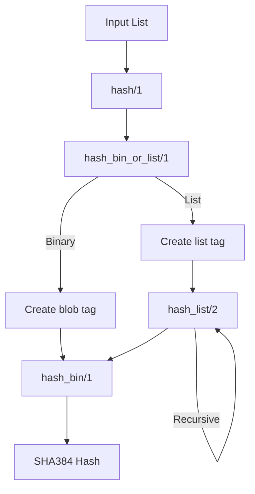

# Module Analysis: ar_deep_hash

## Overview

The `ar_deep_hash` module implements Arweave's deep hash algorithm, which is used to create deterministic hashes of complex data structures. This is a critical component for data integrity and verification in the Arweave protocol.

## Module Structure

```erlang
-module(ar_deep_hash).
-export([hash/1]).
```

The module exposes a single public function `hash/1` while keeping implementation details private.

## Core Functionality

### Public Interface

#### hash/1
```erlang
hash(List) when is_list(List) -> hash_bin_or_list(List).
```

- **Purpose**: Entry point for deep hashing any data structure
- **Input**: A list structure that may contain nested lists or binaries
- **Output**: A SHA384 hash of the data structure
- **Pattern Matching**: Only accepts lists as input, directing to internal processing

### Internal Functions

#### hash_bin_or_list/1
```erlang
hash_bin_or_list(Bin) when is_binary(Bin) ->
    Tag = <<"blob", (integer_to_binary(byte_size(Bin)))/binary>>,
    hash_bin(<<(hash_bin(Tag))/binary, (hash_bin(Bin))/binary>>);
hash_bin_or_list(List) when is_list(List) ->
    Tag = <<"list", (integer_to_binary(length(List)))/binary>>,
    hash_list(List, hash_bin(Tag)).
```

- **Purpose**: Handles both binary and list inputs with appropriate tagging
- **Binary Processing**:
  * Creates a "blob" tag with size information
  * Combines hashed tag with hashed binary
  * Returns final hash of the combination
- **List Processing**:
  * Creates a "list" tag with length information
  * Initiates recursive list processing with tag hash as accumulator

#### hash_list/2
```erlang
hash_list([], Acc) ->
    Acc;
hash_list([Head | List], Acc) ->
    HashPair = <<Acc/binary, (hash_bin_or_list(Head))/binary>>,
    NewAcc = hash_bin(HashPair),
    hash_list(List, NewAcc).
```

- **Purpose**: Recursively processes list elements
- **Implementation**:
  * Base case returns accumulator for empty list
  * Recursive case:
    - Processes each element with hash_bin_or_list
    - Combines with accumulator
    - Hashes the combination
    - Continues recursion

#### hash_bin/1
```erlang
hash_bin(Bin) when is_binary(Bin) ->
    crypto:hash(sha384, Bin).
```

- **Purpose**: Core hashing function using SHA384
- **Implementation**:
  * Takes binary input
  * Uses Erlang's crypto module
  * Returns SHA384 hash

## Data Flow



## Key Characteristics

1. **Deterministic Processing**
   - Consistent tagging scheme
   - Ordered list processing
   - Standardized hash algorithm (SHA384)

2. **Type Safety**
   - Pattern matching ensures correct input types
   - Binary-specific handling
   - List-specific handling

3. **Recursive Design**
   - Handles nested data structures
   - Maintains consistent processing order
   - Accumulator-based list processing

4. **Performance Considerations**
   - Binary concatenation for hash pairs
   - Single-pass list processing
   - Efficient accumulator usage

## Integration Points

1. **Crypto System**
   - Uses Erlang's crypto module
   - Specifically SHA384 algorithm
   - Binary data handling

2. **Binary Processing**
   - Native binary operations
   - Size calculations
   - Concatenation operations

3. **Data Structures**
   - List processing
   - Binary handling
   - Tag generation

## Error Handling

The module relies on pattern matching for input validation:
- Lists must be proper lists
- Binaries must be valid binaries
- No explicit error handling beyond pattern matching

## Performance Implications

1. **Memory Usage**
   - Recursive list processing
   - Binary concatenation
   - Accumulator-based approach

2. **Processing Efficiency**
   - Single-pass list traversal
   - Minimal data copying
   - Efficient binary operations

3. **Scalability**
   - Handles arbitrary nested structures
   - Memory usage proportional to structure depth
   - CPU usage linear with data size

## Security Considerations

1. **Cryptographic Security**
   - Uses SHA384 for strong cryptographic properties
   - Deterministic output for identical inputs
   - Collision resistance inherited from SHA384

2. **Input Processing**
   - Type checking through pattern matching
   - No direct memory manipulation
   - Protected against malformed inputs

## Usage Examples

```erlang
% Hash a simple list
ar_deep_hash:hash([1, 2, 3])

% Hash a nested structure
ar_deep_hash:hash([<<"data">>, [1, 2], <<"more">>])

% Hash binary data
ar_deep_hash:hash([<<"binary data">>])
```

## Related Components

- Arweave bundle system
- Transaction processing
- Data verification systems
- Block processing

## Future Considerations

1. **Potential Enhancements**
   - Additional data type support
   - Performance optimizations
   - Caching mechanisms
   - Parallel processing for large structures

2. **Maintenance Needs**
   - Monitor crypto module updates
   - Performance profiling
   - Security audits
   - Documentation updates
