# HyperBEAM System Overview - Part 1: Architecture & Integration

## System Architecture

The HyperBEAM system is built on a layered architecture that emphasizes modularity, scalability, and maintainability. Each layer provides specific functionality while maintaining clear boundaries and well-defined interfaces.

### Core Subsystems

1. **Message & Protocol Layer**
   The foundation of system communication, this layer handles all message processing and protocol operations:
   - Implements the core message protocol that enables communication between all system components
   - Provides a flexible abstraction layer that allows protocol versioning and evolution over time
   - Manages message transformation between different formats and protocols
   - Implements intelligent routing logic to direct messages to appropriate handlers
   - Ensures protocol compatibility across system versions

2. **Storage & Caching Layer**
   A sophisticated multi-tiered storage system that balances performance and durability:
   - Manages distributed storage across multiple nodes and storage backends
   - Implements an intelligent caching system with multiple levels of caching
   - Provides various persistence strategies optimized for different use cases
   - Ensures data consistency across distributed storage nodes
   - Handles data replication and recovery operations

3. **Network & HTTP Layer**
   The system's communication gateway, handling all external interactions:
   - Provides a robust HTTP server and client implementation
   - Manages client connections and request handling
   - Integrates with external gateways and services
   - Adapts between different network protocols and formats
   - Implements connection pooling and management

4. **Process Management Layer**
   Orchestrates system processes and resources:
   - Controls process lifecycle from creation to termination
   - Implements comprehensive event handling and logging
   - Collects and analyzes system metrics
   - Monitors resource usage and system health
   - Manages process recovery and fault tolerance

5. **System Core Layer**
   The central coordination layer that ties all components together:
   - Handles system initialization and shutdown
   - Manages the supervision tree for fault tolerance
   - Controls system configuration and settings
   - Manages feature flags and system capabilities
   - Coordinates cross-cutting concerns

6. **Integration Layer**
   Enables seamless interaction with external systems:
   - Provides adapters for various external protocols
   - Handles data format transformation
   - Manages compatibility with external systems
   - Implements integration patterns and strategies
   - Ensures reliable external communication

7. **Development Tools Layer**
   Supports development and debugging activities:
   - Provides comprehensive debugging capabilities
   - Implements detailed system tracing
   - Offers development utilities and helpers
   - Supports testing and validation
   - Enables system introspection

8. **Testing & Examples Layer**
   Ensures system quality and provides usage guidance:
   - Implements a comprehensive test framework
   - Provides example implementations
   - Includes performance benchmarking tools
   - Contains test vectors for validation
   - Demonstrates best practices

### System Boundaries

The system's boundaries are carefully defined to ensure proper separation of concerns while enabling efficient communication:

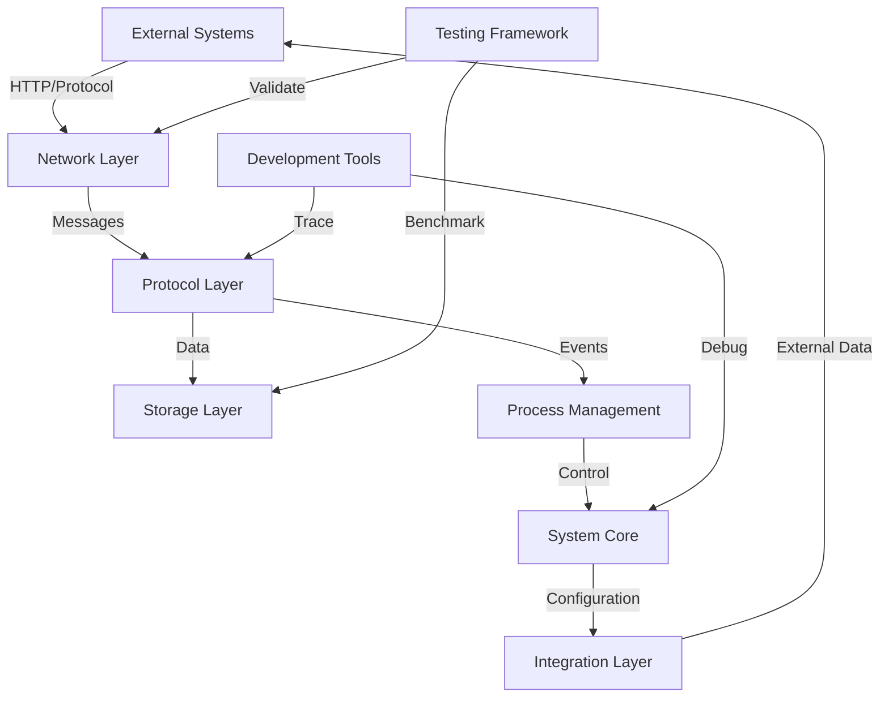

This architecture enables:
- Clear separation between external and internal components
- Well-defined communication paths between layers
- Proper isolation of concerns
- Efficient resource management
- Comprehensive system observability

### Interface Definitions

The system defines two primary types of interfaces:

1. **External Interfaces**
   These interfaces handle all external communication:
   ```erlang
   % HTTP interface demonstrating the request lifecycle
   handle_request(Request) ->
       % 1. Parse and validate incoming request
       ParsedRequest = parse_request(Request),
       
       % 2. Process through system layers
       % This shows how requests flow through the system
       Response = process_request(ParsedRequest),
       
       % 3. Format response for external consumption
       format_response(Response).
   ```
   This pattern ensures:
   - Proper request validation
   - Consistent error handling
   - Clean protocol boundaries
   - Secure processing
   - Proper response formatting

2. **Internal Interfaces**
   These interfaces manage inter-layer communication:
   ```erlang
   % Layer communication showing state management
   process_message(Message, State) ->
       % 1. Handle protocol-specific aspects
       {ok, ProcessedMsg} = protocol:handle(Message),
       
       % 2. Manage storage operations
       {ok, StoredData} = storage:store(ProcessedMsg),
       
       % 3. Update process state
       process:notify(stored, StoredData).
   ```
   This approach provides:
   - Clean layer separation
   - State isolation
   - Clear data flow
   - Error boundaries
   - Transaction management

## Component Integration

The system's components work together through well-defined integration patterns:

### Core Message Flow

The sequence diagram shows how messages flow through the system:

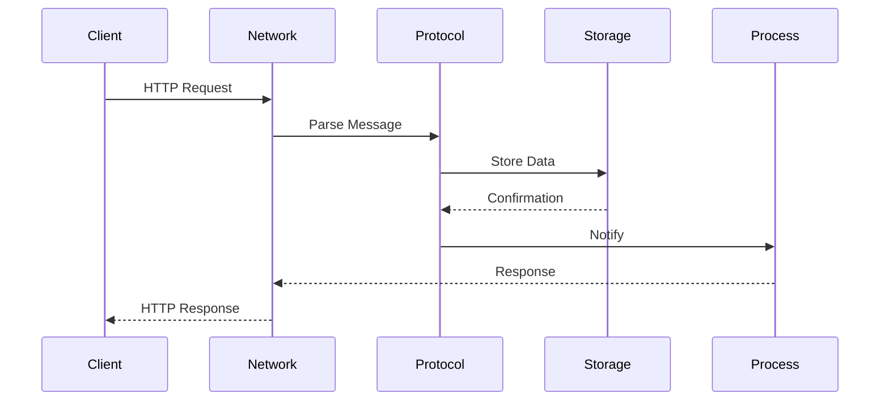

This flow demonstrates:
- Clean request handling
- Proper data transformation
- State management
- Response coordination
- Error propagation
### Cross-Cutting Concerns

1. **Security Management**
   ```erlang
   % Security handling
   secure_operation(Operation, Context) ->
       % 1. Authentication
       {ok, Auth} = authenticate(Context),
       
       % 2. Authorization
       {ok, Perms} = authorize(Auth, Operation),
       
       % 3. Execution
       {ok, Result} = execute(Operation, Perms).
   ```

2. **Error Handling**
   ```erlang
   % Error propagation
   handle_error(Error, Context) ->
       % 1. Log error
       log_error(Error),
       
       % 2. Notify monitoring
       notify_monitoring(Error),
       
       % 3. Handle recovery
       handle_recovery(Error, Context).
   ```

### System-Wide Patterns

1. **Message Processing**
   ```erlang
   % Standard message flow
   process_flow() ->
       receive
           {message, Msg} ->
               % 1. Protocol handling
               {ok, Processed} = protocol:handle(Msg),
               
               % 2. Business logic
               {ok, Result} = logic:process(Processed),
               
               % 3. Response
               respond(Result)
       end.
   ```

2. **State Management**
   ```erlang
   % State handling pattern
   manage_state(Operation, State) ->
       % 1. Validate operation
       {ok, ValidOp} = validate(Operation),
       
       % 2. Apply operation
       {ok, NewState} = apply_operation(ValidOp, State),
       
       % 3. Persist changes
       persist_state(NewState).
   ```

## Data Flow Architecture

### Message Transformation

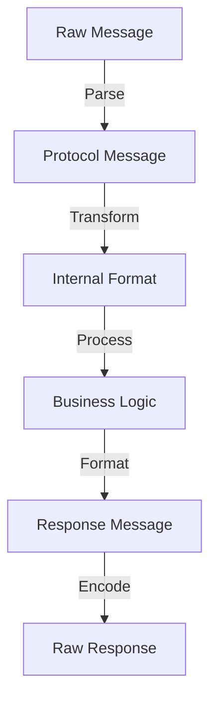

### State Management

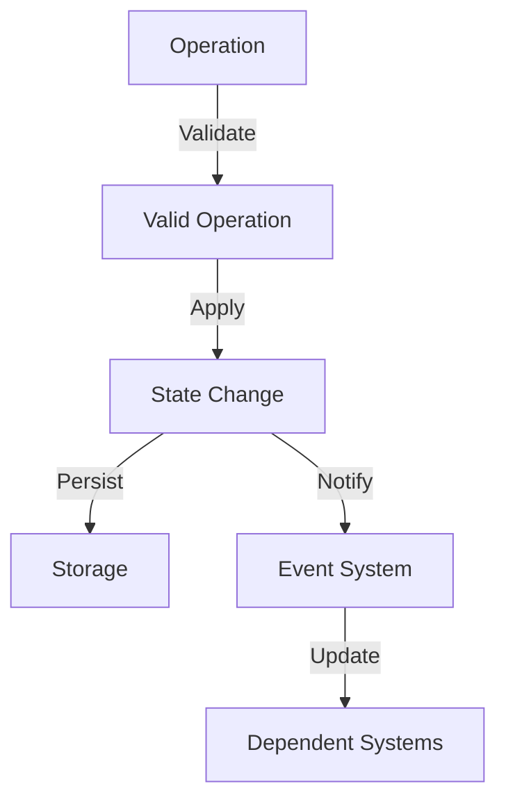

### Resource Management

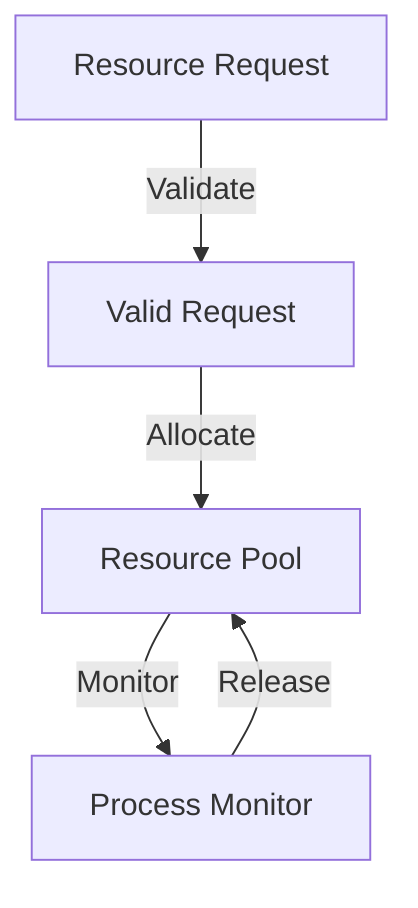

## Core Capabilities

### Message Handling
- Protocol versioning
- Message transformation
- Routing logic
- Error handling

### State Management
- Distributed state
- Consistency control
- Cache management
- Persistence strategies

### Process Control
- Lifecycle management
- Resource monitoring
- Event handling
- Error recovery

### Network Operations
- HTTP handling
- Protocol adaptation
- Gateway integration
- Client management

# Patterns & Capabilities

## System-Wide Patterns

The HyperBEAM system employs several fundamental patterns that ensure consistency, reliability, and maintainability across all components.

### 1. Message Processing Pattern
This core pattern defines how messages flow through the system:

```erlang
% The message processing pattern demonstrates the standard flow for handling
% all types of messages in the system. This pattern ensures consistent
% processing, proper error handling, and reliable state management.
process_message(Message, Context) ->
    % Phase 1: Message Validation
    % Ensures message integrity and proper format
    {ok, ValidMsg} = validate_message(Message),
    
    % Phase 2: Protocol Processing
    % Handles protocol-specific transformations
    {ok, ProcessedMsg} = process_protocol(ValidMsg),
    
    % Phase 3: Business Logic
    % Applies domain-specific operations
    {ok, Result} = apply_business_logic(ProcessedMsg, Context),
    
    % Phase 4: Response Formation
    % Creates appropriate response format
    format_response(Result).
```

This pattern provides:
- **Consistent Processing**: Every message follows the same basic flow
- **Clear Boundaries**: Each phase has distinct responsibilities
- **Error Isolation**: Problems are caught and handled at appropriate levels
- **State Management**: Context is properly maintained and transformed
- **Protocol Independence**: Core logic is separated from protocol details

### 2. State Management Pattern
A sophisticated approach to handling system state:

```erlang
% The state management pattern shows how the system handles state changes
% across different components. It ensures consistency, durability, and proper
% event propagation.
manage_state_change(Operation, State, Context) ->
    % Phase 1: State Validation
    % Ensures the operation is valid for current state
    {ok, ValidOp} = validate_state_operation(Operation, State),
    
    % Phase 2: State Transformation
    % Applies the operation to create new state
    {ok, NewState} = apply_state_change(ValidOp, State),
    
    % Phase 3: Persistence
    % Ensures state changes are durable
    {ok, StoredState} = persist_state(NewState),
    
    % Phase 4: Event Propagation
    % Notifies interested parties of state change
    notify_state_change(StoredState, Context).
```

Key aspects:
- **Atomic Operations**: State changes are all-or-nothing
- **Consistency Checks**: Validates state transitions
- **Durability Guarantees**: Ensures state persistence
- **Event Notification**: Keeps system components synchronized
- **Context Awareness**: Maintains operation context

### 3. Resource Management Pattern
Careful handling of system resources:

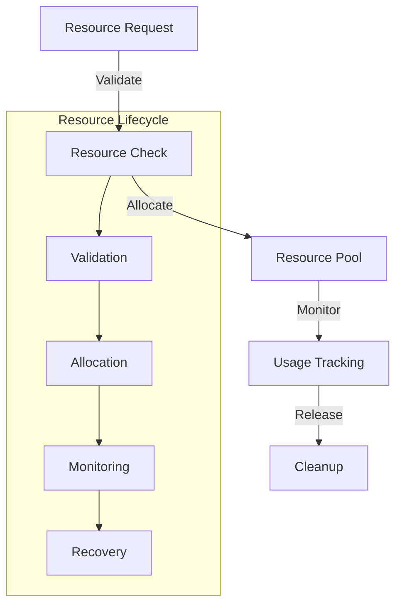

This pattern ensures:
- **Resource Tracking**: All resources are monitored
- **Proper Cleanup**: Resources are always released
- **Usage Optimization**: Efficient resource utilization
- **Error Recovery**: Handles resource failures gracefully
- **Scalability**: Manages resource pools effectively

## Core Capabilities

The system provides several fundamental capabilities that enable its operation:

### 1. Message Handling System
A sophisticated message processing system:

```erlang
% The message handling system demonstrates the core capability for
% processing different types of messages with appropriate transformations
% and routing.
handle_message(Message) ->
    % Phase 1: Protocol Detection
    Protocol = detect_protocol(Message),
    
    % Phase 2: Message Transformation
    TransformedMsg = transform_for_protocol(Message, Protocol),
    
    % Phase 3: Routing
    Route = determine_route(TransformedMsg),
    
    % Phase 4: Processing
    process_with_route(TransformedMsg, Route).
```

Features:
- **Protocol Adaptation**: Handles multiple protocols
- **Message Transformation**: Converts between formats
- **Intelligent Routing**: Directs messages appropriately
- **Error Recovery**: Handles message processing failures
- **Performance Optimization**: Efficient message handling

### 2. State Management System
Comprehensive state handling capabilities:

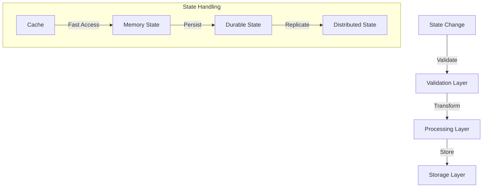

Provides:
- **State Consistency**: Maintains system invariants
- **Distributed State**: Handles state across nodes
- **Caching Strategy**: Optimizes state access
- **Recovery Mechanisms**: Handles state corruption
- **Version Control**: Manages state evolution

### 3. Process Management System
Sophisticated process control:

```erlang
% The process management system shows how the system handles process
% lifecycle, monitoring, and recovery operations.
manage_process(ProcessSpec) ->
    % Phase 1: Process Creation
    {ok, Pid} = create_process(ProcessSpec),
    
    % Phase 2: Monitoring Setup
    {ok, Monitor} = setup_monitoring(Pid),
    
    % Phase 3: Resource Allocation
    {ok, Resources} = allocate_resources(Pid),
    
    % Phase 4: Lifecycle Management
    manage_lifecycle(Pid, Monitor, Resources).
```

Features:
- **Lifecycle Control**: Manages process states
- **Resource Management**: Handles process resources
- **Monitoring**: Tracks process health
- **Recovery**: Handles process failures
- **Scaling**: Manages process pools

### 4. Network Operations System
Comprehensive network handling:

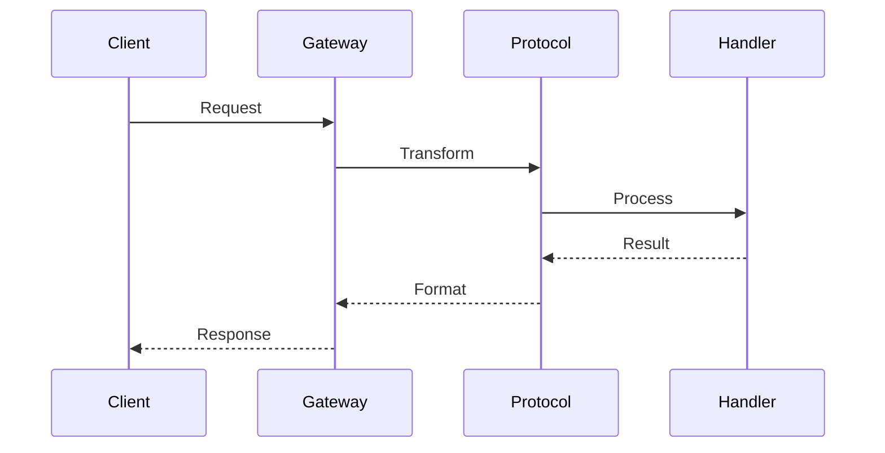

Capabilities:
- **Protocol Support**: Multiple protocol handling
- **Connection Management**: Manages network connections
- **Load Balancing**: Distributes network load
- **Error Handling**: Manages network failures
- **Security**: Ensures secure communication

#  Design 

## Design Philosophy

The HyperBEAM system is built on several core design principles that guide its architecture and implementation:

### 1. Message-Centric Architecture
The system treats messages as first-class citizens:

```erlang
% The message-centric approach demonstrates how all system operations
% are expressed through message passing, ensuring clean interfaces and
% strong isolation between components.
handle_operation(Operation) ->
    % Phase 1: Message Creation
    % Transform operation into a message format that can flow through the system
    Message = create_message(Operation),
    
    % Phase 2: Message Processing
    % Route and handle the message through appropriate channels
    {ok, ProcessedMsg} = process_message(Message),
    
    % Phase 3: State Update
    % Apply message effects to system state
    {ok, NewState} = apply_message(ProcessedMsg),
    
    % Phase 4: Response
    % Generate appropriate response message
    create_response(NewState).
```

This philosophy ensures:
- **Clean Interfaces**: All interactions are message-based
- **Strong Isolation**: Components communicate only through messages
- **Easy Testing**: Messages can be intercepted and verified
- **Clear Boundaries**: System boundaries are well-defined
- **Audit Capability**: Message flows can be traced and analyzed

### 2. Layered Responsibility
The system is organized in clear layers with distinct responsibilities:

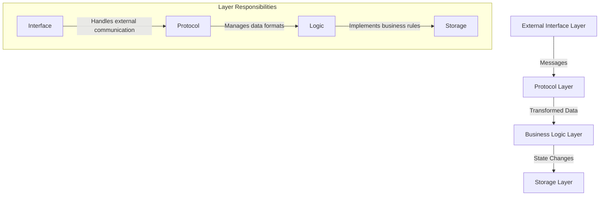

Benefits:
- **Clear Separation**: Each layer has distinct responsibilities
- **Easy Maintenance**: Changes are localized to specific layers
- **Simple Testing**: Layers can be tested in isolation
- **Clean Architecture**: Dependencies flow in one direction
- **Flexible Evolution**: Layers can evolve independently

### 3. State Management Philosophy
A comprehensive approach to system state:

```erlang
% The state management philosophy shows how the system thinks about
% and handles state changes, ensuring consistency and reliability
% across all operations.
manage_system_state(Operation, Context) ->
    % Phase 1: State Access
    % Retrieve current state with proper isolation
    {ok, CurrentState} = get_isolated_state(Context),
    
    % Phase 2: State Validation
    % Ensure operation is valid for current state
    {ok, ValidatedOp} = validate_operation(Operation, CurrentState),
    
    % Phase 3: State Transition
    % Apply operation with proper tracking
    {ok, NewState} = apply_state_transition(ValidatedOp, CurrentState),
    
    % Phase 4: State Persistence
    % Ensure state changes are durable
    persist_state_change(NewState, Context).
```

Key principles:
- **State Isolation**: State changes are contained and controlled
- **Explicit Transitions**: State changes are clearly defined
- **Change Tracking**: State modifications are tracked
- **Recovery Support**: State can be recovered and rebuilt
- **Consistency Rules**: State changes follow clear rules

### 4. Error Handling Strategy
A sophisticated approach to system reliability:

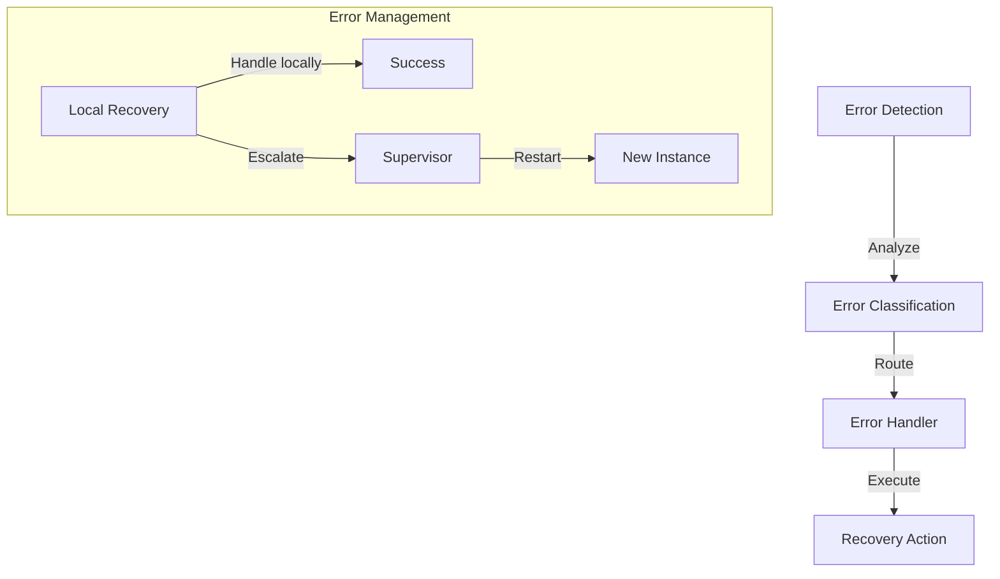

This ensures:
- **Early Detection**: Problems are caught early
- **Clean Recovery**: Errors are handled gracefully
- **State Protection**: System state is preserved
- **Clear Patterns**: Error handling is consistent
- **Proper Escalation**: Problems are routed appropriately

## System Evolution

### 1. Extension Points
The system provides several key extension mechanisms:

```erlang
% Extension mechanism showing how the system can be extended
% without modifying core components
extend_system(Extension) ->
    % Phase 1: Validation
    % Ensure extension meets system requirements
    {ok, ValidExt} = validate_extension(Extension),
    
    % Phase 2: Integration
    % Connect extension to system
    {ok, Connected} = integrate_extension(ValidExt),
    
    % Phase 3: Activation
    % Enable extension functionality
    activate_extension(Connected).
```

Features:
- **Plugin Architecture**: Easy system extension
- **Clean Integration**: Extensions follow clear patterns
- **Version Management**: Extensions are versioned
- **Dependency Handling**: Extension dependencies are managed
- **Resource Control**: Extension resources are controlled

### 2. Growth Areas
Key areas for system expansion:

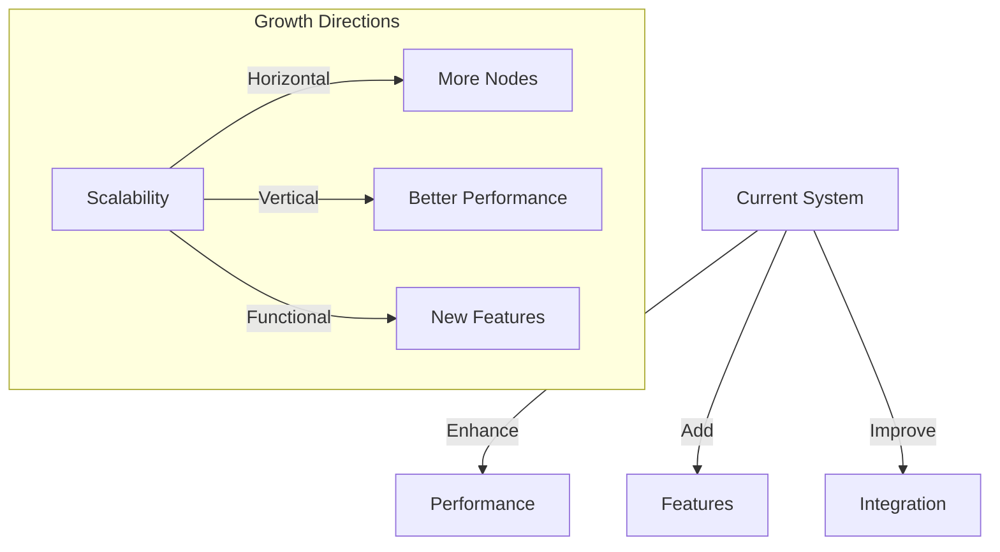

Priorities:
- **Performance Optimization**: Enhance system speed
- **Feature Expansion**: Add new capabilities
- **Integration Enhancement**: Better external system support
- **Scalability Improvement**: Handle larger loads
- **Security Enhancement**: Strengthen system security

### 3. Future Architecture
Vision for system evolution:

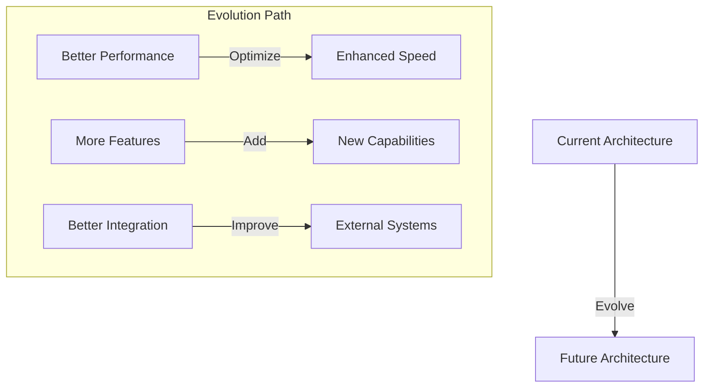

Goals:
- **Enhanced Performance**: Faster operation
- **Better Scalability**: Handle more load
- **More Features**: Additional capabilities
- **Better Integration**: Improved connectivity
- **Enhanced Security**: Stronger protection

## Design Decisions

### 1. Architectural Choices
Key decisions that shape the system:

1. **Message-Based Communication**
   - Why: Clean interfaces, strong isolation
   - Impact: Easy testing, clear boundaries
   - Trade-offs: Some performance overhead
   - Benefits: Simple debugging, clear flow

2. **Layered Architecture**
   - Why: Clear separation, easy maintenance
   - Impact: Clean dependencies, simple testing
   - Trade-offs: Some indirection overhead
   - Benefits: Easy evolution, clear structure

### 2. Implementation Choices
Critical implementation decisions:

1. **Erlang Platform**
   - Why: Excellent concurrency, strong reliability
   - Impact: Great scalability, robust operation
   - Trade-offs: Learning curve, ecosystem size
   - Benefits: Perfect for distributed systems

2. **Supervision Trees**
   - Why: Robust error handling, clean recovery
   - Impact: Strong reliability, easy maintenance
   - Trade-offs: Some complexity in setup
   - Benefits: Self-healing system, clear structure

