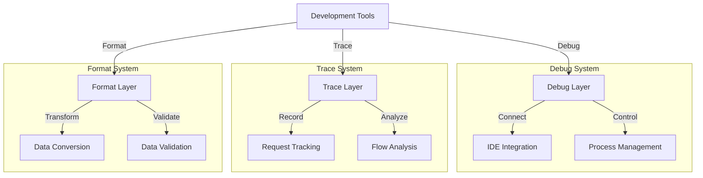
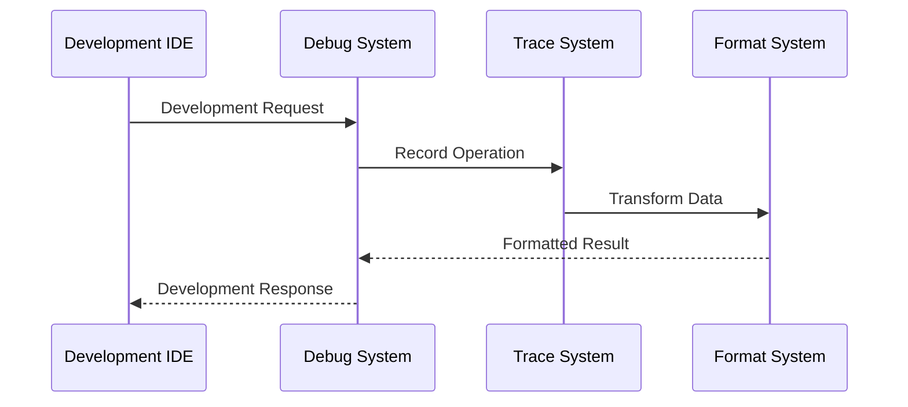

# Development Tools System Overview

## System Architecture

The Development Tools system provides a comprehensive suite of utilities that work together to support development, debugging, and system introspection. This system is built around four key components that provide essential development capabilities:

### 1. Debugging Infrastructure (hb_debugger)
The debugging component serves as the primary interface for development-time system inspection:

```erlang
% Core debugging interface
start_and_break(Module, Function, Args) ->
    start(),
    interpret(Module),
    SetRes = int:break_in(Module, Function, length(Args)),
    apply(Module, Function, Args).
```

This provides:
- **IDE Integration**: Seamless connection with VS Code, Emacs, and other LSP-compatible editors
- **Process Control**: Fine-grained control over execution and inspection
- **State Inspection**: Runtime examination of system state
- **Breakpoint Management**: Strategic execution control points

The debugger enables:
1. **Interactive Development**
   - Live code inspection
   - State examination
   - Execution control
   - Error investigation

2. **Development Workflow**
   - Editor integration
   - Process monitoring
   - State tracking
   - Error handling

### 2. Request Tracing (hb_tracer)
The tracing system provides detailed request lifecycle tracking:

```erlang
% Core tracing system
start_trace() ->
    Trace = #{ steps => queue:new() },
    TracePID = spawn(fun() -> trace_loop(Trace) end),
    ?event(trace, {trace_started, TracePID}),
    TracePID.
```

This enables:
- **Request Tracking**: Complete lifecycle monitoring
- **State Recording**: Step-by-step state capture
- **Error Context**: Detailed error information
- **Visual Feedback**: User-friendly output

The tracer provides:
1. **Request Monitoring**
   - Step recording
   - State tracking
   - Error detection
   - Flow visualization

2. **Development Insights**
   - Performance analysis
   - Error patterns
   - Flow optimization
   - System understanding

### 3. Protocol Support (hb_escape)
The protocol support system handles data encoding requirements:

```erlang
% Protocol encoding system
encode(Bin) when is_binary(Bin) ->
    list_to_binary(percent_escape(binary_to_list(Bin))).

decode(Bin) when is_binary(Bin) ->
    list_to_binary(percent_unescape(binary_to_list(Bin))).
```

This provides:
- **Case Handling**: Mixed-case value support
- **Protocol Compliance**: HTTP/2 and HTTP/3 compatibility
- **Safe Conversion**: Reliable data transformation
- **Clean Integration**: Seamless system interaction

The encoder enables:
1. **Protocol Integration**
   - Header handling
   - Case management
   - Safe transmission
   - Clean conversion

2. **Data Management**
   - Safe encoding
   - Clean decoding
   - State preservation
   - Error handling

### 4. Data Formatting (hb_json)
The formatting system provides data transformation capabilities:

```erlang
% Data formatting system
encode(Term) ->
    iolist_to_binary(json:encode(Term)).

decode(Bin) -> 
    json:decode(Bin).
```

This enables:
- **Format Abstraction**: Library-independent operation
- **Clean Conversion**: Safe data transformation
- **Format Support**: Multiple data formats
- **Easy Integration**: Simple system interaction

The formatter provides:
1. **Data Handling**
   - Term conversion
   - Format management
   - Safe transformation
   - Clean integration

2. **System Integration**
   - Library abstraction
   - Format support
   - Error handling
   - State preservation

## System Integration

### 1. Component Interaction
The components work together in a layered architecture:



This enables:
1. **Clean Architecture**
   - Clear separation
   - Strong cohesion
   - Loose coupling
   - Easy extension

2. **System Coordination**
   - Component interaction
   - State management
   - Error handling
   - Flow control

### 2. Data Flow
The system manages complex data flows:



This provides:
1. **Flow Management**
   - Request tracking
   - State monitoring
   - Error detection
   - Result formatting

2. **System Coordination**
   - Component synchronization
   - State preservation
   - Error propagation
   - Clean interaction

## Core Functionality

### 1. Development Support
The system provides comprehensive development capabilities:

1. **Debugging**
   ```erlang
   % Debug support
   start_and_break(Module, Function) ->
       start(),
       interpret(Module),
       break_in(Module, Function).
   ```

   Features:
   - Live debugging
   - State inspection
   - Flow control
   - Error analysis

2. **Tracing**
   ```erlang
   % Trace support
   record_step(TracePID, Step) ->
       TracePID ! {record_step, Step}.
   ```

   Provides:
   - Request tracking
   - State recording
   - Flow analysis
   - Error context

### 2. Protocol Support
The system enables protocol integration:

1. **Encoding**
   ```erlang
   % Protocol encoding
   encode_keys(Msg) when is_map(Msg) ->
       maps:from_list(
           lists:map(
               fun({Key, Value}) -> {encode(Key), Value} end,
               maps:to_list(Msg)
           )
       ).
   ```

   Features:
   - Safe encoding
   - Clean conversion
   - Error handling
   - State preservation

2. **Formatting**
   ```erlang
   % Data formatting
   format_error_trace(Trace) ->
       Steps = maps:get(steps, Trace, []),
       format_steps(Steps).
   ```

   Provides:
   - Clean formatting
   - Error context
   - Visual feedback
   - State representation

## System Capabilities

### 1. Development Tools
The system provides essential development capabilities:

1. **Debug Tools**
   - Interactive debugging
   - State inspection
   - Flow control
   - Error analysis

2. **Trace Tools**
   - Request tracking
   - State recording
   - Flow analysis
   - Error context

### 2. Integration Tools
Comprehensive integration support:

1. **Protocol Tools**
   - Data encoding
   - Format conversion
   - State preservation
   - Error handling

2. **Format Tools**
   - Data transformation
   - Format management
   - Clean conversion
   - Error handling

## Best Practices

### 1. Development Workflow
Recommended development approaches:

```erlang
% Development pattern
develop_feature() ->
    % Start debug session
    Debug = start_debug(),
    
    % Enable tracing
    Trace = start_trace(),
    
    % Execute with monitoring
    try
        execute_feature(Debug, Trace)
    after
        cleanup_resources()
    end.
```

### 2. Integration Pattern
Recommended integration approaches:

```erlang
% Integration pattern
integrate_system() ->
    % Format data
    Data = format_data(),
    
    % Encode for protocol
    Encoded = encode_data(Data),
    
    % Execute with tracing
    execute_with_trace(Encoded).
```

## Future Directions

### 1. Tool Enhancement
Potential improvements:

1. **Debug System**
   - Enhanced IDE integration
   - Better visualization
   - More control options
   - Performance tools

2. **Trace System**
   - Better analysis
   - More formats
   - Visual tools
   - Performance tracking

### 2. Integration Enhancement
Ways to improve integration:

1. **Protocol Support**
   - More protocols
   - Better handling
   - Clean integration
   - Performance optimization

2. **Format Support**
   - More formats
   - Better conversion
   - Clean integration
   - Performance optimization
