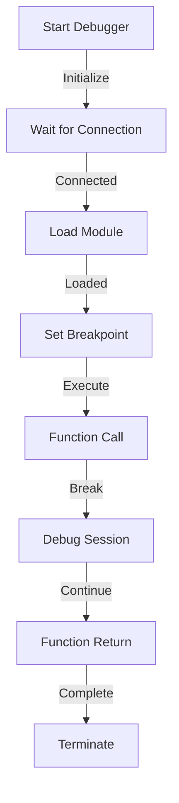

# Module: hb_debugger

## Basic Information
- **Source File:** hb_debugger.erl
- **Module Type:** Development Tool
- **Purpose:** External Debugger Integration Interface

## Purpose
Provides bootstrapping interfaces for external debuggers to connect to HyperBEAM. The module is specifically designed to work with Language Server Protocol (LSP) compatible editors like VS Code and Emacs through the erlang-ls extension, enabling graphical debugging capabilities.

## Interface

### Core Operations
- `start/0` - Initialize debugger and await connection
- `start_and_break/2, start_and_break/3` - Start debugger with breakpoint
- `await_breakpoint/0` - Wait for breakpoint to be set
- `interpret/1` - Load module into debugger (internal)
- `await_debugger/0, await_debugger/1` - Wait for debugger connection (internal)

## Dependencies

### Direct Dependencies
- debugger: Erlang debugger application
- int: Interpreter interface
- timer: Sleep functionality
- init: System control
- io: Output formatting

### Inverse Dependencies
- Used by development tools
- IDE integration point
- Debug workflow support

## Implementation Details

### Key Concepts

1. **Debugger Initialization**
   ```erlang
   % Start debugger and await connection
   start() ->
       io:format("Starting debugger...~n", []),
       DebuggerRes = application:ensure_all_started(debugger),
       io:format("Started debugger server. Result: ~p.~n", [DebuggerRes]),
       io:format(
           "Waiting for debugger. Node is: ~p. Cookie is: ~p.~n",
           [node(), erlang:get_cookie()]
       ),
       await_debugger().
   ```
   Features:
   - Application startup
   - Connection handling
   - Status reporting
   - Error handling

2. **Module Interpretation**
   ```erlang
   % Safe module interpretation
   interpret(Module) ->
       Parent = self(),
       spawn(fun() ->
           case int:interpretable(Module) of
               true ->
                   try Parent ! {interpreted, Module, int:i(Module) == ok}
                   catch _:_ ->
                       io:format("Could not load module: ~p.~n", [Module]),
                       false
                   end;
               Error ->
                   io:format(
                       "Could not interpret module: ~p. Error: ~p.~n",
                       [Module, Error]
                   ),
                   false
           end
       end).
   ```
   Provides:
   - Safe loading
   - Error handling
   - Status reporting
   - Timeout protection

3. **Breakpoint Management**
   ```erlang
   % Breakpoint setup and execution
   start_and_break(Module, Function, Args) ->
       start(),
       interpret(Module),
       SetRes = int:break_in(Module, Function, length(Args)),
       io:format(
           "Breakpoint set. Result from `int:break_in/3': ~p.~n",
           [SetRes]
       ),
       io:format("Invoking function...~n", []),
       apply(Module, Function, Args),
       io:format("Function invoked. Terminating.~n", []),
       init:stop().
   ```
   Features:
   - Breakpoint setup
   - Function execution
   - Status reporting
   - Clean termination

### State Management

1. **Connection State**
   ```erlang
   % Connection detection
   is_debugging_node_connected() ->
       case nodes() ++ nodes(hidden) of
           [] -> false;
           [Node | _] -> Node
       end.
   ```
   Handles:
   - Node detection
   - Connection state
   - Hidden nodes
   - Error handling

2. **Breakpoint State**
   ```erlang
   % Breakpoint monitoring
   await_breakpoint(N) ->
       io:format("Waiting for breakpoint to be set in function...~n", []),
       case int:all_breaks() of
           [] ->
               timer:sleep(1000),
               io:format("Still waiting for breakpoint after ~p seconds...~n", [N]),
               await_breakpoint(N + 1);
           [Breakpoint | _] ->
               io:format("Breakpoint set. Info: ~p.~n", [Breakpoint]),
               Breakpoint
       end.
   ```
   Manages:
   - Breakpoint status
   - Wait cycles
   - Status reporting
   - Error handling

### Error Handling

1. **Interpretation Errors**
   ```erlang
   % Safe module interpretation
   try Parent ! {interpreted, Module, int:i(Module) == ok}
   catch _:_ ->
       io:format("Could not load module: ~p.~n", [Module]),
       false
   end
   ```
   Ensures:
   - Safe loading
   - Error reporting
   - State recovery
   - Process isolation

2. **Connection Errors**
   ```erlang
   % Connection monitoring
   await_debugger(N) ->
       case is_debugging_node_connected() of
           false ->
               timer:sleep(1000),
               io:format("Still waiting for debugger after ~p seconds...~n", [N]),
               await_debugger(N + 1);
           Node ->
               io:format(
                   "External node connection detected. Peer: ~p.~n",
                   [Node]
               ),
               N
       end.
   ```
   Handles:
   - Connection failures
   - Timeout handling
   - Status reporting
   - State recovery

## Integration Points

1. **IDE Integration**
   - VS Code support
   - Emacs support
   - LSP compatibility
   - Configuration files

2. **Debugger System**
   - Process control
   - State tracking
   - Event handling
   - Resource management

3. **Node System**
   - Connection handling
   - State tracking
   - Error handling
   - Resource cleanup

## Analysis Insights

### Performance Considerations

1. **Startup Time**
   - ~10 second boot time
   - Connection delays
   - Resource allocation
   - State initialization

2. **Operation Efficiency**
   - Safe interpretation
   - Quick connection
   - Fast breakpoints
   - Clean termination

### Security Implications

1. **Node Security**
   - Cookie handling
   - Node visibility
   - Connection control
   - Resource protection

2. **Resource Safety**
   - Process isolation
   - State protection
   - Error containment
   - Clean termination

### Best Practices

1. **Debugger Setup**
   ```erlang
   % Recommended debugger initialization
   setup_debugger(Module, Function) ->
       start(),
       case interpret(Module) of
           true ->
               setup_breakpoint(Module, Function);
           false ->
               handle_interpretation_error(Module)
       end.
   ```

2. **Connection Handling**
   ```erlang
   % Recommended connection handling
   handle_connection() ->
       case await_debugger() of
           Node when is_atom(Node) ->
               setup_debugging(Node);
           timeout ->
               handle_timeout()
       end.
   ```

3. **Breakpoint Management**
   ```erlang
   % Recommended breakpoint handling
   manage_breakpoint(Module, Function) ->
       case int:break_in(Module, Function, 0) of
           ok -> monitor_execution();
           error -> handle_breakpoint_error()
       end.
   ```

### Example Usage

```erlang
% Start debugger and wait for connection
hb_debugger:start(),

% Start with breakpoint
hb_debugger:start_and_break(my_module, my_function),

% Start with breakpoint and args
hb_debugger:start_and_break(my_module, my_function, [arg1, arg2]),

% Wait for manual breakpoint
hb_debugger:await_breakpoint()
```

## Debug Flow



## Connection Flow

```mermaid
sequenceDiagram
    participant IDE as IDE/Editor
    participant Debug as Debugger
    participant Node as Erlang Node
    participant Mod as Module

    IDE->>Debug: Connect Request
    Debug->>Node: Start Server
    Node-->>Debug: Server Ready
    Debug-->>IDE: Ready for Connection
    
    IDE->>Debug: Set Breakpoint
    Debug->>Mod: Load Module
    Mod-->>Debug: Module Ready
    Debug->>Mod: Set Break
    
    Mod-->>Debug: Break Set
    Debug-->>IDE: Ready to Debug
