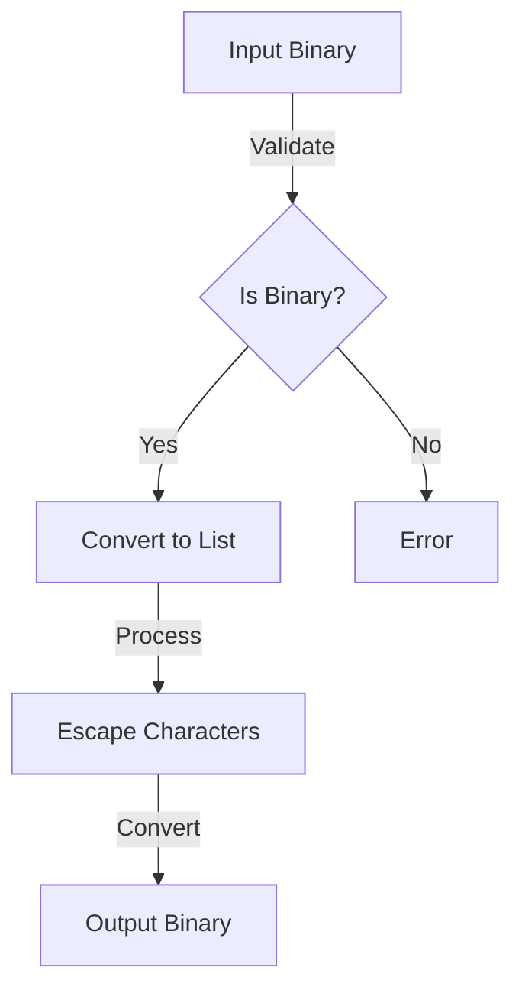

# Module: hb_escape

## Basic Information
- **Source File:** hb_escape.erl
- **Module Type:** Development Tool
- **Purpose:** HTTP Header Case Handling

## Purpose
Provides functionality for escaping and unescaping mixed case values in HTTP headers, specifically for AO-Core message transmission in HTTP/2 and HTTP/3 where uppercase header keys are disallowed. The module handles the conversion of mixed-case IDs to lowercase %-encoded URI-style strings.

## Interface

### Core Operations
- `encode/1` - URI encode a binary
- `decode/1` - Decode URI-encoded binary
- `encode_keys/1` - Encode map keys
- `decode_keys/1` - Decode map keys

## Dependencies

### Direct Dependencies
- lists: List operations
- binary: Binary manipulation
- maps: Map operations
- eunit: Testing framework

### Inverse Dependencies
- Used by HTTP handlers
- Protocol integration
- Message encoding

## Implementation Details

### Key Concepts

1. **URI Encoding**
   ```erlang
   % Binary encoding
   encode(Bin) when is_binary(Bin) ->
       list_to_binary(percent_escape(binary_to_list(Bin))).
   ```
   Features:
   - Binary handling
   - Character escaping
   - List conversion
   - Safe encoding

2. **URI Decoding**
   ```erlang
   % Binary decoding
   decode(Bin) when is_binary(Bin) ->
       list_to_binary(percent_unescape(binary_to_list(Bin))).
   ```
   Provides:
   - Binary handling
   - Character unescaping
   - List conversion
   - Safe decoding

3. **Map Key Handling**
   ```erlang
   % Key encoding in maps
   encode_keys(Msg) when is_map(Msg) ->
       maps:from_list(
           lists:map(
               fun({Key, Value}) -> {encode(Key), Value} end,
               maps:to_list(Msg)
           )
       ).
   ```
   Features:
   - Map traversal
   - Key encoding
   - Value preservation
   - Structure maintenance

### Character Handling

1. **Character Escaping**
   ```erlang
   % Character escape logic
   percent_escape([]) -> [];
   percent_escape([C | Cs]) when C >= $a, C =< $z -> [C | percent_escape(Cs)];
   percent_escape([C | Cs]) when C >= $0, C =< $9 -> [C | percent_escape(Cs)];
   percent_escape([C | Cs]) when
           C == $.; C == $-; C == $_; C == $/;
           C == $?; C == $&; C == $+ ->
       [C | percent_escape(Cs)];
   percent_escape([C | Cs]) -> [escape_byte(C) | percent_escape(Cs)].
   ```
   Handles:
   - Safe characters
   - Special characters
   - Byte encoding
   - Recursive processing

2. **Byte Encoding**
   ```erlang
   % Byte-level encoding
   escape_byte(C) when C >= 0, C =< 255 ->
       [$%, hex_digit(C bsr 4), hex_digit(C band 15)].

   hex_digit(N) when N >= 0, N =< 9 ->
       N + $0;
   hex_digit(N) when N > 9, N =< 15 ->
       N + $a - 10.
   ```
   Provides:
   - Hex conversion
   - Byte validation
   - Safe encoding
   - Character mapping

### Error Handling

1. **Input Validation**
   ```erlang
   % Binary validation
   encode(Bin) when is_binary(Bin) ->
       % Only accept binary input
       list_to_binary(percent_escape(binary_to_list(Bin))).
   ```
   Ensures:
   - Type checking
   - Input validation
   - Safe conversion
   - Error prevention

2. **Character Validation**
   ```erlang
   % Character validation
   hex_value(C) when C >= $0, C =< $9 ->
       C - $0;
   hex_value(C) when C >= $a, C =< $f ->
       C - $a + 10;
   hex_value(C) when C >= $A, C =< $F ->
       C - $A + 10.
   ```
   Handles:
   - Valid ranges
   - Case handling
   - Value mapping
   - Error prevention

## Integration Points

1. **HTTP System**
   - Header encoding
   - Key normalization
   - Value preservation
   - Protocol compliance

2. **Message System**
   - Map handling
   - Key encoding
   - Value preservation
   - Structure maintenance

3. **Protocol System**
   - HTTP/2 compliance
   - HTTP/3 compliance
   - Case handling
   - Safe transmission

## Analysis Insights

### Performance Considerations

1. **Memory Usage**
   ```erlang
   % Efficient list processing
   percent_escape([C | Cs]) when C >= $a, C =< $z -> [C | percent_escape(Cs)];
   percent_escape([C | Cs]) when C >= $0, C =< $9 -> [C | percent_escape(Cs)];
   ```
   Features:
   - Tail recursion
   - Pattern matching
   - Early returns
   - Memory efficiency

2. **Operation Efficiency**
   ```erlang
   % Efficient map processing
   encode_keys(Msg) when is_map(Msg) ->
       maps:from_list(
           lists:map(
               fun({Key, Value}) -> {encode(Key), Value} end,
               maps:to_list(Msg)
           )
       ).
   ```
   Provides:
   - Single pass
   - Bulk processing
   - Memory reuse
   - Fast conversion

### Security Implications

1. **Input Safety**
   - Binary validation
   - Character validation
   - Range checking
   - Safe conversion

2. **Output Safety**
   - Safe encoding
   - Valid characters
   - Protocol compliance
   - Error prevention

### Best Practices

1. **Encoding**
   ```erlang
   % Recommended encoding pattern
   handle_encoding(Input) ->
       case encode(Input) of
           Encoded when is_binary(Encoded) ->
               process_encoded(Encoded);
           Error ->
               handle_error(Error)
       end.
   ```

2. **Decoding**
   ```erlang
   % Recommended decoding pattern
   handle_decoding(Input) ->
       try decode(Input) of
           Decoded ->
               process_decoded(Decoded)
       catch
           _:_ ->
               handle_error(invalid_encoding)
       end.
   ```

3. **Map Handling**
   ```erlang
   % Recommended map processing
   process_map(Map) ->
       EncodedMap = encode_keys(Map),
       validate_map(EncodedMap),
       process_encoded_map(EncodedMap).
   ```

### Example Usage

```erlang
% Encode binary
Encoded = hb_escape:encode(<<"Hello-World">>),

% Decode binary
Decoded = hb_escape:decode(<<"%48ello-%57orld">>),

% Encode map keys
EncodedMap = hb_escape:encode_keys(#{
    <<"MixedCase">> => value,
    <<"UPPERCASE">> => other_value
}),

% Decode map keys
DecodedMap = hb_escape:decode_keys(#{
    <<"%4dixedCase">> => value,
    <<"%55PPERCASE">> => other_value
})
```

## Encoding Flow



## Character Processing Flow

```mermaid
sequenceDiagram
    participant Input as Input Char
    participant Check as Validator
    participant Escape as Escaper
    participant Output as Output

    Input->>Check: Character
    Check->>Check: Check Range
    
    alt Safe Character
        Check->>Output: Keep Original
    else Special Character
        Check->>Escape: Encode
        Escape->>Output: Hex Encoded
    end
