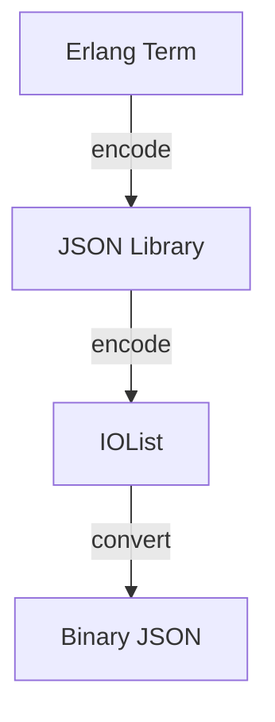

# Module: hb_json

## Basic Information
- **Source File:** hb_json.erl
- **Module Type:** Development Tool
- **Purpose:** JSON Encoding/Decoding Wrapper

## Purpose
Provides an abstraction layer over JSON encoding and decoding operations, supporting both maps and Jiffy's 'ejson' format. The module is designed to allow easy switching between different JSON libraries in the future by centralizing JSON operations through a single interface.

## Interface

### Core Operations
- `encode/1` - Convert Erlang term to JSON string
- `decode/1` - Convert JSON string to Erlang term
- `decode/2` - Convert JSON string with options (forwards to decode/1)

## Dependencies

### Direct Dependencies
- json: Underlying JSON library
- iolist: Binary conversion

### Inverse Dependencies
- Used by data handlers
- Protocol integration
- Message formatting

## Implementation Details

### Key Concepts

1. **JSON Encoding**
   ```erlang
   % Term to JSON conversion
   encode(Term) ->
       iolist_to_binary(json:encode(Term)).
   ```
   Features:
   - Term conversion
   - Binary output
   - Library abstraction
   - Safe encoding

2. **JSON Decoding**
   ```erlang
   % JSON to term conversion
   decode(Bin) -> json:decode(Bin).
   decode(Bin, _Opts) -> decode(Bin).
   ```
   Provides:
   - JSON parsing
   - Term conversion
   - Options handling
   - Library abstraction

### Format Support

1. **Data Types**
   - Maps
   - Jiffy ejson
   - Binary strings
   - Erlang terms

2. **Conversion Flow**
   ```erlang
   % Encoding flow
   Erlang Term -> json:encode -> iolist -> binary

   % Decoding flow
   Binary -> json:decode -> Erlang Term
   ```

### Error Handling

1. **Encoding Safety**
   ```erlang
   % Safe encoding with binary conversion
   encode(Term) ->
       iolist_to_binary(json:encode(Term)).
   ```
   Ensures:
   - Valid output
   - Binary format
   - Error propagation
   - Safe conversion

2. **Decoding Safety**
   ```erlang
   % Safe decoding with option handling
   decode(Bin, _Opts) -> decode(Bin).
   ```
   Handles:
   - Input validation
   - Option ignoring
   - Error propagation
   - Safe conversion

## Integration Points

1. **Data System**
   - Term encoding
   - JSON decoding
   - Format conversion
   - Binary handling

2. **Protocol System**
   - Message formatting
   - Data exchange
   - Format standardization
   - Error handling

3. **Library System**
   - JSON abstraction
   - Library switching
   - Format support
   - Error handling

## Analysis Insights

### Performance Considerations

1. **Memory Usage**
   - Binary conversion
   - Efficient encoding
   - Direct decoding
   - Memory optimization

2. **Operation Efficiency**
   - Single pass
   - Direct conversion
   - Library delegation
   - Minimal overhead

### Security Implications

1. **Data Safety**
   - Input validation
   - Output safety
   - Error handling
   - Format checking

2. **Format Safety**
   - Valid JSON
   - Safe conversion
   - Error handling
   - Type checking

### Best Practices

1. **Encoding**
   ```erlang
   % Recommended encoding pattern
   handle_encoding(Term) ->
       try
           JSON = hb_json:encode(Term),
           process_json(JSON)
       catch
           Error -> handle_error(Error)
       end.
   ```

2. **Decoding**
   ```erlang
   % Recommended decoding pattern
   handle_decoding(JSON) ->
       try
           Term = hb_json:decode(JSON),
           process_term(Term)
       catch
           Error -> handle_error(Error)
       end.
   ```

3. **Integration**
   ```erlang
   % Recommended integration pattern
   process_data(Data) ->
       case needs_json(Data) of
           true -> 
               JSON = hb_json:encode(Data),
               send_json(JSON);
           false ->
               process_raw(Data)
       end.
   ```

### Example Usage

```erlang
% Encode term to JSON
JSON = hb_json:encode(#{
    name => <<"test">>,
    value => 42,
    list => [1, 2, 3]
}),

% Decode JSON to term
Term = hb_json:decode(<<"{\"name\":\"test\",\"value\":42}">>),

% Decode with options (forwards to basic decode)
Term = hb_json:decode(JSON, #{})
```

## Encoding Flow



## Decoding Flow

```mermaid
sequenceDiagram
    participant App as Application
    participant JSON as hb_json
    participant Lib as JSON Library
    participant Term as Erlang Term

    App->>JSON: decode(Binary)
    JSON->>Lib: json:decode
    Lib->>Lib: Parse JSON
    Lib->>Term: Convert
    Term-->>App: Erlang Term
