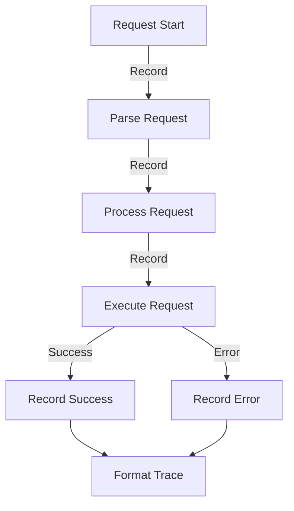

# Module: hb_tracer

## Basic Information
- **Source File:** hb_tracer.erl
- **Module Type:** Development Tool
- **Purpose:** Request Lifecycle Tracing

## Purpose
Provides a comprehensive tracing system for tracking request lifecycles through HyperBEAM, from initial HTTP receipt through processing and response. The module enables detailed monitoring and debugging of request flows with user-friendly error reporting.

## Interface

### Core Operations
- `start_trace/0` - Initialize new trace process
- `record_step/2` - Record trace step
- `get_trace/1` - Retrieve trace data
- `format_error_trace/1` - Format trace for error display

## Dependencies

### Direct Dependencies
- queue: Queue data structure
- string: String manipulation
- maps: Map operations
- lists: List operations

### Inverse Dependencies
- Used by request handlers
- Error reporting system
- Debug workflow support

## Implementation Details

### Key Concepts

1. **Trace Process**
   ```erlang
   % Trace process initialization
   start_trace() ->
       Trace = #{ steps => queue:new() },
       TracePID = spawn(fun() -> trace_loop(Trace) end),
       ?event(trace, {trace_started, TracePID}),
       TracePID.
   ```
   Features:
   - Dedicated process
   - Queue-based storage
   - Event tracking
   - Process isolation

2. **Trace Recording**
   ```erlang
   % Trace step recording
   trace_loop(Trace) ->
       receive
           {record_step, Step} ->
               Steps = maps:get(steps, Trace),
               NewTrace = Trace#{steps => queue:in(Step, Steps)},
               ?event(trace, {step_recorded, Step}),
               trace_loop(NewTrace);
           {get_trace, From} ->
               TraceWithList = Trace#{steps => queue:to_list(maps:get(steps, Trace))},
               From ! {trace, TraceWithList},
               trace_loop(Trace)
       end.
   ```
   Provides:
   - Step recording
   - State management
   - Event tracking
   - Data retrieval

3. **Error Formatting**
   ```erlang
   % Error trace formatting
   format_error_trace(Trace) ->
       Steps = maps:get(steps, Trace, []),
       TraceMap = lists:foldl(fun (TraceItem, Acc) ->
           case TraceItem of
               {http, {parsed_singleton, _, _}} -> 
                   maps:put(request_parsing, true, Acc);
               {ao_core, {stage, Stage, _Task}} -> 
                   maps:put(resolve_stage, Stage, Acc);
               {ao_result, {load_device_failed, _, _, _, _, {exec_exception, Exception}, _, _}} ->
                   maps:put(error, Exception, Acc);
               {ao_result, {exec_failed, _, _, _, {func, Fun}, _, {exec_exception, Error}, _, _}} ->
                   maps:put(error, {Fun, Error}, Acc);
               _ -> Acc
           end
       end, #{}, Steps).
   ```
   Features:
   - Error analysis
   - Stage tracking
   - User-friendly output
   - Emoji integration

### State Management

1. **Trace State**
   ```erlang
   % Trace state structure
   Trace = #{ 
       steps => queue:new() 
   }
   ```
   Manages:
   - Step sequence
   - Queue operations
   - State updates
   - Data retrieval

2. **Error State**
   ```erlang
   % Error state tracking
   TraceMap = #{
       request_parsing => boolean(),
       resolve_stage => integer(),
       error => term()
   }
   ```
   Tracks:
   - Parse status
   - Stage progress
   - Error details
   - Execution state

### Error Handling

1. **Trace Retrieval**
   ```erlang
   % Safe trace retrieval
   get_trace(TracePID) ->
       TracePID! {get_trace, self()},
       receive
           {trace, Trace} ->
               Trace
           after 5000 ->
               ?event(trace, {trace_timeout, TracePID}),
               {trace, #{}}
       end.
   ```
   Ensures:
   - Timeout handling
   - Default values
   - Event tracking
   - Clean recovery

2. **Error Formatting**
   ```erlang
   % Error message formatting
   TraceStrings = ["Oops! Something went wrong. Here's the rundown:"],
   ParsingTrace = case maps:get(request_parsing, TraceMap, false) of
       false ->
           TraceStrings ++ [[failure_emoji(), "Parsing your request"]];
       true ->
           TraceStrings ++ [[checkmark_emoji(), "Parsing your request"]]
   end.
   ```
   Provides:
   - Clear messages
   - Visual indicators
   - Stage tracking
   - Error context

## Integration Points

1. **Request System**
   - HTTP handling
   - Request tracking
   - Error detection
   - State monitoring

2. **Error System**
   - Error formatting
   - Message generation
   - Visual indicators
   - User feedback

3. **Debug System**
   - Trace collection
   - State tracking
   - Event monitoring
   - Error analysis

## Analysis Insights

### Performance Considerations

1. **Memory Usage**
   - Queue-based storage
   - Process isolation
   - State management
   - Resource cleanup

2. **Operation Efficiency**
   - Fast recording
   - Quick retrieval
   - Smart formatting
   - Clean termination

### Security Implications

1. **Process Safety**
   - Isolated processes
   - State protection
   - Error containment
   - Resource cleanup

2. **Data Safety**
   - Controlled access
   - Safe formatting
   - Error handling
   - State protection

### Best Practices

1. **Trace Management**
   ```erlang
   % Recommended trace handling
   handle_trace() ->
       TracePID = start_trace(),
       try
           process_request(TracePID)
       after
           format_trace(TracePID)
       end.
   ```

2. **Error Handling**
   ```erlang
   % Recommended error handling
   handle_error(TracePID, Error) ->
       record_step(TracePID, {error, Error}),
       Trace = get_trace(TracePID),
       format_error_trace(Trace).
   ```

3. **State Management**
   ```erlang
   % Recommended state handling
   manage_state(TracePID, State) ->
       record_step(TracePID, {state, State}),
       process_state(State).
   ```

### Example Usage

```erlang
% Start tracing
TracePID = hb_tracer:start_trace(),

% Record steps
hb_tracer:record_step(TracePID, {http, {request_received}}),
hb_tracer:record_step(TracePID, {http, {parsing_started}}),
hb_tracer:record_step(TracePID, {http, {parsed_singleton, ReqData, _}}),

% Get trace
Trace = hb_tracer:get_trace(TracePID),

% Format error trace
ErrorMessage = hb_tracer:format_error_trace(Trace)
```

## Trace Flow



## Error Flow

```mermaid
sequenceDiagram
    participant Req as Request
    participant Trace as Tracer
    participant Error as Error Handler
    participant Format as Formatter

    Req->>Trace: Record Step
    Trace->>Error: Detect Error
    Error->>Trace: Record Error
    
    Trace->>Format: Get Trace
    Format->>Format: Process Steps
    Format->>Format: Add Emojis
    Format-->>Req: Error Message
