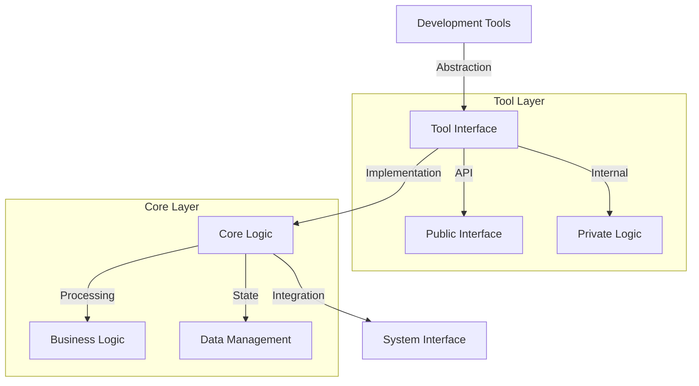
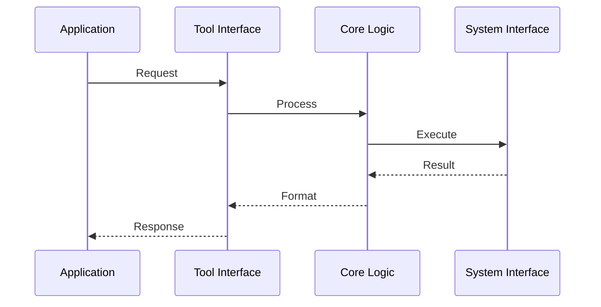
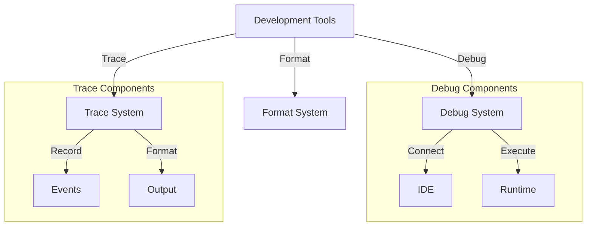

# Development Tools Observations

## Architectural Patterns

### 1. Tool Abstraction
The development tools demonstrate strong abstraction patterns:

1. **Interface Abstraction**
   - `hb_json`: Abstracts JSON library implementation
   - `hb_escape`: Abstracts character encoding/decoding
   - `hb_debugger`: Abstracts debugger connection
   - `hb_tracer`: Abstracts request tracing

2. **Implementation Hiding**
   ```erlang
   % JSON library abstraction
   encode(Term) ->
       iolist_to_binary(json:encode(Term)).
   ```
   Features:
   - Clean interfaces
   - Library independence
   - Easy switching
   - Future flexibility

### 2. Process Management
Strong process handling patterns:

1. **Process Isolation**
   ```erlang
   % Tracer process creation
   start_trace() ->
       Trace = #{ steps => queue:new() },
       TracePID = spawn(fun() -> trace_loop(Trace) end),
       ?event(trace, {trace_started, TracePID}),
       TracePID.
   ```
   Provides:
   - State isolation
   - Error containment
   - Resource management
   - Clean termination

2. **Message Passing**
   ```erlang
   % Trace recording
   record_step(TracePID, Step) ->
       TracePID! {record_step, Step}.
   ```
   Features:
   - Asynchronous operation
   - State management
   - Event tracking
   - Error handling

### 3. Error Handling
Sophisticated error handling approaches:

1. **Safe Operations**
   ```erlang
   % Safe module interpretation
   interpret(Module) ->
       Parent = self(),
       spawn(fun() ->
           case int:interpretable(Module) of
               true -> try_interpret(Module, Parent);
               Error -> handle_error(Error)
           end
       end).
   ```
   Ensures:
   - Operation safety
   - Error recovery
   - State protection
   - Resource cleanup

2. **Timeout Management**
   ```erlang
   % Timeout handling
   get_trace(TracePID) ->
       TracePID! {get_trace, self()},
       receive
           {trace, Trace} -> Trace
           after 5000 -> {trace, #{}}
       end.
   ```
   Provides:
   - Operation timeouts
   - Default values
   - Clean recovery
   - State protection

## Implementation Patterns

### 1. State Management
Consistent state handling approaches:

1. **Process State**
   - Dedicated processes
   - Message-based updates
   - State isolation
   - Clean termination

2. **Data State**
   - Queue-based storage
   - Map structures
   - Binary handling
   - Safe conversion

### 2. Resource Management
Careful resource handling:

1. **Process Resources**
   - Process spawning
   - Resource tracking
   - Clean termination
   - Error recovery

2. **Memory Resources**
   - Binary handling
   - Efficient conversion
   - Resource cleanup
   - State management

### 3. Protocol Integration
Clean protocol handling:

1. **HTTP Integration**
   - Header encoding
   - Case handling
   - Protocol compliance
   - Safe transmission

2. **Debug Protocol**
   - Debugger connection
   - State tracking
   - Event handling
   - Safe operation

## Common Themes

### 1. Safety First
All modules prioritize safety:

1. **Operation Safety**
   - Input validation
   - Safe conversion
   - Error handling
   - State protection

2. **Resource Safety**
   - Process isolation
   - Resource tracking
   - Clean termination
   - Error recovery

### 2. Flexibility
Modules designed for flexibility:

1. **Library Independence**
   - Clean abstractions
   - Easy switching
   - Future proofing
   - Clear interfaces

2. **Protocol Support**
   - Multiple formats
   - Easy extension
   - Clean integration
   - Safe handling

### 3. Developer Focus
Strong developer experience:

1. **Debugging Support**
   - Easy connection
   - Clear tracing
   - Visual feedback
   - Error context

2. **Tool Integration**
   - IDE support
   - Protocol support
   - Clear interfaces
   - Easy usage

## Areas for Improvement

### 1. Documentation
Documentation could be enhanced:

1. **Usage Examples**
   - More examples
   - Common patterns
   - Best practices
   - Error scenarios

2. **Integration Guides**
   - Setup guides
   - Tool chains
   - Common flows
   - Error handling

### 2. Testing
Testing could be expanded:

1. **Test Coverage**
   - Edge cases
   - Error scenarios
   - Integration tests
   - Performance tests

2. **Test Tools**
   - Helper functions
   - Test utilities
   - Coverage tools
   - Performance tools

## Future Directions

### 1. Tool Enhancement
Potential improvements:

1. **Debugger**
   - More features
   - Better integration
   - Visual tools
   - Performance tools

2. **Tracer**
   - More formats
   - Better visualization
   - Performance tracking
   - Error analysis

### 2. Integration Enhancement
Ways to improve integration:

1. **IDE Support**
   - More editors
   - Better integration
   - Visual tools
   - Debug support

2. **Tool Chain**
   - Better workflow
   - Tool combination
   - Clear patterns
   - Easy setup

## Development Patterns

### 1. Code Structure


### 2. Process Flow


## Integration Architecture

### 1. Component Structure


### 2. Data Flow
```mermaid
sequenceDiagram
    participant IDE as Development IDE
    participant Tools as Dev Tools
    participant Core as Core System
    participant Output as System Output

    IDE->>Tools: Development Request
    Tools->>Core: Process Request
    Core->>Tools: System Response
    Tools->>Output: Format Output
    Output-->>IDE: Developer Feedback
