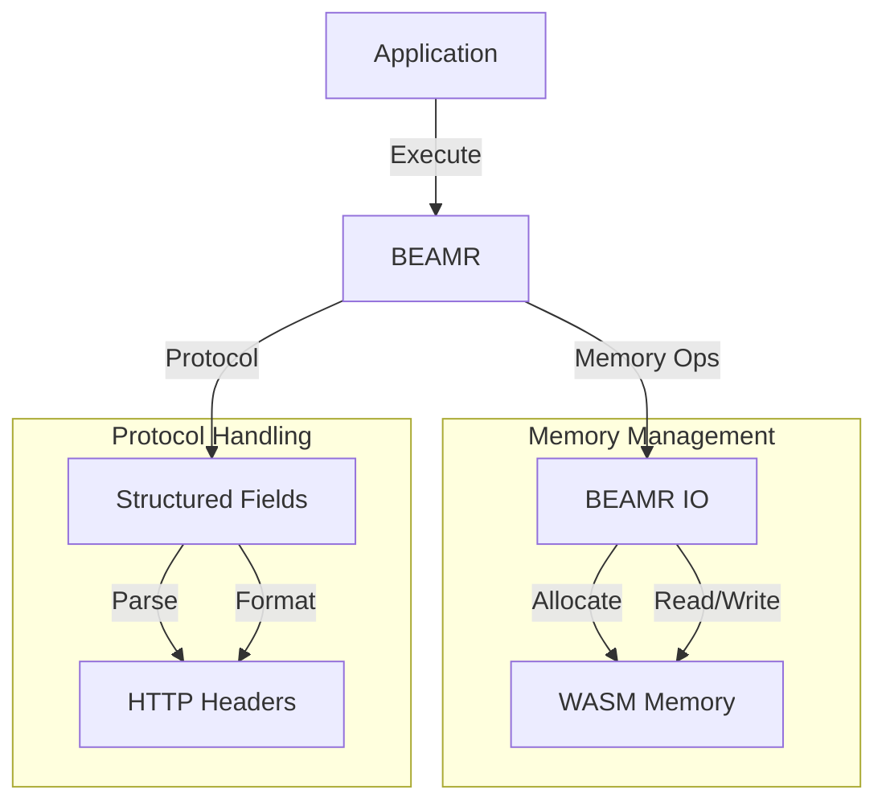
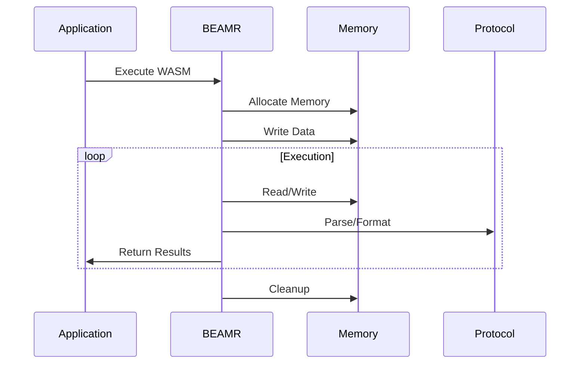

# Integration System Overview

## System Architecture

The Integration system provides a sophisticated layer for interfacing with external systems and protocols. It consists of three key components that work together to enable seamless integration:

### 1. WASM Runtime Integration (hb_beamr)
The BEAMR (BEAM Runtime) module serves as the primary interface for WebAssembly execution:

```erlang
% Core WASM execution interface
start(WasmBinary) ->
    WASM = spawn(fun() ->
        ok = load_driver(),
        Port = open_port({spawn, "hb_beamr"}, []),
        Port ! {self(), {command, term_to_binary({init, WasmBinary, Mode})}},
        worker(Port, Self)
    end).
```

This provides:
- Asynchronous WASM execution
- Process isolation for safety
- Resource management
- Error handling
- State tracking

The module enables:
1. **Long-running WASM executions**
   - Process supervision
   - Resource management
   - State persistence
   - Error recovery

2. **Erlang Integration**
   - Function calls
   - Message passing
   - Resource sharing
   - Error propagation

### 2. Memory Management (hb_beamr_io)
The BEAMR I/O module handles all memory operations for WASM instances:

```erlang
% Memory management interface
write_string(WASM, Data) when is_pid(WASM) andalso is_binary(Data) ->
    DataSize = byte_size(Data) + 1,
    String = <<Data/bitstring, 0:8>>,
    case malloc(WASM, DataSize) of
        {ok, Ptr} ->
            case write(WASM, Ptr, String) of
                ok -> {ok, Ptr};
                {error, Error} -> {error, Error}
            end;
        Error -> Error
    end.
```

This enables:
1. **Safe Memory Operations**
   - Bounds checking
   - Type validation
   - Resource tracking
   - Error handling

2. **Resource Management**
   - Memory allocation
   - Resource cleanup
   - State tracking
   - Error recovery

### 3. Protocol Integration (hb_structured_fields)
The Structured Fields module implements RFC-9651 for HTTP header handling:

```erlang
% Type system for structured fields
-type sh_list() :: [sh_item() | sh_inner_list()].
-type sh_inner_list() :: {list, [sh_item()], sh_params()}.
-type sh_params() :: [{binary(), sh_bare_item()}].
-type sh_dictionary() :: [{binary(), sh_item() | sh_inner_list()}].
```

This provides:
1. **Type Mapping**
   - Clear type definitions
   - Validation rules
   - Error handling
   - Standard compliance

2. **Data Processing**
   - Parsing operations
   - Formatting operations
   - Type conversion
   - Error handling

## System Integration

### 1. Component Interaction
The components work together in a layered architecture:



This enables:
1. **Clean Abstraction**
   - Clear interfaces
   - Resource isolation
   - Error handling
   - State management

2. **Resource Coordination**
   - Memory sharing
   - Process communication
   - State synchronization
   - Error propagation

### 2. Data Flow
The system manages complex data flows:



This provides:
1. **Data Management**
   - Memory operations
   - Protocol handling
   - Resource tracking
   - Error handling

2. **State Management**
   - Process state
   - Memory state
   - Protocol state
   - Error state

## Core Functionality

### 1. WASM Execution
The system provides robust WASM execution:

1. **Process Management**
   ```erlang
   % Process supervision
   worker(Port, Listener) ->
       receive
           stop ->
               port_close(Port),
               ok;
           {wasm_send, NewListener, Message} ->
               Port ! {self(), Message},
               worker(Port, NewListener)
       end.
   ```

   Features:
   - Process isolation
   - Message passing
   - Resource management
   - Error handling

2. **Memory Operations**
   ```erlang
   % Memory management
   malloc(WASM, Size) ->
       case hb_beamr:call(WASM, "malloc", [Size]) of
           {ok, [Ptr]} -> {ok, Ptr};
           {error, Error} -> {error, Error}
       end.
   ```

   Provides:
   - Safe allocation
   - Resource tracking
   - Error handling
   - State management

### 2. Protocol Handling
The system implements sophisticated protocol handling:

1. **Type System**
   ```erlang
   % Protocol type mapping
   to_dictionary(Map) when is_map(Map) ->
       to_dictionary(maps:to_list(Map));
   to_dictionary(Pairs) when is_list(Pairs) ->
       to_dictionary([], Pairs).
   ```

   Features:
   - Clear mappings
   - Type validation
   - Error handling
   - Standard compliance

2. **Data Processing**
   ```erlang
   % Data formatting
   bare_item({string, String}) ->
       [$", escape_string(String, <<>>), $"];
   bare_item({token, Token}) ->
       Token.
   ```

   Provides:
   - Clean formatting
   - Type conversion
   - Error handling
   - Standard compliance

## System Capabilities

### 1. Integration Support
The system enables various integration scenarios:

1. **WASM Integration**
   - Long-running executions
   - Resource management
   - State persistence
   - Error handling

2. **Protocol Integration**
   - Standard compliance
   - Type conversion
   - Data validation
   - Error handling

### 2. Resource Management
Comprehensive resource handling:

1. **Memory Management**
   - Safe allocation
   - Resource tracking
   - State management
   - Error handling

2. **Process Management**
   - Process isolation
   - Message passing
   - State tracking
   - Error handling

## Best Practices

### 1. Error Handling
Robust error handling strategies:

```erlang
% Recommended error handling
handle_operation(Input) ->
    try
        case validate_input(Input) of
            ok -> perform_operation(Input);
            {error, Reason} -> handle_error(Reason)
        end
    catch
        Error:Reason:Stack ->
            cleanup_resources(),
            {error, {Error, Reason, Stack}}
    end.
```

### 2. Resource Management
Safe resource management patterns:

```erlang
% Recommended resource handling
manage_resources(Resources) ->
    try
        allocate_resources(Resources),
        use_resources(Resources)
    after
        cleanup_resources(Resources)
    end.
```

### 3. Integration Patterns
Clean integration approaches:

```erlang
% Recommended integration pattern
integrate_system(System) ->
    case initialize_system(System) of
        {ok, Handle} ->
            setup_resources(Handle),
            monitor_system(Handle);
        Error ->
            handle_error(Error)
    end.
```

## Future Directions

### 1. System Enhancement
Potential improvements:

1. **WASM Integration**
   - More features
   - Better tooling
   - Performance optimization
   - Resource management

2. **Protocol Support**
   - New standards
   - Better parsing
   - More formats
   - Better validation

### 2. Performance Optimization
Areas for optimization:

1. **Memory Usage**
   - Better allocation
   - Smarter cleanup
   - Resource pooling
   - State caching

2. **Processing Speed**
   - Faster parsing
   - Better formatting
   - Resource reuse
   - State management
