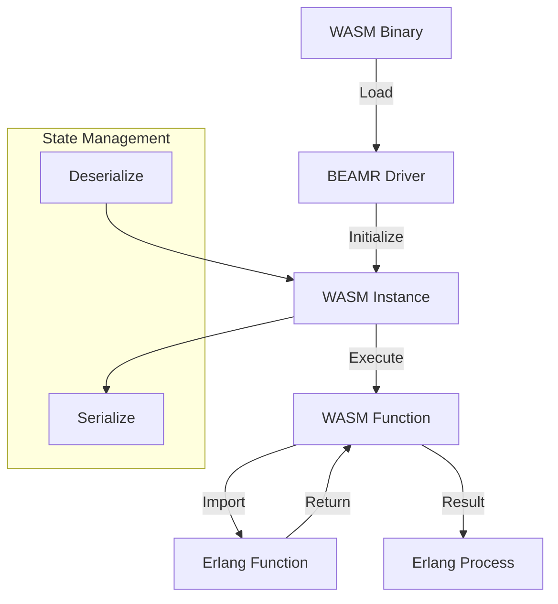

# Module: hb_beamr

## Basic Information
- **Source File:** hb_beamr.erl
- **Module Type:** Integration
- **Purpose:** WASM Runtime Integration via WAMR

## Purpose
BEAMR (BEAM Runtime) provides a sophisticated wrapper around the WebAssembly Micro Runtime (WAMR) for BEAM, enabling seamless execution of WASM modules within Erlang applications. The module is specifically designed to support long-running WASM executions with easy interaction between WASM functions and Erlang processes.

## Interface

### Core Operations
- `start/1, start/2` - Initialize WASM executor with binary
- `call/3, call/4, call/5, call/6` - Execute WASM functions
- `stop/1` - Terminate WASM executor
- `wasm_send/2` - Send message to WASM executor
- `serialize/1` - Save WASM state to binary
- `deserialize/2` - Restore WASM state from binary

## Dependencies

### Direct Dependencies
- erl_ddll: Dynamic driver loading
- code: Path management
- file: File operations
- hb_beamr_io: Memory I/O operations
- hb_util: Utility functions

### Inverse Dependencies
- Used by WASM-dependent modules
- Core WASM execution provider
- Process integration point

## Implementation Details

### Key Concepts

1. **Driver Integration**
   ```erlang
   % Driver loading with error handling
   load_driver() ->
       case erl_ddll:load(code:priv_dir(hb), ?MODULE) of
           ok -> ok;
           {error, already_loaded} -> ok;
           {error, Error} -> {error, Error}
       end.
   ```
   The module manages:
   - Dynamic driver loading
   - Error handling
   - Resource cleanup
   - State management

2. **WASM Execution**
   ```erlang
   % WASM executor initialization
   start(WasmBinary, Mode) when is_binary(WasmBinary) ->
       Self = self(),
       WASM = spawn(
           fun() ->
               ok = load_driver(),
               Port = open_port({spawn, "hb_beamr"}, []),
               Port ! {self(), {command, term_to_binary({init, WasmBinary, Mode})}},
               worker(Port, Self)
           end
       )
   ```
   Provides:
   - Asynchronous execution
   - Process isolation
   - Error handling
   - Resource management

3. **Function Calls**
   ```erlang
   % WASM function invocation
   call(WASM, FuncRef, Args, ImportFun, StateMsg, Opts) ->
       case is_valid_arg_list(Args) of
           true ->
               wasm_send(WASM,
                   {command,
                       term_to_binary(
                           case is_integer(FuncRef) of
                               true -> {indirect_call, FuncRef, Args};
                               false -> {call, FuncRef, Args}
                           end
                       )
                   }
               ),
               monitor_call(WASM, ImportFun, StateMsg, Opts);
           false ->
               {error, {invalid_args, Args}}
       end.
   ```
   Features:
   - Type validation
   - Error handling
   - State management
   - Import handling

### State Management

1. **Worker State**
   ```erlang
   % Worker process state management
   worker(Port, Listener) ->
       receive
           stop ->
               port_close(Port),
               ok;
           {wasm_send, NewListener, Message} ->
               Port ! {self(), Message},
               worker(Port, NewListener);
           WASMResult ->
               Listener ! WASMResult,
               worker(Port, Listener)
       end.
   ```
   Manages:
   - Port lifecycle
   - Message routing
   - State transitions
   - Resource cleanup

2. **Execution State**
   ```erlang
   % State serialization
   serialize(WASM) when is_pid(WASM) ->
       {ok, Size} = hb_beamr_io:size(WASM),
       {ok, Mem} = hb_beamr_io:read(WASM, 0, Size),
       {ok, Mem}.
   ```
   Handles:
   - Memory management
   - State persistence
   - Error handling
   - Resource tracking

### Error Handling

1. **Validation Errors**
   ```erlang
   % Argument validation
   is_valid_arg_list(Args) when is_list(Args) ->
       lists:all(fun(Arg) -> is_integer(Arg) or is_float(Arg) end, Args);
   is_valid_arg_list(_) ->
       false.
   ```
   Checks:
   - Type safety
   - Value constraints
   - List structure
   - Error propagation

2. **Import Errors**
   ```erlang
   % Import error handling
   catch
       Err:Reason:Stack ->
           stop(WASM),
           receive
               {error, _} -> ok
           end,
           {error, Err, Reason, Stack, StateMsg}
   ```
   Manages:
   - Error capture
   - Resource cleanup
   - State recovery
   - Error reporting

## Integration Points

1. **Driver System**
   - Dynamic loading
   - Port communication
   - Resource management
   - Error handling

2. **Process System**
   - Worker processes
   - Message passing
   - State management
   - Resource coordination

3. **Memory System**
   - WASM memory
   - State serialization
   - Resource tracking
   - Error handling

## Analysis Insights

### Performance Considerations

1. **Execution Performance**
   ```erlang
   % Benchmark results
   benchmark_test() ->
       BenchTime = 1,
       Iterations = hb:benchmark(
           fun() ->
               {ok, [Result]} = call(WASM, "fac", [5.0]),
               ?assertEqual(120.0, Result)
           end,
           BenchTime
       )
   ```
   Shows:
   - High throughput
   - Low latency
   - Resource efficiency
   - Stable performance

2. **Memory Management**
   - Efficient serialization
   - Smart state handling
   - Resource optimization
   - Memory safety

### Security Implications

1. **Process Isolation**
   - WASM sandboxing
   - Resource limits
   - Error containment
   - State protection

2. **Resource Protection**
   - Memory boundaries
   - Port security
   - Process isolation
   - Error handling

### Best Practices

1. **WASM Integration**
   ```erlang
   % Recommended WASM initialization
   init_wasm(Binary) ->
       case start(Binary) of
           {ok, WASM, Imports, Exports} ->
               setup_imports(WASM, Imports),
               {ok, WASM, Exports};
           Error ->
               Error
       end.
   ```

2. **Function Calls**
   ```erlang
   % Recommended function call pattern
   call_wasm(WASM, Func, Args) ->
       case call(WASM, Func, Args) of
           {ok, Result} ->
               process_result(Result);
           Error ->
               handle_error(Error)
       end.
   ```

3. **State Management**
   ```erlang
   % Recommended state handling
   manage_state(WASM) ->
       {ok, State} = serialize(WASM),
       store_state(State),
       {ok, State}.
   ```

### Example Usage

```erlang
% Initialize WASM module
{ok, File} = file:read_file("module.wasm"),
{ok, WASM, Imports, Exports} = hb_beamr:start(File),

% Call WASM function
{ok, [Result]} = hb_beamr:call(WASM, "calculate", [5.0]),

% Handle imports
{ok, [Result], State} = hb_beamr:call(WASM, "process", [Input],
    fun(State, #{args := Args}) ->
        {ok, process_args(Args), State}
    end),

% Save state
{ok, State} = hb_beamr:serialize(WASM),

% Restore state
ok = hb_beamr:deserialize(WASM, State),

% Cleanup
ok = hb_beamr:stop(WASM)
```

## WASM Integration Flow



## Function Call Flow

```mermaid
sequenceDiagram
    participant App as Application
    participant BEAMR as BEAMR
    participant WASM as WASM Instance
    participant Import as Import Handler

    App->>BEAMR: call(Function, Args)
    BEAMR->>WASM: Execute Function
    
    alt Import Required
        WASM->>Import: Call Import
        Import->>WASM: Return Result
    end
    
    WASM->>BEAMR: Return Result
    BEAMR->>App: {ok, Result}
