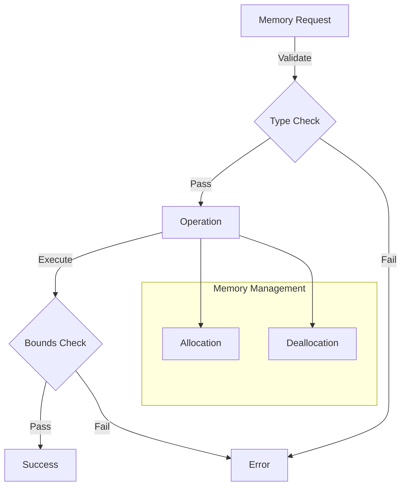

# Module: hb_beamr_io

## Basic Information
- **Source File:** hb_beamr_io.erl
- **Module Type:** Integration
- **Purpose:** WASM Memory Management Interface

## Purpose
Provides a comprehensive interface for managing memory in WASM instances through BEAMR. Unlike typical HyperBEAM modules, it takes a defensive approach to type checking on the Erlang side rather than in C/WASM, ensuring robust memory operations and early error detection.

## Interface

### Core Operations
- `size/1` - Get WASM instance memory size
- `read/3` - Read memory at offset
- `write/3` - Write memory at offset
- `read_string/2, read_string/3` - Read null-terminated string
- `write_string/2` - Write null-terminated string
- `malloc/2` - Allocate WASM memory
- `free/2` - Free WASM memory

## Dependencies

### Direct Dependencies
- hb_beamr: WASM execution interface
- file: File operations for tests
- binary: Binary manipulation
- iolist: String handling

### Inverse Dependencies
- Used by WASM-dependent modules
- Memory management provider
- Resource allocation service

## Implementation Details

### Key Concepts

1. **Memory Size Management**
   ```erlang
   % Get WASM memory size
   size(WASM) when is_pid(WASM) ->
       hb_beamr:wasm_send(WASM, {command, term_to_binary({size})}),
       receive
           {execution_result, Size} ->
               {ok, Size}
       end.
   ```
   Important characteristics:
   - Fixed page size (65,536 bytes)
   - No memory reduction
   - Growth-only allocation
   - Size tracking

2. **Memory Operations**
   ```erlang
   % Memory write with bounds checking
   write(WASM, Offset, Data)
           when is_pid(WASM)
           andalso is_binary(Data)
           andalso is_integer(Offset) ->
       hb_beamr:wasm_send(WASM, {command, term_to_binary({write, Offset, Data})}),
       receive
           ok -> ok;
           {error, Error} -> {error, Error}
       end.
   ```
   Features:
   - Type validation
   - Bounds checking
   - Error handling
   - Safe operations

3. **String Handling**
   ```erlang
   % String write with null termination
   write_string(WASM, Data) when is_pid(WASM) andalso is_binary(Data) ->
       DataSize = byte_size(Data) + 1,
       String = <<Data/bitstring, 0:8>>,
       case malloc(WASM, DataSize) of
           {ok, Ptr} ->
               case write(WASM, Ptr, String) of
                   ok -> {ok, Ptr};
                   {error, Error} -> {error, Error}
               end;
           Error -> Error
       end.
   ```
   Provides:
   - Null termination
   - Memory allocation
   - Error handling
   - Resource cleanup

### State Management

1. **Memory Allocation**
   ```erlang
   % Memory allocation with validation
   malloc(WASM, Size) when is_pid(WASM) andalso is_integer(Size) ->
       case hb_beamr:call(WASM, "malloc", [Size]) of
           {ok, [0]} ->
               {error, malloc_failed};
           {ok, [Ptr]} ->
               {ok, Ptr};
           {error, Error} ->
               {error, Error}
       end.
   ```
   Handles:
   - Size validation
   - Pointer management
   - Error handling
   - Resource tracking

2. **Memory Deallocation**
   ```erlang
   % Memory deallocation with validation
   free(WASM, Ptr) when is_pid(WASM) andalso is_integer(Ptr) ->
       case hb_beamr:call(WASM, "free", [Ptr]) of
           {ok, Res} ->
               ok;
           {error, Error} ->
               {error, Error}
       end.
   ```
   Manages:
   - Pointer validation
   - Resource cleanup
   - Error handling
   - State tracking

### Error Handling

1. **Type Validation**
   ```erlang
   % Defensive type checking
   read(WASM, Offset, Size)
           when is_pid(WASM)
           andalso is_integer(Offset)
           andalso is_integer(Size) ->
   ```
   Ensures:
   - Valid types
   - Safe operations
   - Early failures
   - Clear errors

2. **Operation Errors**
   ```erlang
   % Error propagation
   case write(WASM, Ptr, String) of
       ok -> {ok, Ptr};
       {error, Error} -> {error, Error}
   end
   ```
   Handles:
   - Operation failures
   - Resource errors
   - State corruption
   - Clean recovery

## Integration Points

1. **WASM System**
   - Memory allocation
   - Resource management
   - State tracking
   - Error handling

2. **String System**
   - Null termination
   - Chunked reading
   - Buffer management
   - Resource cleanup

3. **Resource System**
   - Memory tracking
   - Pointer management
   - State validation
   - Error handling

## Analysis Insights

### Performance Considerations

1. **Memory Management**
   ```erlang
   % Chunked string reading
   read_string(WASM, Offset, ChunkSize) ->
       {ok, Data} = read(WASM, Offset, ChunkSize),
       case binary:split(Data, [<<0>>]) of
           [Data|[]] -> [Data|read_string(WASM, Offset + ChunkSize, ChunkSize)];
           [FinalData|_] -> [FinalData]
       end.
   ```
   Features:
   - Efficient chunking
   - Smart allocation
   - Resource reuse
   - Memory safety

2. **Operation Efficiency**
   ```erlang
   % Page size constants
   WASMPageSize = 65536,
   File1Pages = 1,
   File2Pages = 193
   ```
   Considerations:
   - Fixed page sizes
   - Growth patterns
   - Memory limits
   - Resource usage

### Security Implications

1. **Memory Protection**
   - Bounds checking
   - Type validation
   - Resource isolation
   - Error handling

2. **Resource Safety**
   - Pointer validation
   - Memory cleanup
   - State protection
   - Error containment

### Best Practices

1. **Memory Operations**
   ```erlang
   % Recommended memory handling
   handle_memory(WASM, Data) ->
       case write_string(WASM, Data) of
           {ok, Ptr} ->
               process_data(WASM, Ptr),
               free(WASM, Ptr);
           Error ->
               handle_error(Error)
       end.
   ```

2. **String Management**
   ```erlang
   % Recommended string handling
   process_string(WASM, String) ->
       {ok, Ptr} = write_string(WASM, String),
       try
           handle_string(WASM, Ptr)
       after
           free(WASM, Ptr)
       end.
   ```

3. **Resource Management**
   ```erlang
   % Recommended resource handling
   manage_resources(WASM, Size) ->
       case malloc(WASM, Size) of
           {ok, Ptr} ->
               try
                   use_memory(WASM, Ptr, Size)
               after
                   free(WASM, Ptr)
               end;
           Error ->
               handle_error(Error)
       end.
   ```

### Example Usage

```erlang
% Initialize WASM instance
{ok, WASM, _, _} = hb_beamr:start(WasmBinary),

% Get memory size
{ok, Size} = hb_beamr_io:size(WASM),

% Write string to memory
{ok, Ptr} = hb_beamr_io:write_string(WASM, <<"Hello World">>),

% Read string from memory
{ok, String} = hb_beamr_io:read_string(WASM, Ptr),

% Allocate memory
{ok, NewPtr} = hb_beamr_io:malloc(WASM, 1024),

% Write to memory
ok = hb_beamr_io:write(WASM, NewPtr, Data),

% Read from memory
{ok, Data} = hb_beamr_io:read(WASM, NewPtr, 1024),

% Free memory
ok = hb_beamr_io:free(WASM, NewPtr)
```

## Memory Operation Flow



## String Operation Flow

```mermaid
sequenceDiagram
    participant App as Application
    participant IO as BEAMR IO
    participant WASM as WASM Instance
    participant Mem as Memory

    App->>IO: write_string(Data)
    IO->>WASM: malloc(Size)
    WASM->>Mem: Allocate
    Mem-->>WASM: Pointer
    WASM-->>IO: {ok, Ptr}
    
    IO->>WASM: write(Ptr, Data)
    WASM->>Mem: Write
    Mem-->>WASM: ok
    WASM-->>IO: ok
    
    IO-->>App: {ok, Ptr}
