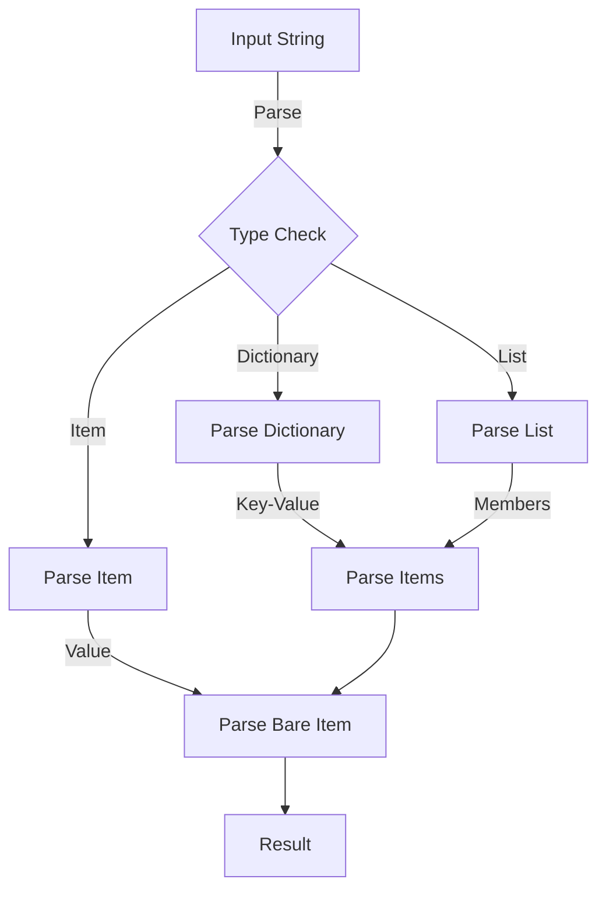

# Module: hb_structured_fields

## Basic Information
- **Source File:** hb_structured_fields.erl
- **Module Type:** Integration
- **Purpose:** HTTP Structured Fields Parser/Formatter (RFC-9651)

## Purpose
Provides a comprehensive implementation of RFC-9651 for parsing and converting between Erlang terms and HTTP Structured Fields. The module handles complex data structures like lists, dictionaries, and items with parameters while ensuring strict compliance with the specification.

## Interface

### Core Operations
- `parse_dictionary/1` - Parse structured dictionary
- `parse_item/1` - Parse structured item
- `parse_list/1` - Parse structured list
- `parse_bare_item/1` - Parse bare item
- `dictionary/1` - Format dictionary to string
- `item/1` - Format item to string
- `list/1` - Format list to string
- `to_dictionary/1` - Convert to dictionary
- `to_list/1` - Convert to list
- `to_item/1, to_item/2` - Convert to item

## Dependencies

### Direct Dependencies
- binary: Binary manipulation
- base64: Binary encoding
- jsx: JSON parsing (tests)
- eunit: Testing framework

### Inverse Dependencies
- Used by HTTP protocol modules
- Data structure conversion
- Protocol integration

## Implementation Details

### Key Concepts

1. **Type Mapping**
   ```erlang
   % Type definitions
   -type sh_list() :: [sh_item() | sh_inner_list()].
   -type sh_inner_list() :: {list, [sh_item()], sh_params()}.
   -type sh_params() :: [{binary(), sh_bare_item()}].
   -type sh_dictionary() :: [{binary(), sh_item() | sh_inner_list()}].
   -type sh_item() :: {item, sh_bare_item(), sh_params()}.
   -type sh_bare_item() ::
       integer()
       | sh_decimal()
       | boolean()
       | {string | token | binary, binary()}.
   ```
   Comprehensive type system:
   - Lists and inner lists
   - Dictionaries
   - Items with parameters
   - Bare items

2. **Parsing System**
   ```erlang
   % Dictionary parsing
   parse_dictionary(<<>>) ->
       [];
   parse_dictionary(<<C, R/bits>>) when ?IS_ALPHA(C)
           or ?IS_DIGIT(C) or (C =:= $*) or (C =:= $%) or (C =:= $_) or (C =:= $-) ->
       parse_dict_key(R, [], <<C>>).
   ```
   Features:
   - Character-level parsing
   - State management
   - Error handling
   - Type validation

3. **Formatting System**
   ```erlang
   % Dictionary formatting
   dictionary(Map) when is_map(Map) ->
       dictionary(maps:to_list(Map));
   dictionary(KVList) when is_list(KVList) ->
       lists:join(
           <<", ">>,
           [
               case Value of
                   true -> Key;
                   _ -> [Key, $=, item_or_inner_list(Value)]
               end
           ||
               {Key, Value} <- KVList
           ]
       ).
   ```
   Provides:
   - Clean formatting
   - Type conversion
   - Error handling
   - Standard compliance

### State Management

1. **Parser State**
   ```erlang
   % Parser state management
   parse_dict_key(<<$=, $(, R0/bits>>, Acc, K) ->
       {Item, R} = parse_inner_list(R0, []),
       parse_dict_before_sep(R, lists:keystore(K, 1, Acc, {K, Item}));
   parse_dict_key(<<$=, R0/bits>>, Acc, K) ->
       {Item, R} = parse_item1(R0),
       parse_dict_before_sep(R, lists:keystore(K, 1, Acc, {K, Item})).
   ```
   Handles:
   - Parsing state
   - Accumulator management
   - Error recovery
   - Type tracking

2. **Formatter State**
   ```erlang
   % Formatter state management
   to_dictionary(Dict, []) ->
       {ok, Dict};
   to_dictionary(_Dict, [{ Name, Value } | _Rest]) when is_map(Value) ->
       {too_deep, Name};
   to_dictionary(Dict, [{Name, Value} | Rest]) ->
       case to_item_or_inner_list(Value) of
           {ok, ItemOrInner} -> 
               to_dictionary([{key_to_binary(Name), ItemOrInner} | Dict], Rest);
           E -> E
       end.
   ```
   Manages:
   - Conversion state
   - Error handling
   - Type validation
   - Resource tracking

### Error Handling

1. **Parser Errors**
   ```erlang
   % Parser error handling
   parse_number(R, L, Acc) when L =< 15 ->
       {binary_to_integer(Acc), R}.
   ```
   Ensures:
   - Length validation
   - Type checking
   - Error propagation
   - Clean recovery

2. **Formatter Errors**
   ```erlang
   % Formatter error handling
   to_dictionary(_Dict, [{ Name, Value } | _Rest]) when is_map(Value) ->
       {too_deep, Name};
   ```
   Handles:
   - Type errors
   - Depth limits
   - Invalid values
   - Error reporting

## Integration Points

1. **HTTP System**
   - Header parsing
   - Value formatting
   - Type conversion
   - Error handling

2. **Protocol System**
   - Data structures
   - Type mapping
   - Value validation
   - Error handling

3. **Testing System**
   - Comprehensive tests
   - Edge cases
   - Error conditions
   - Standard compliance

## Analysis Insights

### Performance Considerations

1. **Parsing Performance**
   ```erlang
   % Efficient parsing
   parse_string(<<$\\, $", R/bits>>, Acc) ->
       parse_string(R, <<Acc/binary, $">>);
   parse_string(<<$\\, $\\, R/bits>>, Acc) ->
       parse_string(R, <<Acc/binary, $\\>>).
   ```
   Features:
   - Binary matching
   - Efficient accumulation
   - State management
   - Memory usage

2. **Formatting Performance**
   ```erlang
   % Efficient formatting
   bare_item({string, String}) ->
       [$", escape_string(String, <<>>), $"];
   bare_item({token, Token}) ->
       Token.
   ```
   Optimizations:
   - Direct conversion
   - Minimal copying
   - Memory efficiency
   - Type safety

### Security Implications

1. **Input Validation**
   - Length checks
   - Type validation
   - Character sets
   - Error handling

2. **Resource Protection**
   - Memory limits
   - Stack safety
   - Error containment
   - State protection

### Best Practices

1. **Parsing**
   ```erlang
   % Recommended parsing pattern
   parse_value(Input) ->
       case parse_item(Input) of
           {item, Value, Params} ->
               process_value(Value, Params);
           Error ->
               handle_error(Error)
       end.
   ```

2. **Formatting**
   ```erlang
   % Recommended formatting pattern
   format_value(Value) ->
       case to_item(Value) of
           {ok, Item} ->
               iolist_to_binary(item(Item));
           Error ->
               handle_error(Error)
       end.
   ```

3. **Integration**
   ```erlang
   % Recommended integration pattern
   handle_header(Name, Value) ->
       case parse_dictionary(Value) of
           Dict when is_list(Dict) ->
               process_dictionary(Name, Dict);
           Error ->
               handle_error(Error)
       end.
   ```

### Example Usage

```erlang
% Parse dictionary header
Dict = hb_structured_fields:parse_dictionary(<<"key=value, other=123">>),

% Parse list header
List = hb_structured_fields:parse_list(<<"value1, value2, (inner1 inner2)">>),

% Parse item header
Item = hb_structured_fields:parse_item(<<"value;param=123">>),

% Format dictionary
Formatted = hb_structured_fields:dictionary([
    {<<"key">>, {item, {string, <<"value">>}, []}},
    {<<"other">>, {item, 123, []}}
]),

% Convert Erlang terms
{ok, Dict} = hb_structured_fields:to_dictionary(#{
    key => "value",
    other => 123,
    list => ["a", "b", "c"]
})
```

## Parsing Flow



## Formatting Flow

```mermaid
sequenceDiagram
    participant App as Application
    participant SF as Structured Fields
    participant Conv as Converter
    participant Fmt as Formatter

    App->>SF: Format Value
    SF->>Conv: Convert Type
    Conv->>Fmt: Format Parts
    
    alt Dictionary
        Fmt->>Fmt: Format Key-Value
    else List
        Fmt->>Fmt: Format Members
    else Item
        Fmt->>Fmt: Format Value+Params
    end
    
    Fmt-->>App: Formatted String
