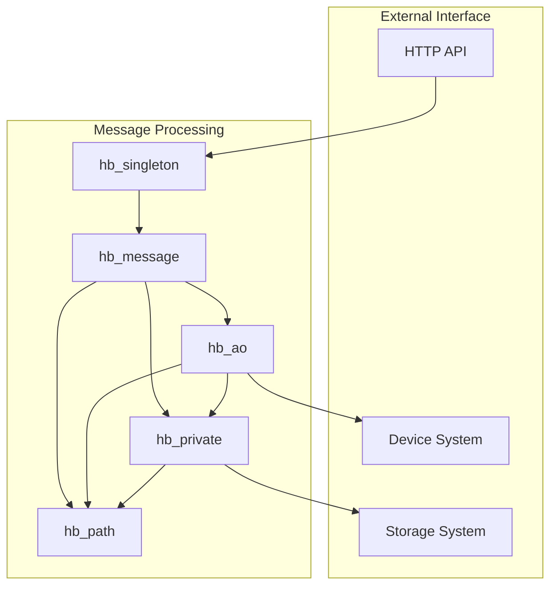

# Overview: Message & Protocol Chunk

## Purpose
The Message & Protocol chunk forms the core of HyperBEAM's message processing system. It provides a sophisticated pipeline for transforming, routing, and managing messages across different formats and protocols. This chunk is essential for enabling communication between different parts of the system while maintaining message integrity and state consistency.

## System Architecture



## Core Components

### 1. Message Transformation Pipeline
The message transformation system starts with hb_singleton, which acts as the entry point for HTTP API requests. It parses complex path syntax and query parameters into a standardized format. The message then flows through hb_message, which converts between different message formats using TABM (Type Annotated Binary Messages) as an intermediate representation. This allows seamless conversion between formats like Arweave transactions, ANS-104 data items, and HTTP signed messages.

For example, when an HTTP request arrives:
```erlang
% HTTP Request: /compute/data?format=json
% Gets transformed by hb_singleton into:
#{ 
    <<"path">> => [<<"compute">>, <<"data">>],
    <<"format">> => <<"json">>
}
% Then processed by hb_message into TABM format
```

### 2. Path Resolution System
The path system, implemented in hb_path, handles three types of paths:
1. Request Paths: Used for routing messages to their destinations
2. HashPaths: Track message history and ensure integrity
3. Private Paths: Manage internal state and caching

Each path type serves a specific purpose. For instance, HashPaths create a verifiable history of message transformations:
```erlang
% Message transformation creates a HashPath:
Msg1.HashPath = Hash(Msg1.ID)
Msg2.HashPath = Hash(Msg1.HashPath, Msg2.ID)
Msg3.HashPath = Hash(Msg2.HashPath, Msg3.ID)
```

### 3. Device Integration System
The hb_ao module serves as the core of the device system. It implements the AO-Core protocol by:
1. Resolving device functions based on message paths
2. Managing device state and execution
3. Handling device loading and verification
4. Coordinating message routing

For example, when resolving a device function:
```erlang
% Given a message with path "compute"
{ok, DeviceMod} = hb_ao:message_to_device(Msg)
{ok, Function} = hb_ao:message_to_fun(Msg, <<"compute">>, Opts)
Result = apply(DeviceMod, Function, [Msg, Opts])
```

### 4. State Management System
The hb_private module manages message state that shouldn't be exposed or serialized. This includes:
1. Temporary computation results
2. Caching information
3. Internal routing state
4. Performance optimizations

State is carefully isolated:
```erlang
% Private state is stored separately
Msg = #{
    <<"public">> => PublicData,
    <<"priv">> => #{
        <<"cache">> => CacheData,
        <<"temp">> => TempState
    }
}
```

## Integration Points

### 1. HTTP API Integration
The system integrates with HTTP APIs through hb_singleton, which provides:
1. Rich path syntax for complex operations
2. Query parameter handling
3. Type conversion
4. Device routing

Example path syntax:
```
/part1/part2~device&key=value  => Route through 'device' with parameters
/part1/(nested/path)           => Resolve nested path first
/part1&key+type=value         => Apply type conversion to value
```

### 2. Device System Integration
Devices integrate through hb_ao using:
1. Function resolution based on message paths
2. State management through private data
3. Caching and optimization support
4. Error handling and recovery

### 3. Storage System Integration
Storage integration happens through:
1. Cache management in private state
2. HashPath tracking for message history
3. State persistence when needed
4. Efficient retrieval mechanisms

## Protocol Implementation

The AO-Core protocol is implemented through several layers:

1. **Message Layer** (hb_message)
   - Format conversion
   - Message validation
   - State management
   - Type safety

2. **Path Layer** (hb_path)
   - Path resolution
   - History tracking
   - State routing
   - Validation

3. **Device Layer** (hb_ao)
   - Function resolution
   - State coordination
   - Error handling
   - Device management

4. **State Layer** (hb_private)
   - Private data
   - Caching
   - Temporary state
   - Optimization

## Best Practices

When working with this system:

1. **Message Handling**
   - Always validate message formats before processing
   - Use appropriate message types for different operations
   - Handle errors at each transformation step
   - Maintain message integrity through transformations

2. **Path Processing**
   - Validate paths before resolution
   - Use appropriate path types for different operations
   - Handle path encoding carefully
   - Maintain path integrity

3. **State Management**
   - Keep private state isolated
   - Use caching appropriately
   - Handle state transitions carefully
   - Validate state at boundaries

4. **Device Integration**
   - Implement proper device interfaces
   - Handle device errors appropriately
   - Manage device state carefully
   - Follow protocol specifications
