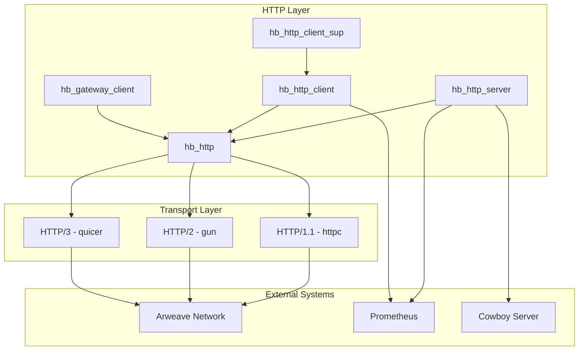
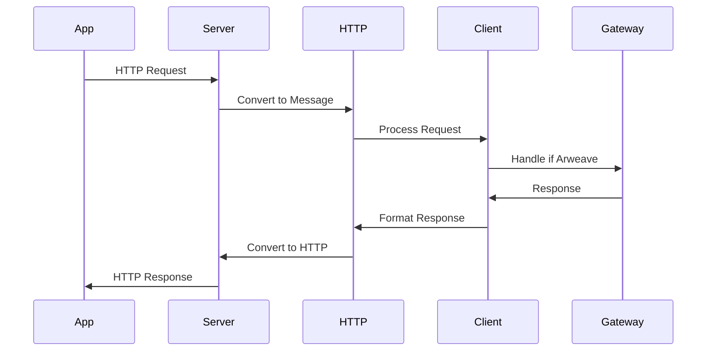
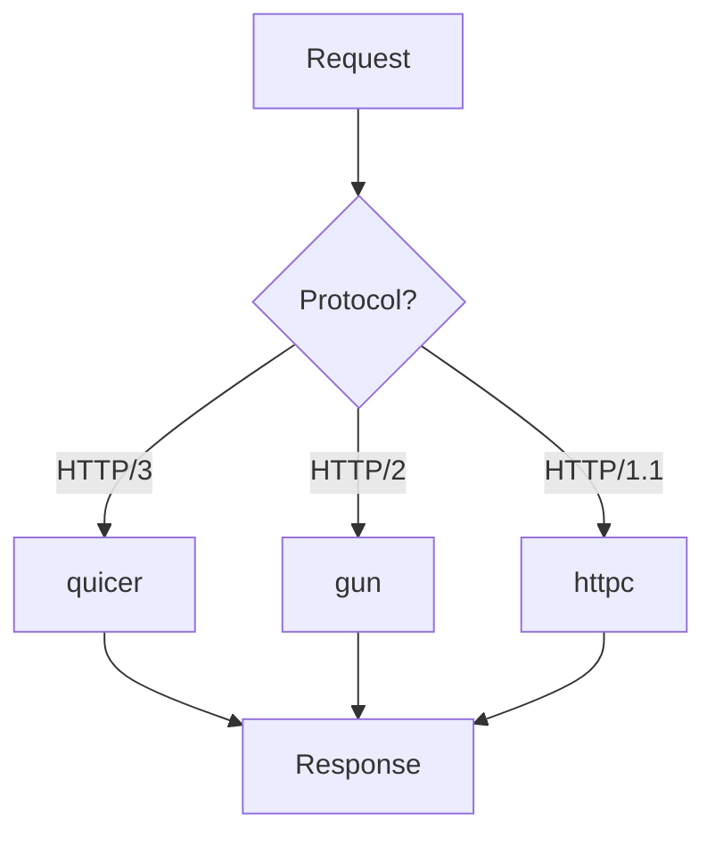
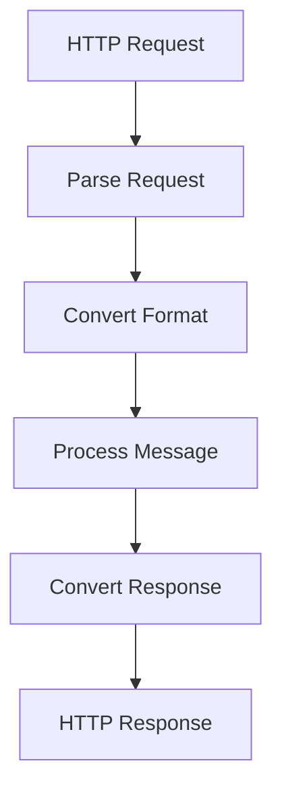

# Network & HTTP System Overview

## System Architecture

## System Purpose & Design Philosophy

The Network & HTTP system in HyperBEAM provides a comprehensive networking solution that addresses several key challenges in distributed systems:

### 1. Protocol Abstraction & Flexibility
The system implements a sophisticated protocol abstraction layer that enables:

- **Protocol Independence**: Applications can work with a high-level message-based API without concerning themselves with the underlying transport protocol. The system automatically handles protocol selection, negotiation, and fallback between HTTP/1.1, HTTP/2, and HTTP/3.

- **Format Conversion**: Messages are automatically converted between different formats (httpsig, ans104) as needed, with proper handling of headers, bodies, and metadata. This allows applications to work with native Erlang terms while the system handles all necessary transformations.

- **Transport Optimization**: Each protocol implementation is optimized for its specific use case:
  * HTTP/1.1 through httpc for basic needs
  * HTTP/2 through gun for high performance
  * HTTP/3 through quicer for cutting-edge features

### 2. Connection Management & Reliability
The system provides robust connection handling through:

- **Connection Pooling**: The client maintains a pool of connections, reusing them when possible to reduce overhead. This includes:
  * Connection tracking
  * State management
  * Automatic reconnection
  * Resource cleanup

- **Supervision Strategy**: A dedicated supervisor (hb_http_client_sup) ensures:
  * Process monitoring
  * Crash recovery
  * Resource management
  * State preservation

- **Error Handling**: Comprehensive error management including:
  * Connection failures
  * Protocol errors
  * State recovery
  * Resource cleanup

### 3. Integration & Extensibility
The system is designed for seamless integration:

- **External Systems**: Direct integration with:
  * Arweave network through GraphQL
  * Prometheus for metrics
  * Cowboy for HTTP serving
  * Custom protocols as needed

- **Internal Systems**: Deep integration with:
  * Message protocol system
  * Storage & caching system
  * Process management
  * Event system

## Core Components & Their Roles

### 1. HTTP Server (hb_http_server)
The server component provides:

- **Protocol Support**
  * HTTP/1.1, HTTP/2, HTTP/3 handling
  * Protocol negotiation
  * CORS management
  * Request routing

- **Message Processing**
  * Request parsing
  * Format conversion
  * Response generation
  * Error handling

- **Integration Features**
  * Prometheus metrics
  * Request tracing
  * State tracking
  * Resource management

### 2. HTTP Client (hb_http_client)
The client component manages:

- **Connection Handling**
  * Connection pooling
  * State tracking
  * Protocol selection
  * Resource management

- **Request Processing**
  * Request formatting
  * Response parsing
  * Error handling
  * State management

- **Performance Features**
  * Connection reuse
  * Request batching
  * Timeout handling
  * Resource optimization

### 3. Gateway Client (hb_gateway_client)
The gateway component provides:

- **Arweave Integration**
  * GraphQL queries
  * Data retrieval
  * Format conversion
  * State management

- **Message Processing**
  * ANS-104 handling
  * Tag processing
  * Signature verification
  * State tracking

### 4. Core HTTP (hb_http)
The core component implements:

- **Message Abstraction**
  * Request formatting
  * Response parsing
  * Protocol handling
  * State management

- **Format Conversion**
  * Protocol adaptation
  * Content negotiation
  * Header management
  * Body processing

## Integration Points & Data Flow

### 1. Request Flow

### 2. Protocol Selection

### 3. Message Processing

## Performance & Scalability

### 1. Connection Management
The system optimizes performance through:

- **Connection Pooling**
  * Reuse existing connections
  * Manage connection lifecycle
  * Handle connection errors
  * Clean up resources

- **Protocol Selection**
  * Choose optimal protocol
  * Handle protocol negotiation
  * Manage fallback options
  * Track protocol state

### 2. Resource Management
Resources are carefully managed:

- **Memory Usage**
  * Buffer management
  * Connection pooling
  * State tracking
  * Resource cleanup

- **Process Management**
  * Supervision trees
  * Process monitoring
  * State preservation
  * Error recovery

### 3. Monitoring & Metrics
Comprehensive monitoring through:

- **Prometheus Integration**
  * Request metrics
  * Connection stats
  * Error tracking
  * Performance data

- **System Events**
  * State changes
  * Error conditions
  * Performance issues
  * Resource usage

## Future Considerations

### 1. Protocol Evolution
The system is designed for evolution:

- **HTTP/3 Support**
  * Full implementation
  * Performance optimization
  * Feature parity
  * Migration path

- **Protocol Extensions**
  * WebSocket support
  * Custom protocols
  * Format additions
  * New features

### 2. Integration Enhancement
Planned improvements include:

- **External Systems**
  * More integrations
  * Better coordination
  * Enhanced features
  * Improved reliability

- **Internal Systems**
  * Tighter integration
  * Better coordination
  * Enhanced features
  * Improved performance

### 3. Development Support
Future tooling improvements:

- **Debugging Tools**
  * Better tracing
  * Enhanced visualization
  * More metrics
  * Improved analysis

- **Documentation**
  * More examples
  * Better guides
  * Enhanced API docs
  * Integration guides
