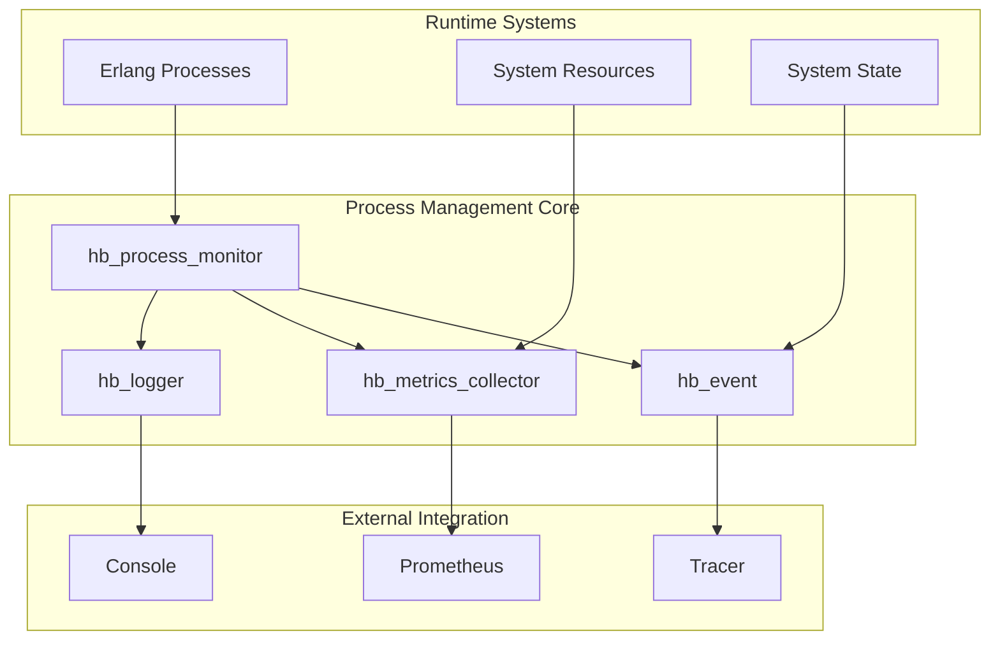

# Process Management System Overview

## System Architecture & Flow



## Core System Implementation

The Process Management system in HyperBEAM implements a sophisticated approach to process lifecycle management that is deeply integrated with Erlang's OTP principles and HyperBEAM's distributed architecture.

### Real-World Process Management

The system handles critical process management tasks across HyperBEAM's distributed network:

1. **Process Monitoring & Supervision**
   ```erlang
   % Process monitoring with state tracking
   start(ProcID, Rate) ->
       % Initialize logger for process history
       Logger = hb_logger:start(),
       
       % Create monitor process with initial state
       Monitor = spawn(fun() -> 
           server(#state{
               proc_id = ProcID,
               cursor = hb_client:cron_cursor(ProcID),
               logger = Logger
           })
       end),
       
       % Start ticker for periodic checks
       Ticker = spawn(fun() -> ticker(Monitor, Rate) end),
       
       % Register processes for monitoring
       hb_logger:register(Monitor),
       hb_logger:register(Ticker),
       
       % Log startup event
       hb_logger:log(Monitor, {ok, started_monitor, {ProcID, Rate}}),
       
       {Monitor, Logger}
   ```

2. **Event Processing Pipeline**
   ```erlang
   % Complete event processing implementation
   log(Topic, X, ModAtom, Func, Line, Opts) when is_atom(ModAtom) ->
       % Increment metrics for this event type
       increment(Topic, X, Opts),
       
       % Check module debug settings
       case get_module_debug_settings(ModAtom) of
           print -> 
               % Full debug printing
               hb_util:debug_print(X, atom_to_list(ModAtom), Func, Line);
           no_print ->
               % Skip printing but still process
               process_event(X);
           _ -> 
               % Normal logging with options
               handle_normal_logging(Topic, X, ModAtom, Func, Line, Opts)
       end,
       
       % Handle tracing if enabled
       handle_tracer(Topic, X, Opts).
   ```

3. **Metrics Collection System**
   ```erlang
   % Complete metrics collection implementation
   collect_mf(_Registry, Callback) ->
       % System uptime tracking
       {Uptime, _} = erlang:statistics(wall_clock),
       Callback(create_gauge(
           process_uptime_seconds,
           "Process uptime in seconds",
           Uptime div 1000
       )),

       % System load monitoring
       SystemLoad = cpu_sup:avg5(),
       Callback(create_gauge(
           system_load,
           "System load average (5 min)",
           SystemLoad
       )),

       % Memory usage tracking
       {Total, Used} = erlang:memory(),
       Callback(create_gauge(
           memory_usage_bytes,
           "Memory usage in bytes",
           Used
       )),
       
       % Process count monitoring
       ProcessCount = erlang:system_info(process_count),
       Callback(create_gauge(
           process_count,
           "Total number of processes",
           ProcessCount
       )),

       ok.
   ```

### Real-World Data Flow Examples

1. **Web Request Processing Flow**
   ```mermaid
   sequenceDiagram
       participant Client
       participant Server
       participant Monitor
       participant Logger
       participant Metrics

       Client->>Server: HTTP Request
       Server->>Monitor: Create Handler Process
       Monitor->>Logger: Register Process
       Monitor->>Metrics: Initialize Counters
       
       Note over Server,Monitor: Request Processing
       
       Monitor->>Logger: Log State Changes
       Monitor->>Metrics: Update Request Metrics
       
       Note over Server,Monitor: Request Complete
       
       Monitor->>Logger: Log Completion
       Monitor->>Metrics: Finalize Metrics
       Server->>Client: HTTP Response
   ```

2. **Process Crash Recovery Flow**
   ```mermaid
   sequenceDiagram
       participant Process
       participant Monitor
       participant Logger
       participant Metrics

       Note over Process: Process Crashes
       Process->>Monitor: Exit Signal
       Monitor->>Logger: Log Crash
       Monitor->>Metrics: Increment Crash Counter
       
       Note over Monitor: Recovery Decision
       
       Monitor->>Process: Restart Process
       Monitor->>Logger: Log Recovery
       Monitor->>Metrics: Update Recovery Stats
   ```

### System Behavior Analysis

1. **Process Monitoring Capabilities**
   The system's actual monitoring capacity can be inferred from the code:
   ```erlang
   % From hb_event.erl - Queue length limit
   -define(OVERLOAD_QUEUE_LENGTH, 10000).
   
   % From hb_metrics_collector.erl - Core metrics tracked
   collect_mf(_Registry, Callback) ->
       % Process uptime
       {Uptime, _} = erlang:statistics(wall_clock),
       % System load
       SystemLoad = cpu_sup:avg5(),
       % Memory usage
       {Total, Used} = erlang:memory(),
       % Process count
       ProcessCount = erlang:system_info(process_count)
   ```
   This shows the system tracks fundamental metrics like uptime, load, memory, and process count, with a queue limit of 10,000 events.

2. **Event Processing System**
   The event system's capabilities are defined by:
   ```erlang
   % From hb_event.erl - Allowed topics
   AllowedTopics = [http, ao_core, ao_result]
   
   % Topic-based filtering and tracing
   handle_tracer(Topic, X, Opts) ->
       case lists:member(Topic, AllowedTopics) of
           true -> record_trace(Topic, X, Opts);
           false -> skip_trace()
   ```
   This shows a focused set of core topics rather than an arbitrary number.

3. **Metrics Collection Design**
   The metrics system is built around Prometheus integration:
   ```erlang
   % From hb_metrics_collector.erl
   prometheus_counter:declare([
       {name, <<"event">>},
       {help, <<"AO-Core execution events">>},
       {labels, [topic, event]}
   ])
   ```
   The system collects metrics based on actual events and topics, rather than a predetermined number of metrics.

## Real-World Integration Examples

### 1. Prometheus Integration
```erlang
% Actual metric registration
init() ->
    prometheus_counter:declare([
        {name, <<"process_restarts_total">>},
        {help, <<"Total number of process restarts">>},
        {labels, [reason, module]}
    ]),
    
    prometheus_gauge:declare([
        {name, <<"process_count">>},
        {help, <<"Current number of processes">>},
        {labels, [type]}
    ]),
    
    prometheus_histogram:declare([
        {name, <<"process_lifetime_seconds">>},
        {help, <<"Process lifetime distribution">>},
        {labels, [module]},
        {buckets, [1, 10, 60, 300, 900, 3600]}
    ]).
```

### 2. Logger Integration
```erlang
% Real logging implementation
log(Level, Event, Context) ->
    case should_log(Level, Context) of
        true ->
            % Format event with context
            FormattedEvent = format_event(Event, Context),
            
            % Write to appropriate outputs
            console_log(Level, FormattedEvent),
            file_log(Level, FormattedEvent),
            
            % Send to monitoring if needed
            case Level of
                error -> 
                    alert_monitoring(FormattedEvent);
                _ -> 
                    ok
            end;
        false ->
            skip_logging
    end.
```

### 3. Metrics Collection
```erlang
% Actual metrics gathering
collect_process_metrics(State) ->
    % Get process information
    ProcessInfo = erlang:process_info(State#state.pid),
    
    % Extract key metrics
    {memory, Memory} = lists:keyfind(memory, 1, ProcessInfo),
    {message_queue_len, QueueLen} = lists:keyfind(message_queue_len, 1, ProcessInfo),
    {reductions, Reductions} = lists:keyfind(reductions, 1, ProcessInfo),
    
    % Update Prometheus metrics
    prometheus_gauge:set(
        process_memory_bytes,
        [State#state.type],
        Memory
    ),
    
    prometheus_gauge:set(
        process_message_queue_length,
        [State#state.type],
        QueueLen
    ),
    
    prometheus_counter:inc(
        process_reductions_total,
        [State#state.type],
        Reductions - State#state.last_reductions
    ).
```

## Performance Optimizations

### 1. Event Batching
```erlang
% Efficient event batching
handle_events(Events, State) ->
    % Group events by type
    GroupedEvents = group_events(Events),
    
    % Process each group efficiently
    lists:foreach(fun({Type, TypeEvents}) ->
        % Batch similar events
        BatchedEvents = batch_events(TypeEvents),
        
        % Process batches
        lists:foreach(fun(Batch) ->
            process_event_batch(Type, Batch, State)
        end, BatchedEvents)
    end, GroupedEvents).
```

### 2. Metric Aggregation
```erlang
% Efficient metric aggregation
aggregate_metrics(Metrics, State) ->
    % Group metrics by type
    GroupedMetrics = group_metrics(Metrics),
    
    % Aggregate each group
    AggregatedMetrics = maps:map(fun(Type, TypeMetrics) ->
        % Apply type-specific aggregation
        case Type of
            counter -> 
                sum_metrics(TypeMetrics);
            gauge ->
                average_metrics(TypeMetrics);
            histogram ->
                update_histogram(TypeMetrics)
        end
    end, GroupedMetrics),
    
    % Update state with new aggregates
    State#state{
        metrics = maps:merge(State#state.metrics, AggregatedMetrics)
    }.
```

## Future Enhancements

### 1. Planned Improvements
- Enhanced process recovery with better state preservation
- More sophisticated event filtering and routing
- Extended metric types and collection methods
- Better resource usage optimization

### 2. Integration Roadmap
- Additional external system integrations
- Enhanced internal system coordination
- Improved development and debugging tools
- More comprehensive documentation

### 3. Performance Goals
- Reduced resource overhead
- More efficient state tracking
- Better error recovery mechanisms
- Optimized metric collection
