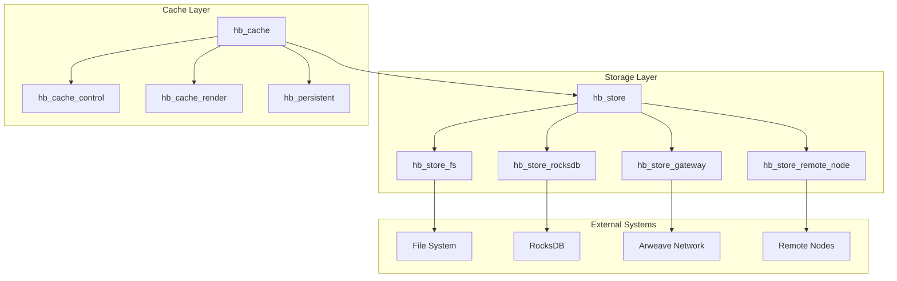

# Storage & Caching System Overview

## Architecture Overview



## System Purpose & Design Philosophy

The Storage & Caching system in HyperBEAM represents a sophisticated approach to data persistence and caching that addresses several key challenges in distributed systems:

### 1. Flexible Storage Architecture
The system is built around a pluggable storage architecture that allows different storage backends to be used interchangeably. This is achieved through the hb_store behavior, which defines a common interface that all storage implementations must follow. This design enables:

- **Storage Flexibility**: Applications can choose the most appropriate storage backend for their needs, whether that's local filesystem storage for development, RocksDB for high-performance requirements, or remote storage for distributed scenarios.

- **Transparent Operation**: The common interface means that application code doesn't need to know which storage backend is being used. The same code works regardless of whether data is stored locally or remotely.

- **Distributed Capabilities**: Through the gateway and remote node implementations, the system can seamlessly handle distributed storage scenarios, including integration with Arweave for permanent storage.

### 2. Intelligent Caching System
The caching system is designed with performance and resource efficiency in mind, implementing sophisticated strategies for data management:

- **Multi-layer Caching**: The system implements a three-layer approach to caching:
  1. Raw binary data storage with content-based addressing for deduplication
  2. Hashpath-based graph structure for efficient navigation and relationship tracking
  3. Message-level caching with both committed and uncommitted states

- **Policy-based Control**: Through hb_cache_control, the system provides HTTP-style cache control directives that allow fine-grained control over caching behavior:
  * Cache invalidation strategies
  * Storage policies
  * Lookup behaviors
  * Resource management

- **Performance Optimization**: The system includes several performance optimizations:
  * Content deduplication to minimize storage usage
  * Path optimization for efficient access
  * Process-based caching for frequently accessed data
  * Asynchronous operations where appropriate

### 3. Development and Debugging Support
The system includes comprehensive tools for development and debugging:

- **Visualization Tools**: Through hb_cache_render, developers can:
  * Generate visual representations of cache structures
  * Analyze relationships between cached items
  * Debug cache state and behavior
  * Monitor system performance

- **Debugging Capabilities**: The system provides extensive debugging support:
  * Detailed logging of cache operations
  * State inspection tools
  * Performance monitoring
  * Error tracking and analysis

## Core Components & Their Interactions

### 1. Storage Abstraction Layer (hb_store)
The hb_store module serves as the foundational abstraction layer for all storage operations in HyperBEAM. It provides:

- **Common Interface**: A behavior-based interface that all storage backends must implement, ensuring consistent operation across different storage types. This includes operations for:
  * Reading and writing data
  * Creating and managing links between data
  * Handling paths and directories
  * Managing data types and metadata

- **Path Resolution System**: A sophisticated path resolution mechanism that:
  * Handles both simple and complex paths
  * Resolves symbolic links and references
  * Manages path normalization
  * Provides consistent path handling across backends

- **Operation Coordination**: Coordinates storage operations across multiple backends:
  * Implements chain of responsibility pattern for store selection
  * Handles fallback between stores
  * Manages operation priorities
  * Coordinates distributed operations

- **Error Management**: Comprehensive error handling system that:
  * Provides consistent error reporting
  * Handles backend-specific errors
  * Manages recovery procedures
  * Ensures data consistency

### 2. Storage Implementation Layer
The system provides multiple storage backends, each optimized for specific use cases:

- **Filesystem Backend (hb_store_fs)**
  * Uses local filesystem for storage, providing:
    - Direct file access for maximum performance
    - Native filesystem operations
    - Symbolic link support
    - Directory-based organization
  * Implements path management through:
    - Directory hierarchy
    - File-based storage
    - Link resolution
    - Path normalization

- **RocksDB Backend (hb_store_rocksdb)**
  * High-performance key-value store offering:
    - Optimized binary storage
    - Fast key-value operations
    - Efficient data compression
    - Transaction support
  * Enhanced with:
    - Process-based wrapper
    - Type annotation system
    - Custom serialization
    - Performance optimizations

- **Gateway Backend (hb_store_gateway)**
  * Provides Arweave network integration:
    - Direct Arweave access
    - GraphQL query support
    - Transaction management
    - Network optimization
  * Features:
    - Local caching system
    - Request batching
    - Response caching
    - Error recovery

- **Remote Node Backend (hb_store_remote_node)**
  * Enables node-to-node communication:
    - HTTP-based protocol
    - Message authentication
    - State synchronization
    - Error handling
  * Implements:
    - Request signing
    - Response validation
    - State management
    - Connection pooling

### 3. Cache Management System
A multi-layered caching system designed for performance and reliability:

- **Core Cache (hb_cache)**
  * Implements fundamental caching operations:
    - Content-addressed storage
    - Data deduplication
    - Path-based access
    - State management
  * Provides:
    - Format conversion
    - Type handling
    - Link management
    - Cache invalidation

- **Cache Control (hb_cache_control)**
  * Manages caching policies through:
    - HTTP-style directives
    - Custom control options
    - Performance settings
    - Resource limits
  * Features:
    - Policy enforcement
    - Setting resolution
    - Cache optimization
    - Resource management

- **Cache Visualization (hb_cache_render)**
  * Provides debugging and analysis tools:
    - Graph visualization
    - Structure analysis
    - State inspection
    - Performance monitoring
  * Supports:
    - DOT format generation
    - SVG rendering
    - Interactive debugging
    - State exploration

- **Persistent Cache (hb_persistent)**
  * Manages long-lived cache processes:
    - Process-based caching
    - State persistence
    - Message deduplication
    - Resource coordination
  * Implements:
    - Worker management
    - State synchronization
    - Error recovery
    - Resource cleanup

## Key Features & Capabilities

### 1. Advanced Storage Features
The storage system provides a rich set of features for data management:

- **Backend Flexibility**
  * Multiple storage implementations:
    - Local filesystem for development
    - RocksDB for high performance
    - Gateway for Arweave integration
    - Remote nodes for distribution
  * Seamless backend switching
  * Fallback mechanisms
  * Mixed backend support

- **Path Management**
  * Sophisticated path abstraction:
    - Hierarchical organization
    - Link resolution
    - Path normalization
    - Type-aware paths
  * Group management:
    - Directory structures
    - Namespace isolation
    - Group permissions
    - Hierarchical access

- **Data Integrity**
  * Comprehensive error handling:
    - Operation validation
    - State consistency
    - Recovery procedures
    - Error propagation
  * State persistence:
    - Reliable storage
    - State recovery
    - Transaction support
    - Consistency guarantees

### 2. Intelligent Cache Features
The caching system implements sophisticated features for performance:

- **Policy Management**
  * HTTP-style cache control:
    - Cache directives
    - Invalidation rules
    - Storage policies
    - Lookup behaviors
  * Performance settings:
    - Caching strategies
    - Resource limits
    - Timeout controls
    - Priority management

- **Resource Optimization**
  * Efficient resource usage:
    - Memory management
    - Process coordination
    - Resource pooling
    - Load balancing
  * Performance features:
    - Content deduplication
    - Path optimization
    - State caching
    - Batch operations

- **Development Support**
  * Visualization tools:
    - Cache structure graphs
    - State visualization
    - Performance metrics
    - Debug information
  * Analysis capabilities:
    - State inspection
    - Performance analysis
    - Error tracking
    - Resource monitoring

### 3. Integration Capabilities
Rich integration features for system interoperability:

- **External Systems**
  * Protocol support:
    - HTTP communication
    - GraphQL integration
    - Custom protocols
    - Format handling
  * System integration:
    - Arweave network
    - RocksDB engine
    - File systems
    - Remote nodes

- **Internal Coordination**
  * State management:
    - Process coordination
    - Resource handling
    - Error recovery
    - State synchronization
  * Security features:
    - Access control
    - Data protection
    - Request validation
    - Error isolation

- **Monitoring & Control**
  * System monitoring:
    - Performance metrics
    - Resource usage
    - Error tracking
    - State monitoring
  * Control mechanisms:
    - Resource limits
    - Access controls
    - Operation priorities
    - System configuration

## Common Usage Patterns & Examples

### 1. Basic Storage Operations
The storage system provides straightforward patterns for common operations:

```erlang
%% Basic Data Storage
% Write data with automatic path generation
{ok, Path} = hb_store:write(Store, Key, Value),

% Read data using path
{ok, Data} = hb_store:read(Store, Path),

% Create links between paths
ok = hb_store:make_link(Store, ExistingPath, NewPath),

%% Advanced Operations
% Write with specific options
{ok, Path} = hb_store:write(Store, Key, Value, #{
    type => binary,
    compress => true,
    metadata => #{created_at => erlang:timestamp()}
}),

% List directory contents
{ok, Items} = hb_store:list(Store, Path),

% Check path type
{ok, Type} = hb_store:type(Store, Path)
```

### 2. Cache Management Patterns
The caching system supports various usage patterns:

```erlang
%% Basic Caching
% Write to cache with policy
{ok, ID} = hb_cache:write(Message, #{
    store => Store,
    cache_control => [<<"always">>],
    async => true
}),

% Read from cache with options
{ok, Data} = hb_cache:read(ID, #{
    store_scope => local,
    cache_control => [<<"only-if-cached">>]
}),

%% Advanced Caching
% Write with deduplication
{ok, ID} = hb_cache:write_hashpath(Message, #{
    store => Store,
    hashpath => CustomPath
}),

% Read resolved computation
{ok, Result} = hb_cache:read_resolved(Msg1, Msg2, Opts)
```

### 3. Persistent Processing
Long-lived process management patterns:

```erlang
%% Worker Management
% Start persistent worker
WorkerPid = hb_persistent:start_worker(Message, #{
    static_worker => true,
    worker_timeout => 10000,
    error_strategy => throw
}),

% Handle execution with coordination
case hb_persistent:find_or_register(Msg1, Msg2, Opts) of
    {leader, Group} -> 
        % Handle as leader
        Result = handle_execution(Msg1, Msg2),
        hb_persistent:unregister_notify(Group, Msg2, Result, Opts);
    {wait, Leader} ->
        % Wait for result
        {ok, Result} = hb_persistent:await(Leader, Msg1, Msg2, Opts)
end,

%% Process Monitoring
% Start monitor
MonitorPid = hb_persistent:start_monitor(Group),

% Stop monitor
hb_persistent:stop_monitor(MonitorPid)
```

## Integration Points & System Interaction

### 1. External System Integration
The system provides comprehensive integration with external systems:

- **File System Integration**
  * Direct file operations:
    - Path-based access
    - Directory management
    - Link handling
    - Permission control
  * Performance optimization:
    - Buffered operations
    - Batch processing
    - Async I/O
    - Resource pooling

- **RocksDB Integration**
  * Database operations:
    - Key-value storage
    - Range queries
    - Batch operations
    - Transaction support
  * Advanced features:
    - Custom comparators
    - Merge operators
    - Column families
    - Backup/restore

- **Network Integration**
  * Arweave connectivity:
    - Transaction management
    - Data permanence
    - Network optimization
    - State verification
  * Remote node communication:
    - Protocol handling
    - State synchronization
    - Error recovery
    - Load balancing

### 2. Internal System Integration
Deep integration with HyperBEAM's internal systems:

- **Message Processing**
  * Message handling:
    - Format conversion
    - State tracking
    - Path resolution
    - Cache coordination
  * Process management:
    - Worker coordination
    - State persistence
    - Error handling
    - Resource cleanup

- **Resource Management**
  * Resource control:
    - Memory management
    - Process limits
    - Connection pooling
    - Load distribution
  * Error handling:
    - Recovery procedures
    - State restoration
    - Error propagation
    - Cleanup operations

### 3. Development Tool Integration
Comprehensive tooling support:

- **Visualization Tools**
  * Graph generation:
    - Structure visualization
    - State inspection
    - Performance analysis
    - Debug support
  * Interactive tools:
    - Live monitoring
    - State exploration
    - Performance tuning
    - Error analysis

- **Debug Support**
  * Debugging features:
    - State inspection
    - Error tracking
    - Performance profiling
    - Resource monitoring
  * Analysis tools:
    - Graph analysis
    - Path validation
    - State verification
    - Load testing

## Best Practices & Guidelines

### 1. Storage System Usage
Best practices for storage operations:

- **Backend Selection**
  * Choose based on:
    - Performance requirements
    - Reliability needs
    - Distribution needs
    - Resource constraints
  * Consider:
    - Data volume
    - Access patterns
    - Consistency needs
    - Recovery requirements

- **Error Management**
  * Handle errors by:
    - Validating operations
    - Implementing recovery
    - Managing state
    - Cleaning resources
  * Ensure:
    - Data consistency
    - State recovery
    - Resource cleanup
    - Error logging

### 2. Cache System Usage
Guidelines for effective caching:

- **Policy Management**
  * Configure policies:
    - Set appropriate directives
    - Define timeouts
    - Manage resources
    - Control invalidation
  * Optimize for:
    - Performance needs
    - Resource usage
    - Data freshness
    - System load

- **Resource Optimization**
  * Manage resources:
    - Monitor usage
    - Set limits
    - Handle cleanup
    - Coordinate access
  * Optimize for:
    - Memory usage
    - Process count
    - Network load
    - Disk usage

### 3. Integration Guidelines
Best practices for system integration:

- **Protocol Compliance**
  * Follow standards:
    - Use correct formats
    - Handle versions
    - Validate data
    - Manage errors
  * Ensure:
    - Compatibility
    - Interoperability
    - Maintainability
    - Extensibility

- **Security Considerations**
  * Implement security:
    - Validate input
    - Control access
    - Protect data
    - Handle errors
  * Maintain:
    - Data integrity
    - Access control
    - Error isolation
    - Audit trails
