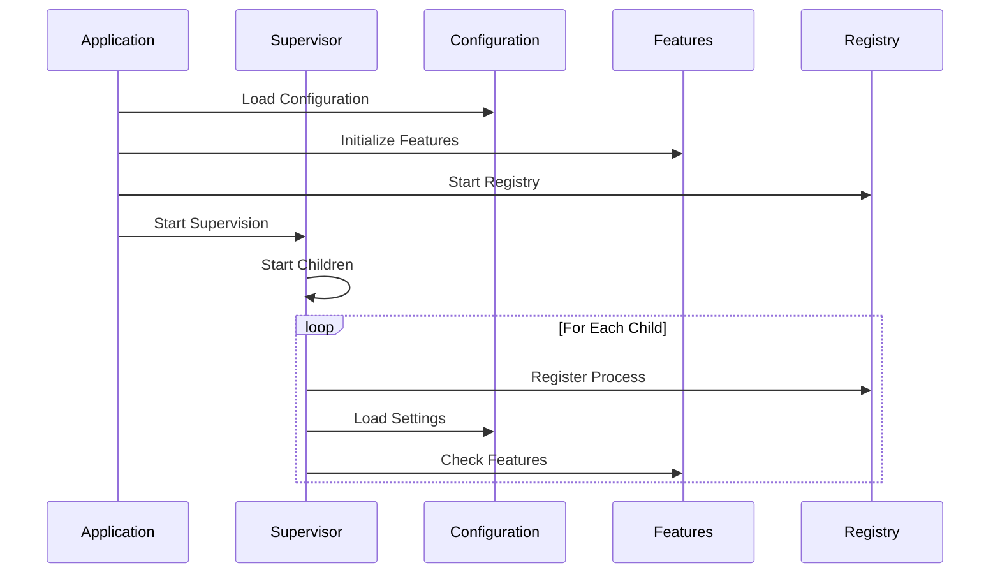
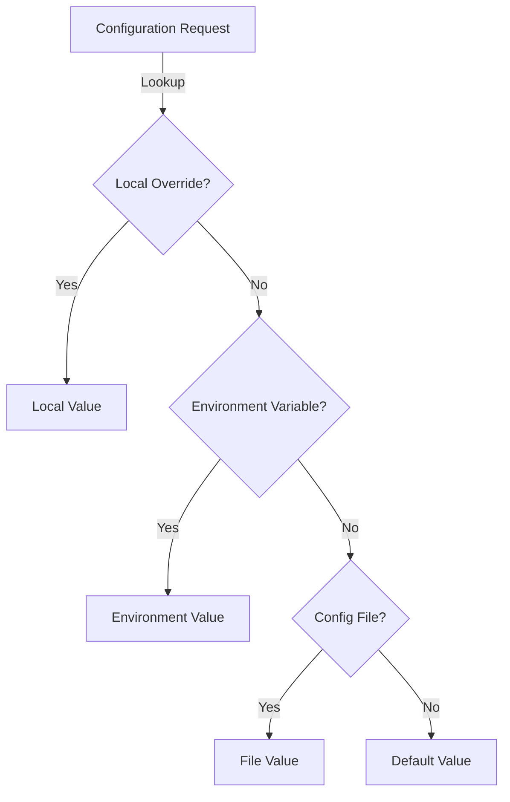
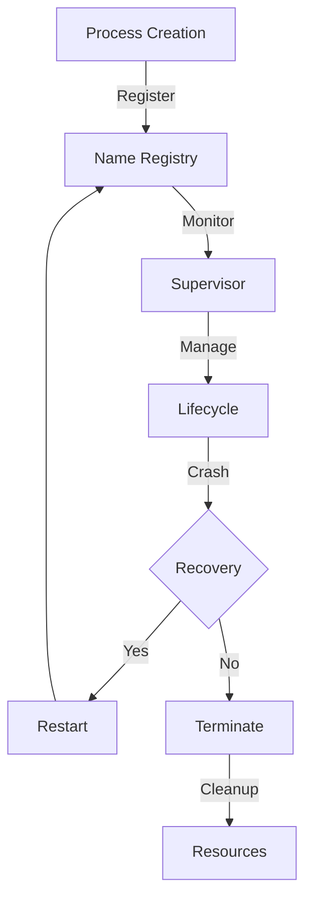

# System Core Overview

## Foundational Architecture

The System Core represents the foundational layer of HyperBEAM, providing essential services that enable the entire system to function. This layer implements critical functionality through five key components that work together to create a robust and flexible system:

### 1. Application Lifecycle (hb_app)
The application module serves as the primary entry point and lifecycle manager for HyperBEAM. It orchestrates the startup sequence:

```erlang
start(_StartType, _StartArgs) ->
    % Initialize core systems
    hb:init(),
    
    % Start supervision tree
    hb_sup:start_link(),
    
    % Initialize scheduler
    ok = dev_scheduler_registry:start(),
    
    % Start timestamp service
    _TimestampServer = ar_timestamp:start(),
    
    % Start HTTP interface
    {ok, _} = hb_http_server:start().
```

This carefully ordered sequence ensures that:
1. Core systems are initialized first
2. The supervision tree is established
3. Essential services are started
4. Network interfaces become available

### 2. Process Supervision (hb_sup)
The supervisor implements a strict supervision strategy for critical system components:

```erlang
% Supervisor configuration
SupFlags = #{
    strategy => one_for_all,  % All children restart if one fails
    intensity => 0,           % No restarts allowed in period
    period => 1              % 1 second period
},

% Child specifications
[
    #{  % HTTP client worker
        id => hb_http_client,
        start => {hb_http_client, start_link, [Opts]},
        restart => permanent,
        shutdown => 5000
    },
    #{  % Storage backend
        id => hb_store_rocksdb,
        start => {hb_store_rocksdb, start_link, [RocksDBOpts]}
    }
]
```

This design provides:
- Strict failure handling for critical components
- Clean shutdown procedures
- Resource cleanup guarantees
- System stability

### 3. Configuration Management (hb_opts)
The configuration system implements a sophisticated hierarchy:

```erlang
% Configuration lookup with precedence
get(Key, Default, Opts = #{ prefer := local }) ->
    case get(Key, not_found, Opts#{ only => local }) of
        not_found ->
            get(Key, Default, Opts#{ only => global });
        Value -> Value
    end
```

Key features include:
- Environment variable integration
- File-based configuration
- Runtime overrides
- Type safety
- Default values

### 4. Feature Management (hb_features)
The feature system provides build-time configuration:

```erlang
% Feature flag implementation
-ifdef(ENABLE_FEATURE).
feature() -> true.
-else.
feature() -> false.
-endif.

% Feature discovery
all() ->
    Features = lists:filtermap(
        fun({Name, _}) ->
            case lists:member(Name, [all, enabled, module_info]) of
                true -> false;
                false -> {true, Name}
            end
        end,
        ?MODULE:module_info(exports)
    )
```

This enables:
- Compile-time optimization
- Feature discovery
- Runtime access
- System customization

### 5. Process Registration (hb_name)
The registration system extends Erlang's capabilities:

```erlang
% Hybrid registration system
register(Name, Pid) when is_atom(Name) ->
    try erlang:register(Name, Pid) of
        true -> ok
    catch
        error:badarg -> error
    end;
register(Name, Pid) ->
    case ets:insert_new(?NAME_TABLE, {Name, Pid}) of
        true -> ok;
        false -> error
    end
```

This provides:
- Extended naming capabilities
- Atomic operations
- Process monitoring
- Resource cleanup

## System Integration

### 1. Startup Flow


### 2. Configuration Flow


### 3. Process Management Flow


## Core Interactions

### 1. Configuration Integration
The configuration system interacts deeply with other components:

```erlang
% Feature-based configuration
case hb_features:enabled(Feature) of
    true -> 
        % Load feature-specific configuration
        FeatureOpts = hb_opts:get(Feature, #{}),
        initialize_feature(Feature, FeatureOpts);
    false ->
        skip_feature
end
```

### 2. Process Management
Process management involves multiple components:

```erlang
% Process initialization with registration
start_managed_process(Name, Module, Args) ->
    % Start under supervision
    {ok, Pid} = supervisor:start_child(hb_sup, #{
        id => Name,
        start => {Module, start_link, Args}
    }),
    
    % Register with extended naming
    ok = hb_name:register(Name, Pid),
    
    % Configure based on features
    case hb_features:enabled(advanced_monitoring) of
        true -> setup_monitoring(Pid);
        false -> ok
    end.
```

### 3. Feature Integration
Features affect system behavior:

```erlang
% Feature-based system configuration
init_system() ->
    % Load core configuration
    CoreOpts = hb_opts:get(core, #{}),
    
    % Initialize based on features
    Features = hb_features:all(),
    
    % Configure components
    lists:foreach(fun({Feature, Enabled}) ->
        case Enabled of
            true -> 
                FeatureOpts = hb_opts:get(Feature, #{}),
                init_feature(Feature, FeatureOpts);
            false ->
                skip_feature(Feature)
        end
    end, maps:to_list(Features)).
```

## System Capabilities

### 1. Process Management
The system provides sophisticated process management:

- **Registration**: Extended process naming
- **Supervision**: Strict failure handling
- **Monitoring**: Resource tracking
- **Cleanup**: Automatic resource recovery

### 2. Configuration Management
Configuration handling includes:

- **Hierarchy**: Clear precedence rules
- **Integration**: Environment and file-based
- **Override**: Runtime configuration
- **Validation**: Type safety and conversion

### 3. Feature Management
Feature system capabilities:

- **Build Control**: Compile-time optimization
- **Discovery**: Runtime feature detection
- **Integration**: System-wide coordination
- **Configuration**: Feature-specific settings

## Best Practices

### 1. Process Management
```erlang
% Recommended process initialization
init_process(Name, Opts) ->
    % Register with cleanup
    case hb_name:register(Name) of
        ok ->
            % Configure based on features
            setup_process(Name, Opts);
        error ->
            {error, already_registered}
    end.
```

### 2. Configuration Usage
```erlang
% Recommended configuration pattern
get_config(Key) ->
    % Check local overrides
    case hb_opts:get(Key, undefined, #{prefer => local}) of
        undefined ->
            % Use feature-based default
            feature_default(Key);
        Value ->
            Value
    end.
```

### 3. Feature Integration
```erlang
% Recommended feature usage
init_component(Opts) ->
    % Check required features
    case check_features(required_features()) of
        ok ->
            % Initialize with feature-specific config
            setup_component(Opts);
        {error, Missing} ->
            {error, {missing_features, Missing}}
    end.
```

## System Evolution

### 1. Current Capabilities
The system core provides:

- Robust process management
- Flexible configuration
- Feature control
- Resource management
- System monitoring

### 2. Future Directions
Planned enhancements include:

- Enhanced process recovery
- Dynamic configuration
- Runtime feature updates
- Improved monitoring
- Better resource management

### 3. Integration Opportunities
Areas for expansion:

- External system integration
- Enhanced monitoring
- Dynamic configuration
- Feature dependencies
