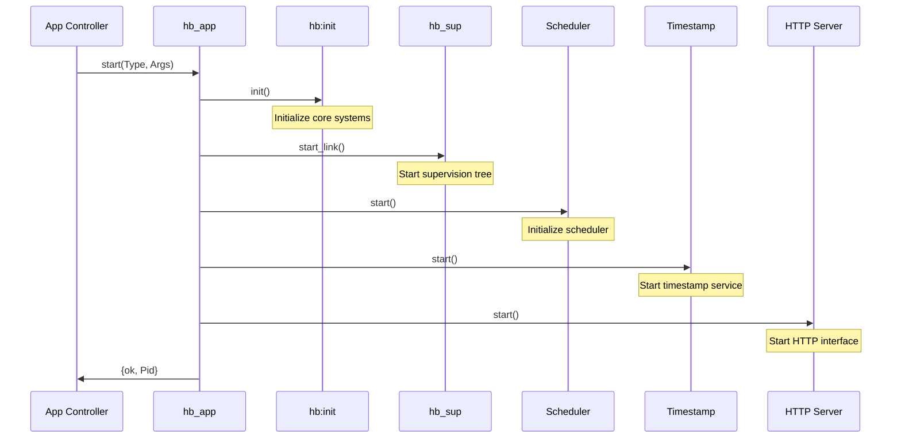

# Module: hb_app

## Basic Information
- **Source File:** hb_app.erl
- **Module Type:** Core System
- **Purpose:** Main HyperBEAM application entry point

## Purpose
Serves as the primary application module for HyperBEAM, implementing the OTP application behavior. This module orchestrates the system startup sequence, ensuring all core components are initialized in the correct order.

## Interface

### Core Operations
- `start/2` - Start the HyperBEAM application
- `stop/1` - Stop the HyperBEAM application

## Dependencies

### Direct Dependencies
- hb: Core initialization
- hb_sup: Root supervisor
- dev_scheduler_registry: Scheduler management
- ar_timestamp: Timestamp service
- hb_http_server: HTTP server interface

### Inverse Dependencies
- Used by Erlang application controller
- Core system startup coordinator
- Primary system lifecycle manager

## Implementation Details

### Key Concepts

1. **Application Startup Sequence**
   ```erlang
   start(_StartType, _StartArgs) ->
       % Initialize core HyperBEAM functionality
       hb:init(),
       
       % Start root supervisor
       hb_sup:start_link(),
       
       % Initialize scheduler registry
       ok = dev_scheduler_registry:start(),
       
       % Start timestamp service
       _TimestampServer = ar_timestamp:start(),
       
       % Start HTTP server
       {ok, _} = hb_http_server:start().
   ```
   The startup sequence is carefully ordered to ensure dependencies are available when needed:
   1. Core initialization first
   2. Supervision tree establishment
   3. Scheduler system startup
   4. Support services initialization
   5. Network interface activation

2. **Application Shutdown**
   ```erlang
   stop(_State) ->
       ok.
   ```
   Clean shutdown is handled by the OTP application controller, which ensures orderly termination of the supervision tree.

### State Management

1. **System State**
   - Application lifecycle state
   - Component initialization status
   - Service availability tracking
   - Resource allocation state

2. **Component State**
   - Supervisor tree state
   - Service process states
   - Resource states
   - Network interface state

3. **Startup State**
   - Initialization sequence state
   - Dependency resolution state
   - Service startup state
   - Error handling state

### Error Handling

1. **Startup Errors**
   - Initialization failures
   - Supervisor startup errors
   - Service startup failures
   - Resource allocation errors

2. **Shutdown Errors**
   - Resource cleanup failures
   - Process termination errors
   - State cleanup issues
   - Network shutdown problems

## Integration Points

1. **OTP Integration**
   - Application behavior
   - Supervision principles
   - Process management
   - Error handling

2. **System Services**
   - Scheduler system
   - Timestamp service
   - HTTP interface
   - Resource management

3. **Core Systems**
   - Initialization system
   - Supervision system
   - Network system
   - Resource system

## Analysis Insights

### Performance Considerations

1. **Startup Performance**
   - Sequential initialization
   - Resource allocation
   - Service startup
   - State establishment

2. **System Impact**
   - Memory footprint
   - Process overhead
   - Resource usage
   - Network impact

### Security Implications

1. **System Security**
   - Component isolation
   - Resource protection
   - Service security
   - Network security

2. **Startup Security**
   - Initialization safety
   - Resource protection
   - Service isolation
   - Error containment

### Best Practices

1. **Application Design**
   - Follow OTP principles
   - Proper initialization
   - Clean shutdown
   - Error handling

2. **Integration**
   - Service coordination
   - Resource management
   - Error handling
   - State tracking

3. **System Management**
   - Proper startup
   - Clean shutdown
   - Resource cleanup
   - Error recovery

### Example Usage

```erlang
% Application startup (via application controller)
application:start(hyperbeam).

% This triggers the following sequence:
1. hb:init()              % Core initialization
2. hb_sup:start_link()    % Supervisor tree
3. dev_scheduler_registry:start() % Scheduler system
4. ar_timestamp:start()   % Timestamp service
5. hb_http_server:start() % Network interface

% Application shutdown
application:stop(hyperbeam).

% This triggers:
1. OTP shutdown sequence
2. Supervisor tree termination
3. Resource cleanup
4. Process termination
```

## Startup Flow Visualization



## Shutdown Flow Visualization

```mermaid
sequenceDiagram
    participant AC as App Controller
    participant App as hb_app
    participant Sup as Supervisor
    participant Procs as Processes

    AC->>App: stop(State)
    App->>Sup: stop children
    Sup->>Procs: terminate
    Note over Procs: Cleanup resources
    Procs->>Sup: terminated
    Sup->>App: stopped
    App->>AC: ok
