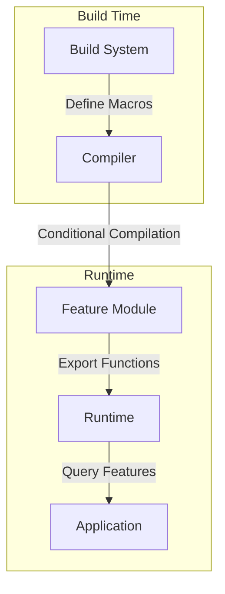

# Module: hb_features

## Basic Information
- **Source File:** hb_features.erl
- **Module Type:** Core System
- **Purpose:** Feature flag management and build-time configuration proxy

## Purpose
Acts as a bridge between the build system and runtime environment by exposing compile-time feature flags through a unified interface. This module uses Erlang's `-ifdef` macro system to conditionally enable features based on build-time configuration.

## Interface

### Core Operations
- `all/0` - Get map of all feature flags and their states
- `enabled/1` - Check if specific feature is enabled
- `http3/0` - Check HTTP/3 support
- `rocksdb/0` - Check RocksDB support
- `test/0` - Check test mode
- `genesis_wasm/0` - Check Genesis WASM support

## Dependencies

### Direct Dependencies
- Erlang compiler: `-ifdef` macro system
- Build system: Feature flag definitions
- Module info system: Export introspection

### Inverse Dependencies
- Used by all modules requiring feature checks
- Core system capability provider
- Build system integration point

## Implementation Details

### Key Concepts

1. **Feature Flag System**
   ```erlang
   % Feature flag definition pattern
   -ifdef(ENABLE_FEATURE).
   feature() -> true.
   -else.
   feature() -> false.
   -endif.
   ```
   Each feature is defined using conditional compilation:
   - Build system defines `ENABLE_*` macros
   - Compile-time resolution of features
   - Runtime access to build decisions

2. **Feature Discovery**
   ```erlang
   all() ->
       Features =
           lists:filtermap(
               fun({Name, _}) ->
                   case lists:member(Name, [all, enabled, module_info]) of
                       true -> false;
                       false -> {true, Name}
                   end
               end,
               ?MODULE:module_info(exports)
           ),
       maps:from_list(
           lists:map(
               fun(Name) ->
                   {Name, ?MODULE:Name()}
               end,
               Features
           )
       ).
   ```
   Dynamic feature discovery through module introspection:
   - Examines exported functions
   - Filters utility functions
   - Maps feature names to states

3. **Feature Checking**
   ```erlang
   enabled(Feature) ->
       maps:get(Feature, all(), false).
   ```
   Safe feature checking with defaults:
   - Unified interface
   - Default to disabled
   - Runtime caching

### State Management

1. **Build State**
   - Compile-time flags
   - Feature definitions
   - Macro system
   - Build configuration

2. **Runtime State**
   - Feature availability
   - Capability flags
   - System state
   - Feature map

3. **Feature State**
   ```erlang
   % Current feature set
   - http3: HTTP/3 protocol support
   - rocksdb: RocksDB storage backend
   - test: Test mode configuration
   - genesis_wasm: WASM execution support
   ```

### Error Handling

1. **Feature Checks**
   ```erlang
   % Safe feature checking
   enabled(Feature) ->
       maps:get(Feature, all(), false).
   ```
   - Default to disabled
   - Safe lookups
   - Error prevention
   - State protection

2. **Build Integration**
   - Macro validation
   - Feature consistency
   - Build errors
   - State verification

## Integration Points

1. **Build System**
   - Feature definitions
   - Macro system
   - Compilation flags
   - Build configuration

2. **Runtime System**
   - Feature checks
   - Capability queries
   - State access
   - System configuration

3. **Module System**
   - Export introspection
   - Function discovery
   - State mapping
   - Feature access

## Analysis Insights

### Performance Considerations

1. **Build Impact**
   - Compile-time resolution
   - Dead code elimination
   - Feature optimization
   - Size reduction

2. **Runtime Impact**
   - Fast feature checks
   - State caching
   - Memory efficiency
   - Access patterns

### Security Implications

1. **Feature Control**
   - Build-time locking
   - Runtime protection
   - State isolation
   - Access control

2. **System Protection**
   - Feature isolation
   - State protection
   - Error prevention
   - Access control

### Best Practices

1. **Feature Management**
   - Clear definitions
   - Build integration
   - State tracking
   - Error handling

2. **Integration**
   - Build system
   - Runtime system
   - Error handling
   - State management

3. **Usage Patterns**
   - Feature checks
   - State access
   - Error handling
   - Capability queries

### Example Usage

```erlang
% Check individual features
IsHTTP3 = hb_features:http3(),
IsRocksDB = hb_features:rocksdb(),
IsTest = hb_features:test(),

% Check specific feature
case hb_features:enabled(http3) of
    true -> 
        % Use HTTP/3
        setup_http3();
    false ->
        % Fallback to HTTP/2
        setup_http2()
end,

% Get all features
Features = hb_features:all(),
io:format("Available features: ~p~n", [maps:keys(Features)]),

% Conditional behavior
case hb_features:enabled(genesis_wasm) of
    true ->
        execute_wasm_code(Code);
    false ->
        {error, wasm_not_supported}
end
```

## Feature Resolution Flow



## Feature Check Flow

```mermaid
sequenceDiagram
    participant App as Application
    participant Feat as hb_features
    participant Cache as Feature Cache
    participant Build as Build Config

    App->>Feat: enabled(feature)
    Feat->>Cache: check_cache()
    
    alt Cache Miss
        Feat->>Build: check_build_flag()
        Build->>Feat: flag_state
        Feat->>Cache: update_cache()
    end
    
    Feat->>App: feature_state
