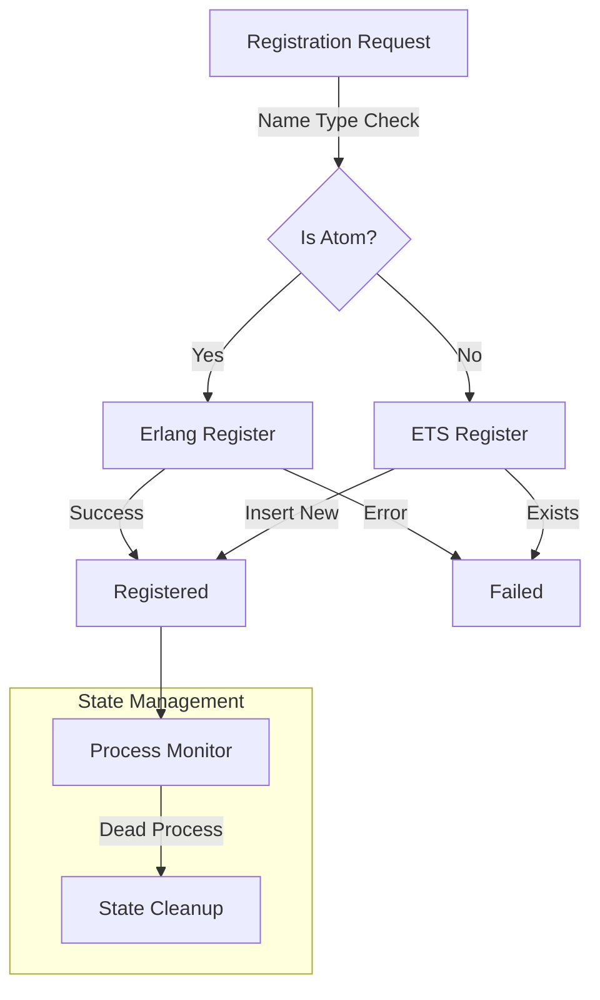

# Module: hb_name

## Basic Information
- **Source File:** hb_name.erl
- **Module Type:** Core System
- **Purpose:** Extended process registration system

## Purpose
Provides an abstraction layer over Erlang's process registration system that allows registering processes with any term as a name, not just atoms. This enables more flexible process identification while maintaining atomic registration guarantees. The module is particularly important for HyperBEAM's distributed architecture where processes may need to be identified by hashpaths or versioned IDs.

## Interface

### Core Operations
- `start/0` - Initialize the name registry
- `register/1` - Register current process with a name
- `register/2` - Register specific process with a name
- `unregister/1` - Remove name registration
- `lookup/1` - Find process by name
- `all/0` - List all registered names

## Dependencies

### Direct Dependencies
- ets: Storage for non-atom registrations
- erlang: Native process registration
- timer: Test utilities
- eunit: Testing framework

### Inverse Dependencies
- Used by all modules requiring process registration
- Core system naming provider
- Process discovery service

## Implementation Details

### Key Concepts

1. **ETS-Based Registry**
   ```erlang
   % Initialize ETS table with optimized settings
   start_ets() ->
       ets:new(?NAME_TABLE, [
           named_table,
           public,
           {keypos, 1},
           {write_concurrency, true}, % Safe as key-writes are atomic
           {read_concurrency, true}
       ]),
       ok.
   ```
   The registry uses ETS for:
   - Atomic operations
   - Concurrent access
   - Fast lookups
   - Process monitoring

2. **Hybrid Registration**
   ```erlang
   % Registration handling based on name type
   register(Name, Pid) when is_atom(Name) ->
       try erlang:register(Name, Pid) of
           true -> ok
       catch
           error:badarg -> error % Name already registered
       end;
   register(Name, Pid) ->
       start(),
       case ets:insert_new(?NAME_TABLE, {Name, Pid}) of
           true -> ok;
           false -> error
       end.
   ```
   Seamless integration of:
   - Erlang's native registration
   - ETS-based registration
   - Atomic operations
   - Error handling

3. **Process Monitoring**
   ```erlang
   % Dead process cleanup during lookup
   ets_lookup(Name) ->
       case ets:lookup(?NAME_TABLE, Name) of
           [{Name, Pid}] -> 
               case is_process_alive(Pid) of
                   true -> Pid;
                   false -> 
                       ets:delete(?NAME_TABLE, Name),
                       undefined
               end;
           [] -> undefined
       end.
   ```
   Automatic cleanup of:
   - Dead processes
   - Stale registrations
   - Invalid entries
   - Resource management

### State Management

1. **Registry State**
   ```erlang
   % Registry initialization with safety checks
   start() ->
       try ets:info(?NAME_TABLE) of
           undefined -> start_ets();
           _ -> ok
       catch
           error:badarg -> start_ets()
       end.
   ```
   Careful management of:
   - Table initialization
   - State consistency
   - Error recovery
   - Resource cleanup

2. **Process State**
   ```erlang
   % Process state verification
   case is_process_alive(Pid) of
       true -> Pid;
       false -> 
           ets:delete(?NAME_TABLE, Name),
           undefined
   end
   ```
   Monitoring of:
   - Process lifecycle
   - Registration validity
   - Resource cleanup
   - State consistency

### Error Handling

1. **Registration Errors**
   ```erlang
   % Safe registration with error handling
   register(Name, Pid) when is_atom(Name) ->
       try erlang:register(Name, Pid) of
           true -> ok
       catch
           error:badarg -> error
       end
   ```
   Comprehensive handling of:
   - Duplicate registrations
   - Invalid names
   - Dead processes
   - Resource errors

2. **Cleanup Operations**
   ```erlang
   % Safe unregistration with cleanup
   unregister(Name) when is_atom(Name) ->
       catch erlang:unregister(Name),
       ets:delete(?NAME_TABLE, Name),  % Cleanup if atom was in ETS
       ok
   ```
   Safe management of:
   - Process termination
   - Registration cleanup
   - Resource recovery
   - State consistency

## Integration Points

1. **Process System**
   - Process registration
   - Name management
   - State tracking
   - Resource coordination

2. **Storage System**
   - ETS table management
   - State persistence
   - Atomic operations
   - Concurrent access

3. **Runtime System**
   - Process monitoring
   - State management
   - Error handling
   - Resource cleanup

## Analysis Insights

### Performance Considerations

1. **Registration Performance**
   ```erlang
   % Optimized table configuration
   ets:new(?NAME_TABLE, [
       named_table,
       public,
       {keypos, 1},
       {write_concurrency, true},
       {read_concurrency, true}
   ])
   ```
   Performance optimizations:
   - Concurrent access
   - Fast lookups
   - Atomic operations
   - Resource efficiency

2. **Cleanup Impact**
   ```erlang
   % Lazy cleanup during lookup
   case is_process_alive(Pid) of
       true -> Pid;
       false -> 
           ets:delete(?NAME_TABLE, Name),
           undefined
   end
   ```
   Resource management:
   - Lazy cleanup
   - On-demand verification
   - Efficient deletion
   - State consistency

### Security Implications

1. **Registration Protection**
   - Atomic operations
   - Process validation
   - Name uniqueness
   - Resource isolation

2. **State Protection**
   - Consistent state
   - Safe cleanup
   - Error handling
   - Resource management

### Best Practices

1. **Registration Usage**
   - Atomic operations
   - Error handling
   - State verification
   - Resource cleanup

2. **Integration**
   - Process monitoring
   - State management
   - Error handling
   - Resource coordination

3. **System Design**
   - Atomic guarantees
   - Concurrent access
   - Safe cleanup
   - Resource efficiency

### Example Usage

```erlang
% Basic registration
ok = hb_name:register(my_process),
self() = hb_name:lookup(my_process),

% Custom name registration
ProcessName = {process, "1.0", generate_id()},
ok = hb_name:register(ProcessName),
self() = hb_name:lookup(ProcessName),

% Registration with specific PID
Worker = spawn(fun() -> worker_loop() end),
ok = hb_name:register(worker_process, Worker),
Worker = hb_name:lookup(worker_process),

% List all registrations
Registered = hb_name:all(),
io:format("Active processes: ~p~n", [Registered]),

% Cleanup
ok = hb_name:unregister(ProcessName)
```

## Registration Flow



## Lookup Flow

```mermaid
sequenceDiagram
    participant App as Application
    participant Name as hb_name
    participant ETS as ETS Table
    participant Erlang as Erlang Registry

    App->>Name: lookup(Name)
    
    alt Is Atom
        Name->>Erlang: whereis(Name)
        Erlang-->>Name: PID/undefined
        
        alt undefined
            Name->>ETS: lookup(Name)
            ETS-->>Name: PID/undefined
        end
    else
        Name->>ETS: lookup(Name)
        ETS-->>Name: PID/undefined
    end
    
    alt Found PID
        Name->>Name: verify_alive(PID)
    end
    
    Name-->>App: PID/undefined
