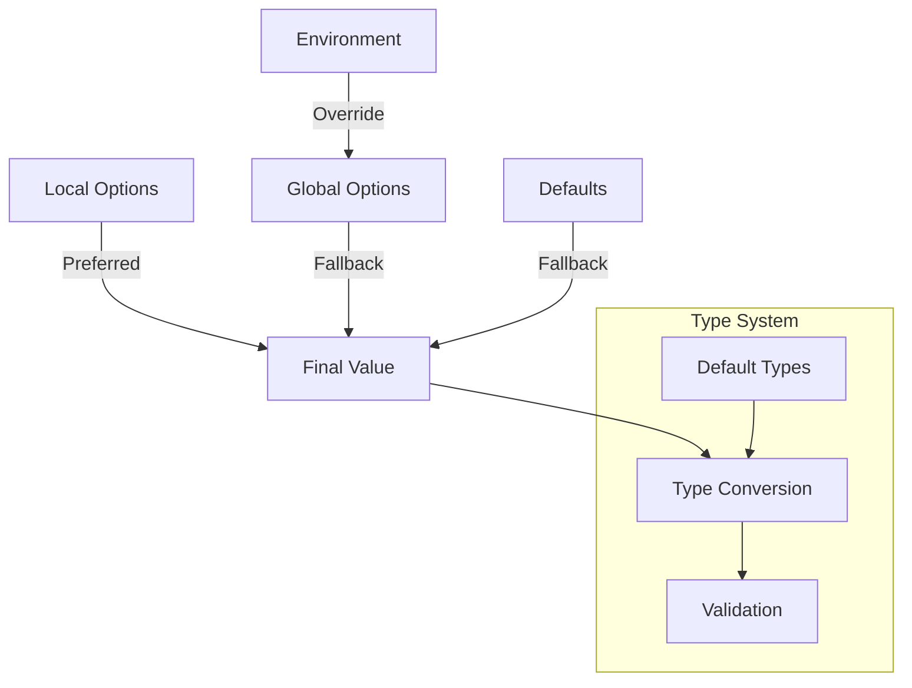

# Module: hb_opts

## Basic Information
- **Source File:** hb_opts.erl
- **Module Type:** Core System
- **Purpose:** Configuration management system for HyperBEAM

## Purpose
Provides a unified interface for managing both global and local configuration options throughout HyperBEAM. The module implements a sophisticated configuration system that handles environment variables, default values, and local overrides while ensuring deterministic behavior for critical operations.

## Interface

### Core Operations
- `get/1` - Get option with default undefined
- `get/2` - Get option with custom default
- `get/3` - Get option with custom default and local overrides
- `load/1` - Load configuration from flat file
- `default_message/0` - Get default configuration map
- `mimic_default_types/2` - Convert map values to match default types

## Dependencies

### Direct Dependencies
- dev_codec_flat: Configuration file parsing
- hb_util: Utility functions
- hb_features: Feature flags
- os: Environment variables

### Inverse Dependencies
- Used by all HyperBEAM modules for configuration
- Core system configuration provider
- Primary determinism enforcer

## Implementation Details

### Key Concepts

1. **Configuration Hierarchy**
   ```erlang
   % Configuration lookup order
   get(Key, Default, Opts = #{ prefer := local }) ->
       case ?MODULE:get(Key, hb_opts_not_found, Opts#{ only => local }) of
           hb_opts_not_found ->
               ?MODULE:get(Key, Default, Opts#{ only => global });
           Value -> Value
       end
   ```
   The system implements a sophisticated lookup hierarchy:
   1. Local options (if preferred)
   2. Global options
   3. Environment variables
   4. Default values

2. **Deterministic Behavior**
   ```erlang
   % Options must never change deterministic behavior
   % Example from documentation:
   %%% Options set in an `Opts' map must _never_ change the behavior of a function
   %%% that should otherwise be deterministic. Doing so may lead to loss of funds
   %%% by the HyperBEAM node operator, as the results of their executions will be
   %%% different than those of other node operators.
   ```
   Critical focus on maintaining deterministic execution across nodes.

3. **Environment Integration**
   ```erlang
   -define(ENV_KEYS,
       #{
           priv_key_location => {"HB_KEY", "hyperbeam-key.json"},
           hb_config_location => {"HB_CONFIG", "config.flat"},
           port => {"HB_PORT", fun erlang:list_to_integer/1, "8734"},
           mode => {"HB_MODE", fun list_to_existing_atom/1},
           debug_print => {"HB_PRINT", fun(...) -> ... end}
       }
   ).
   ```
   Sophisticated environment variable handling with type conversion.

### State Management

1. **Configuration State**
   ```erlang
   % Default configuration map
   default_message() ->
       #{
           % Core settings
           initialized => true,
           http_client => gun,
           scheduling_mode => local_confirmation,
           compute_mode => lazy,
           
           % Network settings
           host => <<"localhost">>,
           gateway => <<"https://arweave.net">>,
           port => 8734,
           
           % Security settings
           priv_key_location => <<"hyperbeam-key.json">>,
           trusted_device_signers => [],
           
           % Performance settings
           http_connect_timeout => 5000,
           http_keepalive => 120000,
           scheduler_location_ttl => (60 * 60 * 24 * 7) * 1000
       }
   ```
   Comprehensive default configuration covering all system aspects.

2. **Type Management**
   ```erlang
   % Type conversion based on defaults
   mimic_default_types(Map, Mode) ->
       Default = default_message(),
       maps:from_list(lists:map(
           fun({Key, Value}) ->
               NewKey = hb_util:key_to_atom(Key, Mode),
               NewValue = 
                   case maps:get(NewKey, Default, not_found) of
                       not_found -> Value;
                       DefaultValue when is_atom(DefaultValue) ->
                           hb_util:atom(Value);
                       DefaultValue when is_integer(DefaultValue) ->
                           hb_util:int(Value);
                       DefaultValue when is_float(DefaultValue) ->
                           hb_util:float(Value);
                       DefaultValue when is_binary(DefaultValue) ->
                           Value;
                       _ -> Value
                   end,
               {NewKey, NewValue}
           end,
           maps:to_list(Map)
       )).
   ```
   Automatic type conversion based on default values.

### Error Handling

1. **Configuration Errors**
   ```erlang
   load(Path) ->
       case file:read_file(Path) of
           {ok, Bin} ->
               try dev_codec_flat:deserialize(Bin) of
                   {ok, Map} -> {ok, mimic_default_types(Map, new_atoms)}
               catch
                   error:B -> {error, B}
               end;
           _ -> {error, not_found}
       end.
   ```
   Comprehensive error handling for configuration loading.

2. **Type Conversion Errors**
   ```erlang
   % Environment variable parsing with error handling
   global_get(Key, Default) ->
       case maps:get(Key, ?ENV_KEYS, Default) of
           {EnvKey, ValParser} when is_function(ValParser) ->
               case cached_os_env(EnvKey, not_found) of
                   not_found -> config_lookup(Key, Default);
                   Value -> ValParser(Value)
               end;
           % ... other cases
       end.
   ```
   Safe type conversion with fallbacks.

## Integration Points

1. **Environment System**
   - Environment variables
   - System configuration
   - Default values
   - Type conversion

2. **Configuration System**
   - File-based configuration
   - Runtime overrides
   - Type management
   - Error handling

3. **Application System**
   - Global settings
   - Local overrides
   - Feature flags
   - Debug options

## Analysis Insights

### Performance Considerations

1. **Configuration Caching**
   ```erlang
   % Environment variable caching
   cached_os_env(Key, DefaultValue) ->
       case erlang:get({os_env, Key}) of
           undefined ->
               case os:getenv(Key) of
                   false -> DefaultValue;
                   Value ->
                       erlang:put({os_env, Key}, Value),
                       Value
               end;
           Value -> Value
       end.
   ```
   Efficient caching of environment variables.

2. **Type Conversion**
   - Lazy conversion
   - Cached results
   - Default fallbacks
   - Error recovery

### Security Implications

1. **Configuration Security**
   ```erlang
   % Security-critical settings
   #{
       trusted_device_signers => [],
       load_remote_devices => false,
       debug_show_priv => false,
       trusted => #{}
   }
   ```
   Careful management of security settings.

2. **Determinism Protection**
   - Option validation
   - Behavior constraints
   - Error handling
   - State protection

### Best Practices

1. **Configuration Management**
   - Clear hierarchy
   - Type safety
   - Error handling
   - Default values

2. **Integration**
   - Environment awareness
   - System coordination
   - Error handling
   - State management

3. **Security**
   - Safe defaults
   - Validation
   - Error handling
   - State protection

### Example Usage

```erlang
% Basic option retrieval
Value = hb_opts:get(key),
Value = hb_opts:get(key, default_value),

% Local overrides
Value = hb_opts:get(key, default_value, #{
    key => override_value,
    prefer => local
}),

% Load configuration file
{ok, Config} = hb_opts:load("config.flat"),

% Configuration with type conversion
Config = #{
    "port" => "1234",
    "host" => "localhost",
    "debug" => "true"
},
TypedConfig = hb_opts:mimic_default_types(Config, new_atoms)
```

## Configuration Flow



## Option Resolution Flow

```mermaid
sequenceDiagram
    participant App as Application
    participant Opts as hb_opts
    participant Env as Environment
    participant File as Config File
    participant Cache as Process Dictionary

    App->>Opts: get(key, default, local_opts)
    
    alt Local Preferred
        Opts->>Opts: Check local_opts
        Opts->>Opts: Check global
        Opts->>Env: Check environment
        Opts->>File: Check config file
    else Global Preferred
        Opts->>Opts: Check global
        Opts->>Env: Check environment
        Opts->>File: Check config file
        Opts->>Opts: Check local_opts
    end
    
    Opts->>Cache: Cache result
    Opts->>App: Return value
