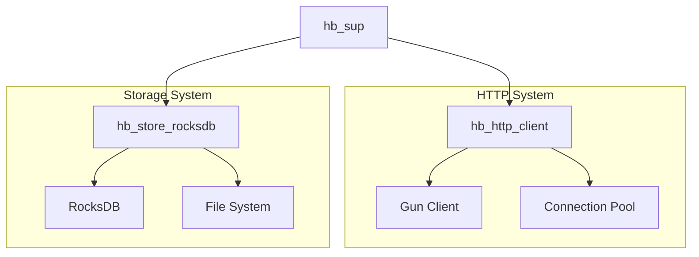

# Module: hb_sup

## Basic Information
- **Source File:** hb_sup.erl
- **Module Type:** Core System
- **Purpose:** Root supervisor for HyperBEAM application

## Purpose
Implements the root supervisor for the HyperBEAM application, managing the lifecycle and supervision strategy for critical system components. This supervisor follows the OTP supervisor behavior and implements a one_for_all strategy, meaning if any child process fails, all children are restarted.

## Interface

### Core Operations
- `start_link/0` - Start supervisor with default options
- `start_link/1` - Start supervisor with custom options
- `init/1` - Initialize supervisor with child specifications

## Dependencies

### Direct Dependencies
- hb_http_client: HTTP client worker
- hb_store_rocksdb: RocksDB storage backend
- hb_opts: Configuration management

### Inverse Dependencies
- Used by hb_app for system initialization
- Core system lifecycle manager
- Primary fault tolerance provider

## Implementation Details

### Key Concepts

1. **Supervision Strategy**
   ```erlang
   % Supervisor configuration
   SupFlags = #{
       strategy => one_for_all,  % All children restart if one fails
       intensity => 0,           % No restarts allowed in period
       period => 1              % 1 second period
   }
   ```
   The supervisor uses a strict one_for_all strategy with no restarts allowed, indicating these are critical system components that should fail fast if there are issues.

2. **Child Specifications**
   ```erlang
   % HTTP client specification
   GunChild = #{
       id => hb_http_client,
       start => {hb_http_client, start_link, [Opts]},
       restart => permanent,
       shutdown => 5000,
       type => worker,
       modules => [hb_http_client]
   }
   ```
   Each child process is carefully specified with:
   - Unique identification
   - Start function and arguments
   - Restart strategy
   - Shutdown timeout
   - Process type
   - Module dependencies

3. **Storage Management**
   ```erlang
   % Store child generation
   store_children([RocksDBOpts = #{ <<"store-module">> := hb_store_rocksdb } | Rest]) ->
       [#{
           id => hb_store_rocksdb,
           start => {hb_store_rocksdb, start_link, [RocksDBOpts]}
       }] ++ store_children(Rest)
   ```
   Dynamic child specification generation based on configured storage backends.

### State Management

1. **Supervisor State**
   - Child process registry
   - Restart counters
   - Process monitoring
   - Error tracking

2. **Child State**
   - Process state
   - Resource allocation
   - Connection state
   - Error handling

3. **System State**
   - Supervision tree
   - Resource tracking
   - Error handling
   - Recovery state

### Error Handling

1. **Supervisor Errors**
   - Child process failures
   - Restart management
   - Resource cleanup
   - State recovery

2. **Child Errors**
   - Process crashes
   - Resource failures
   - State corruption
   - Connection issues

## Integration Points

1. **Application System**
   - System initialization
   - Process management
   - Error handling
   - Resource coordination

2. **Storage System**
   - Backend initialization
   - Resource management
   - State persistence
   - Error handling

3. **Network System**
   - Client initialization
   - Connection management
   - Resource tracking
   - Error handling

## Analysis Insights

### Performance Considerations

1. **Supervision Impact**
   - Process overhead
   - Memory usage
   - Restart costs
   - Resource management

2. **Child Management**
   - Process creation
   - State tracking
   - Resource allocation
   - Error handling

### Security Implications

1. **Process Isolation**
   - Component separation
   - Resource protection
   - State isolation
   - Error containment

2. **Resource Protection**
   - Access control
   - State protection
   - Connection security
   - Error isolation

### Best Practices

1. **Supervisor Design**
   - Clear strategy
   - Proper specification
   - Error handling
   - Resource management

2. **Child Management**
   - Process isolation
   - Resource control
   - State tracking
   - Error handling

3. **System Integration**
   - Clean initialization
   - Proper shutdown
   - Resource cleanup
   - Error recovery

### Example Usage

```erlang
% Start supervisor with default options
{ok, Pid} = hb_sup:start_link(),

% Start with custom storage configuration
{ok, Pid} = hb_sup:start_link(#{
    store => [#{
        <<"store-module">> => hb_store_rocksdb,
        <<"path">> => <<"data/db">>,
        <<"options">> => #{
            <<"create_if_missing">> => true
        }
    }]
}),

% The supervisor automatically manages:
% - HTTP client worker
% - Storage backends
% - System resources
% - Process lifecycles
```

## Supervision Tree Visualization



## Process Lifecycle Flow

```mermaid
sequenceDiagram
    participant App as Application
    participant Sup as hb_sup
    participant HTTP as HTTP Client
    participant Store as Storage

    App->>Sup: start_link(Opts)
    Sup->>HTTP: start_child
    Sup->>Store: start_child
    
    Note over HTTP,Store: Normal Operation
    
    alt Child Failure
        HTTP->>Sup: exit(Reason)
        Sup->>HTTP: terminate
        Sup->>Store: terminate
        Sup->>HTTP: restart
        Sup->>Store: restart
    end
