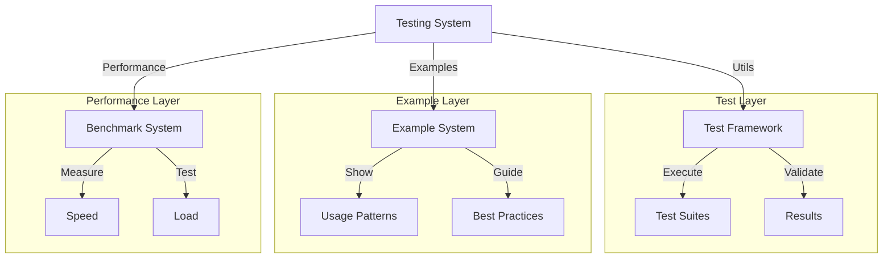
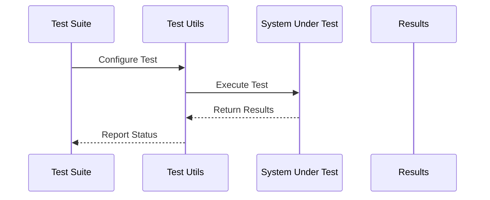

# Testing & Examples System Overview

## System Architecture

The Testing & Examples system provides a comprehensive framework for testing, benchmarking, and demonstrating HyperBEAM functionality. This system is built around four key components that work together to ensure system quality and provide usage examples:

### 1. Test Utilities (hb_test_utils)
The test utilities component provides core testing infrastructure:

```erlang
% Core test suite execution
suite_with_opts(Suite, OptsList) ->
    lists:filtermap(
        fun(OptSpec = #{ name := Name, opts := Opts }) ->
            case satisfies_requirements(OptSpec) of
                true -> {true, setup_and_run_tests(Suite, Opts)};
                false -> false
            end
        end,
        OptsList
    ).
```

This enables:
- **Suite Organization**: Structured test grouping
- **Configuration Management**: Flexible test options
- **Resource Management**: Clean setup/teardown
- **Result Validation**: Clear assertions

The utilities provide:
1. **Test Structure**
   - Suite definition
   - Test grouping
   - Option handling
   - Result management

2. **Resource Handling**
   - Environment setup
   - State management
   - Resource cleanup
   - Error handling

### 2. Example Framework (hb_examples)
The examples system demonstrates real-world usage:

```erlang
% Example test case
relay_with_payments_test() ->
    % Setup test environment
    HostWallet = ar_wallet:new(),
    ClientWallet = ar_wallet:new(),
    
    % Configure and start node
    HostNode = setup_test_node(HostWallet),
    
    % Execute test operations
    execute_test_scenario(HostNode, ClientWallet).
```

This provides:
- **Usage Patterns**: Common use cases
- **Integration Examples**: System interaction
- **Error Handling**: Problem resolution
- **Best Practices**: Recommended approaches

The framework enables:
1. **Basic Examples**
   - Simple scenarios
   - Core features
   - Quick understanding
   - Easy validation

2. **Advanced Examples**
   - Complex scenarios
   - Full features
   - Real use cases
   - Complete flows

### 3. Performance Testing (hb_http_benchmark_tests)
The benchmark system validates performance:

```erlang
% Performance benchmark
benchmark_test() ->
    BenchTime = 1,
    BenchWorkers = 16,
    URL = setup_benchmark_node(),
    
    % Execute benchmark
    Iterations = run_benchmark(URL, BenchTime, BenchWorkers),
    
    % Validate results
    validate_performance(Iterations).
```

This enables:
- **Speed Testing**: Operation timing
- **Load Testing**: System stress
- **Resource Usage**: Utilization tracking
- **Scaling Validation**: Capacity testing

The system provides:
1. **Performance Metrics**
   - Operation speed
   - Resource usage
   - System capacity
   - Error rates

2. **Load Generation**
   - Concurrent users
   - Request patterns
   - Resource stress
   - Error scenarios

### 4. Test Vectors (hb_ao_test_vectors)
The test vectors validate core functionality:

```erlang
% Test vector execution
test_suite() ->
    [
        {resolve_simple, "resolve simple",
            fun resolve_simple_test/1},
        {resolve_id, "resolve id",
            fun resolve_id_test/1}
    ].
```

This provides:
- **Functionality Testing**: Feature validation
- **Edge Cases**: Boundary testing
- **Error Handling**: Problem detection
- **Integration Testing**: System interaction

The vectors enable:
1. **Feature Testing**
   - Core functions
   - Edge cases
   - Error scenarios
   - Integration points

2. **System Testing**
   - Full flows
   - Complex scenarios
   - Error handling
   - State management

## System Integration

### 1. Component Interaction
The components work together in a layered architecture:



This enables:
1. **Clean Architecture**
   - Clear separation
   - Strong cohesion
   - Loose coupling
   - Easy extension

2. **System Coordination**
   - Component interaction
   - Resource sharing
   - State management
   - Error handling

### 2. Test Flow
The system manages complex test flows:



This provides:
1. **Flow Management**
   - Test execution
   - Resource handling
   - State tracking
   - Result collection

2. **System Coordination**
   - Component sync
   - Resource sharing
   - State preservation
   - Error propagation

## Core Functionality

### 1. Test Management
The system provides comprehensive test management:

1. **Suite Organization**
   ```erlang
   % Test suite structure
   organize_suite() ->
       [
           {test_name, "description",
               fun(Opts) ->
                   setup_test(Opts),
                   execute_test(Opts),
                   verify_results(Opts)
               end
           }
       ].
   ```

   Features:
   - Suite definition
   - Test grouping
   - Resource management
   - Result validation

2. **Configuration Management**
   ```erlang
   % Test configuration
   manage_config() ->
       #{
           name => test_config,
           desc => "Test configuration",
           opts => #{
               store => memory_store,
               cache => disabled
           }
       }.
   ```

   Provides:
   - Config definition
   - Option management
   - Resource control
   - State handling

### 2. Example Management
The system enables example organization:

1. **Basic Examples**
   ```erlang
   % Simple example
   basic_example() ->
       % Setup
       Environment = setup_environment(),
       
       % Execute
       Result = execute_operation(Environment),
       
       % Verify
       verify_result(Result).
   ```

   Features:
   - Simple scenarios
   - Clear purpose
   - Easy understanding
   - Quick validation

2. **Advanced Examples**
   ```erlang
   % Complex example
   advanced_example() ->
       % Setup complex environment
       Environment = setup_complex_environment(),
       
       % Execute multiple operations
       Results = execute_operations(Environment),
       
       % Verify complex results
       verify_complex_results(Results).
   ```

   Provides:
   - Complex scenarios
   - Full features
   - Real use cases
   - Complete flows

## Best Practices

### 1. Test Organization
Recommended test structure:

```erlang
% Test organization pattern
organize_tests() ->
    % 1. Define suites
    Suites = define_test_suites(),
    
    % 2. Configure options
    Options = configure_test_options(),
    
    % 3. Execute tests
    run_test_suites(Suites, Options).
```

### 2. Example Creation
Recommended example pattern:

```erlang
% Example creation pattern
create_example() ->
    % 1. Setup environment
    Environment = setup_example_environment(),
    
    % 2. Execute operations
    Results = execute_example_operations(Environment),
    
    % 3. Verify and document
    document_example_results(Results).
```

### 3. Performance Testing
Recommended benchmark pattern:

```erlang
% Benchmark pattern
run_benchmark() ->
    % 1. Configure benchmark
    Config = configure_benchmark(),
    
    % 2. Execute operations
    Results = execute_benchmark(Config),
    
    % 3. Analyze results
    analyze_benchmark_results(Results).
```

## Future Directions

### 1. Test Enhancement
Potential improvements:

1. **Framework**
   - More features
   - Better organization
   - Better reporting
   - Better tools

2. **Coverage**
   - More scenarios
   - Better validation
   - More integration
   - More edge cases

### 2. Example Enhancement
Ways to improve examples:

1. **Documentation**
   - Better explanations
   - More scenarios
   - Better organization
   - Visual guides

2. **Coverage**
   - More use cases
   - More features
   - More patterns
   - More integration

### 3. Performance Enhancement
Areas for improvement:

1. **Benchmarks**
   - More metrics
   - Better accuracy
   - Better reporting
   - Better analysis

2. **Load Testing**
   - More scenarios
   - Better simulation
   - Better control
   - Better reporting
