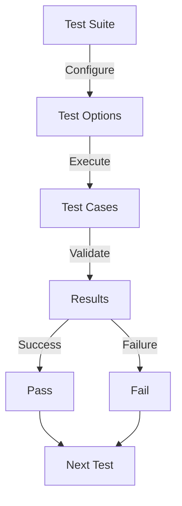

# Module: hb_ao_test_vectors

## Basic Information
- **Source File:** hb_ao_test_vectors.erl
- **Module Type:** Testing Example
- **Purpose:** Resolution Engine Test Vectors

## Purpose
Provides a comprehensive suite of test vectors for validating the resolution engine's execution under different circumstances. The module tests various aspects of message resolution, device handling, and state management with different configuration options.

## Interface

### Core Operations
- `run_test/0` - Run single test via command line
- `run_all_test_/0` - Run all test vectors
- `test_suite/0` - Define test suite
- `test_opts/0` - Define test configurations

## Dependencies

### Direct Dependencies
- eunit: Testing framework
- hb_test_utils: Test utilities
- hb_ao: Resolution engine
- hb_message: Message handling
- hb_cache: Cache operations

### Inverse Dependencies
- System testing
- Resolution validation
- Device testing

## Implementation Details

### Key Concepts

1. **Test Configuration**
   ```erlang
   % Test options configuration
   test_opts() ->
       [
           #{
               name => no_cache,
               desc => "No cache read or write",
               opts => #{
                   hashpath => ignore,
                   cache_control => [<<"no-cache">>, <<"no-store">>],
                   spawn_worker => false,
                   store => #{
                       <<"store-module">> => hb_store_fs,
                       <<"prefix">> => <<"cache-TEST/fs">>
                   }
               },
               skip => [load_as]
           }
       ]
   ```
   Features:
   - Multiple configurations
   - Cache control
   - Store settings
   - Test filtering

2. **Test Suite Organization**
   ```erlang
   % Test suite structure
   test_suite() ->
       [
           {resolve_simple, "resolve simple",
               fun resolve_simple_test/1},
           {resolve_id, "resolve id",
               fun resolve_id_test/1}
           % ... more tests
       ]
   ```
   Provides:
   - Test grouping
   - Test descriptions
   - Function mapping
   - Skip handling

3. **Device Testing**
   ```erlang
   % Device test configuration
   generate_device_with_keys_using_args() ->
       #{
           key_using_only_state =>
               fun(State) ->
                   {ok, <<(maps:get(<<"state_key">>, State))/binary>>}
               end,
           key_using_state_and_msg =>
               fun(State, Msg) ->
                   {ok, <<(maps:get(<<"state_key">>, State))/binary,
                         (maps:get(<<"msg_key">>, Msg))/binary>>}
               end
       }
   ```
   Shows:
   - Device creation
   - State handling
   - Message handling
   - Function arity

### Test Categories

1. **Resolution Tests**
   ```erlang
   % Basic resolution test
   resolve_simple_test(Opts) ->
       Res = hb_ao:resolve(#{ <<"a">> => <<"RESULT">> }, <<"a">>, Opts),
       ?assertEqual({ok, <<"RESULT">>}, Res).
   ```
   Tests:
   - Simple resolution
   - Key handling
   - Value retrieval
   - Error handling

2. **Device Tests**
   ```erlang
   % Device function test
   device_with_handler_function_test(Opts) ->
       Msg = #{
           device => gen_handler_device(),
           test_key => <<"BAD">>
       },
       ?assertEqual(
           {ok, <<"HANDLER VALUE">>},
           hb_ao:resolve(Msg, <<"test_key">>, Opts)
       ).
   ```
   Verifies:
   - Device loading
   - Function handling
   - State management
   - Error cases

### Test Configurations

1. **Cache Control**
   ```erlang
   % Cache configuration
   #{
       name => no_cache,
       desc => "No cache read or write",
       opts => #{
           hashpath => ignore,
           cache_control => [<<"no-cache">>, <<"no-store">>]
       }
   }
   ```
   Manages:
   - Cache settings
   - Store options
   - Path handling
   - Worker control

2. **Store Settings**
   ```erlang
   % Store configuration
   store => #{
       <<"store-module">> => hb_store_fs,
       <<"prefix">> => <<"cache-TEST/fs">>
   }
   ```
   Controls:
   - Store module
   - Path prefix
   - File system
   - Cache location

## Integration Points

1. **Resolution System**
   - Message resolution
   - Key handling
   - Value retrieval
   - Error management

2. **Device System**
   - Device loading
   - Function execution
   - State management
   - Error handling

3. **Cache System**
   - Cache control
   - Store operations
   - Path handling
   - Worker management

## Analysis Insights

### Performance Considerations

1. **Resource Management**
   - Store initialization
   - Cache control
   - Worker handling
   - Memory usage

2. **Operation Efficiency**
   - Resolution speed
   - Cache usage
   - Store access
   - Worker allocation

### Security Implications

1. **Device Safety**
   - Function validation
   - State protection
   - Error handling
   - Resource cleanup

2. **Store Safety**
   - Path validation
   - Access control
   - Error handling
   - Resource protection

### Best Practices

1. **Test Organization**
   ```erlang
   % Recommended test structure
   organize_test() ->
       % 1. Setup
       setup_test_environment(),
       
       % 2. Execute
       run_test_vectors(),
       
       % 3. Verify
       verify_results().
   ```

2. **Device Testing**
   ```erlang
   % Recommended device test
   test_device() ->
       % 1. Create device
       Device = create_test_device(),
       
       % 2. Execute operations
       Results = execute_operations(Device),
       
       % 3. Verify behavior
       verify_device_behavior(Results).
   ```

3. **Configuration Management**
   ```erlang
   % Recommended config handling
   manage_config() ->
       % 1. Setup config
       Config = setup_config(),
       
       % 2. Run tests
       Results = run_with_config(Config),
       
       % 3. Cleanup
       cleanup_config(Config).
   ```

### Example Usage

```erlang
% Run single test
hb_test_utils:run(start_as, normal, test_suite(), test_opts()),

% Run all tests
hb_test_utils:suite_with_opts(test_suite(), test_opts()),

% Test with specific device
Device = generate_device_with_keys_using_args(),
Msg = #{ device => Device, state_key => <<"1">> },
hb_ao:resolve(Msg, #{ path => <<"key_using_only_state">> }, Opts)
```

## Test Flow



## Device Test Flow

```mermaid
sequenceDiagram
    participant Test as Test Suite
    participant Device as Device
    participant State as State
    participant Result as Result

    Test->>Device: Create Device
    Test->>State: Initialize State
    
    loop Test Cases
        Test->>Device: Execute Function
        Device->>State: Access State
        State-->>Device: State Data
        Device-->>Test: Result
        Test->>Result: Verify
    end
