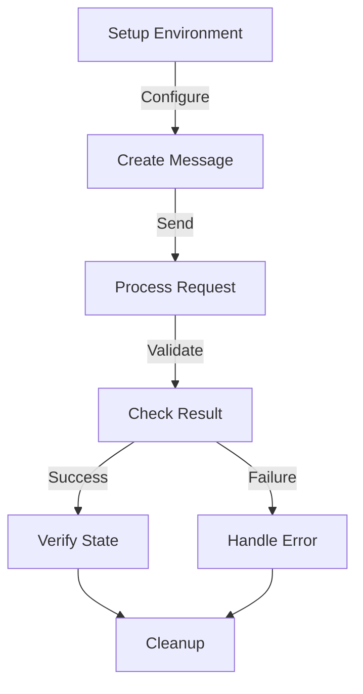

# Module: hb_examples

## Basic Information
- **Source File:** hb_examples.erl
- **Module Type:** Testing Example
- **Purpose:** End-to-End Test Examples

## Purpose
Provides comprehensive end-to-end test examples that demonstrate how to interact with HyperBEAM nodes through the HTTP interface. These tests serve both as system validation and as usage examples for developers.

## Interface

### Core Tests
- `relay_with_payments_test/0` - Message relay with payment system
- `paid_wasm_test/0` - WASM execution with payment
- `create_schedule_aos2_test_disabled/0` - Process scheduling (disabled)
- `schedule/2,3,4` - Helper functions for scheduling

## Dependencies

### Direct Dependencies
- eunit: Testing framework
- hb_http: HTTP client
- hb_message: Message handling
- ar_wallet: Arweave wallet operations
- hb_util: Utility functions

### Inverse Dependencies
- Used as examples
- System testing
- Documentation

## Implementation Details

### Key Concepts

1. **Payment Integration**
   ```erlang
   % Payment system setup
   HostNode =
       hb_http_server:start_node(
           #{
               operator => ar_wallet:to_address(HostWallet),
               preprocessor => ProcessorMsg,
               postprocessor => ProcessorMsg
           }
       ).
   ```
   Features:
   - Wallet management
   - Payment processing
   - Balance tracking
   - Error handling

2. **Message Relay**
   ```erlang
   % Message relay with payment
   ClientMessage =
       hb_message:commit(
           #{
               <<"path">> => <<"/~relay@1.0/call?relay-path=https://www.google.com">>
           },
           ClientWallet
       ),
   Res = hb_http:get(HostNode, ClientMessage, #{})
   ```
   Demonstrates:
   - Message creation
   - HTTP integration
   - Payment handling
   - Error handling

3. **WASM Integration**
   ```erlang
   % WASM execution
   {ok, WASMFile} = file:read_file(<<"test/test-64.wasm">>),
   ClientMessage =
       hb_message:commit(
           #{
               <<"path">> => <<"/~wasm-64@1.0/init/compute/results?function=fac">>,
               <<"body">> => WASMFile,
               <<"parameters+list">> => <<"3.0">>
           },
           ClientWallet
       )
   ```
   Shows:
   - WASM loading
   - Function execution
   - Parameter passing
   - Result handling

### Test Scenarios

1. **Payment Flow**
   ```erlang
   % Payment test flow
   % 1. Try without balance
   Res1 = hb_http:get(HostNode, ClientMessage1, #{}),
   ?assertMatch({error, #{ <<"body">> := <<"Insufficient funds">> }}, Res1),
   
   % 2. Topup balance
   TopupMessage =
       hb_message:commit(
           #{
               <<"path">> => <<"/~simple-pay@1.0/topup">>,
               <<"recipient">> => ClientAddress,
               <<"amount">> => 100
           },
           HostWallet
       ),
   
   % 3. Try again with balance
   Res2 = hb_http:get(HostNode, ClientMessage1, #{})
   ```
   Tests:
   - Balance checking
   - Payment processing
   - Error handling
   - Success validation

2. **WASM Execution**
   ```erlang
   % WASM test flow
   % 1. Execute WASM
   {ok, Res} = hb_http:post(HostNode, ClientMessage1, #{}),
   
   % 2. Verify signature
   ?assert(length(hb_message:signers(Res)) > 0),
   ?assert(hb_message:verify(Res)),
   
   % 3. Check result
   ?assertMatch(6.0, hb_ao:get(<<"output/1">>, Res, #{}))
   ```
   Verifies:
   - WASM execution
   - Result validation
   - Signature checking
   - Balance deduction

### Process Management

1. **Process Creation**
   ```erlang
   % Process configuration
   ProcMsg = #{
       <<"data-protocol">> => <<"ao">>,
       <<"type">> => <<"Process">>,
       <<"variant">> => <<"ao.TN.1">>,
       <<"module">> => ModuleID,
       <<"scheduler">> => SchedulerID,
       <<"memory-limit">> => <<"1024-mb">>,
       <<"compute-limit">> => <<"10000000">>
   }
   ```
   Manages:
   - Process specs
   - Resource limits
   - Scheduler config
   - Authority setup

2. **Scheduling**
   ```erlang
   % Schedule process
   schedule(ProcMsg, Target, Wallet, Node) ->
       SignedReq = 
           hb_message:commit(
               #{
                   <<"path">> => <<"/~scheduler@1.0/schedule">>,
                   <<"target">> => Target,
                   <<"body">> => ProcMsg
               },
               Wallet
           ),
       hb_http:post(Node, SignedReq, #{})
   ```
   Handles:
   - Process scheduling
   - Message signing
   - Request sending
   - Response handling

## Integration Points

1. **HTTP System**
   - Request sending
   - Response handling
   - Error management
   - Status tracking

2. **Payment System**
   - Balance management
   - Payment processing
   - Error handling
   - State tracking

3. **WASM System**
   - Code execution
   - Result handling
   - Error management
   - Resource tracking

## Analysis Insights

### Performance Considerations

1. **Resource Management**
   - Memory limits
   - Compute limits
   - Balance tracking
   - Error handling

2. **Operation Efficiency**
   - Quick validation
   - Fast execution
   - Clean termination
   - Resource cleanup

### Security Implications

1. **Message Safety**
   - Signature validation
   - Balance checking
   - Error handling
   - State protection

2. **Process Safety**
   - Resource limits
   - Authority checking
   - Error handling
   - State protection

### Best Practices

1. **Test Organization**
   ```erlang
   % Recommended test structure
   test_flow() ->
       % 1. Setup
       setup_environment(),
       
       % 2. Execute
       Result = execute_operation(),
       
       % 3. Verify
       verify_result(Result).
   ```

2. **Error Handling**
   ```erlang
   % Recommended error handling
   handle_operation() ->
       try
           execute_operation()
       catch
           Error ->
               handle_error(Error)
       end.
   ```

3. **Resource Management**
   ```erlang
   % Recommended resource handling
   manage_resources() ->
       Resources = allocate_resources(),
       try
           use_resources(Resources)
       after
           cleanup_resources(Resources)
       end.
   ```

### Example Usage

```erlang
% Start test node
HostNode = hb_http_server:start_node(#{
    operator => OperatorAddress,
    preprocessor => ProcessorConfig,
    postprocessor => ProcessorConfig
}),

% Create and send message
Message = hb_message:commit(
    #{
        <<"path">> => <<"/test/path">>,
        <<"body">> => <<"test data">>
    },
    Wallet
),
{ok, Response} = hb_http:post(HostNode, Message, #{})
```

## Test Flow



## Message Flow

```mermaid
sequenceDiagram
    participant Client
    participant Host
    participant Payment
    participant WASM

    Client->>Host: Send Request
    Host->>Payment: Check Balance
    Payment-->>Host: Balance OK
    Host->>WASM: Execute Code
    WASM-->>Host: Result
    Host->>Payment: Deduct Balance
    Host-->>Client: Signed Response
