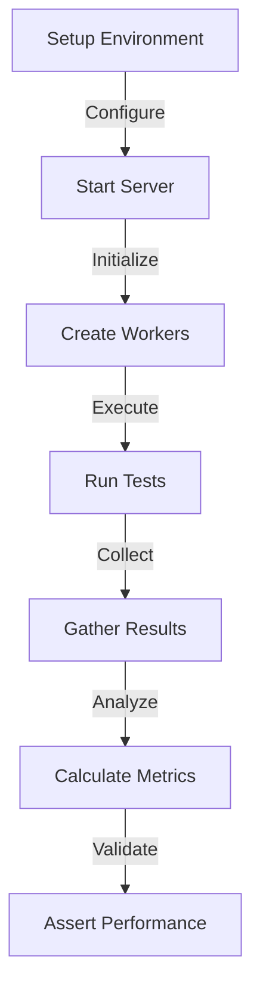

# Module: hb_http_benchmark_tests

## Basic Information
- **Source File:** hb_http_benchmark_tests.erl
- **Module Type:** Performance Testing
- **Purpose:** HTTP Performance Benchmarking

## Purpose
Provides comprehensive performance benchmarks for HTTP operations in HyperBEAM, including message resolution, WASM execution, and process scheduling. The module uses a performance divider to adjust expectations based on machine specifications.

## Interface

### Core Tests (Currently Disabled)
- `unsigned_resolve_benchmark_test/0` - Benchmark unsigned message resolution
- `parallel_unsigned_resolve_benchmark_test/0` - Parallel unsigned resolution
- `run_wasm_unsigned_benchmark_test/0` - WASM execution benchmark
- `run_wasm_signed_benchmark_test_disabled/0` - Signed WASM execution
- `parallel_wasm_unsigned_benchmark_test_disabled/0` - Parallel WASM execution
- `parallel_wasm_signed_benchmark_test_disabled/0` - Parallel signed WASM
- `parallel_http_scheduling_benchmark_test/0` - Process scheduling benchmark

## Dependencies

### Direct Dependencies
- eunit: Testing framework
- hb_http: HTTP client
- hb_http_server: Server operations
- hb_util: Utility functions
- hb: Core benchmarking

### Inverse Dependencies
- Performance testing
- System validation
- Capacity planning

## Implementation Details

### Key Concepts

1. **Performance Scaling**
   ```erlang
   % Performance adjustment
   -define(PERFORMANCE_DIVIDER, 1).
   % 1: 50% performance of Macbook Pro M2 Max
   ```
   Features:
   - Machine scaling
   - Performance targets
   - Benchmark adjustment
   - Test calibration

2. **WASM Testing**
   ```erlang
   % WASM test configuration
   wasm_compute_request(ImageFile, Func, Params) ->
       {ok, Bin} = file:read_file(ImageFile),
       #{
           <<"path">> => <<"init/compute/results">>,
           <<"device">> => <<"wasm-64@1.0">>,
           <<"function">> => Func,
           <<"parameters">> => Params,
           <<"image">> => Bin
       }.
   ```
   Demonstrates:
   - WASM loading
   - Function setup
   - Parameter handling
   - Request formatting

3. **Parallel Testing**
   ```erlang
   % Parallel benchmark setup
   BenchTime = 1,
   BenchWorkers = 16,
   URL = hb_http_server:start_node(#{force_signed => false}),
   Iterations = hb:benchmark(
       fun(_Count) -> execute_operation() end,
       BenchTime,
       BenchWorkers
   )
   ```
   Shows:
   - Worker management
   - Time tracking
   - Result collection
   - Performance measurement

### Benchmark Types

1. **Message Resolution**
   ```erlang
   % Message resolution benchmark
   hb_http:post(URL,
       #{
           <<"path">> => <<"key1">>,
           <<"key1">> => #{<<"key2">> => <<"value1">>}
       },
       #{}
   )
   ```
   Tests:
   - Message handling
   - Path resolution
   - Response time
   - System throughput

2. **WASM Execution**
   ```erlang
   % WASM execution benchmark
   case hb_http:post(URL, Msg, #{}) of
       {ok, _} -> 1;
       _ -> 0
   end
   ```
   Verifies:
   - WASM loading
   - Function execution
   - Result handling
   - Error management

### Performance Metrics

1. **Throughput Measurement**
   ```erlang
   % Performance reporting
   hb_util:eunit_print(
       "Resolved ~p messages via HTTP (~p workers) in ~p seconds (~.2f msg/s)",
       [Iterations, BenchWorkers, BenchTime, Iterations / BenchTime]
   )
   ```
   Tracks:
   - Message count
   - Time taken
   - Worker count
   - Messages per second

2. **Performance Validation**
   ```erlang
   % Performance assertion
   ?assert(Iterations > 400 / ?PERFORMANCE_DIVIDER)
   ```
   Ensures:
   - Minimum throughput
   - Scaled targets
   - System capacity
   - Performance goals

## Integration Points

1. **HTTP System**
   - Request handling
   - Response timing
   - Error management
   - Performance tracking

2. **WASM System**
   - Code execution
   - Resource usage
   - Error handling
   - Performance metrics

3. **Process System**
   - Scheduling operations
   - Resource allocation
   - State management
   - Performance monitoring

## Analysis Insights

### Performance Considerations

1. **Resource Usage**
   - Worker allocation
   - Memory management
   - CPU utilization
   - Network bandwidth

2. **Operation Efficiency**
   - Request handling
   - Response timing
   - Resource cleanup
   - Error recovery

### Security Implications

1. **Message Safety**
   - Signed messages
   - Unsigned messages
   - Validation checks
   - Error handling

2. **Resource Safety**
   - Worker limits
   - Memory bounds
   - CPU constraints
   - Network limits

### Best Practices

1. **Benchmark Organization**
   ```erlang
   % Recommended benchmark structure
   benchmark_operation() ->
       % 1. Setup
       setup_environment(),
       
       % 2. Execute
       Results = run_benchmark(),
       
       % 3. Validate
       validate_results(Results).
   ```

2. **Performance Testing**
   ```erlang
   % Recommended test pattern
   test_performance() ->
       % 1. Configure
       configure_benchmark(),
       
       % 2. Execute
       Results = execute_benchmark(),
       
       % 3. Assert
       assert_performance(Results).
   ```

3. **Resource Management**
   ```erlang
   % Recommended resource handling
   manage_resources() ->
       Resources = allocate_resources(),
       try
           use_resources(Resources)
       after
           cleanup_resources(Resources)
       end.
   ```

### Example Usage

```erlang
% Configure benchmark
URL = hb_http_server:start_node(#{
    force_signed => false
}),

% Run benchmark
Iterations = hb:benchmark(
    fun() ->
        hb_http:post(URL,
            #{<<"path">> => <<"test">>},
            #{}
        )
    end,
    BenchTime
),

% Validate results
?assert(Iterations > MinimumExpected / ?PERFORMANCE_DIVIDER)
```

## Benchmark Flow



## Test Execution Flow

```mermaid
sequenceDiagram
    participant Test as Benchmark
    participant Server as HTTP Server
    participant Workers as Worker Pool
    participant System as System Under Test

    Test->>Server: Start Server
    Test->>Workers: Create Workers
    
    loop Benchmark Duration
        Workers->>Server: Send Requests
        Server->>System: Process
        System-->>Server: Response
        Server-->>Workers: Results
    end
    
    Workers->>Test: Report Metrics
    Test->>Test: Validate Performance
