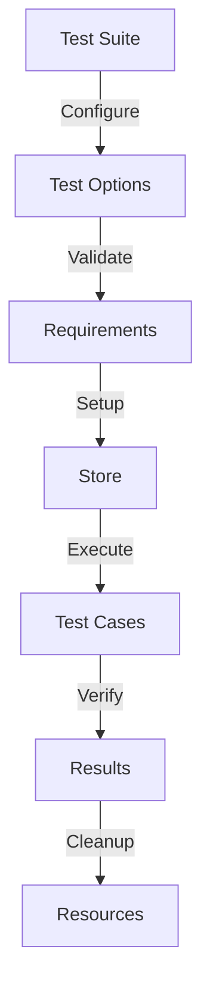

# Module: hb_test_utils

## Basic Information
- **Source File:** hb_test_utils.erl
- **Module Type:** Testing Utility
- **Purpose:** Test Suite Management

## Purpose
Provides utilities for running test suites with different configurations in HyperBEAM. The module enables running tests with various store configurations and handles test setup/teardown, requirement checking, and selective test execution.

## Interface

### Core Operations
- `suite_with_opts/2` - Run test suite with multiple configurations
- `run/4` - Execute single test with specific options
- `satisfies_requirements/1` - Check test requirements

## Dependencies

### Direct Dependencies
- eunit: Testing framework
- hb_opts: Options management
- hb_store: Storage operations
- hb_features: Feature flags

### Inverse Dependencies
- Used by test suites
- Testing framework
- CI/CD integration

## Implementation Details

### Key Concepts

1. **Test Suite Configuration**
   ```erlang
   % Suite configuration with options
   suite_with_opts(Suite, OptsList) ->
       lists:filtermap(
           fun(OptSpec = #{ name := _Name, opts := Opts, desc := ODesc}) ->
               Store = hb_opts:get(store, hb_opts:get(store), Opts),
               Skip = maps:get(skip, OptSpec, []),
               case satisfies_requirements(OptSpec) of
                   true -> {true, {foreach, Setup, Cleanup, Tests}};
                   false -> false
               end
           end,
           OptsList
       ).
   ```
   Features:
   - Multiple configurations
   - Store management
   - Test filtering
   - Requirement checking

2. **Test Setup/Teardown**
   ```erlang
   % Test lifecycle management
   Setup = fun() ->
       ?event({starting, Store}),
       hb_store:start(Store)
   end,
   Cleanup = fun(_) ->
       ok
   end
   ```
   Provides:
   - Store initialization
   - Resource cleanup
   - Event tracking
   - Error handling

3. **Requirement Checking**
   ```erlang
   % Requirement validation
   satisfies_requirements(Requirements) ->
       lists:all(
           fun(Req) ->
               case hb_features:enabled(Req) of
                   true -> true;
                   false -> check_module_enabled(Req)
               end
           end,
           Requirements
       ).
   ```
   Features:
   - Feature checking
   - Module validation
   - Dynamic loading
   - Error handling

### Test Management

1. **Suite Organization**
   ```erlang
   % Test suite structure
   Suite = [
       {test_name, "Test Description", TestFunction},
       {other_test, "Other Description", OtherFunction}
   ]
   ```
   Manages:
   - Test identification
   - Test descriptions
   - Test functions
   - Test organization

2. **Options Management**
   ```erlang
   % Options specification
   OptsList = [
       #{
           name => config_name,
           opts => #{key => value},
           desc => "Configuration Description",
           skip => [test_to_skip]
       }
   ]
   ```
   Handles:
   - Configuration names
   - Option values
   - Test skipping
   - Description management

### Error Handling

1. **Requirement Validation**
   ```erlang
   % Module requirement checking
   check_module_enabled(Req) ->
       case code:is_loaded(Req) of
           false -> false;
           {file, _} ->
               case erlang:function_exported(Req, enabled, 0) of
                   true -> Req:enabled();
                   false -> true
               end
       end.
   ```
   Ensures:
   - Module existence
   - Function checking
   - Safe validation
   - Error prevention

2. **Store Management**
   ```erlang
   % Safe store handling
   Store = hb_opts:get(store, hb_opts:get(store), Opts),
   hb_store:start(Store)
   ```
   Provides:
   - Safe initialization
   - Error handling
   - Resource management
   - State tracking

## Integration Points

1. **Test Framework**
   - EUnit integration
   - Test organization
   - Result reporting
   - Error handling

2. **Store System**
   - Store initialization
   - Resource management
   - State tracking
   - Error handling

3. **Feature System**
   - Feature checking
   - Module validation
   - Requirement tracking
   - Error handling

## Analysis Insights

### Performance Considerations

1. **Resource Management**
   - Store initialization
   - Resource cleanup
   - State tracking
   - Error handling

2. **Test Execution**
   - Parallel testing
   - Resource sharing
   - State isolation
   - Error containment

### Security Implications

1. **Resource Safety**
   - Store isolation
   - State protection
   - Error containment
   - Resource cleanup

2. **Feature Safety**
   - Feature validation
   - Module checking
   - Safe execution
   - Error handling

### Best Practices

1. **Test Organization**
   ```erlang
   % Recommended test structure
   organize_tests() ->
       [
           {test_name, "Clear description",
               fun(Opts) ->
                   setup_test(Opts),
                   run_test(Opts),
                   verify_results(Opts)
               end
           }
       ].
   ```

2. **Configuration Management**
   ```erlang
   % Recommended configuration
   manage_config() ->
       #{
           name => test_config,
           opts => #{store => memory_store},
           desc => "Memory store tests",
           requires => [required_feature]
       }.
   ```

3. **Test Execution**
   ```erlang
   % Recommended execution pattern
   execute_tests() ->
       Suite = organize_tests(),
       Configs = setup_configs(),
       suite_with_opts(Suite, Configs).
   ```

### Example Usage

```erlang
% Define test suite
Suite = [
    {basic_test, "Basic functionality test",
        fun(Opts) ->
            Result = perform_operation(Opts),
            ?assertEqual(expected, Result)
        end
    }
],

% Define configurations
Configs = [
    #{
        name => memory_config,
        opts => #{store => memory_store},
        desc => "Memory store tests"
    },
    #{
        name => disk_config,
        opts => #{store => disk_store},
        desc => "Disk store tests",
        skip => [slow_test]
    }
],

% Run suite with configurations
suite_with_opts(Suite, Configs),

% Run single test
run(basic_test, memory_config, Suite, Configs)
```

## Test Flow



## Configuration Flow

```mermaid
sequenceDiagram
    participant Test as Test Suite
    participant Config as Configuration
    participant Store as Store System
    participant Exec as Execution

    Test->>Config: Load Options
    Config->>Store: Initialize Store
    Store-->>Config: Store Ready
    Config->>Exec: Run Tests
    Exec->>Store: Use Store
    Store-->>Exec: Results
    Exec-->>Test: Test Complete
