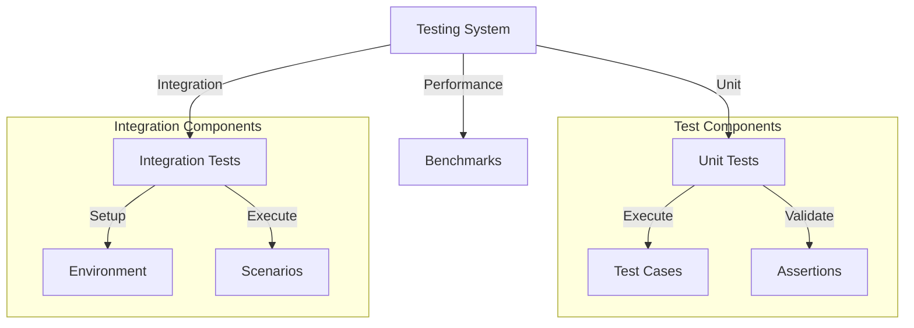
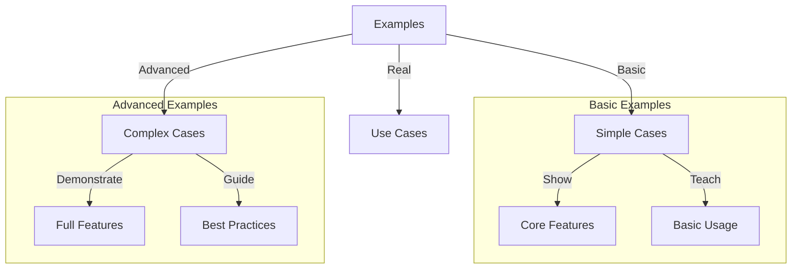
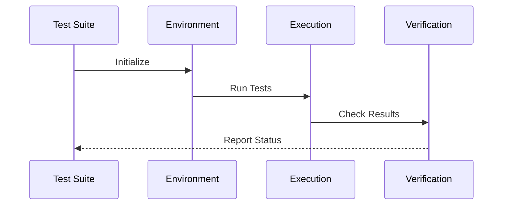

# Testing & Examples Observations

## Architectural Patterns

### 1. Test Organization
The testing modules demonstrate strong organizational patterns:

1. **Test Suite Structure**
   ```erlang
   test_suite() ->
       [
           {test_name, "test description",
               fun test_function/1}
       ]
   ```
   Features:
   - Clear naming
   - Descriptive text
   - Function mapping
   - Easy maintenance

2. **Configuration Management**
   ```erlang
   test_opts() ->
       [
           #{
               name => config_name,
               desc => "Configuration description",
               opts => #{key => value},
               skip => [tests_to_skip]
           }
       ]
   ```
   Provides:
   - Named configs
   - Clear descriptions
   - Option grouping
   - Test filtering

### 2. Test Categories

1. **Unit Tests**
   ```erlang
   % Basic unit test
   basic_test(Opts) ->
       Result = execute_operation(Opts),
       ?assertEqual(expected, Result).
   ```
   Features:
   - Single focus
   - Clear assertions
   - Easy debugging
   - Quick feedback

2. **Integration Tests**
   ```erlang
   % Integration test
   integration_test(Opts) ->
       % Setup environment
       Environment = setup_environment(),
       
       % Execute operations
       Result = execute_with_environment(Environment, Opts),
       
       % Verify results
       verify_results(Result).
   ```
   Provides:
   - System testing
   - Environment setup
   - Complex scenarios
   - Full validation

### 3. Performance Testing
Strong performance testing approaches:

1. **Benchmark Structure**
   ```erlang
   % Benchmark execution
   benchmark_test() ->
       BenchTime = 1,
       Iterations = hb:benchmark(
           fun() -> execute_operation() end,
           BenchTime
       ).
   ```
   Features:
   - Time tracking
   - Iteration counting
   - Performance metrics
   - Clear reporting

2. **Parallel Testing**
   ```erlang
   % Parallel benchmark
   parallel_test() ->
       BenchTime = 1,
       Workers = 16,
       Iterations = hb:benchmark(
           fun() -> execute_operation() end,
           BenchTime,
           Workers
       ).
   ```
   Enables:
   - Concurrent testing
   - Load simulation
   - Resource testing
   - Scaling validation

## Implementation Patterns

### 1. Test Utilities
Consistent utility patterns:

1. **Test Helpers**
   - Suite organization
   - Option management
   - Result validation
   - Error handling

2. **Resource Management**
   - Environment setup
   - State tracking
   - Resource cleanup
   - Error recovery

### 2. Example Organization
Clear example structuring:

1. **Basic Examples**
   - Simple cases
   - Clear purpose
   - Easy understanding
   - Quick validation

2. **Complex Examples**
   - Advanced scenarios
   - Full features
   - Real use cases
   - Complete flows

### 3. Benchmark Design
Robust benchmark approaches:

1. **Performance Measurement**
   - Time tracking
   - Operation counting
   - Resource monitoring
   - Result validation

2. **Load Testing**
   - Parallel execution
   - Resource usage
   - System limits
   - Error handling

## Common Themes

### 1. Test Coverage
Comprehensive testing focus:

1. **Functionality Coverage**
   - Core features
   - Edge cases
   - Error scenarios
   - Integration points

2. **Performance Coverage**
   - Speed testing
   - Load testing
   - Resource usage
   - System limits

### 2. Example Quality
Strong example characteristics:

1. **Code Quality**
   - Clean structure
   - Clear purpose
   - Good practices
   - Error handling

2. **Documentation Quality**
   - Clear descriptions
   - Usage examples
   - Expected results
   - Error scenarios

### 3. Benchmark Accuracy
Careful benchmark design:

1. **Measurement Accuracy**
   - Time precision
   - Count accuracy
   - Resource tracking
   - Result validation

2. **Load Simulation**
   - Real scenarios
   - System stress
   - Resource limits
   - Error conditions

## Areas for Improvement

### 1. Documentation
Documentation could be enhanced:

1. **Test Documentation**
   - More examples
   - Better descriptions
   - Clear purposes
   - Error scenarios

2. **Example Documentation**
   - More scenarios
   - Better explanations
   - Use cases
   - Best practices

### 2. Coverage
Testing could be expanded:

1. **Test Coverage**
   - More edge cases
   - More integrations
   - More scenarios
   - More validations

2. **Example Coverage**
   - More use cases
   - More features
   - More patterns
   - More scenarios

## Future Directions

### 1. Test Enhancement
Potential improvements:

1. **Test Framework**
   - More features
   - Better organization
   - Better reporting
   - Better tools

2. **Example Framework**
   - More examples
   - Better structure
   - Better documentation
   - Better tools

### 2. Benchmark Enhancement
Ways to improve benchmarks:

1. **Measurement Tools**
   - More metrics
   - Better accuracy
   - Better reporting
   - Better analysis

2. **Load Tools**
   - More scenarios
   - Better simulation
   - Better control
   - Better reporting

## Testing Architecture

### 1. Component Structure


### 2. Example Structure


## Test Flow



## Benchmark Flow

```mermaid
sequenceDiagram
    participant Bench as Benchmark
    participant Workers as Worker Pool
    participant System as System Under Test
    participant Results as Results

    Bench->>Workers: Create Workers
    
    loop Benchmark Time
        Workers->>System: Execute Operations
        System-->>Workers: Return Results
        Workers->>Results: Record Metrics
    end
    
    Results-->>Bench: Final Report
