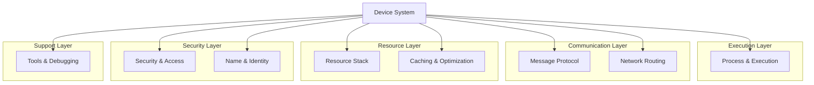
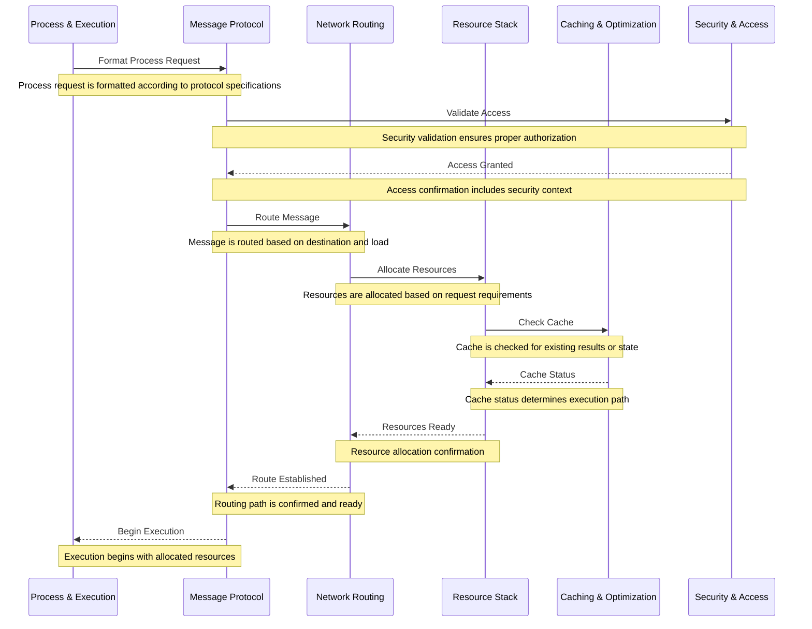
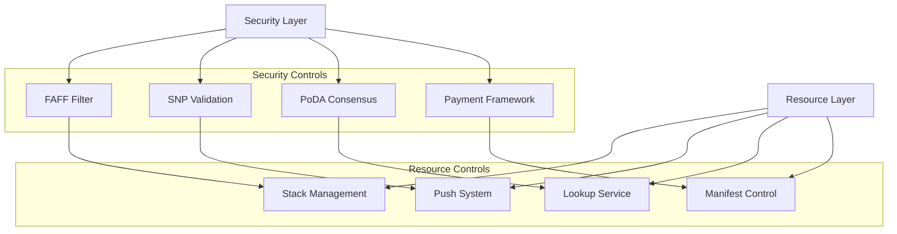
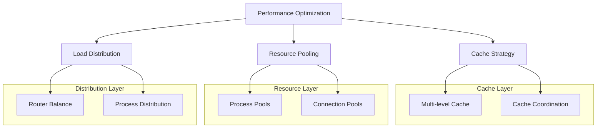
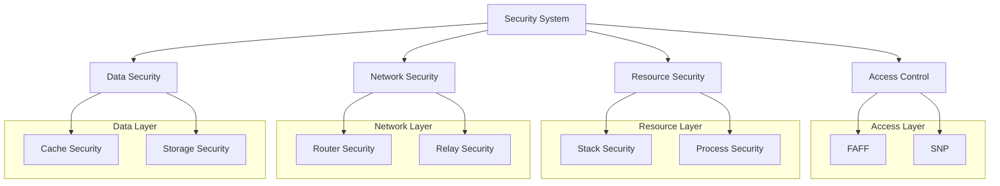
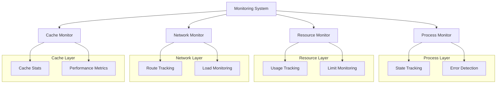

# HyperBEAM Device System: Comprehensive Integration Overview (Part 1)

## System Architecture

The HyperBEAM device system represents a sophisticated collection of interoperating subsystems that together provide a complete distributed computing platform. Each subsystem is meticulously designed to handle specific aspects of the system while maintaining clean integration points with other components. This architectural approach ensures both modularity and cohesion, allowing subsystems to operate independently while still working together seamlessly.

The device system's architecture is built upon several key principles:

1. **Modularity**: Each subsystem operates as a self-contained unit with well-defined boundaries and interfaces. This modularity enables independent development, testing, and deployment while ensuring system stability.

2. **Interoperability**: Despite their independence, subsystems are designed to work together through standardized protocols and interfaces. This interoperability allows for complex operations that span multiple subsystems.

3. **Extensibility**: The architecture supports the addition of new capabilities through its plugin-based design. New subsystems can be integrated without modifying existing components.

4. **Resilience**: Each subsystem implements its own error handling and recovery mechanisms while participating in system-wide reliability measures.

### Core Subsystems


Each subsystem serves a critical role in the overall architecture:

1. **Process & Execution**
   - Manages the lifecycle of computational processes
   - Provides isolated execution environments
   - Handles resource allocation and monitoring
   - Ensures reliable process state management
   - Coordinates with scheduling systems

2. **Message Protocol**
   - Implements standardized message formats
   - Handles protocol versioning and compatibility
   - Provides message validation and transformation
   - Manages message flow and routing
   - Ensures reliable message delivery

3. **Network Routing**
   - Orchestrates message routing across nodes
   - Implements sophisticated routing algorithms
   - Manages network topology and state
   - Handles network partitioning and recovery
   - Provides load balancing capabilities

4. **Resource Stack**
   - Manages system resource allocation
   - Implements resource pooling and sharing
   - Handles resource lifecycle management
   - Provides resource tracking and monitoring
   - Ensures efficient resource utilization

5. **Caching & Optimization**
   - Implements multi-level caching strategies
   - Provides performance optimization
   - Manages cache coherence and invalidation
   - Handles cache persistence and recovery
   - Optimizes resource usage patterns

6. **Security & Access**
   - Enforces security policies and access control
   - Implements authentication and authorization
   - Provides cryptographic operations
   - Manages security boundaries
   - Ensures secure communication

7. **Tools & Debugging**
   - Provides development and debugging tools
   - Implements monitoring and profiling
   - Handles logging and tracing
   - Supports system diagnostics
   - Enables performance analysis

8. **Name & Identity**
   - Manages system-wide naming
   - Handles identity verification
   - Provides name resolution
   - Implements naming policies
   - Ensures naming consistency

## Subsystem Integration Patterns

The integration between subsystems follows carefully designed patterns that ensure reliable operation while maintaining system flexibility.

### 1. Process & Message Flow


This flow demonstrates the sophisticated interaction between subsystems during a typical operation:

1. **Initial Request Processing**
   - Process & Execution subsystem initiates the request
   - Message Protocol formats according to system standards
   - Security validation is performed early in the flow
   - Resource requirements are evaluated and allocated
   - Cache is checked for optimization opportunities

2. **Resource Coordination**
   - Resource Stack manages allocation across subsystems
   - Caching system provides optimization opportunities
   - Network routing ensures efficient message delivery
   - Security boundaries are maintained throughout
   - State is tracked across all interactions

3. **Execution Flow**
   - Process execution begins after all checks pass
   - Resources are monitored during execution
   - Cache is updated with results
   - Security context is maintained
   - System state remains consistent

### 2. Security & Resource Management


The security and resource management integration demonstrates several key patterns:

1. **Layered Security**
   - FAFF provides fast initial filtering
   - SNP ensures hardware-level security
   - PoDA maintains distributed consensus
   - Payment framework enables economic security
   - Multiple layers provide defense in depth

2. **Resource Control**
   - Stack management coordinates resources
   - Push system handles distribution
   - Lookup service enables resource discovery
   - Manifest control tracks resources
   - Integration ensures efficient usage

3. **Cross-Layer Integration**
   - Security directly influences resource access
   - Resource allocation respects security boundaries
   - System state is consistently maintained
   - Performance is optimized within constraints
   - Reliability is ensured across layers

This architecture enables sophisticated operations while maintaining:
- Strong security boundaries
- Efficient resource utilization
- Reliable state management
- Consistent system behavior
- Optimal performance characteristics

## Common Device Stacks

The HyperBEAM system enables sophisticated device stacking patterns that allow for complex operations while maintaining clean separation of concerns. These stacks are carefully designed to provide specific functionality while ensuring optimal performance, security, and reliability.

### 1. Basic Processing Stack
```erlang
% Example stack configuration for basic processing
#{
    <<"device">> => <<"Stack@1.0">>,
    <<"device-stack">> => #{
        <<"1">> => <<"Security@1.0">>,  % FAFF + SNP
        <<"2">> => <<"Process@1.0">>,   % Process execution
        <<"3">> => <<"Cache@1.0">>      % Result caching
    }
}
```

This fundamental stack demonstrates several key architectural principles:

1. **Security-First Design**
   - Places security validation at the entry point
   - Combines FAFF filtering for quick rejections
   - Integrates SNP for hardware-level security
   - Ensures consistent security context
   - Maintains security boundaries throughout execution

2. **Process Management**
   - Handles core computation needs
   - Manages process lifecycle
   - Controls resource allocation
   - Monitors execution state
   - Ensures reliable operation

3. **Performance Optimization**
   - Implements result caching
   - Optimizes resource usage
   - Reduces redundant computation
   - Maintains execution efficiency
   - Enables quick response times

### 2. Network Service Stack
```erlang
% Example stack for network services
#{
    <<"device">> => <<"Stack@1.0">>,
    <<"device-stack">> => #{
        <<"1">> => <<"Router@1.0">>,    % Message routing
        <<"2">> => <<"GreenZone@1.0">>, % Security boundary
        <<"3">> => <<"Relay@1.0">>,     % Message relay
        <<"4">> => <<"Cache@1.0">>      % Response caching
    }
}
```

This network-oriented stack provides:

1. **Intelligent Routing**
   - Implements sophisticated routing algorithms
   - Manages network topology
   - Handles load balancing
   - Ensures message delivery
   - Optimizes network usage

2. **Security Boundaries**
   - Establishes clear security zones
   - Controls cross-zone communication
   - Implements access policies
   - Monitors security state
   - Ensures secure message handling

3. **Message Management**
   - Handles message relay operations
   - Ensures reliable delivery
   - Manages message state
   - Implements retry logic
   - Provides delivery guarantees

4. **Response Optimization**
   - Caches frequent responses
   - Reduces network load
   - Improves response times
   - Manages cache invalidation
   - Ensures data consistency

### 3. Resource Management Stack
```erlang
% Example stack for resource management
#{
    <<"device">> => <<"Stack@1.0">>,
    <<"device-stack">> => #{
        <<"1">> => <<"Name@1.0">>,      % Resource naming
        <<"2">> => <<"Manifest@1.0">>,  % Resource tracking
        <<"3">> => <<"Push@1.0">>,      % Resource distribution
        <<"4">> => <<"Dedup@1.0">>      % Optimization
    }
}
```

This resource-focused stack implements:

1. **Resource Identification**
   - Manages resource naming
   - Ensures unique identification
   - Handles name resolution
   - Maintains naming consistency
   - Supports hierarchical names

2. **Resource Tracking**
   - Implements manifest system
   - Tracks resource states
   - Manages dependencies
   - Ensures resource validity
   - Maintains resource metadata

3. **Distribution Management**
   - Handles resource distribution
   - Manages replication
   - Ensures consistency
   - Optimizes delivery
   - Controls resource flow

4. **Efficiency Measures**
   - Prevents duplicate operations
   - Optimizes resource usage
   - Reduces overhead
   - Improves performance
   - Ensures efficient operation

## Integration with Core System

The device system maintains sophisticated integration patterns with the core HyperBEAM system (hb_* modules) to ensure reliable operation while maintaining clean separation of concerns.

### 1. Message System Integration
```erlang
% Integration with hb_message
handle_message(Msg, Opts) ->
    % 1. Protocol validation via dev_meta
    {ok, ValidMsg} = dev_meta:validate(Msg, Opts),
    
    % 2. Security check via dev_faff
    case dev_faff:check_access(ValidMsg, Opts) of
        {ok, _} ->
            % 3. Process via dev_process
            dev_process:handle(ValidMsg, Opts);
        Error ->
            Error
    end.
```

This integration demonstrates several key patterns:

1. **Protocol Management**
   - Validates message format
   - Ensures protocol compliance
   - Handles version compatibility
   - Manages message transformation
   - Maintains protocol consistency

2. **Security Integration**
   - Implements access control
   - Validates security context
   - Ensures proper authorization
   - Maintains security boundaries
   - Tracks security state

3. **Process Coordination**
   - Manages message flow
   - Handles state transitions
   - Ensures reliable processing
   - Maintains execution context
   - Provides error handling

### 2. Cache Integration
```erlang
% Integration with hb_cache
cache_operation(Key, Value, Opts) ->
    % 1. Check dedup cache
    case dev_dedup:check(Key, Opts) of
        {ok, cached} ->
            {ok, cached};
        {ok, not_found} ->
            % 2. Store in system cache
            case hb_cache:write(Key, Value, Opts) of
                {ok, Path} ->
                    % 3. Update local cache
                    dev_cache:update(Path, Value, Opts);
                Error ->
                    Error
            end
    end.
```

The caching system implements:

1. **Deduplication Logic**
   - Prevents duplicate operations
   - Optimizes resource usage
   - Maintains operation history
   - Ensures idempotency
   - Improves efficiency

2. **Multi-Level Caching**
   - Implements cache hierarchy
   - Manages cache coherence
   - Handles cache invalidation
   - Ensures data consistency
   - Optimizes access patterns

3. **State Management**
   - Tracks cache state
   - Manages updates
   - Handles concurrent access
   - Ensures atomic operations
   - Maintains consistency

### 3. Storage Integration
```erlang
% Integration with hb_store
store_operation(Data, Opts) ->
    % 1. Security validation
    case dev_snp:verify(Data, Opts) of
        {ok, Verified} ->
            % 2. Store data
            case hb_store:write(Verified, Opts) of
                {ok, Path} ->
                    % 3. Update manifest
                    dev_manifest:register(Path, Verified, Opts);
                Error ->
                    Error
            end;
        Error ->
            Error
    end.
```

This integration provides:

1. **Security Verification**
   - Validates data integrity
   - Ensures proper authorization
   - Maintains security context
   - Implements access control
   - Provides audit trail

2. **Storage Management**
   - Handles data persistence
   - Manages storage operations
   - Ensures data integrity
   - Optimizes storage usage
   - Maintains consistency

3. **Resource Tracking**
   - Updates manifest system
   - Tracks stored resources
   - Manages metadata
   - Ensures traceability
   - Maintains resource state

These integration patterns ensure:
- Reliable system operation
- Consistent state management
- Proper security boundaries
- Efficient resource usage
- Optimal performance characteristics

## Performance Considerations

The device system implements sophisticated performance optimization strategies that span multiple layers and components, ensuring efficient operation while maintaining system reliability.

### 1. Cross-Device Optimization


The optimization system implements several key strategies:

1. **Cache Optimization**
   - Implements multi-level caching hierarchy
   - Coordinates cache invalidation across devices
   - Manages cache coherence protocols
   - Optimizes cache hit rates
   - Reduces memory pressure through intelligent eviction
   - Implements predictive caching where beneficial
   - Maintains cache statistics for optimization
   - Handles cache warm-up and pre-fetching
   - Coordinates cache sharing between devices
   - Ensures cache consistency during updates

2. **Resource Management**
   - Maintains efficient resource pools
   - Implements dynamic pool sizing
   - Handles resource reuse
   - Manages connection lifecycles
   - Optimizes resource allocation
   - Implements backpressure mechanisms
   - Handles resource contention
   - Provides fair resource scheduling
   - Monitors resource utilization
   - Implements resource quotas

3. **Load Distribution**
   - Balances load across available resources
   - Implements sophisticated routing algorithms
   - Handles process distribution
   - Manages network traffic patterns
   - Optimizes resource usage
   - Provides failover capabilities
   - Implements load shedding when needed
   - Maintains system stability
   - Handles peak load conditions
   - Ensures fair resource allocation

### 2. Resource Efficiency

The system implements coordinated resource management across devices:

1. **Resource Sharing**
   - Process sharing mechanisms:
     * Pool-based process reuse
     * Process state management
     * Efficient process handoff
     * Process migration support
     * Resource cleanup protocols

   - Cache sharing strategies:
     * Distributed cache coordination
     * Cache synchronization protocols
     * Cache partition management
     * Cache coherence maintenance
     * Cache optimization patterns

   - Network optimization:
     * Connection pooling
     * Request batching
     * Protocol optimization
     * Bandwidth management
     * Latency reduction

   - State management:
     * Coordinated state updates
     * State synchronization
     * Consistency protocols
     * State recovery mechanisms
     * State verification

2. **Resource Limits**
   - Process management:
     * CPU usage limits
     * Memory constraints
     * Time boundaries
     * Resource quotas
     * Process priorities

   - Cache constraints:
     * Memory limits
     * Entry count restrictions
     * Time-to-live settings
     * Update frequencies
     * Size restrictions

   - Network boundaries:
     * Bandwidth limits
     * Connection pools
     * Request quotas
     * Rate limiting
     * Timeout settings

   - Stack restrictions:
     * Depth limits
     * Resource boundaries
     * Operation quotas
     * Time constraints
     * Memory limits

## Security Architecture

The security architecture implements a comprehensive, multi-layered approach to system protection.

### 1. Multi-Layer Security


The security system implements:

1. **Access Control Layer**
   - FAFF (Fast Allow/Forbid Filter):
     * Quick address-based filtering
     * Pattern matching capabilities
     * Rule-based access control
     * Dynamic rule updates
     * Efficient lookup operations

   - SNP (Secure Nested Paging):
     * Hardware-level security
     * Memory isolation
     * Execution protection
     * State verification
     * Secure enclaves

2. **Resource Security**
   - Stack protection:
     * Operation validation
     * Resource boundaries
     * State protection
     * Access control
     * Quota enforcement

   - Process security:
     * Isolation boundaries
     * Resource control
     * State protection
     * Execution safety
     * Error containment

3. **Network Security**
   - Router protection:
     * Message validation
     * Route verification
     * Access control
     * State protection
     * Error handling

   - Relay security:
     * Message integrity
     * Delivery validation
     * State protection
     * Error recovery
     * Access control

4. **Data Security**
   - Cache protection:
     * Access control
     * Data integrity
     * State protection
     * Secure updates
     * Error handling

   - Storage security:
     * Data encryption
     * Access control
     * Integrity checks
     * Secure storage
     * Recovery mechanisms

### 2. Security Integration

Security measures are deeply integrated across device interactions:

1. **Access Management**
   - Permission system:
     * Role-based access
     * Dynamic permissions
     * Context awareness
     * Audit logging
     * Policy enforcement

   - Identity verification:
     * Strong authentication
     * Identity validation
     * Context verification
     * Trust establishment
     * Credential management

   - Resource access:
     * Permission checking
     * Quota enforcement
     * Usage tracking
     * Access logging
     * Policy compliance

   - Operation validation:
     * Request validation
     * Parameter checking
     * State verification
     * Error handling
     * Audit logging

2. **Data Protection**
   - Message security:
     * Encryption
     * Integrity checks
     * Signature validation
     * Format verification
     * Protocol compliance

   - State protection:
     * Access control
     * State integrity
     * Update validation
     * Recovery mechanisms
     * Audit logging

   - Cache security:
     * Access control
     * Data protection
     * Update validation
     * State integrity
     * Error handling

   - Storage security:
     * Encryption
     * Access control
     * Integrity checks
     * Secure storage
     * Recovery mechanisms

## Monitoring & Debugging

The system provides comprehensive monitoring and debugging capabilities across all components.

### 1. System Monitoring


The monitoring system provides:

1. **Process Monitoring**
   - State tracking:
     * Process lifecycle
     * State transitions
     * Resource usage
     * Performance metrics
     * Error conditions

   - Error detection:
     * Pattern recognition
     * Anomaly detection
     * Error correlation
     * Impact analysis
     * Recovery tracking

2. **Resource Monitoring**
   - Usage tracking:
     * Resource allocation
     * Utilization patterns
     * Bottleneck detection
     * Trend analysis
     * Capacity planning

   - Limit monitoring:
     * Quota tracking
     * Threshold alerts
     * Usage patterns
     * Trend analysis
     * Capacity planning

3. **Network Monitoring**
   - Route tracking:
     * Message flow
     * Routing patterns
     * Latency tracking
     * Error detection
     * Performance analysis

   - Load monitoring:
     * Traffic patterns
     * Bottleneck detection
     * Capacity planning
     * Performance metrics
     * Trend analysis

4. **Cache Monitoring**
   - Cache statistics:
     * Hit rates
     * Miss patterns
     * Eviction tracking
     * Size monitoring
     * Performance metrics

   - Performance tracking:
     * Access patterns
     * Latency metrics
     * Resource usage
     * Efficiency analysis
     * Optimization opportunities

### 2. Debug Capabilities

The system provides comprehensive debugging capabilities:

1. **Tool Integration**
   - Cache visualization:
     * Structure display
     * State inspection
     * Pattern analysis
     * Performance views
     * Debug support

   - Process inspection:
     * State examination
     * Resource tracking
     * Performance analysis
     * Error investigation
     * Debug capabilities

   - Network analysis:
     * Traffic inspection
     * Route analysis
     * Performance tracking
     * Error detection
     * Debug support

   - Stack debugging:
     * State inspection
     * Flow analysis
     * Error tracking
     * Performance monitoring
     * Debug capabilities

2. **Debug Features**
   - State inspection:
     * Live examination
     * History tracking
     * Change detection
     * Error analysis
     * Recovery support

   - Error tracking:
     * Error detection
     * Root cause analysis
     * Impact assessment
     * Recovery tracking
     * Prevention measures

   - Performance profiling:
     * Resource usage
     * Bottleneck detection
     * Optimization analysis
     * Trend tracking
     * Improvement planning

   - Resource monitoring:
     * Usage tracking
     * Pattern analysis
     * Efficiency metrics
     * Optimization opportunities
     * Capacity planning
