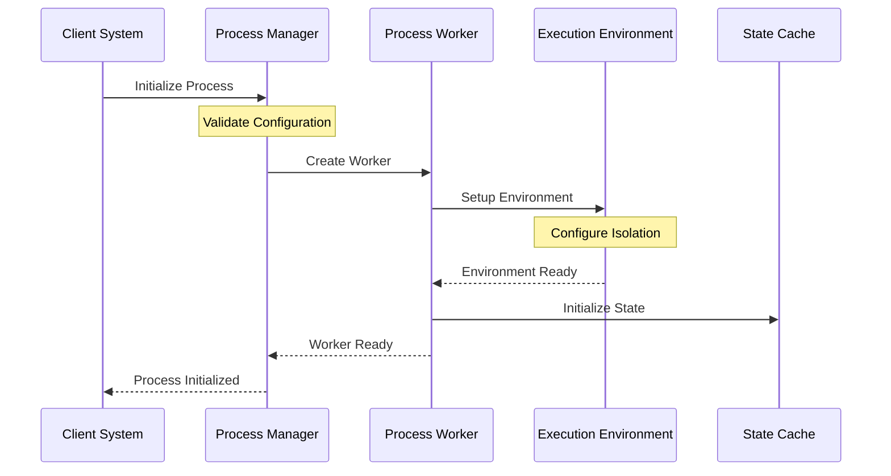
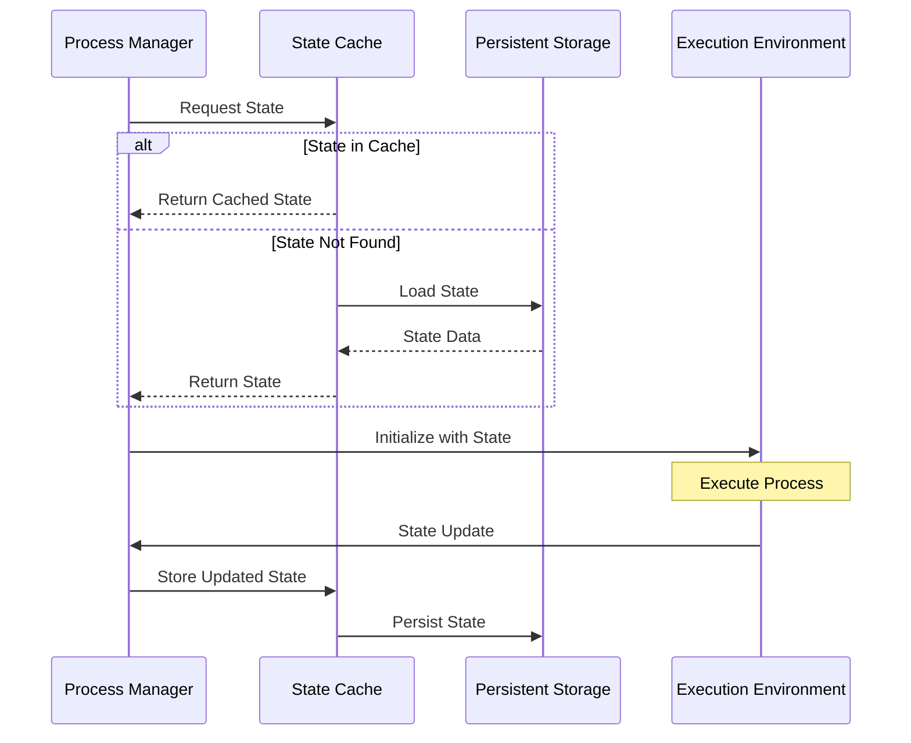

# Process & Execution System: Comprehensive Overview

## System Foundation

The Process & Execution system serves as the cornerstone of HyperBEAM's computational capabilities, providing a sophisticated framework for executing code across diverse environments while maintaining robust security boundaries, ensuring reliable operation, and delivering consistent performance. This system implements a layered architecture that separates concerns between process management, execution environments, and resource control.

### Core Philosophy

The system is built on several fundamental principles:

1. **Environment Isolation**: Each execution context operates within strictly defined boundaries, preventing unauthorized access and resource consumption while enabling secure code execution.

2. **State Management**: Comprehensive tracking and persistence of process states ensures reliability and enables recovery from failures, while maintaining execution consistency.

3. **Resource Control**: Fine-grained management of system resources prevents overconsumption and ensures fair allocation across multiple processes.

4. **Extensibility**: A plugin-based architecture allows for the addition of new execution environments without modifying the core system.

## Architectural Components

### 1. Process Management Layer

#### dev_process
The central orchestrator that coordinates process lifecycle management:
- Handles process creation and initialization
- Manages state transitions and persistence
- Coordinates between execution environments
- Implements resource allocation strategies

#### dev_process_worker
Dedicated worker processes that:
- Execute individual process instances
- Maintain isolation boundaries
- Handle state transitions
- Monitor resource usage

#### dev_process_cache
Optimizes process execution through:
- State caching mechanisms
- Quick recovery capabilities
- Memory usage optimization
- Performance enhancement

### 2. Execution Environments

#### Native Execution Layer

##### dev_wasm & dev_wasi
WebAssembly execution environment providing:
- Direct bytecode execution capabilities
- System call interception and validation
- Memory isolation and protection
- Resource usage monitoring and limits

##### dev_lua
Lua scripting environment offering:
- Sandboxed execution context
- Function-level isolation
- State persistence mechanisms
- AO Core integration capabilities

#### Remote Execution Layer

##### dev_delegated_compute
Enables distributed computation through:
- Remote execution coordination
- Result verification mechanisms
- State synchronization protocols
- Error handling and recovery

##### dev_genesis_wasm
Provides legacy system compatibility via:
- Process migration support
- State translation mechanisms
- Protocol adaptation layers
- Backward compatibility assurance

#### Node-Specific Layer

##### dev_node_process
Manages node-local processes with:
- Local name registration
- Process persistence
- State management
- Resource coordination

## System Interactions

### Process Lifecycle Flow



### State Management Flow



## Implementation Details

### 1. Process State Management

The system implements a sophisticated state management approach:

```erlang
% State Lifecycle Management
-record(process_state, {
    id :: binary(),
    environment :: atom(),
    resources :: map(),
    execution_context :: map(),
    metadata :: map()
}).

% State Transitions
handle_state_transition(State, Event) ->
    validate_transition(State, Event),
    apply_transition(State, Event),
    persist_state(State),
    notify_observers(State, Event).
```

### 2. Resource Control

Resource management is implemented through multiple layers:

```erlang
% Resource Allocation
allocate_resources(Requirements) ->
    validate_availability(Requirements),
    reserve_resources(Requirements),
    monitor_usage(Requirements),
    register_cleanup(Requirements).

% Usage Monitoring
monitor_resources(Allocation) ->
    track_memory_usage(Allocation),
    monitor_cpu_usage(Allocation),
    check_time_limits(Allocation),
    verify_permissions(Allocation).
```

### 3. Error Handling

Comprehensive error handling ensures system stability:

```erlang
% Error Management
handle_error(Error, Context) ->
    log_error(Error, Context),
    cleanup_resources(Context),
    notify_monitoring(Error),
    initiate_recovery(Context).

% Recovery Procedures
recover_from_error(Error, State) ->
    restore_safe_state(State),
    reallocate_resources(State),
    restart_execution(State),
    verify_recovery(State).
```

## Security Considerations

### 1. Isolation Mechanisms

Multiple layers of isolation protect the system:

- Memory isolation through WebAssembly
- Process-level isolation via separate workers
- Resource quotas and limits
- Input validation and sanitization

### 2. Permission Management

Granular permission control ensures security:

- Execution environment permissions
- Resource access controls
- Network restrictions
- File system limitations

## Performance Optimization

### 1. Caching Strategy

Multi-level caching improves performance:

- Process state caching
- Execution context caching
- Resource allocation caching
- Result caching

### 2. Resource Pooling

Efficient resource management through:

- Worker process pooling
- Memory pool management
- Connection pooling
- Cache pool optimization

## Monitoring and Metrics

### 1. Performance Metrics

Comprehensive monitoring includes:

- Execution time tracking
- Resource usage monitoring
- Cache hit rates
- Error frequency analysis

### 2. Health Checks

System health is maintained through:

- Process health monitoring
- Resource availability checks
- Error rate tracking
- Performance threshold monitoring

## Future Enhancements

### 1. Technical Improvements

Planned technical enhancements:

- Additional execution environments
- Enhanced security features
- Improved performance monitoring
- Better resource management

### 2. Architectural Evolution

Future architectural changes:

- Enhanced distribution capabilities
- Improved state management
- Better error recovery
- More flexible resource allocation

## Best Practices

### 1. Development Guidelines

Key development practices:

- Follow the device pattern
- Implement complete lifecycle
- Handle all error cases
- Maintain proper logging

### 2. Operational Guidelines

Operational considerations:

- Monitor resource usage
- Track performance metrics
- Analyze error patterns
- Maintain security protocols
