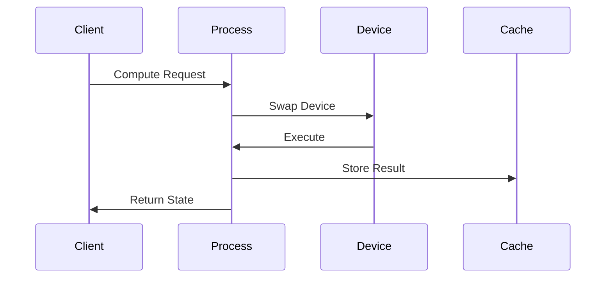
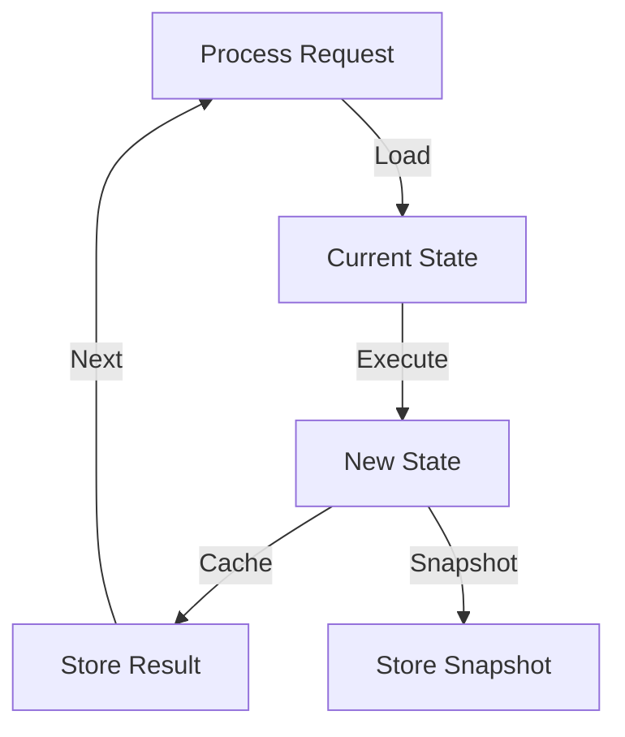

# Module: dev_process

## Basic Information
- **Source File:** dev_process.erl
- **Module Type:** Device Core Processing
- **Purpose:** Device implementation of AO processes in AO-Core

## Purpose

The dev_process module implements the core functionality for routing requests to different functionality handlers (scheduling, computing, and pushing messages) through device swapping. It manages process state and caching, allowing devices to share state as needed.

## Interface

### Public API

```erlang
% Core operations
-export([info/1, compute/3, schedule/3, slot/3, now/3, push/3, snapshot/3]).
-export([ensure_process_key/2]).

% Public utilities
-export([as_process/2, process_id/3]).

% Test helpers
-export([test_aos_process/0, test_aos_process/1, dev_test_process/0, test_wasm_process/1]).
-export([schedule_aos_call/2, schedule_aos_call/3, init/0]).
```

### REST API Endpoints
```
GET /ID/Schedule                Returns the messages in the schedule
POST /ID/Schedule              Adds a message to the schedule
GET /ID/Compute/[IDorSlotNum]  Returns process state after applying message
GET /ID/Now                    Returns the `/Results' key of the latest computed message
```

### Process Definition Example
```
Device: Process/1.0
Scheduler-Device: Scheduler/1.0
Execution-Device: Stack/1.0
Execution-Stack: "Scheduler/1.0", "Cron/1.0", "WASM/1.0", "PoDA/1.0"
Cron-Frequency: 10-Minutes
WASM-Image: WASMImageID
PoDA:
    Device: PoDA/1.0
    Authority: A
    Authority: B
    Authority: C
    Quorum: 2
```

## Runtime Options

- **Cache-Frequency**: Number of assignments computed before full state cache
- **Cache-Keys**: List of keys to cache for all assignments beyond `/Results`
- **Default Cache Frequency**: 1 (defined as DEFAULT_CACHE_FREQ)

## Implementation Details

### Key Functions

1. **run_as/4**: Core device swapping mechanism
```erlang
run_as(Key, Msg1, Msg2, Opts) ->
    BaseDevice = hb_ao:get(<<"device">>, {as, dev_message, Msg1}, Opts),
    {ok, PreparedMsg} = dev_message:set(
        ensure_process_key(Msg1, Opts),
        #{
            <<"device">> => DeviceSet,
            <<"input-prefix">> => get_input_prefix(Msg1, Opts),
            <<"output-prefixes">> => get_output_prefixes(Key, Msg1, Opts)
        },
        Opts
    ),
    {Status, Result} = hb_ao:resolve(PreparedMsg, Msg2, Opts)
```

2. **compute_slot/5**: Single slot computation
```erlang
compute_slot(ProcID, State, InputMsg, ReqMsg, Opts) ->
    NextSlot = hb_util:int(hb_ao:get(<<"slot">>, InputMsg, Opts)),
    UnsetResults = hb_ao:set(State, #{ <<"results">> => unset }, Opts),
    case run_as(<<"execution">>, UnsetResults, InputMsg, Opts) of
        {ok, Msg3} ->
            Msg3SlotAfter = hb_ao:set(Msg3, #{ <<"at-slot">> => NextSlot }, Opts),
            dev_process_worker:notify_compute(ProcID, NextSlot, {ok, Msg3SlotAfter}, Opts),
            store_result(ProcID, NextSlot, Msg3SlotAfter, ReqMsg, Opts),
            {ok, Msg3SlotAfter};
        {error, Error} ->
            {error, Error}
    end
```

3. **store_result/5**: Result caching with snapshots
```erlang
store_result(ProcID, Slot, Msg3, Msg2, Opts) ->
    Freq = hb_opts:get(process_cache_frequency, ?DEFAULT_CACHE_FREQ, Opts),
    Msg3MaybeWithSnapshot =
        case Slot rem Freq of
            0 ->
                {ok, Snapshot} = snapshot(Msg3, Msg2, Opts),
                Msg3#{ <<"snapshot">> => Snapshot };
            _ -> 
                Msg3
        end,
    Writer = fun() -> dev_process_cache:write(ProcID, Slot, Msg3MaybeWithSnapshot, Opts) end,
    case hb_opts:get(process_async_cache, true, Opts) of
        true -> spawn(Writer);
        false -> Writer()
    end
```

### State Management

1. **Process State**
   - Computation results stored at each slot
   - Slot numbers tracked for state transitions
   - Snapshots taken at configurable intervals
   - State restored from latest snapshot or initialized

2. **State Loading**
```erlang
ensure_loaded(Msg1, Msg2, Opts) ->
    TargetSlot = hb_ao:get(<<"slot">>, Msg2, undefined, Opts),
    ProcID = process_id(Msg1, Msg2, Opts),
    case hb_ao:get(<<"initialized">>, Msg1, Opts) of
        <<"true">> -> {ok, Msg1};
        _ ->
            case dev_process_cache:latest(ProcID, [<<"snapshot">>], TargetSlot, Opts) of
                {ok, LoadedSlot, SnapshotMsg} ->
                    {ok, Normalized} = run_as(<<"execution">>, SnapshotMsg, normalize, Opts),
                    {ok, maps:remove(<<"snapshot">>, Normalized)};
                not_found ->
                    init(Msg1, Msg2, Opts)
            end
    end
```

## Integration Points

### 1. Device System
- Execution devices (WASM, Lua) via device swapping
- Scheduler device for message scheduling
- Stack device for execution composition
- Push device for message propagation

### 2. Cache System
- Result storage through dev_process_cache
- Snapshot management at configured intervals
- State restoration from snapshots
- Async caching support

### 3. Message System
- Request routing based on path
- State transitions through message processing
- Result propagation via notifications
- Event tracking for operations

## Flow Diagrams

### Computation Flow



### State Management



## Test Coverage

The module includes comprehensive tests for:
- Process scheduling
- State computation
- Device swapping
- Cache management
- Worker persistence
- AOS integration
- WASM execution
- Error handling
