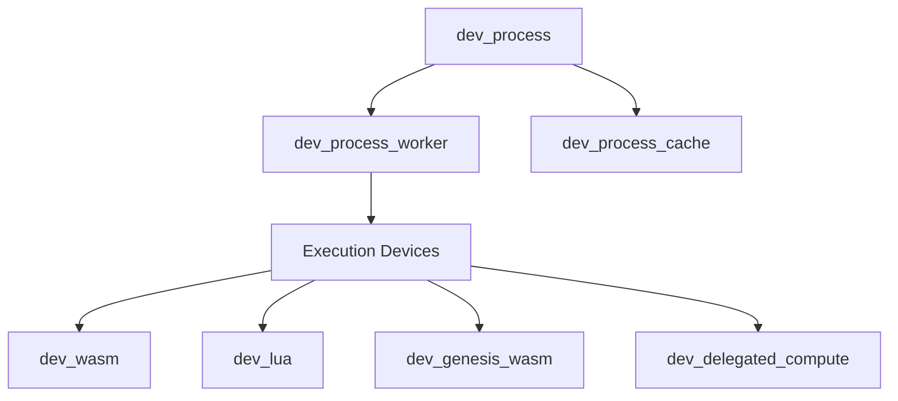
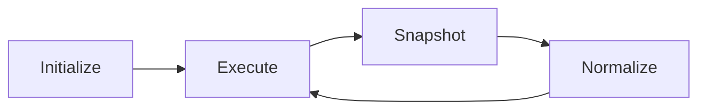

# Process & Execution System Observations

## Architectural Patterns

### 1. Process Lifecycle Management
- **Initialization Pattern**
  - Common `init/3` interface across execution devices
  - State initialization with error handling
  - Resource allocation and setup
  - Configuration validation

- **State Management**
  - Consistent use of `normalize/3` for state restoration
  - `snapshot/3` for state persistence
  - Private state encapsulation via hb_private
  - Cache-based state storage

### 2. Execution Models

#### Direct Execution
- **WASM/WASI**
  - Direct bytecode execution
  - Memory isolation
  - System call interception
  - Resource limits enforcement

- **Lua**
  - Sandboxed environment
  - Function-level isolation
  - State persistence
  - AO Core integration

#### Delegated Execution
- **Remote Computation**
  - JSON-Iface protocol
  - Result verification
  - State synchronization
  - Error propagation

- **Legacy Integration**
  - Genesis WASM compatibility
  - Process migration support
  - State translation
  - Protocol adaptation

### 3. Integration Mechanisms

#### Message-Based Communication
- Consistent use of AO Core messaging
- Standardized error formats
- Event logging patterns
- State transfer protocols

#### Resource Management
- Cache coordination
- Memory limits
- Process isolation
- Resource cleanup

## Implementation Patterns

### 1. Error Handling
```erlang
% Common error response format
{error, #{
    <<"status">> => StatusCode,
    <<"body">> => ErrorMessage,
    <<"details">> => Details
}}
```

### 2. State Management
```erlang
% Private state pattern
hb_private:set(Base, <<"state">>, State, Opts)
hb_private:get(<<"state">>, Base, Opts)
```

### 3. Event Logging
```erlang
% Standardized event logging
?event(Category, {action, {param, Value}})
?event(debug_category, {debug_info})
```

## Cross-Cutting Concerns

### 1. Security
- Sandboxing in execution environments
- Resource limits enforcement
- Input validation
- State isolation

### 2. Performance
- Caching strategies
- State persistence optimization
- Resource pooling
- Execution batching

### 3. Reliability
- Error recovery
- State restoration
- Process monitoring
- Resource cleanup

## Testing Approaches

### 1. Unit Testing
- Function-level tests
- Error case coverage
- State management verification
- Resource cleanup validation

### 2. Integration Testing
- Cross-module interaction
- Protocol compliance
- Error propagation
- Resource management

### 3. Performance Testing
- Execution benchmarks
- Resource utilization
- State persistence metrics
- Cache effectiveness

## Design Patterns

### 1. Device Pattern
```erlang
% Common device interface
-export([
    init/3,
    compute/3,
    normalize/3,
    snapshot/3
]).
```

### 2. State Management Pattern
```erlang
% State lifecycle
init -> compute -> snapshot -> normalize
```

### 3. Resource Management Pattern
```erlang
% Resource allocation with cleanup
setup_resources() ->
    allocate(),
    register_cleanup().
```

## Module Relationships

### Core Dependencies


### State Flow


## Key Insights

### 1. Modularity
- Clear separation of concerns
- Pluggable execution environments
- Standardized interfaces
- Flexible state management

### 2. Extensibility
- Common device pattern
- Consistent error handling
- Unified event logging
- Resource management patterns

### 3. Reliability
- Comprehensive error handling
- State persistence
- Resource cleanup
- Process isolation

### 4. Performance
- Caching strategies
- Resource pooling
- Execution optimization
- State management efficiency

## Areas for Enhancement

### 1. Documentation
- More detailed error scenarios
- Performance tuning guidelines
- Resource management best practices
- Security considerations

### 2. Testing
- More comprehensive benchmarks
- Cross-environment testing
- Error injection testing
- Resource leak detection

### 3. Monitoring
- Enhanced metrics collection
- Resource usage tracking
- Performance profiling
- Error pattern analysis

## Best Practices

### 1. Process Management
- Always cleanup resources
- Validate state transitions
- Handle all error cases
- Log significant events

### 2. State Management
- Use private state encapsulation
- Implement state snapshots
- Handle restoration errors
- Cache effectively

### 3. Error Handling
- Provide detailed error info
- Clean up on failures
- Log error contexts
- Handle edge cases

### 4. Testing
- Test error scenarios
- Verify state management
- Check resource cleanup
- Measure performance
