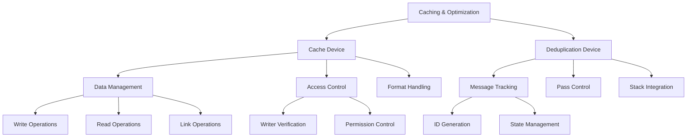
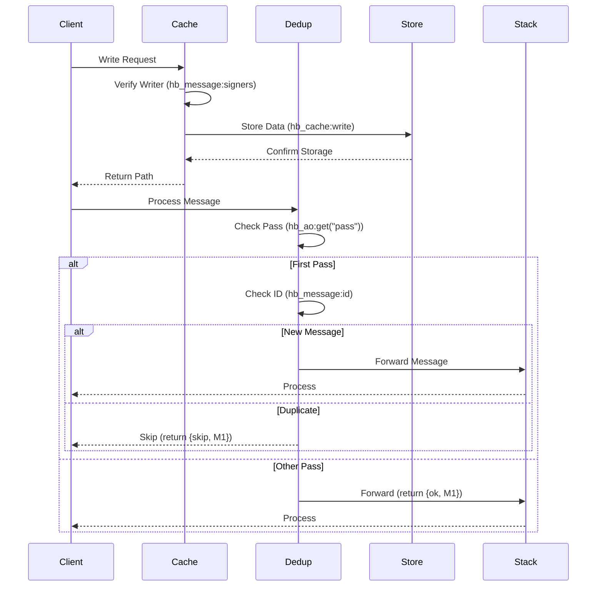

# Caching & Optimization Overview

## System Architecture


## Core Components

### 1. Cache Device (dev_cache)
- **Purpose**: Implements a secure caching layer with trusted writer verification and format-aware data handling
- **Key Features**:
  - **Trusted Writer Model**: 
    ```erlang
    % Verify writer through signature validation
    is_trusted_writer(Req, Opts) ->
        Signers = hb_message:signers(Req),
        CacheWriters = hb_opts:get(cache_writers, [], Opts),
        lists:any(fun(Signer) -> 
            lists:member(Signer, CacheWriters) 
        end, Signers).
    ```
  - **Format Conversion**: 
    ```erlang
    % Convert to AOS-2 format when requested
    case hb_ao:get(<<"accept">>, M2, Opts) of
        <<"application/aos-2">> ->
            JSONMsg = dev_json_iface:message_to_json_struct(Res),
            {ok, #{
                <<"body">> => hb_json:encode(JSONMsg),
                <<"content-type">> => <<"application/aos-2">>
            }};
        _ -> {ok, Res}
    end.
    ```
  - **Storage Integration**: Seamless integration with both `hb_cache` for fast access and `hb_store` for persistence
  - **Link Operations**: Atomic linking between cache entries with full writer verification
  - **Event Tracking**: Comprehensive event logging using `?event` macros for debugging and monitoring

### 2. Deduplication Device (dev_dedup)
- **Purpose**: Optimizes message processing by preventing duplicate executions in stack operations
- **Key Features**:
  - **First-pass Isolation**:
    ```erlang
    % Only deduplicate on first pass
    case hb_ao:get(<<"pass">>, {as, dev_message, M1}, 1, Opts) of
        1 -> handle_dedup(M1, M2, Opts);
        _ -> {ok, M1}  % Pass through on subsequent passes
    end.
    ```
  - **Message Identification**:
    ```erlang
    % Generate unique message ID
    Msg2ID = hb_message:id(M2, all),
    Dedup = hb_ao:get(<<"dedup">>, {as, dev_message, M1}, [], Opts),
    case lists:member(Msg2ID, Dedup) of
        true -> {skip, M1};
        false -> update_dedup_list(M1, Msg2ID, Dedup)
    end.
    ```
  - **State Management**: In-memory tracking with potential for future persistence
  - **Stack Integration**: Direct integration with device stack for message control
  - **Pass Awareness**: Special handling for multipass operations to maintain correctness

## Integration Points

### 1. System Integration


### 2. Data Flow
```mermaid
graph TD
    A[Client Request] --> B{Cache or Dedup?}
    
    B -->|Cache| C[Cache Device]
    B -->|Dedup| D[Dedup Device]
    
    C --> E{Operation Type}
    E -->|Write| F[Writer Check via hb_message:signers]
    E -->|Read| G[Format Check via accept header]
    E -->|Link| H[Permission Check + hb_cache:link]
    
    D --> I{Pass Number via hb_ao:get}
    I -->|First| J[ID Check via hb_message:id]
    I -->|Other| K[Forward via {ok, M1}]
    
    J -->|New| L[Update State via hb_ao:set]
    J -->|Seen| M[Skip via {skip, M1}]
```

## Real-World Usage Scenarios

### 1. HTTP API Caching
```erlang
% Configure cache device with HTTP settings
CacheOpts = #{
    cache_control => [<<"no-cache">>, <<"no-store">>],
    store => LocalStore,
    cache_writers => [TrustedAddress],
    store_all_signed => false
},

% Set up HTTP node with cache
Node = hb_http_server:start_node(CacheOpts),

% Write data to cache via HTTP
WriteMsg = #{
    <<"path">> => <<"/~cache@1.0/write">>,
    <<"method">> => <<"POST">>,
    <<"body">> => Data
},
SignedMsg = hb_message:commit(WriteMsg, Wallet),
{ok, WriteResponse} = hb_http:post(Node, SignedMsg, #{}).
```

### 2. Stack-based Deduplication
```erlang
% Create stack with dedup and processing devices
Msg = #{
    <<"device">> => <<"Stack@1.0">>,
    <<"device-stack">> => #{
        <<"1">> => <<"Dedup@1.0">>,
        <<"2">> => ProcessingDevice,
        <<"3">> => <<"Multipass@1.0">>
    },
    <<"passes">> => 2
},

% Process message through stack
{ok, Result} = hb_ao:resolve(Msg, Message, Opts).
```

### 3. Format Conversion
```erlang
% Read with format conversion
ReadMsg = #{
    <<"path">> => <<"/~cache@1.0/read">>,
    <<"method">> => <<"GET">>,
    <<"target">> => Path,
    <<"accept">> => <<"application/aos-2">>
},
{ok, JSONResponse} = hb_http:get(Node, ReadMsg, #{}).
```

## Implementation Details

### 1. Cache Operations
```erlang
% Write operation with verification and type handling
write(_M1, M2, Opts) ->
    case is_trusted_writer(M2, Opts) of
        true ->
            Type = hb_ao:get(<<"type">>, M2, <<"single">>, Opts),
            case Type of
                <<"single">> -> write_single(M2, Opts);
                <<"batch">> -> write_batch(M2, Opts);
                _ -> {error, #{<<"status">> => 400}}
            end;
        false ->
            {error, #{<<"status">> => 403}}
    end.

% Read operation with format handling and fallback
read(_M1, M2, Opts) ->
    Location = hb_ao:get(<<"target">>, M2, Opts),
    case hb_cache:read(Location, Opts) of
        {ok, Res} ->
            handle_format(Res, M2, Opts);
        not_found ->
            Store = hb_opts:get(store, [], Opts),
            hb_store:read(Store, Location)
    end.
```

### 2. Dedup Operations
```erlang
% First pass deduplication with state management
handle(Key, M1, M2, Opts) ->
    case hb_ao:get(<<"pass">>, M1, 1, Opts) of
        1 -> 
            Msg2ID = hb_message:id(M2, all),
            Dedup = hb_ao:get(<<"dedup">>, M1, [], Opts),
            case lists:member(Msg2ID, Dedup) of
                true -> 
                    ?event({already_seen, Msg2ID}),
                    {skip, M1};
                false ->
                    M3 = hb_ao:set(M1, #{
                        <<"dedup">> => [Msg2ID|Dedup]
                    }),
                    {ok, M3}
            end;
        Pass ->
            ?event({multipass_detected, Pass}),
            {ok, M1}
    end.
```

### 3. Resource Management
- **Memory Efficiency**:
  ```erlang
  % Direct binary handling for efficiency
  case Body of
      Binary when is_binary(Binary) ->
          {ok, Path} = hb_cache:write(Binary, Opts);
      _ ->
          handle_complex_data(Body, Opts)
  end.
  ```
- **State Preservation**:
  ```erlang
  % Atomic state updates
  M3 = hb_ao:set(M1, #{
      <<"dedup">> => [Msg2ID|Dedup],
      <<"state">> => NewState
  }),
  ```
- **Format Handling**:
  ```erlang
  % Lazy format conversion
  case hb_ao:get(<<"accept">>, M2, Opts) of
      <<"application/aos-2">> ->
          convert_to_json(Data);
      _ ->
          {ok, Data}
  end.
  ```

## Future Considerations

### 1. Cache Enhancements
- **Persistent Storage**: Integration with RocksDB for durable caching
- **Enhanced Formats**: Support for more content types and conversion paths
- **Better Security**: Enhanced signature verification and access control
- **Performance Tuning**: Optimized lookup paths and cache invalidation
- **Error Recovery**: Automatic state repair and consistency checking

### 2. Dedup Improvements
- **Cache Integration**: Shared state between cache and dedup devices
- **Better Tracking**: More efficient duplicate detection algorithms
- **Enhanced Validation**: Additional message integrity checks
- **Format Handling**: Better integration with format conversion
- **Error Management**: Improved error recovery and state restoration

### 3. Integration Updates
- **Better Coordination**: Enhanced interaction between devices
- **Enhanced Sharing**: More efficient resource sharing
- **Improved Handling**: Better error propagation and recovery
- **Format Optimization**: More efficient format conversion paths
- **Error Recovery**: Better handling of partial failures
