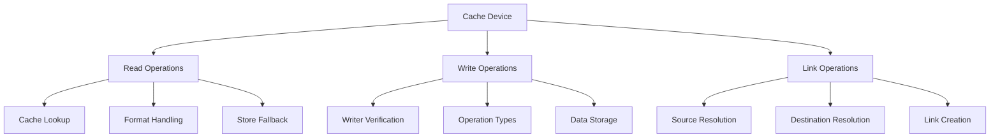
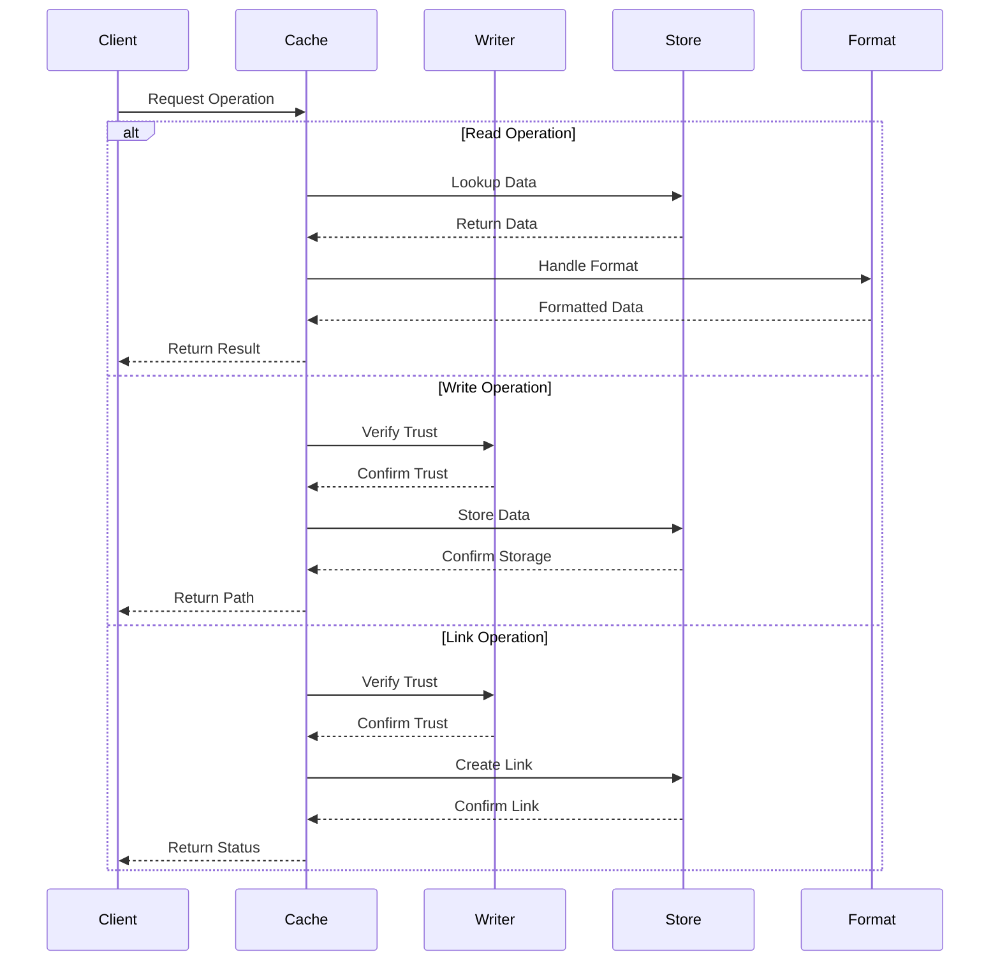

# Module: dev_cache

## Basic Information
- **Source File:** dev_cache.erl
- **Module Type:** Cache Management Device
- **Purpose:** Manages a secure caching system with trusted writer verification, format handling, and support for both single and batch operations.

## Core Functionality

### 1. Cache Architecture


### 2. Operation Flow


## Implementation Details

### 1. Read Operation
```erlang
read(_M1, M2, Opts) ->
    % Extract target location
    Location = hb_ao:get(<<"target">>, M2, Opts),
    
    % Attempt cache lookup
    case hb_cache:read(Location, Opts) of
        {ok, Res} ->
            % Handle format conversion if needed
            case hb_ao:get(<<"accept">>, M2, Opts) of
                <<"application/aos-2">> ->
                    convert_to_json(Res);
                _ ->
                    {ok, Res}
            end;
        not_found ->
            % Try store fallback
            Store = hb_opts:get(store, [], Opts),
            hb_store:read(Store, Location)
    end
```

### 2. Write Operation
```erlang
write(_M1, M2, Opts) ->
    % Verify trusted writer
    case is_trusted_writer(M2, Opts) of
        true ->
            % Handle write type
            case hb_ao:get(<<"type">>, M2, <<"single">>, Opts) of
                <<"single">> ->
                    write_single(M2, Opts);
                <<"batch">> ->
                    write_batch(M2, Opts);
                _ ->
                    {error, invalid_type}
            end;
        false ->
            {error, not_authorized}
    end
```

### 3. Link Operation
```erlang
link(_Base, Req, Opts) ->
    % Verify trusted writer
    case is_trusted_writer(Req, Opts) of
        true ->
            % Extract source and destination
            Source = hb_ao:get(<<"source">>, Req, Opts),
            Destination = hb_ao:get(<<"destination">>, Req, Opts),
            
            % Create link
            write_single(#{
                <<"operation">> => <<"link">>,
                <<"source">> => Source,
                <<"destination">> => Destination
            }, Opts);
        false ->
            {error, not_authorized}
    end
```

## Key Features

### 1. Security
- Trusted writer verification
- Signature validation
- Access control
- Operation authorization
- Error handling

### 2. Format Handling
- Multiple format support
- JSON conversion
- Binary handling
- Message formatting
- Type validation

### 3. Operation Types
- Single writes
- Batch operations
- Link creation
- Format conversion
- Error recovery

## Usage Examples

### 1. Reading Data
```erlang
% Basic read
{ok, Result} = dev_cache:read(
    #{},
    #{
        <<"target">> => DataID
    },
    #{}
)

% Read with format conversion
{ok, Result} = dev_cache:read(
    #{},
    #{
        <<"target">> => DataID,
        <<"accept">> => <<"application/aos-2">>
    },
    #{}
)
```

### 2. Writing Data
```erlang
% Single write
{ok, Result} = dev_cache:write(
    #{},
    #{
        <<"type">> => <<"single">>,
        <<"body">> => Data
    },
    #{
        cache_writers => [TrustedAddress]
    }
)

% Batch write
{ok, Result} = dev_cache:write(
    #{},
    #{
        <<"type">> => <<"batch">>,
        <<"body">> => #{
            <<"item1">> => Data1,
            <<"item2">> => Data2
        }
    },
    #{
        cache_writers => [TrustedAddress]
    }
)
```

### 3. Creating Links
```erlang
% Link creation
{ok, Result} = dev_cache:link(
    #{},
    #{
        <<"source">> => SourceID,
        <<"destination">> => DestID
    },
    #{
        cache_writers => [TrustedAddress]
    }
)
```

## Error Handling

### 1. Security Errors
- Unauthorized writers
- Invalid signatures
- Missing permissions
- Trust verification
- Access control

### 2. Operation Errors
- Invalid types
- Missing data
- Format errors
- Link failures
- Storage issues

### 3. Format Errors
- Conversion failures
- Invalid formats
- Type mismatches
- Data corruption
- Validation errors

## Performance Considerations

### 1. Cache Efficiency
- Quick lookups
- Format caching
- Link resolution
- Error handling
- Resource management

### 2. Operation Speed
- Batch processing
- Link creation
- Format conversion
- Error recovery
- Resource cleanup

### 3. Resource Usage
- Memory allocation
- Storage optimization
- Link management
- Format handling
- Error tracking

## Future Improvements

### 1. Feature Extensions
- More formats
- Better batching
- Enhanced linking
- Format detection
- Error recovery

### 2. Performance Optimization
- Faster lookups
- Better caching
- Improved linking
- Enhanced formats
- Error handling

### 3. Security Enhancements
- Better verification
- Enhanced trust
- Improved access
- Format validation
- Error prevention
