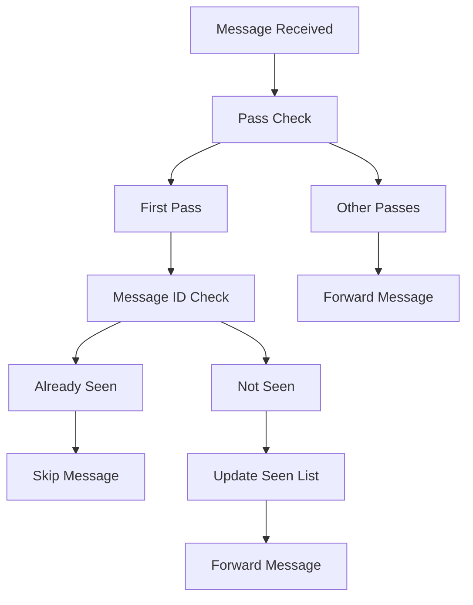
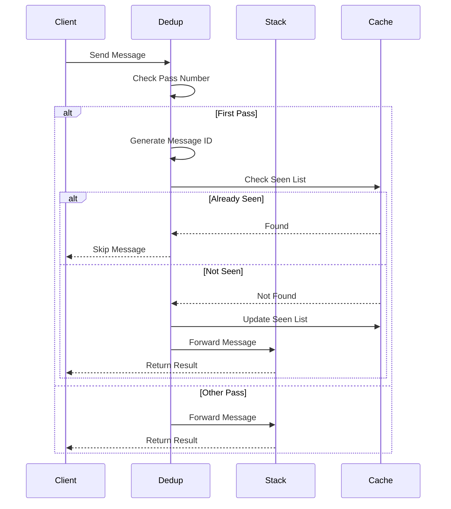

# Module: dev_dedup

## Basic Information
- **Source File:** dev_dedup.erl
- **Module Type:** Message Deduplication Device
- **Purpose:** Deduplicates messages sent to a process by tracking and filtering duplicate messages during the first pass of stack execution.

## Core Functionality

### 1. Deduplication Architecture


### 2. Message Flow


## Implementation Details

### 1. Handler Configuration
```erlang
info(_M1) ->
    #{
        handler => fun handle/4
    }
```

### 2. Message Handling
```erlang
handle(Key, M1, M2, Opts) ->
    % Check pass number
    case hb_ao:get(<<"pass">>, {as, dev_message, M1}, 1, Opts) of
        1 ->
            % Generate message ID
            Msg2ID = hb_message:id(M2, all),
            % Get existing dedup list
            Dedup = hb_ao:get(<<"dedup">>, {as, dev_message, M1}, [], Opts),
            
            % Check if message seen before
            case lists:member(Msg2ID, Dedup) of
                true ->
                    {skip, M1};
                false ->
                    % Update dedup list
                    M3 = hb_ao:set(
                        M1,
                        #{ <<"dedup">> => [Msg2ID|Dedup] }
                    ),
                    {ok, M3}
            end;
        Pass ->
            % Skip dedup on other passes
            {ok, M1}
    end
```

## Key Features

### 1. Message Tracking
- Unique ID generation
- Seen list maintenance
- First pass tracking
- State management
- Memory optimization

### 2. Pass Control
- First pass handling
- Pass number tracking
- Multi-pass support
- State preservation
- Operation control

### 3. Stack Integration
- Message forwarding
- State propagation
- Error handling
- Resource management
- Operation coordination

## Usage Examples

### 1. Basic Deduplication
```erlang
% Create stack with dedup device
Msg = #{
    <<"device">> => <<"Stack@1.0">>,
    <<"device-stack">> => #{
        <<"1">> => <<"Dedup@1.0">>,
        <<"2">> => OtherDevice
    }
}

% Send same message twice
{ok, Msg2} = hb_ao:resolve(Msg, Message1, Opts),
{ok, Msg3} = hb_ao:resolve(Msg2, Message1, Opts)
% Second message will be skipped
```

### 2. Multi-pass Operation
```erlang
% Create stack with dedup and multipass
Msg = #{
    <<"device">> => <<"Stack@1.0">>,
    <<"device-stack">> => #{
        <<"1">> => <<"Dedup@1.0">>,
        <<"2">> => OtherDevice,
        <<"3">> => <<"Multipass@1.0">>
    },
    <<"passes">> => 2
}

% Dedup only affects first pass
{ok, Result} = hb_ao:resolve(Msg, Message, Opts)
```

### 3. Stack Integration
```erlang
% Create stack with dedup and append devices
Msg = #{
    <<"device">> => <<"Stack@1.0">>,
    <<"device-stack">> => #{
        <<"1">> => <<"Dedup@1.0">>,
        <<"2">> => AppendDevice1,
        <<"3">> => AppendDevice2
    },
    <<"result">> => <<"INIT">>
}
```

## Error Handling

### 1. Message Errors
- Invalid messages
- Missing IDs
- Format errors
- State corruption
- Resource issues

### 2. Pass Errors
- Invalid pass numbers
- State corruption
- Resource issues
- Format errors
- Operation failures

### 3. Stack Errors
- Integration issues
- State corruption
- Resource problems
- Format conflicts
- Operation failures

## Performance Considerations

### 1. Memory Usage
- Seen list size
- State management
- Resource allocation
- Cache utilization
- Operation efficiency

### 2. Processing Speed
- ID generation
- List operations
- State updates
- Pass checking
- Error handling

### 3. Stack Impact
- Message flow
- State propagation
- Resource usage
- Operation timing
- Error recovery

## Future Improvements

### 1. Storage Enhancement
- Cache integration
- Better state management
- Resource optimization
- Format handling
- Error recovery

### 2. Performance Optimization
- Faster lookups
- Better state handling
- Improved caching
- Enhanced validation
- Error management

### 3. Stack Integration
- Better coordination
- Enhanced state sharing
- Improved resource usage
- Format optimization
- Error handling
