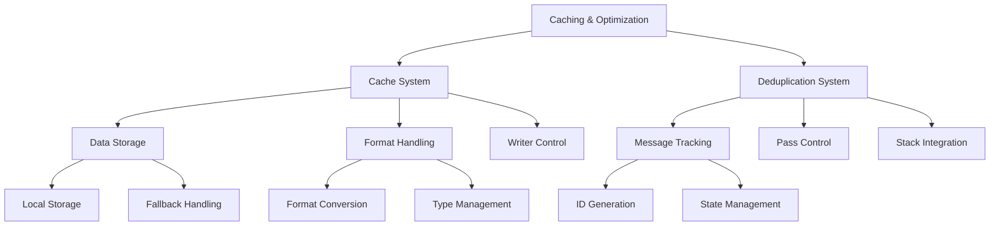
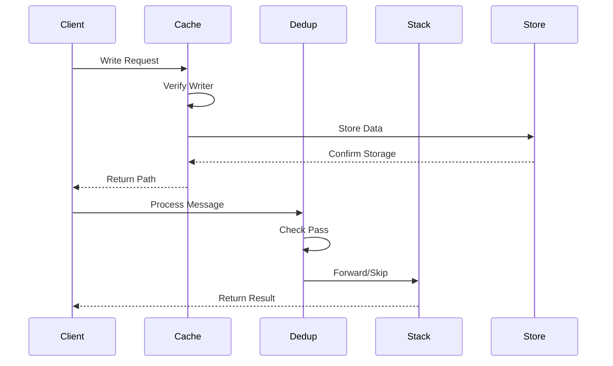
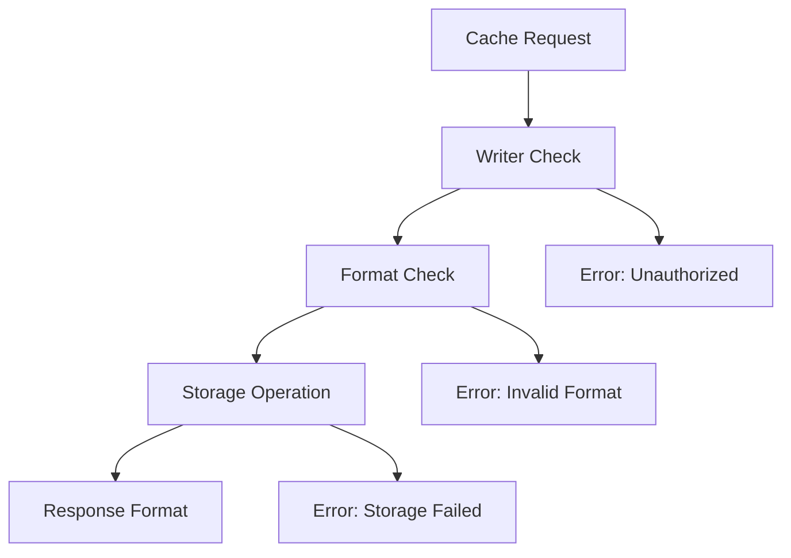
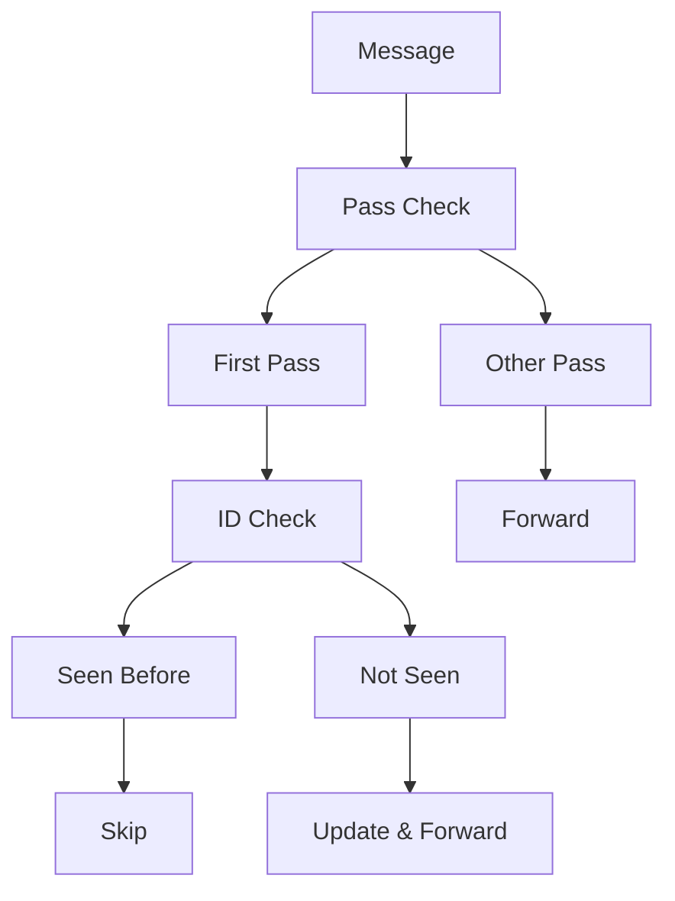

# Caching & Optimization: System Observations

## Architectural Patterns

### 1. System Architecture

### 2. Component Integration

## Key Insights

### 1. Design Philosophy

#### Caching Strategy
- Trusted writer model
- Format flexibility
- Storage abstraction
- Error resilience
- Performance optimization

#### Deduplication Approach
- First-pass focus
- Memory-based tracking
- Stack awareness
- State preservation
- Operation efficiency

#### Integration Model
- Clear boundaries
- Defined interfaces
- Error propagation
- Resource sharing
- State coordination

### 2. System Characteristics

#### Performance
- Efficient lookups
- Smart caching
- Memory optimization
- Resource management
- Operation control

#### Reliability
- Error handling
- State tracking
- Resource cleanup
- Format validation
- Operation verification

#### Flexibility
- Multiple formats
- Writer control
- Pass management
- Stack integration
- State handling

## Implementation Patterns

### 1. Code Organization

#### Module Structure
- Clear responsibilities
- Focused functionality
- Error handling
- Resource management
- State tracking

#### Integration Points
- Well-defined interfaces
- Clear dependencies
- Error propagation
- Resource sharing
- State coordination

#### Error Handling
- Comprehensive coverage
- Recovery mechanisms
- State preservation
- Resource cleanup
- Operation validation

### 2. Resource Management

#### Cache Control
- Writer verification
- Format handling
- Storage management
- Error recovery
- State preservation

#### Memory Usage
- Efficient tracking
- State management
- Resource allocation
- Operation control
- Format handling

#### Operation Control
- Pass management
- State tracking
- Error handling
- Resource cleanup
- Format validation

## Optimization Techniques

### 1. Cache Optimization

### 2. Deduplication Strategy

## Future Considerations

### 1. Enhancement Opportunities

#### Cache System
- Persistent storage
- Better formats
- Enhanced security
- Performance tuning
- Error recovery

#### Dedup System
- Cache integration
- Better tracking
- Enhanced validation
- Format handling
- Error management

#### Integration
- Better coordination
- Enhanced sharing
- Improved handling
- Format optimization
- Error recovery

### 2. Performance Improvements

#### Cache Performance
- Faster lookups
- Better storage
- Enhanced formats
- Improved validation
- Error handling

#### Dedup Performance
- Efficient tracking
- Better memory
- Enhanced validation
- Format handling
- Error recovery

#### System Performance
- Better integration
- Enhanced sharing
- Improved handling
- Format optimization
- Error management

## Architectural Impact

### 1. System Benefits

#### Efficiency Gains
- Reduced redundancy
- Better resource use
- Enhanced performance
- Format optimization
- Error reduction

#### Reliability Improvements
- Better error handling
- Enhanced tracking
- Improved validation
- Format consistency
- Operation verification

#### Integration Benefits
- Clear interfaces
- Better coordination
- Enhanced sharing
- Format handling
- Error management

### 2. Design Influence

#### Pattern Adoption
- Clear separation
- Focused modules
- Error handling
- Resource management
- State tracking

#### Implementation Guide
- Module structure
- Integration points
- Error handling
- Resource control
- State management

#### Future Direction
- Enhancement paths
- Performance goals
- Integration plans
- Format evolution
- Error handling
