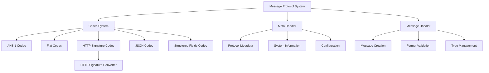
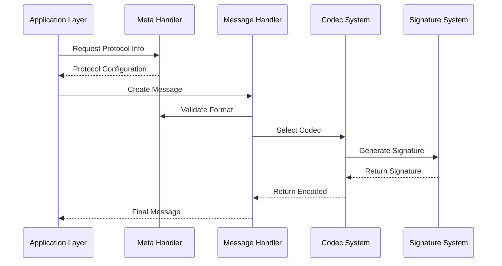
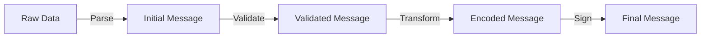
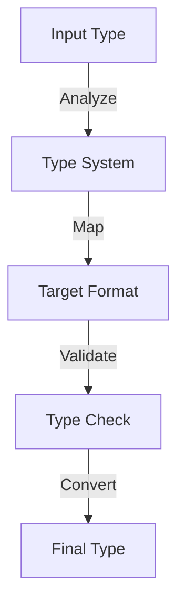

# Message Protocol Handling System: Comprehensive Overview

## System Architecture & Core Components

### 1. Architectural Foundation

The Message Protocol Handling System serves as the foundational layer for all message-based communication within HyperBEAM. It implements a sophisticated multi-codec architecture that enables seamless conversion between different message formats while preserving type information and ensuring message integrity through cryptographic signatures.

### 2. Message Flow & Processing

The system implements a carefully orchestrated message flow that ensures proper handling at each stage:
1. Initial protocol validation through the Meta Handler
2. Message creation and format verification
3. Codec selection based on target format
4. Optional signature generation and verification
5. Final message assembly and delivery

## Core Subsystems: Detailed Analysis

### 1. Meta Handler (dev_meta)
The Meta Handler serves as the system's configuration and metadata management center, responsible for:

#### Protocol Management
- **Version Control**: Maintains protocol versioning and compatibility
- **Feature Tracking**: Maps available protocol features and capabilities
- **Configuration**: Handles protocol-specific configuration settings
- **Validation Rules**: Defines and enforces protocol validation rules

#### System Information
- **Runtime Data**: Tracks system state and runtime information
- **Resource Usage**: Monitors protocol-related resource utilization
- **Performance Metrics**: Collects and manages performance statistics
- **Error Tracking**: Handles protocol-level error reporting

### 2. Message Handler (dev_message)
The Message Handler orchestrates the core message processing functionality:

#### Message Creation
- **Format Selection**: Chooses appropriate message formats
- **Type Assignment**: Handles initial type assignment and validation
- **Structure Building**: Constructs message structure hierarchies
- **Validation**: Ensures message integrity and completeness

#### Processing Pipeline
- **Pre-processing**: Prepares messages for codec processing
- **Transformation**: Handles message structure transformations
- **Post-processing**: Finalizes messages after codec operations
- **Error Handling**: Manages processing errors and recovery

### 3. Codec System
The Codec System provides a comprehensive suite of encoders/decoders:

#### ANS.1 Codec
Implements ASN.1 encoding with:
- **Binary Efficiency**: Optimized binary format encoding
- **Type Preservation**: Strong type system maintenance
- **Schema Support**: ASN.1 schema validation and handling
- **Performance Focus**: High-performance processing paths

#### Flat Codec
Provides simplified message encoding:
- **Key Flattening**: Hierarchical structure flattening
- **Value Preservation**: Direct value representation
- **Debug Support**: Enhanced debugging capabilities
- **Simple Interface**: Straightforward API design

#### HTTP Signature Codec (RFC-9421)
Implements cryptographic message signing:
- **Signature Generation**: Creates cryptographic signatures
- **Verification Flow**: Validates message signatures
- **Commitment Tracking**: Manages signature commitments
- **Security Features**: Implements security protocols

#### JSON Codec
Handles JSON format conversion:
- **Type Mapping**: Maps between JSON and internal types
- **Structure Preservation**: Maintains message structure
- **Web Integration**: Supports web-based protocols
- **Format Validation**: Ensures JSON compliance

#### Structured Fields Codec (RFC-9651)
Manages structured field encoding:
- **Field Organization**: Handles complex field structures
- **Type System**: Implements rich type support
- **Format Compliance**: Ensures RFC-9651 compliance
- **Optimization**: Optimizes field representations

## Integration & Interaction Patterns

### 1. System Integration
The protocol handling system integrates with other components through:

#### Core System Interface
- **Message Routing**: Directs messages through the system
- **Type Management**: Coordinates type system integration
- **Error Handling**: Manages system-wide error flows
- **Resource Control**: Handles resource allocation

#### Network Layer Connection
- **Protocol Bridging**: Connects different protocol layers
- **Format Translation**: Handles format conversions
- **Performance Optimization**: Optimizes network usage
- **Security Integration**: Implements security measures

### 2. Data Flow Patterns
The system implements sophisticated data flow patterns:

#### Message Processing Flow

#### Type Handling Flow

## Advanced Features & Capabilities

### 1. Type System
The type system provides comprehensive type handling:

#### Type Management
- **Rich Types**: Support for complex type structures
- **Type Preservation**: Maintains type information
- **Conversion Rules**: Defines type conversion logic
- **Validation System**: Implements type validation

#### Empty Value Handling
- **Null Representation**: Handles null values properly
- **Empty Containers**: Manages empty collections
- **Default Values**: Implements default value logic
- **Type Safety**: Ensures type-safe operations

### 2. Security Features
Implements robust security measures:

#### Signature System
- **Cryptographic Operations**: Handles crypto functions
- **Key Management**: Manages cryptographic keys
- **Verification Flow**: Implements signature verification
- **Security Policies**: Enforces security rules

#### Message Protection
- **Integrity Checks**: Ensures message integrity
- **Encryption Support**: Handles message encryption
- **Access Control**: Implements access restrictions
- **Audit Trail**: Maintains security logging

## Performance & Optimization

### 1. Processing Optimization
Implements various optimization strategies:

#### Memory Management
- **Buffer Handling**: Optimizes buffer usage
- **Resource Pooling**: Implements resource pools
- **Cache Strategy**: Utilizes caching systems
- **Memory Efficiency**: Optimizes memory use

#### CPU Utilization
- **Processing Paths**: Optimizes processing flows
- **Batch Operations**: Implements batch processing
- **Parallel Processing**: Uses parallel execution
- **Load Balancing**: Manages processing load

### 2. Format Optimization
Optimizes format handling:

#### Binary Optimization
- **Compression**: Implements data compression
- **Format Efficiency**: Optimizes format storage
- **Transfer Optimization**: Improves data transfer
- **Size Reduction**: Minimizes message size

#### Structure Optimization
- **Field Organization**: Optimizes field layout
- **Index Management**: Implements efficient indexing
- **Access Patterns**: Optimizes access paths
- **Cache Efficiency**: Improves cache usage

## Future Development & Evolution

### 1. Planned Enhancements
Future development focuses on:

#### Protocol Extensions
- **New Formats**: Additional format support
- **Enhanced Features**: Extended capabilities
- **Better Integration**: Improved system integration
- **Performance Updates**: Enhanced performance

#### Security Improvements
- **Advanced Signing**: Enhanced signature systems
- **Better Verification**: Improved verification
- **Security Features**: Additional security measures
- **Protection Methods**: Enhanced protection

### 2. System Evolution
Long-term evolution plans include:

#### Architecture Updates
- **Component Refinement**: Enhanced components
- **Better Integration**: Improved integration
- **System Expansion**: Extended functionality
- **Performance Evolution**: Continuous optimization

#### Feature Development
- **New Capabilities**: Additional features
- **Enhanced Support**: Improved support
- **Better Tools**: Advanced tooling
- **Extended Functionality**: New functions
