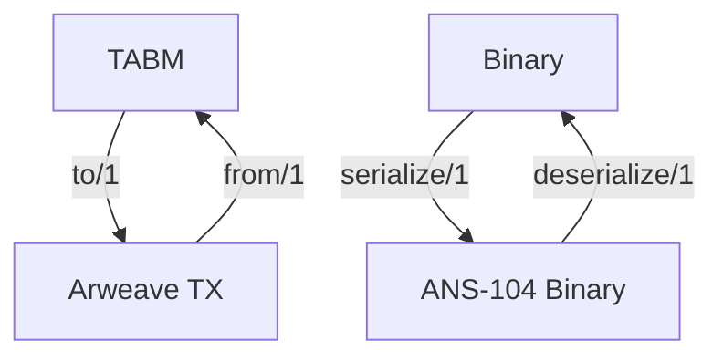
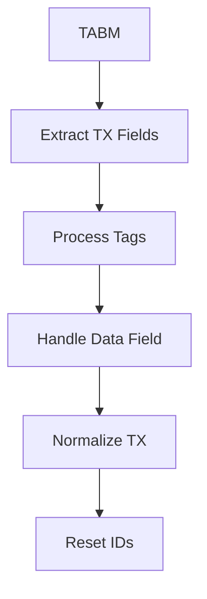
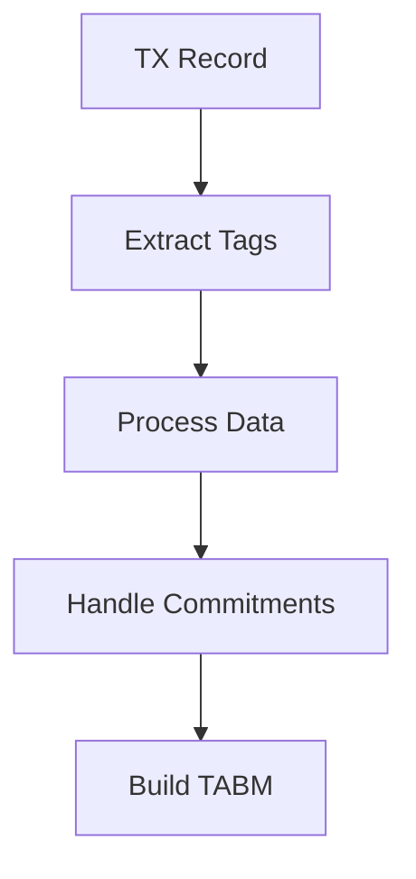
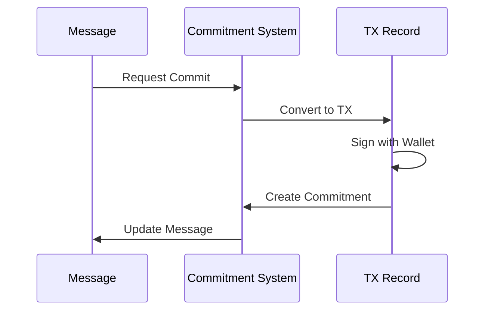

# Module: dev_codec_ans104

## Basic Information
- **Source File:** dev_codec_ans104.erl
- **Module Type:** Message Protocol Codec
- **Purpose:** Manages transformations between Arweave transaction records (ar_bundles-style) and Tagged Attribute-Based Messages (TABMs), providing serialization and commitment handling.

## Core Functionality

### 1. Message Transformation Flow


### 2. Configuration Constants
```erlang
% Maximum size for tag values
-define(MAX_TAG_VAL, 128).

% Transaction fields users can set
-define(TX_KEYS, [
    <<"id">>,
    <<"last_tx">>,
    <<"owner">>,
    <<"target">>,
    <<"signature">>
]).

% Tags committed during signing
-define(COMMITTED_TAGS, ?TX_KEYS ++ [<<"data">>]).
```

## Implementation Details

### 1. Message Conversion

#### TABM to TX Conversion


#### TX to TABM Conversion


### 2. Tag Management

#### Tag Processing
```erlang
deduplicating_from_list(Tags) ->
    % Aggregate duplicated tags
    Aggregated = lists:foldl(
        fun({Key, Value}, Acc) ->
            NormKey = hb_ao:normalize_key(Key),
            case maps:get(NormKey, Acc, undefined) of
                undefined -> maps:put(NormKey, Value, Acc);
                Existing when is_list(Existing) ->
                    maps:put(NormKey, Existing ++ [Value], Acc);
                ExistingSingle ->
                    maps:put(NormKey, [ExistingSingle, Value], Acc)
            end
        end,
        #{},
        Tags
    )
```

### 3. Commitment Handling

#### Commitment Flow


## Key Features

### 1. Message Transformation
- Bidirectional conversion between TABMs and TX records
- Tag normalization and deduplication
- Data field handling
- Binary serialization/deserialization

### 2. Commitment Support
- Message signing
- Commitment verification
- Tag commitment tracking
- Original tag preservation

### 3. Tag Management
- Case-sensitive tag handling
- Tag deduplication
- Value size constraints
- Structured field support

### 4. Integration Points
- ar_bundles system
- Message protocol
- Commitment system
- Serialization system

## Testing Coverage

### 1. Tag Management
```erlang
normal_tags_test() ->
    Msg = #{
        <<"first-tag">> => <<"first-value">>,
        <<"second-tag">> => <<"second-value">>
    },
    Encoded = to(Msg),
    Decoded = from(Encoded),
    ?assert(hb_message:match(Msg, Decoded))
```

### 2. Case Sensitivity
```erlang
from_maintains_tag_name_case_test() ->
    TX = #tx {
        tags = [
            {<<"Test-Tag">>, <<"test-value">>}
        ]
    },
    SignedTX = ar_bundles:sign_item(TX, hb:wallet()),
    TABM = from(SignedTX),
    ConvertedTX = to(TABM),
    ?assert(ar_bundles:verify_item(ConvertedTX))
```

### 3. Tag Duplication
```erlang
duplicated_tag_name_test() ->
    TX = #tx {
        tags = [
            {<<"Test-Tag">>, <<"test-value">>,
            {<<"test-tag">>, <<"test-value-2">>}
        ]
    },
    Msg = convert_to_message(TX),
    TX2 = convert_to_tx(Msg),
    ?assertEqual(TX, TX2)
```

## Best Practices

### 1. Message Handling
- Validate all inputs
- Preserve tag case
- Handle duplicates
- Maintain data integrity

### 2. Commitment Management
- Verify signatures
- Track original tags
- Handle nested data
- Preserve metadata

### 3. Integration
- Follow ANS-104 spec
- Handle edge cases
- Log operations
- Maintain compatibility

## Error Handling

### 1. Common Errors
```erlang
% Invalid transaction
throw(invalid_tx)

% Multiple signatures not supported
throw({multisignatures_not_supported_by_ans104, Message})

% Invalid original tags
throw({invalid_original_tags, OriginalTags, NormalizedTags})
```

### 2. Error Prevention
- Input validation
- Type checking
- Size constraints
- Format verification

## Usage Examples

### 1. Basic Conversion
```erlang
% Convert TABM to TX
TX = dev_codec_ans104:to(Message)

% Convert TX to TABM
Message = dev_codec_ans104:from(TX)

% Serialize message
{ok, Binary} = dev_codec_ans104:serialize(Message)
```

### 2. Commitment Operations
```erlang
% Create commitment
{ok, SignedMsg} = dev_codec_ans104:commit(Message, Request, Options)

% Verify commitment
{ok, true} = dev_codec_ans104:verify(SignedMsg, Request, Options)
```

### 3. Tag Management
```erlang
% Handle duplicated tags
TX = #tx{tags = [{<<"key">>, <<"value1">>}, {<<"key">>, <<"value2">>}]}
Message = dev_codec_ans104:from(TX)
% Results in structured field list for duplicated values
