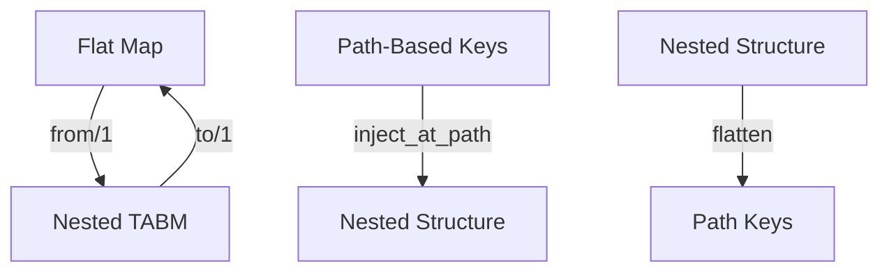
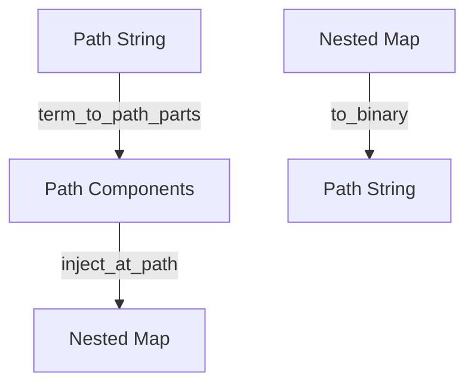
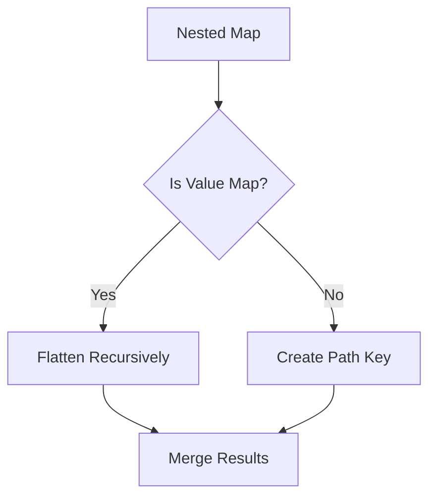

# Module: dev_codec_flat

## Basic Information
- **Source File:** dev_codec_flat.erl
- **Module Type:** Message Protocol Codec
- **Purpose:** Converts between flat maps with path-based keys and nested Tagged Attribute-Based Messages (TABMs), providing a simplified representation for path-based access.

## Core Functionality

### 1. Message Transformation Flow


### 2. Path Handling


## Implementation Details

### 1. Flat to Nested Conversion

#### Path Injection
```erlang
inject_at_path([Key], Value, Map) ->
    case maps:get(Key, Map, not_found) of
        not_found ->
            Map#{ Key => Value };
        ExistingMap when is_map(ExistingMap) andalso is_map(Value) ->
            % Merge maps at leaf nodes
            Map#{ Key => maps:merge(ExistingMap, Value) };
        OldValue ->
            % Handle path collisions
            throw({path_collision, {key, Key}, 
                  {existing, OldValue}, {value, Value}})
    end
```

#### Recursive Conversion
```erlang
from(Map) when is_map(Map) ->
    maps:fold(
        fun(Path, Value, Acc) ->
            inject_at_path(
                hb_path:term_to_path_parts(Path), 
                from(Value), 
                Acc
            )
        end,
        #{},
        Map
    )
```

### 2. Nested to Flat Conversion

#### Path Flattening


#### Implementation
```erlang
to(Map) when is_map(Map) ->
    maps:fold(
        fun(Key, Value, Acc) ->
            case to(Value) of
                SubMap when is_map(SubMap) ->
                    % Recursively flatten submaps
                    maps:fold(
                        fun(SubKey, SubValue, InnerAcc) ->
                            maps:put(
                                hb_path:to_binary([Key, SubKey]),
                                SubValue,
                                InnerAcc
                            )
                        end,
                        Acc,
                        SubMap
                    );
                SimpleValue ->
                    % Handle leaf values
                    maps:put(
                        hb_path:to_binary([Key]), 
                        SimpleValue, 
                        Acc
                    )
            end
        end,
        #{},
        Map
    )
```

### 3. Serialization Support

#### Text Format
```erlang
serialize(Map) ->
    % Convert to flat representation
    Flattened = hb_message:convert(Map, <<"flat@1.0">>, #{}),
    % Format as key-value pairs
    {ok, iolist_to_binary(
        lists:foldl(
            fun(Key, Acc) ->
                [Acc, Key, <<": ">>, maps:get(Key, Flattened), <<"\n">>]
            end,
            <<>>,
            maps:keys(Flattened)
        )
    )}
```

## Key Features

### 1. Path Management
- Path-based key representation
- Nested structure support
- Collision detection
- Binary path conversion

### 2. Map Operations
- Deep map merging
- Recursive conversion
- Binary passthrough
- Path validation

### 3. Integration Support
- HTTPSIG commitment delegation
- Serialization helpers
- Path utilities
- Error handling

### 4. Integration Points
- Path system
- Message protocol
- HTTPSIG codec
- Serialization system

## Testing Coverage

### 1. Basic Conversion
```erlang
simple_conversion_test() ->
    Flat = #{[<<"a">>] => <<"value">>},
    Nested = #{<<"a">> => <<"value">>},
    ?assert(hb_message:match(Nested, from(Flat))),
    ?assert(hb_message:match(Flat, to(Nested)))
```

### 2. Nested Structures
```erlang
nested_conversion_test() ->
    Flat = #{<<"a/b">> => <<"value">>},
    Nested = #{<<"a">> => #{<<"b">> => <<"value">>}},
    ?assert(hb_message:match(Nested, from(Flat))),
    ?assert(hb_message:match(Flat, to(Nested)))
```

### 3. Edge Cases
```erlang
binary_passthrough_test() ->
    Bin = <<"raw binary">>,
    ?assertEqual(Bin, from(Bin)),
    ?assertEqual(Bin, to(Bin))
```

## Best Practices

### 1. Path Handling
- Validate path components
- Handle collisions gracefully
- Preserve path order
- Maintain path integrity

### 2. Map Operations
- Check map types
- Handle edge cases
- Preserve data
- Maintain structure

### 3. Integration
- Follow path conventions
- Handle errors
- Log operations
- Maintain compatibility

## Error Handling

### 1. Common Errors
```erlang
% Path collision
throw({path_collision, 
    {key, Key},
    {existing, OldValue},
    {value, Value}
})
```

### 2. Error Prevention
- Path validation
- Type checking
- Collision detection
- Format verification

## Usage Examples

### 1. Basic Conversion
```erlang
% Convert flat to nested
Nested = dev_codec_flat:from(#{<<"a/b">> => <<"value">>})
% Result: #{<<"a">> => #{<<"b">> => <<"value">>}}

% Convert nested to flat
Flat = dev_codec_flat:to(#{<<"a">> => #{<<"b">> => <<"value">>}})
% Result: #{<<"a/b">> => <<"value">>}
```

### 2. Serialization
```erlang
% Serialize to text format
{ok, Text} = dev_codec_flat:serialize(Message)
% Result: "a/b: value\n"

% Deserialize from text
{ok, Message} = dev_codec_flat:deserialize(Text)
```

### 3. Deep Structures
```erlang
% Handle deep nesting
Deep = dev_codec_flat:from(#{<<"a/b/c/d">> => <<"value">>})
% Result: #{<<"a">> => #{<<"b">> => #{<<"c">> => #{<<"d">> => <<"value">>}}}}
