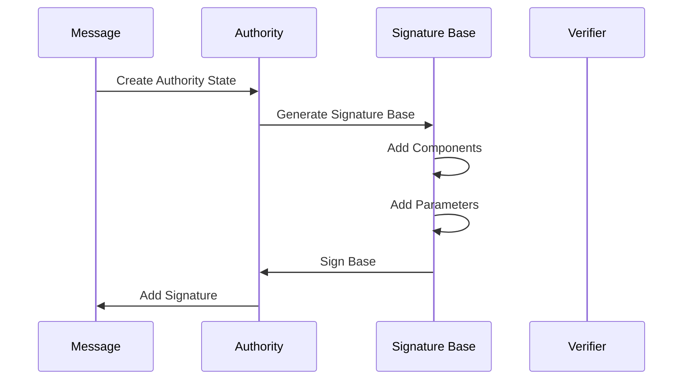
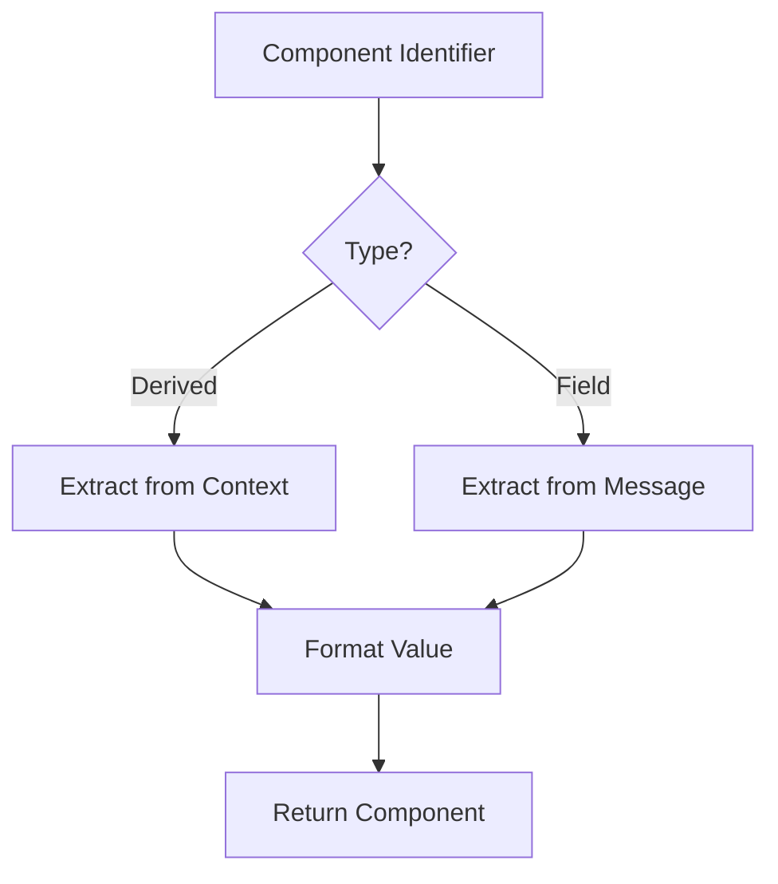

# Module: dev_codec_httpsig

## Basic Information
- **Source File:** dev_codec_httpsig.erl
- **Module Type:** Message Protocol Codec
- **Purpose:** Implements HTTP Message Signatures as defined in RFC-9421, providing message signing, verification, and component handling capabilities.

## Core Functionality

### 1. HTTP Message Signing Flow


### 2. Component Types
```erlang
-type fields() :: #{
    binary() | atom() | string() => binary() | atom() | string()
}.

-type request_message() :: #{
    url => binary(),
    method => binary(),
    headers => fields(),
    trailers => fields(),
    is_absolute_form => boolean()
}.

-type response_message() :: #{
    status => integer(),
    headers => fields(),
    trailers => fields()
}.
```

## Implementation Details

### 1. Signature Parameters

#### Parameter Handling
```erlang
-define(SIGNATURE_PARAMS, [
    created, 
    expired, 
    nonce, 
    alg, 
    keyid, 
    tag
]).

-type signature_params() :: #{
    atom() | binary() | string() => 
        binary() | integer()
}.
```

#### Authority State
```erlang
-type authority_state() :: #{
    component_identifiers => [component_identifier()],
    sig_params => signature_params(),
    key => binary()
}.
```

### 2. Component Management

#### Derived Components
```erlang
-define(DERIVED_COMPONENTS, [
    <<"method">>,
    <<"target-uri">>,
    <<"authority">>,
    <<"scheme">>,
    <<"request-target">>,
    <<"path">>,
    <<"query">>,
    <<"query-param">>,
    <<"status">>
]).
```

#### Component Extraction


### 3. Signature Generation

#### Base Creation
```erlang
signature_base(Authority, Req, Res) ->
    ComponentsLine = signature_components_line(
        maps:get(component_identifiers, Authority),
        Req, 
        Res
    ),
    ParamsLine = signature_params_line(
        ComponentIdentifiers,
        maps:get(sig_params, Authority)
    ),
    {ParamsLine, join_signature_base(ComponentsLine, ParamsLine)}
```

## Key Features

### 1. Message Signing
- RFC-9421 compliant signing
- Component identification
- Parameter management
- Signature base generation

### 2. Verification Support
- Signature validation
- Component verification
- Parameter checking
- Multiple signature handling

### 3. Component Handling
- Derived component support
- Field extraction
- Value normalization
- Parameter processing

### 4. Integration Points
- HTTP message system
- Structured fields
- Cryptographic operations
- Message protocol

## Testing Coverage

### 1. Large Message Handling
```erlang
validate_large_message_from_http_test() ->
    Node = start_test_node(),
    {ok, Res} = get_signed_message(Node),
    ?assert(verify_signature(Res)),
    ?assert(verify_hmac(Res))
```

### 2. Multiple Commitments
```erlang
multicommitted_id_test() ->
    Msg = create_test_message(),
    Signed1 = commit_with_wallet(Msg, Wallet1),
    Signed2 = commit_with_wallet(Signed1, Wallet2),
    ?assert(verify_all_signatures(Signed2))
```

### 3. Component Processing
```erlang
derive_component_test() ->
    Result = derive_component(
        create_test_identifier(),
        create_test_request(),
        create_test_response()
    ),
    ?assertMatch({ok, {_, _}}, Result)
```

## Best Practices

### 1. Signature Handling
- Validate components
- Check parameters
- Handle errors
- Maintain integrity

### 2. Component Processing
- Normalize values
- Handle edge cases
- Follow RFC specs
- Preserve data

### 3. Integration
- Follow standards
- Handle errors
- Log operations
- Maintain security

## Error Handling

### 1. Common Errors
```erlang
% Invalid signature parameters
{unknown_signature_param, Name}

% Invalid component identifier
{field_not_found_error, Details}

% Conflicting parameters
{conflicting_params_error, Message}
```

### 2. Error Prevention
- Parameter validation
- Component checking
- Format verification
- State validation

## Usage Examples

### 1. Message Signing
```erlang
% Create authority state
Authority = authority(
    ComponentIdentifiers,
    SignatureParams,
    KeyPair
),

% Sign message
{ok, {SignatureInput, Signature}} = 
    sign_auth(Authority, Request, Response)
```

### 2. Verification
```erlang
% Create verifier
Verifier = #{
    sig_name => SignatureName,
    key => PublicKey
},

% Verify signature
Result = verify_auth(Verifier, Request, Response)
```

### 3. Component Handling
```erlang
% Extract derived component
{ok, {Identifier, Value}} = 
    derive_component(
        <<"@method">>, 
        Request, 
        Response
    )

% Process field component
{ok, {Identifier, Value}} = 
    extract_field(
        FieldIdentifier,
        Request,
        Response
    )
```

## RFC-9421 Compliance

### 1. Signature Parameters
- Created timestamp
- Expiration time
- Nonce support
- Algorithm specification
- Key identification
- Custom tags

### 2. Component Types
- Derived components
- Field components
- Dictionary fields
- Binary sequences

### 3. Message Context
- Request handling
- Response handling
- Trailer support
- Parameter processing
