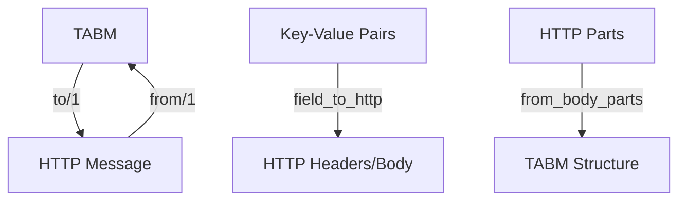
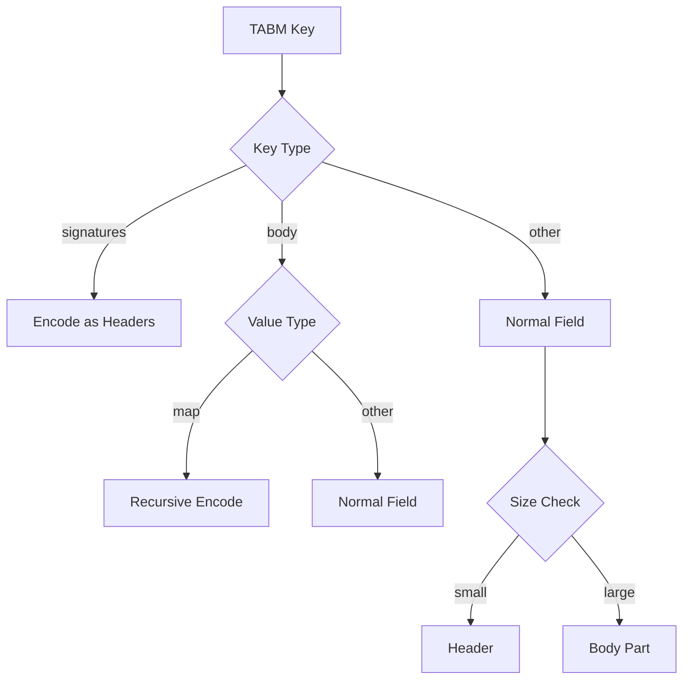
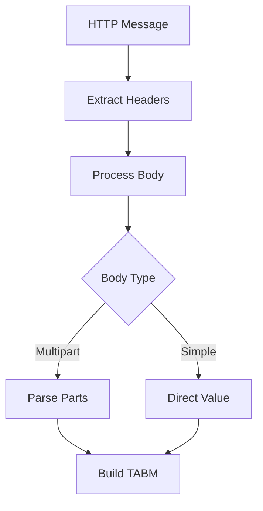

# Module: dev_codec_httpsig_conv

## Basic Information
- **Source File:** dev_codec_httpsig_conv.erl
- **Module Type:** Message Protocol Codec
- **Purpose:** Handles conversion between Tagged Attribute-Based Messages (TABMs) and HTTP multipart message structures, implementing RFC-7578 multipart message handling.

## Core Functionality

### 1. Message Conversion Flow


### 2. Configuration Constants
```erlang
% Maximum header length (4KB)
-define(MAX_HEADER_LENGTH, 4096).

% Line endings
-define(CRLF, <<"\r\n">>).
-define(DOUBLE_CRLF, <<?CRLF/binary, ?CRLF/binary>>).
```

## Implementation Details

### 1. TABM to HTTP Conversion

#### Key Encoding Rules


#### Multipart Body Generation
```erlang
encode_body_part(PartName, BodyPart, InlineKey) ->
    Disposition = case PartName of
        InlineKey -> <<"inline">>;
        _ -> <<"form-data;name=\"", PartName/binary, "\"">>
    end,
    
    case BodyPart of
        BPMap when is_map(BPMap) ->
            WithDisposition = maps:put(
                <<"content-disposition">>,
                Disposition,
                BPMap
            ),
            encode_http_msg(WithDisposition);
        BPBin when is_binary(BPBin) ->
            <<"content-disposition: ", Disposition/binary,
              ?DOUBLE_CRLF/binary, BPBin/binary>>
    end
```

### 2. HTTP to TABM Conversion

#### Body Processing


#### Commitment Handling
```erlang
commitments_from_signature(Map, HPs, RawSig, RawSigInput) ->
    SfSigsKV = parse_dictionary(RawSig),
    SfInputs = parse_dictionary(RawSigInput),
    
    Commitments = maps:from_list(
        lists:map(
            fun({SigName, Signature}) ->
                build_commitment(SigName, Signature, SfInputs, HPs)
            end,
            SfSigsKV
        )
    ),
    
    add_commitments_to_message(Map, Commitments)
```

## Key Features

### 1. Message Structure
- Multipart message support
- Header/body organization
- Part boundary handling
- Content disposition

### 2. Field Processing
- Size-based placement
- Case normalization
- ID grouping
- Value encoding

### 3. Body Management
- Inline body handling
- Part encoding
- Boundary generation
- Content type handling

### 4. Integration Points
- HTTP message system
- TABM protocol
- Structured fields
- Commitment system

## Testing Coverage

### 1. Map Grouping
```erlang
group_maps_test() ->
    Map = #{
        <<"a">> => <<"1">>,
        <<"b">> => #{
            <<"x">> => <<"10">>,
            <<"y">> => #{
                <<"z">> => <<"20">>
            }
        }
    },
    Lifted = group_maps(Map),
    ?assertEqual(expected_structure, Lifted)
```

### 2. Flat Compatibility
```erlang
group_maps_flat_compatible_test() ->
    Map = create_test_map(),
    Lifted = group_maps(Map),
    ?assertEqual(
        dev_codec_flat:from(Lifted),
        Map
    )
```

## Best Practices

### 1. Message Handling
- Validate inputs
- Handle boundaries
- Preserve structure
- Maintain encoding

### 2. Field Processing
- Check sizes
- Normalize names
- Handle duplicates
- Preserve case

### 3. Integration
- Follow RFC specs
- Handle errors
- Log operations
- Maintain compatibility

## Error Handling

### 1. Common Errors
```erlang
% Missing content disposition
{error, no_content_disposition_in_multipart, Headers}

% Invalid boundary
{error, invalid_boundary_format}

% Parsing failure
{error, multipart_parse_error, Details}
```

### 2. Error Prevention
- Validate headers
- Check boundaries
- Verify formats
- Handle edge cases

## Usage Examples

### 1. Basic Conversion
```erlang
% Convert TABM to HTTP
HTTPMsg = dev_codec_httpsig_conv:to(TABMessage)

% Convert HTTP to TABM
TABMsg = dev_codec_httpsig_conv:from(HTTPMessage)
```

### 2. Field Handling
```erlang
% Process field to HTTP
field_to_http(HTTPMsg, {Name, Value}, #{
    where => headers,
    max_size => ?MAX_HEADER_LENGTH
})

% Handle body part
encode_body_part(
    <<"field-name">>,
    BodyContent,
    <<"inline">>
)
```

### 3. Map Processing
```erlang
% Group nested maps
Grouped = group_maps(#{
    <<"a">> => #{
        <<"b">> => <<"value">>
    }
})

% Process multipart body
{ok, TABM} = from_body_parts(
    InitialTABM,
    InlineKey,
    BodyParts
)
```

## RFC Compliance

### 1. RFC-7578 (Multipart)
- Part boundaries
- Content disposition
- Header formatting
- Body encoding

### 2. Message Structure
- Header limits
- Line endings
- Part separation
- Field encoding

### 3. Content Types
- Multipart handling
- Boundary generation
- Type preservation
- Format validation
