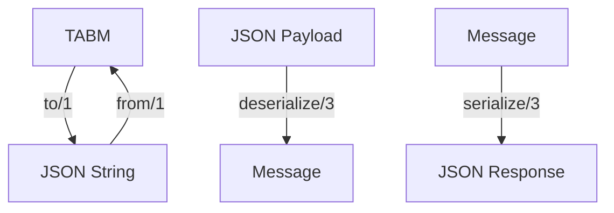

# Module: dev_codec_json

## Basic Information
- **Source File:** dev_codec_json.erl
- **Module Type:** Message Protocol Codec
- **Purpose:** Provides JSON encoding/decoding capabilities for HyperBEAM's Tagged Attribute-Based Messages (TABMs), with integrated support for message signing through the httpsig codec.

## Core Functionality

### 1. Message Conversion Flow


### 2. Content Type
```erlang
content_type(_) -> {ok, <<"application/json">>}
```

## Implementation Details

### 1. Message Encoding

#### TABM to JSON
```erlang
to(Msg) when is_binary(Msg) -> 
    iolist_to_binary(json:encode(Msg));
to(Msg) -> 
    iolist_to_binary(
        json:encode(hb_private:reset(Msg))
    )
```

#### JSON to TABM
```erlang
from(Map) when is_map(Map) -> Map;
from(Json) -> json:decode(Json)
```

### 2. Serialization Support

#### Deserialization
```erlang
deserialize(Base, Req, Opts) ->
    % Extract payload from target path
    Payload = hb_ao:get(
        Target = hb_ao:get(
            <<"target">>,
            Req,
            <<"body">>,
            Opts
        ),
        Base,
        Opts
    ),
    
    % Handle payload extraction
    case Payload of
        not_found -> 
            {error, #{
                <<"status">> => 404,
                <<"body">> => error_message(Target)
            }};
        _ ->
            {ok, from(Payload)}
    end
```

#### Serialization
```erlang
serialize(Base, _Msg, _Opts) ->
    {ok, #{
        <<"content-type">> => <<"application/json">>,
        <<"body">> => to(Base)
    }}
```

## Key Features

### 1. Message Handling
- JSON encoding/decoding
- Private field handling
- Binary passthrough
- Error handling

### 2. Integration Support
- HTTPSIG commitment delegation
- Content type specification
- Target path resolution
- Response formatting

### 3. Commitment Support
- Message signing
- Signature verification
- Commitment tracking
- HTTPSIG integration

### 4. Integration Points
- JSON system
- TABM protocol
- HTTPSIG codec
- Message system

## Function Reference

### 1. Core Functions

#### Message Conversion
```erlang
% Convert TABM to JSON string
to(Message) -> JsonString

% Convert JSON to TABM
from(JsonString) -> Message
```

#### Commitment Operations
```erlang
% Sign message (delegates to httpsig)
commit(Message, Request, Options) -> 
    dev_codec_httpsig:commit(Message, Request, Options)

% Verify signature (delegates to httpsig)
verify(Message, Request, Options) ->
    dev_codec_httpsig:verify(Message, Request, Options)
```

### 2. Serialization Functions

#### Payload Processing
```erlang
% Deserialize JSON from target path
deserialize(Base, Request, Options) ->
    {ok, Message} | {error, ErrorDetails}

% Serialize message to JSON response
serialize(Base, Message, Options) ->
    {ok, #{
        <<"content-type">> => <<"application/json">>,
        <<"body">> => JsonString
    }}
```

## Best Practices

### 1. Message Handling
- Reset private fields
- Handle binary data
- Validate inputs
- Format responses

### 2. Error Handling
- Check payloads
- Validate paths
- Format errors
- Provide context

### 3. Integration
- Follow protocols
- Handle errors
- Log operations
- Maintain compatibility

## Error Handling

### 1. Common Errors
```erlang
% Missing payload
{error, #{
    <<"status">> => 404,
    <<"body">> => <<"JSON payload not found...">>
}}

% Invalid JSON
{error, json_decode_error}

% Missing target
{error, target_not_found}
```

### 2. Error Prevention
- Validate inputs
- Check paths
- Handle edge cases
- Format errors

## Usage Examples

### 1. Basic Conversion
```erlang
% Convert TABM to JSON
JsonString = dev_codec_json:to(TABMessage)

% Convert JSON to TABM
Message = dev_codec_json:from(JsonString)
```

### 2. Message Signing
```erlang
% Sign message using HTTPSIG
{ok, SignedMsg} = dev_codec_json:commit(
    Message,
    Request,
    Options
)

% Verify signature
{ok, true} = dev_codec_json:verify(
    SignedMsg,
    Request,
    Options
)
```

### 3. Serialization
```erlang
% Deserialize JSON payload
{ok, Message} = dev_codec_json:deserialize(
    BaseMessage,
    #{<<"target">> => <<"body">>},
    Options
)

% Serialize to JSON response
{ok, Response} = dev_codec_json:serialize(
    Message,
    Request,
    Options
)
```

## Integration Notes

### 1. HTTPSIG Integration
- Delegates commitment operations
- Maintains signature compatibility
- Preserves verification flow
- Handles commitment tracking

### 2. Message System
- Handles TABM conversion
- Preserves message structure
- Manages private fields
- Supports binary data

### 3. Response Format
- Content type specification
- Body encapsulation
- Error formatting
- Status handling
