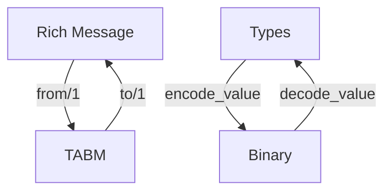
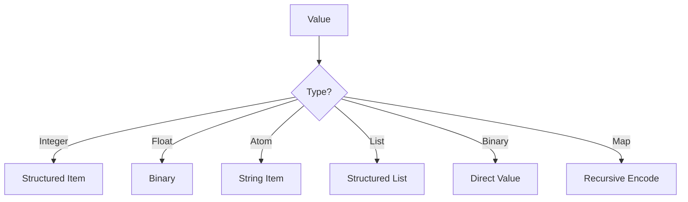

# Module: dev_codec_structured

## Basic Information
- **Source File:** dev_codec_structured.erl
- **Module Type:** Message Protocol Codec
- **Purpose:** Implements HTTP Structured Fields (RFC-9651) encoding/decoding for HyperBEAM's internal richly typed message format, with support for TABM (Type-Annotated-Binary-Message) conversion.

## Core Functionality

### 1. Message Conversion Flow


### 2. Type Handling


## Implementation Details

### 1. Message Encoding

#### TABM Generation
```erlang
from(Msg) when is_map(Msg) ->
    % Normalize keys and split into types and values
    {Types, Values} = process_message_parts(Msg),
    
    % Add ao-types field if types exist
    case Types of
        [] -> Values;
        T -> [{<<"ao-types">>, encode_types(T)} | Values]
    end
```

#### Value Encoding
```erlang
encode_value(Value) when is_integer(Value) ->
    {<<"integer">>, encode_structured_item(Value)};
encode_value(Value) when is_atom(Value) ->
    {<<"atom">>, encode_atom_to_string(Value)};
encode_value(Values) when is_list(Values) ->
    {<<"list">>, encode_list_items(Values)};
encode_value(Value) when is_binary(Value) ->
    {<<"binary">>, Value}
```

### 2. Message Decoding

#### Type Processing
```erlang
decode_value(Type, Value) ->
    case Type of
        integer -> parse_structured_integer(Value);
        atom -> parse_structured_atom(Value);
        list -> parse_structured_list(Value);
        map -> parse_structured_dictionary(Value)
    end
```

#### Empty Value Handling
```erlang
handle_empty_values(Types, TABM) ->
    maps:fold(
        fun
            (Key, <<"empty-binary">>, Acc) -> 
                Acc#{Key => <<>>};
            (Key, <<"empty-list">>, Acc) -> 
                Acc#{Key => []};
            (Key, <<"empty-message">>, Acc) -> 
                Acc#{Key => #{}}
        end,
        #{},
        Types
    )
```

## Key Features

### 1. Type System
- Integer encoding
- Atom conversion
- List handling
- Binary passthrough
- Map recursion
- Empty value support

### 2. Structured Fields
- RFC-9651 compliance
- Dictionary encoding
- List serialization
- Item formatting
- Type preservation

### 3. Message Processing
- Key normalization
- Type annotation
- Value encoding
- Recursive handling
- Function serialization

### 4. Integration Points
- HTTPSIG codec
- TABM format
- Message system
- Type system

## Function Reference

### 1. Core Functions

#### Message Conversion
```erlang
% Convert rich message to TABM
from(Message) -> TABM

% Convert TABM to rich message
to(TABM) -> Message
```

#### Value Processing
```erlang
% Encode value with type information
encode_value(Value) -> {Type, EncodedValue}

% Decode value based on type
decode_value(Type, Value) -> DecodedValue
```

### 2. Helper Functions

#### Type Management
```erlang
% Parse ao-types field
parse_ao_types(Binary) -> TypeMap

% Find implicit keys in message
implicit_keys(Message) -> [Keys]
```

## Best Practices

### 1. Type Handling
- Validate types
- Handle edge cases
- Preserve structure
- Maintain encoding

### 2. Message Processing
- Normalize keys
- Track types
- Handle empties
- Preserve order

### 3. Integration
- Follow RFC specs
- Handle errors
- Log operations
- Maintain compatibility

## Error Handling

### 1. Common Errors
```erlang
% Unexpected type
{unexpected_type, Type, Value}

% Invalid format
{invalid_format, Details}

% Parse error
{parse_error, Reason}
```

### 2. Error Prevention
- Validate types
- Check formats
- Handle edge cases
- Log issues

## Usage Examples

### 1. Basic Conversion
```erlang
% Convert rich message to TABM
TABM = dev_codec_structured:from(#{
    <<"key">> => <<"value">>,
    <<"number">> => 42,
    <<"list">> => [1, 2, 3]
})

% Convert TABM back to rich message
Message = dev_codec_structured:to(TABM)
```

### 2. Value Processing
```erlang
% Encode value with type
{Type, Encoded} = encode_value([1, 2, 3])

% Decode value using type
Decoded = decode_value(Type, Encoded)
```

### 3. Type Management
```erlang
% Handle empty values
EmptyMap = #{<<"key">> => <<>>}
TABM = from(EmptyMap)
Types = parse_ao_types(TABM)
```

## Testing Coverage

### 1. List Encoding
```erlang
list_encoding_test() ->
    % Test integer list
    {<<"list">>, Encoded1} = encode_value([1, 2, 3]),
    [1, 2, 3] = decode_value(list, Encoded1),
    
    % Test binary list
    {<<"list">>, Encoded2} = encode_value([<<"1">>, <<"2">>]),
    [<<"1">>, <<"2">>] = decode_value(list, Encoded2),
    
    % Test mixed list
    {<<"list">>, Encoded3} = encode_value([1, <<"2">>, 3]),
    [1, <<"2">>, 3] = decode_value(list, Encoded3)
```

## RFC-9651 Compliance

### 1. Structured Fields
- Dictionary format
- List encoding
- Item structure
- Parameter handling

### 2. Type System
- Integer encoding
- String formatting
- List structure
- Binary handling

### 3. Message Format
- Field structure
- Value encoding
- Type preservation
- Format validation
