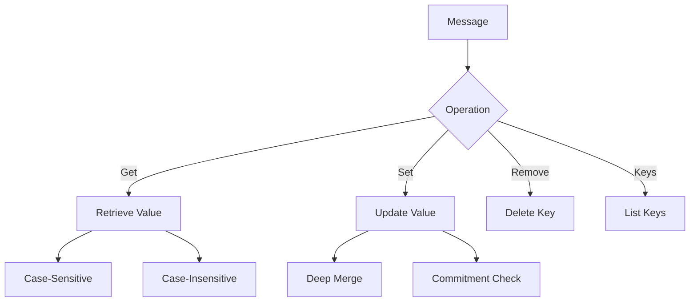
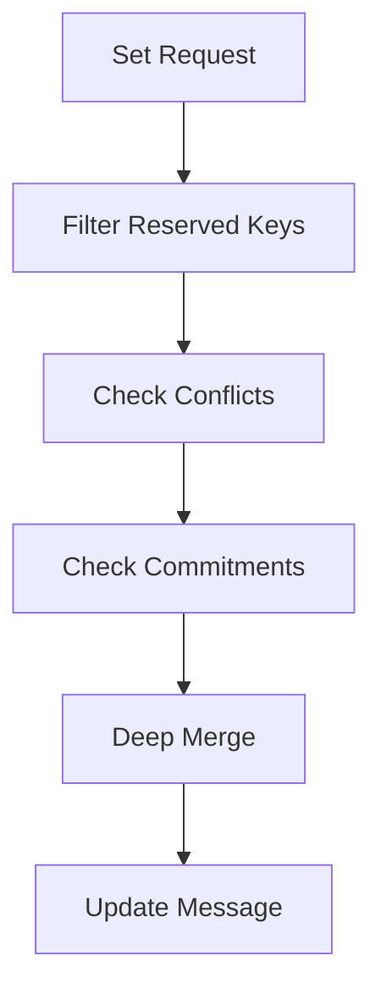
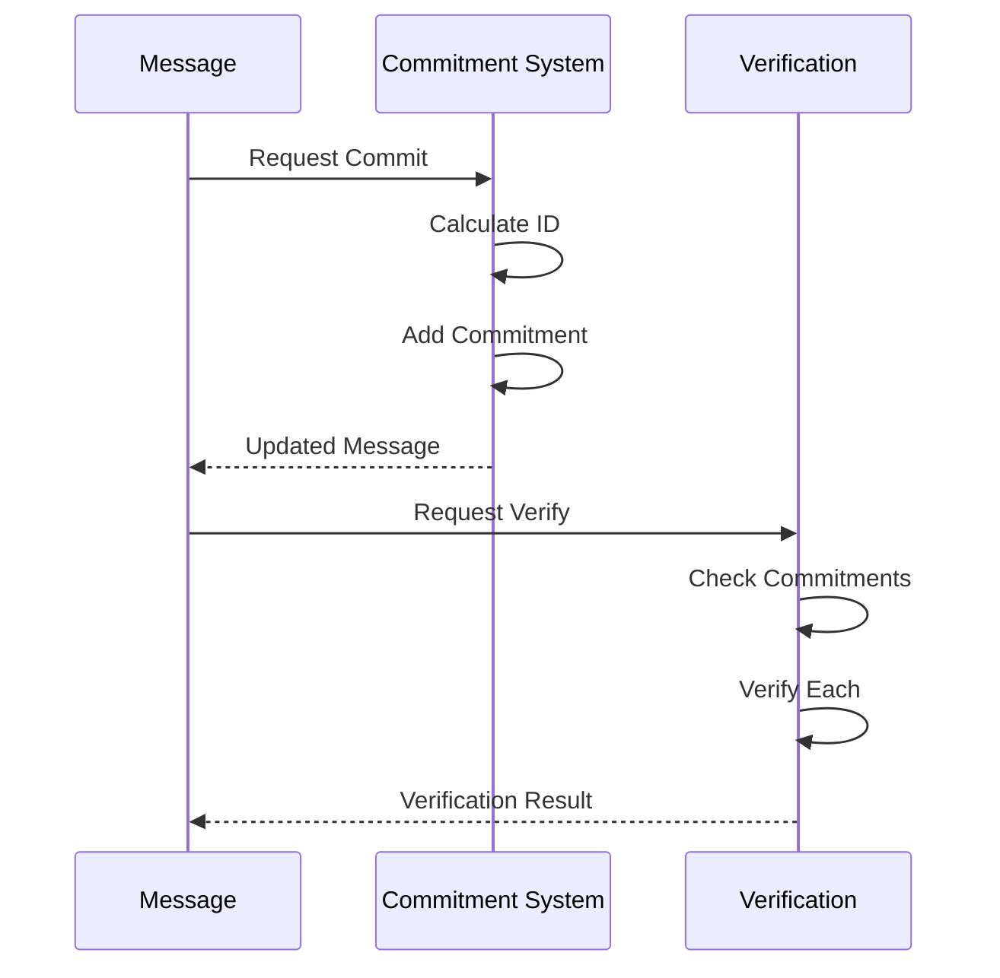

# Module: dev_message

## Basic Information
- **Source File:** dev_message.erl
- **Module Type:** Message Protocol Handler
- **Purpose:** Identity device that handles basic message operations and commitment management, serving as the foundation for message manipulation in the system.

## Core Functionality

### 1. Message Operations


### 2. Reserved Keys
```erlang
-define(DEVICE_KEYS, [
    <<"id">>,
    <<"commitments">>,
    <<"committers">>,
    <<"keys">>,
    <<"path">>,
    <<"set">>,
    <<"remove">>,
    <<"verify">>
]).
```

## Implementation Details

### 1. Message Access

#### Key Retrieval
```erlang
get(Key, Msg) ->
    case hb_private:is_private(Key) of
        true -> {error, not_found}
        false ->
            case maps:get(Key, Msg, not_found) of
                not_found -> case_insensitive_get(Key, Msg)
                Value -> {ok, Value}
            end
    end
```

#### Case-Insensitive Lookup
```erlang
case_insensitive_get(Key, Msg) ->
    NormKey = hb_ao:normalize_key(Key)
    NormMsg = hb_ao:normalize_keys(Msg)
    case maps:get(NormKey, NormMsg, not_found) of
        not_found -> {error, not_found}
        Value -> {ok, Value}
    end
```

### 2. Message Modification

#### Setting Values


#### Value Removal
```erlang
remove(Message1, #{ <<"items">> := Keys }) ->
    {ok, maps:without(Keys, Message1)}
```

### 3. Commitment Management

#### Commitment Flow


#### Commitment Verification
```erlang
verify(Self, Req, Opts) ->
    {ok, Base} = hb_message:find_target(Self, Req, Opts)
    Commitments = maps:get(<<"commitments">>, Base, #{})
    IDsToVerify = commitment_ids_from_request(Base, Req, Opts)
    
    % Verify each commitment
    Result = lists:all(
        fun(CommitmentID) ->
            verify_commitment(Base, CommitmentID, Commitments)
        end,
        IDsToVerify
    )
```

## Key Features

### 1. Message Handling
- Case-insensitive key access
- Private key protection
- Deep merging support
- Key removal capabilities

### 2. Commitment System
- Multiple commitment support
- Commitment verification
- Committer management
- ID calculation

### 3. Security Features
- Private key filtering
- Commitment validation
- Authorization checks
- Data protection

### 4. Integration Points
- Message system
- Commitment devices
- Verification system
- Storage system

## Testing Coverage

### 1. Key Operations
```erlang
case_insensitive_get_test() ->
    % Tests case-insensitive key access
    ?assertEqual({ok, 1}, case_insensitive_get(<<"a">>, #{ <<"A">> => 1 }))
```

### 2. Privacy Controls
```erlang
private_keys_are_filtered_test() ->
    % Tests private key filtering
    ?assertEqual(
        {ok, [<<"a">>]},
        hb_ao:resolve(#{ <<"a">> => 1, <<"private">> => 2 }, keys, #{})
    )
```

### 3. Commitment Handling
```erlang
verify_test() ->
    % Tests commitment verification
    Unsigned = #{ <<"a">> => <<"b">> }
    Signed = hb_message:commit(Unsigned, hb:wallet())
    ?assertEqual({ok, true}, verify(Signed))
```

## Best Practices

### 1. Message Operations
- Validate inputs
- Handle case sensitivity
- Protect private data
- Maintain consistency

### 2. Commitment Management
- Verify all commitments
- Track commitment history
- Handle multiple signers
- Maintain integrity

### 3. Integration
- Follow protocols
- Handle errors
- Log operations
- Maintain security

## Error Handling

### 1. Common Errors
```erlang
% Key not found
{error, not_found}

% Invalid commitment
{error, {multiple_id_devices, Devices}}

% Missing commitments
{error, {requested_committers_not_found, Missing}}
```

### 2. Error Prevention
- Input validation
- Type checking
- Boundary validation
- State verification

## Usage Examples

### 1. Basic Operations
```erlang
% Get value
{ok, Value} = get(Key, Message)

% Set value
{ok, NewMessage} = set(Message, #{<<"key">> => <<"value">>}, Opts)

% Remove key
{ok, UpdatedMessage} = remove(Message, #{<<"items">> => [Key]})
```

### 2. Commitment Operations
```erlang
% Create commitment
{ok, SignedMsg} = commit(Message, Request, Options)

% Verify commitment
{ok, true} = verify(SignedMsg, Request, Options)

% Get committers
{ok, Committers} = committers(Message)
```

### 3. Key Management
```erlang
% List public keys
{ok, Keys} = keys(Message)

% Case-insensitive access
{ok, Value} = case_insensitive_get(<<"Key">>, #{<<"key">> => Value})
