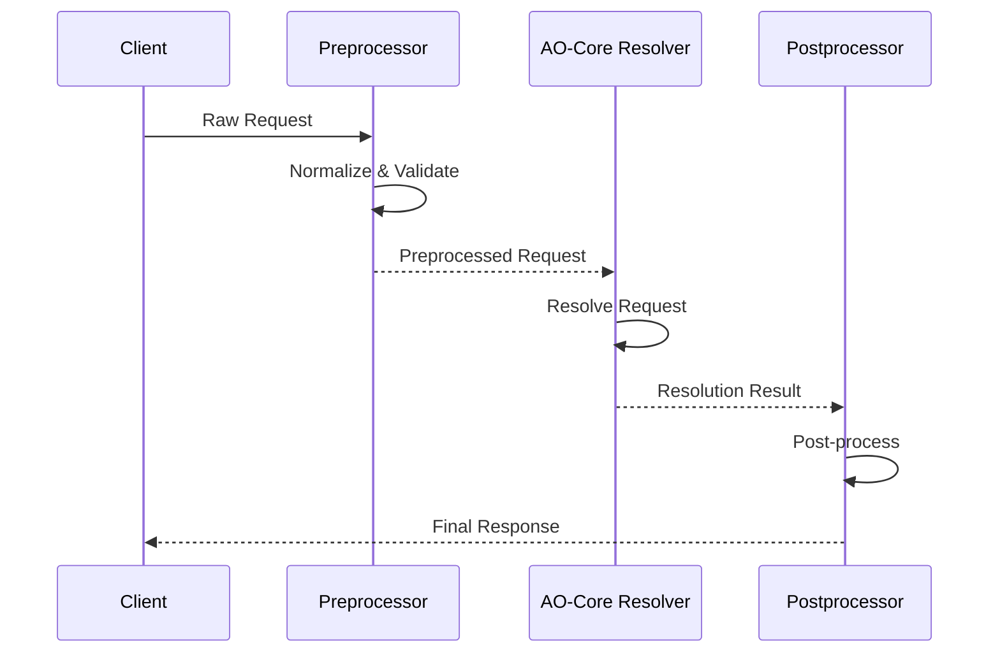
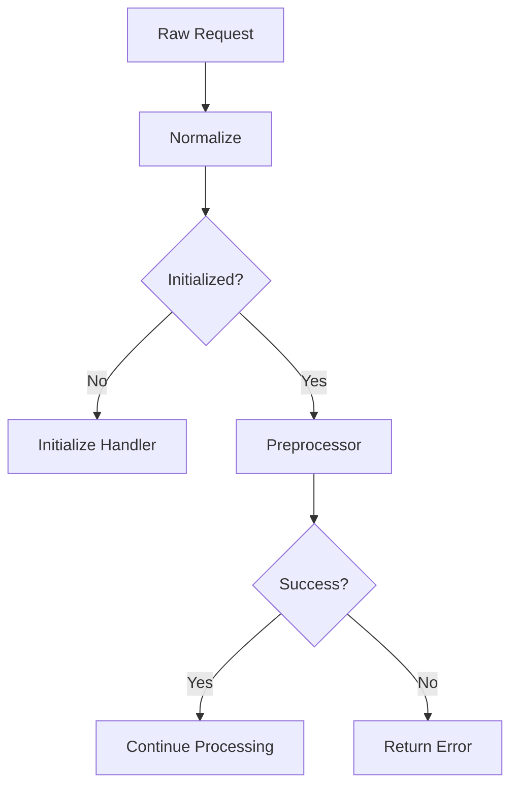
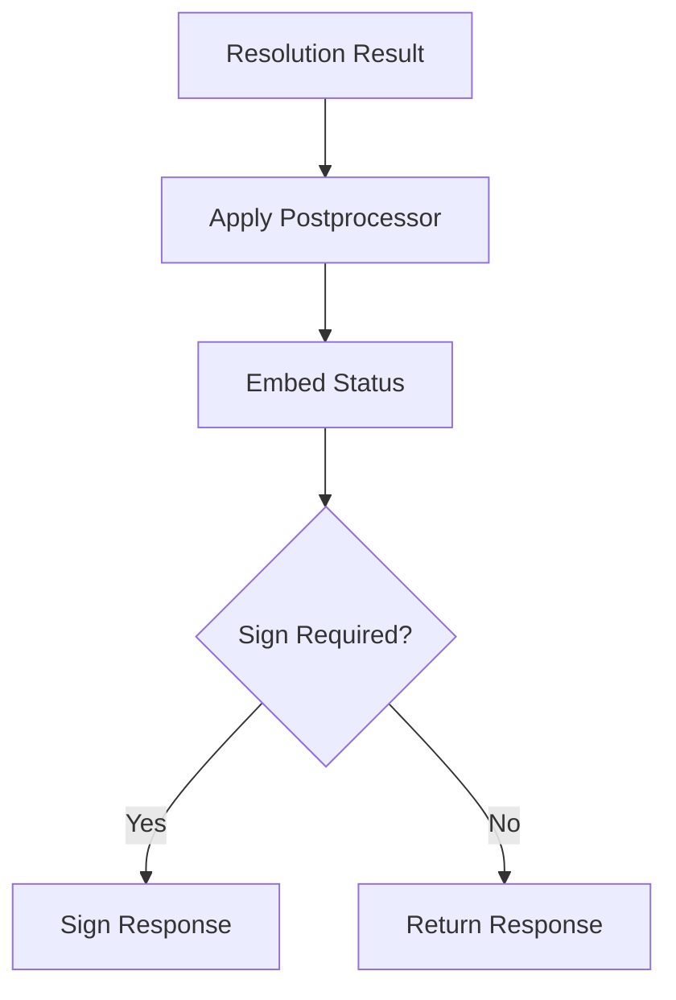

# Module: dev_meta

## Basic Information
- **Source File:** dev_meta.erl
- **Module Type:** Message Protocol Handler
- **Purpose:** Default entry point for all messages processed by the machine, providing message preprocessing, routing, and postprocessing capabilities.

## Core Functionality

### 1. Message Processing Pipeline


### 2. Request Handling Flow
```erlang
handle(NodeMsg, RawRequest) ->
    % 1. Normalize request
    NormRequest = hb_singleton:from(RawRequest)

    % 2. Check initialization
    case initialized? of
        false -> handle_initialize()
        true -> handle_resolve()
    end

    % 3. Process request
    handle_resolve(RawRequest, NormRequest, NodeMsg) ->
        % Apply preprocessor
        case preprocess(Request) of
            {ok, PreProcessed} -> 
                % Resolve request
                Result = resolve(PreProcessed)
                % Apply postprocessor
                postprocess(Result)
            Error -> Error
        end
```

## Implementation Details

### 1. Node Message Management

#### Configuration Access
```erlang
info(_, Request, NodeMsg) ->
    case Method of
        <<"GET">> -> 
            % Return filtered node message
            {ok, filter_node_msg(add_dynamic_keys(NodeMsg))}
        <<"POST">> -> 
            % Update node message if authorized
            update_node_message(Request, NodeMsg)
    end
```

#### Authorization Control
```erlang
is_operator(Request, NodeMsg) ->
    RequestSigners = hb_message:signers(Request)
    Operator = get_operator(NodeMsg)
    EncOperator = encode_operator(Operator)
    EncOperator == unclaimed orelse 
    lists:member(EncOperator, RequestSigners)
```

### 2. Message Processing

#### Preprocessing


#### Postprocessing


### 3. Status Handling

#### Status Code Resolution
```erlang
status_code({ErlStatus, Msg}) ->
    case message_to_status(Msg) of
        default -> status_code(ErlStatus)
        RawStatus -> RawStatus
    end

status_code(ok) -> 200
status_code(error) -> 400
status_code(created) -> 201
status_code(not_found) -> 404
status_code(unavailable) -> 503
```

## Key Features

### 1. Node Configuration
- Dynamic configuration management
- Secure configuration updates
- Configuration persistence
- Access control

### 2. Message Processing
- Request normalization
- Multi-stage processing
- Flexible routing
- Error handling

### 3. Security Features
- Authorization checks
- Message signing
- Private data filtering
- Access control

### 4. Integration Points
- AO-Core resolver
- HTTP server
- Message system
- Node management

## Testing Coverage

### 1. Configuration Management
```erlang
config_test() ->
    % Tests basic configuration access
    Node = start_node(#{ test_config_item => <<"test">> })
    {ok, Res} = get_info(Node)
    assert_config_value(Res)
```

### 2. Security Controls
```erlang
unauthorized_set_node_msg_fails_test() ->
    % Tests unauthorized access prevention
    Node = start_node(#{ priv_wallet => new_wallet() })
    {error, _} = attempt_unauthorized_update(Node)
    verify_unchanged_state(Node)
```

### 3. Node Initialization
```erlang
uninitialized_node_test() ->
    % Tests initialization requirements
    Node = start_node(#{ initialized => false })
    {error, Res} = attempt_computation(Node)
    assert_initialization_error(Res)
```

## Best Practices

### 1. Request Processing
- Validate all inputs
- Apply security checks
- Handle errors gracefully
- Maintain state consistency

### 2. Configuration Management
- Verify authorization
- Filter sensitive data
- Track configuration history
- Ensure atomic updates

### 3. Integration
- Follow protocol standards
- Handle edge cases
- Log important events
- Maintain compatibility

## Error Handling

### 1. Common Errors
- Unauthorized access
- Invalid configuration
- Processing failures
- State inconsistencies

### 2. Error Responses
```erlang
% Authorization failure
{error, <<"Unauthorized">>}

% Initialization required
{error, <<"Node must be initialized before use.">>}

% Configuration locked
{error, <<"Node message is already permanent.">>}
```

## Usage Examples

### 1. Basic Configuration
```erlang
% Get node configuration
GET /~meta@1.0/info

% Update configuration (authorized)
POST /~meta@1.0/info
{
    "config_key": "new_value",
    "signatures": ["authorized_signer"]
}
```

### 2. Message Processing
```erlang
% Process message with preprocessing
handle(NodeMsg, RawRequest) ->
    PreProcessed = preprocess(RawRequest)
    Result = resolve(PreProcessed)
    postprocess(Result)
```

### 3. Security Controls
```erlang
% Verify authorization
is_operator(Request, NodeMsg) ->
    verify_signatures(Request) andalso
    check_permissions(Request, NodeMsg)
