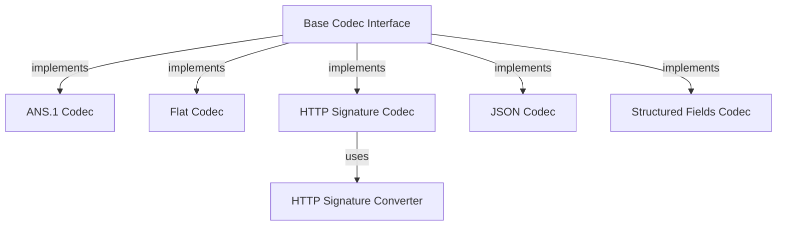

# Message Protocol Handling: In-Depth Analysis & Observations

## Architectural Foundations & Design Philosophy

### 1. Multi-Codec Architecture

The system employs a sophisticated multi-codec architecture that demonstrates several key design principles:

1. **Interface Standardization**
   - Each codec implements a common interface (to/from)
   - Enables consistent message handling across formats
   - Facilitates easy addition of new codecs
   - Maintains system extensibility

2. **Format Specialization**
   - Each codec optimizes for specific use cases
   - Preserves format-specific features
   - Handles unique encoding requirements
   - Maintains format integrity

3. **Integration Strategy**
   - Codecs work together seamlessly
   - Share common type system
   - Handle format conversion
   - Maintain message consistency

### 2. Message Processing Pipeline

The message processing pipeline demonstrates sophisticated handling:

1. **Initial Processing**
   - Parses raw message content
   - Validates basic structure
   - Prepares for transformation
   - Handles encoding selection

2. **Transformation Flow**
   - Converts between formats
   - Preserves message integrity
   - Maintains type information
   - Optimizes representation

3. **Security Integration**
   - Handles message signing
   - Verifies signatures
   - Tracks commitments
   - Ensures message integrity

## Core System Components & Their Interactions

### 1. Type System Architecture
The type system demonstrates remarkable sophistication in handling various data types:

#### Type Management Strategy
1. **Basic Types**
   - Integer handling with range validation
   - Binary data with optimized storage
   - String processing with encoding awareness
   - Boolean values with state preservation

2. **Complex Types**
   - Nested structure support
   - List handling with type preservation
   - Map processing with key normalization
   - Custom type definition capabilities

3. **Special Cases**
   - Null value representation
   - Empty container handling
   - Default value management
   - Type conversion rules

### 2. Protocol Implementation
The protocol layer shows careful attention to detail:

#### Protocol Features
1. **Message Structure**
   - Header organization
   - Body handling
   - Attachment support
   - Metadata management

2. **Format Handling**
   - Content type detection
   - Encoding selection
   - Format validation
   - Conversion rules

3. **Security Measures**
   - Signature generation
   - Verification process
   - Key management
   - Security policy enforcement

## Implementation Patterns & Best Practices

### 1. Code Organization
The codebase demonstrates several sophisticated patterns:

#### Module Structure
1. **Core Components**
   - Clear separation of concerns
   - Modular design principles
   - Interface-based communication
   - Dependency management

2. **Support Systems**
   - Utility functions
   - Helper modules
   - Shared resources
   - Common interfaces

3. **Testing Framework**
   - Unit test coverage
   - Integration testing
   - Performance benchmarks
   - Security validation

### 2. Error Handling
Error management shows comprehensive coverage:

#### Error Strategies
1. **Detection Methods**
   - Early validation
   - Type checking
   - Format verification
   - Protocol compliance

2. **Recovery Procedures**
   - Graceful degradation
   - Fallback options
   - State recovery
   - Error reporting

3. **Prevention Measures**
   - Input validation
   - Type safety
   - Format checking
   - Security verification

## Performance Considerations & Optimizations

### 1. Processing Efficiency
The system implements various optimization techniques:

#### Optimization Strategies
1. **Memory Management**
   - Buffer pooling
   - Resource reuse
   - Cache utilization
   - Memory mapping

2. **CPU Utilization**
   - Batch processing
   - Parallel execution
   - Load distribution
   - Process optimization

3. **I/O Handling**
   - Asynchronous operations
   - Buffered I/O
   - Stream processing
   - Connection pooling

### 2. Format Optimization
Format handling shows careful optimization:

#### Optimization Techniques
1. **Data Representation**
   - Compact encoding
   - Efficient serialization
   - Binary optimization
   - Structure compression

2. **Processing Flow**
   - Streamlined conversion
   - Minimal copying
   - Direct processing
   - Efficient routing

## Security Implementation & Verification

### 1. Signature System
The signature system demonstrates robust security:

#### Security Features
1. **Signature Generation**
   - Key management
   - Algorithm selection
   - Parameter handling
   - Format compliance

2. **Verification Process**
   - Signature validation
   - Key verification
   - Parameter checking
   - Format validation

### 2. Message Protection
Message security shows comprehensive coverage:

#### Protection Measures
1. **Content Security**
   - Data encryption
   - Integrity checking
   - Access control
   - Audit logging

2. **Transport Security**
   - Channel encryption
   - Protocol security
   - Connection validation
   - Session management

## Future Development & Enhancement Opportunities

### 1. System Evolution
Several areas show potential for enhancement:

#### Development Areas
1. **Format Support**
   - New codec addition
   - Format extension
   - Protocol updates
   - Conversion improvements

2. **Performance Enhancement**
   - Processing optimization
   - Memory efficiency
   - CPU utilization
   - I/O improvement

### 2. Feature Extension
Potential feature additions include:

#### New Capabilities
1. **Protocol Extensions**
   - Enhanced security
   - Better performance
   - More formats
   - Better integration

2. **Tool Development**
   - Debug support
   - Analysis tools
   - Monitoring systems
   - Development aids

## Documentation & Maintenance

### 1. Documentation Strategy
Documentation shows systematic organization:

#### Documentation Areas
1. **Technical Documentation**
   - API references
   - Implementation details
   - Protocol specifications
   - Security guidelines

2. **User Documentation**
   - Usage guides
   - Best practices
   - Example code
   - Troubleshooting

### 2. Maintenance Procedures
Maintenance processes demonstrate good practices:

#### Maintenance Areas
1. **Code Maintenance**
   - Regular updates
   - Bug fixing
   - Performance tuning
   - Security patches

2. **System Evolution**
   - Feature addition
   - Protocol updates
   - Security enhancement
   - Performance optimization
