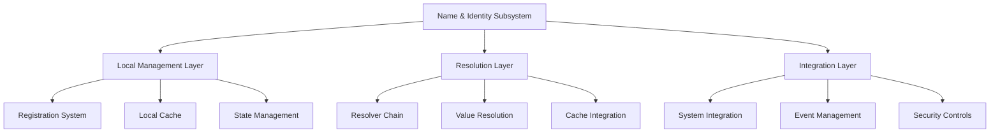
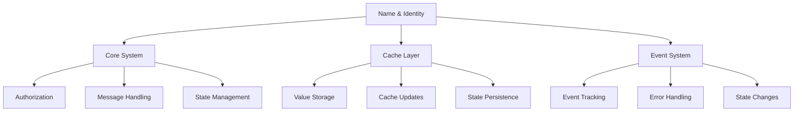

# Name & Identity Subsystem Overview

## Architectural Foundation

The Name & Identity subsystem represents a sophisticated and meticulously engineered solution for managing distributed name resolution and identity management within the HyperBEAM ecosystem. This subsystem implements a hybrid approach that combines local name management with a flexible, chain-based resolution system, enabling both efficient local operations and extensible global name resolution capabilities.

### 1. Foundational Architecture


The architecture is meticulously structured into three primary layers:

1. **Local Management Layer**
   - Implements secure name registration with operator-only access
   - Maintains efficient local cache for rapid lookups
   - Provides atomic state management operations
   - Ensures data consistency and persistence
   - Facilitates efficient resource utilization

2. **Resolution Layer**
   - Orchestrates sophisticated resolver chain processing
   - Implements intelligent value loading strategies
   - Manages cache integration for performance
   - Handles resolution failures gracefully
   - Provides extensible resolver interfaces

3. **Integration Layer**
   - Facilitates seamless system integration
   - Manages event propagation and handling
   - Implements comprehensive security controls
   - Provides monitoring and debugging capabilities
   - Ensures reliable error management

## Core Components

### 1. Local Name Management (dev_local_name)

The Local Name Management component serves as the foundational element for handling name registration and lookup operations within a local context. It implements:

```erlang
% Core registration system
register(_, Req, Opts) ->
    case dev_meta:is_operator(Req, Opts) of
        false ->
            {error, #{<<"status">> => 403}};
        true ->
            handle_registration(Req, Opts)
    end.
```

Key aspects include:
- **Authorization Control**: Rigorous operator verification
- **State Management**: Atomic operations with rollback
- **Cache Integration**: Efficient local caching
- **Event Tracking**: Comprehensive event logging
- **Error Handling**: Sophisticated error recovery

### 2. Name Resolution (dev_name)

The Name Resolution component implements a flexible and extensible system for resolving names through a chain of resolvers:

```erlang
% Resolution chain processing
resolve(Key, _, Req, Opts) ->
    Resolvers = hb_opts:get(name_resolvers, [], Opts),
    case match_resolver(Key, Resolvers, Opts) of
        {ok, Resolved} -> handle_resolution(Resolved, Req, Opts);
        not_found -> handle_not_found(Key, Opts)
    end.
```

Critical features include:
- **Chain Processing**: Sequential resolver execution
- **Value Loading**: Sophisticated loading strategies
- **Cache Management**: Intelligent cache utilization
- **Error Recovery**: Robust error handling
- **Performance Optimization**: Efficient processing

## Integration Mechanisms

### 1. System Integration


The integration layer provides:
- **Core System Integration**: Seamless core system interaction
- **Cache Layer Integration**: Efficient cache management
- **Event System Integration**: Comprehensive event handling
- **Security Integration**: Robust security controls
- **State Management**: Reliable state tracking

### 2. Event Management

The event management system implements:
- **Event Generation**: Comprehensive event creation
- **Event Routing**: Efficient event distribution
- **Event Processing**: Sophisticated event handling
- **State Tracking**: Accurate state monitoring
- **Performance Metrics**: Detailed performance tracking

### 3. Security Controls

Security measures include:
- **Access Control**: Strict access management
- **Data Protection**: Comprehensive data security
- **State Isolation**: Secure state management
- **Error Handling**: Secure error processing
- **Resource Protection**: Resource access control

## Operational Characteristics

### 1. Performance Optimization

The subsystem implements sophisticated performance optimizations:

- **Cache Management**
  - Intelligent cache strategies
  - Efficient cache invalidation
  - Optimized cache updates
  - Cache consistency management
  - Performance monitoring

- **Resource Utilization**
  - Efficient memory usage
  - Optimized processing
  - Resource pooling
  - Load balancing
  - State management

### 2. Error Management

Comprehensive error handling includes:

- **Error Detection**
  - Sophisticated error detection
  - Error categorization
  - Impact assessment
  - Recovery planning
  - Error tracking

- **Error Recovery**
  - Automated recovery procedures
  - State restoration
  - Resource cleanup
  - Event notification
  - System protection

### 3. State Management

State management implements:

- **State Tracking**
  - Accurate state monitoring
  - State validation
  - Consistency checking
  - Version management
  - History tracking

- **State Operations**
  - Atomic updates
  - Transaction management
  - Rollback capabilities
  - State persistence
  - Cache synchronization

## Future Directions

### 1. Enhanced Capabilities

Planned enhancements include:

- **Resolution Features**
  - Advanced resolution strategies
  - Pattern matching capabilities
  - Wildcard support
  - Performance optimizations
  - Extended protocols

- **Integration Features**
  - External system integration
  - Cloud service support
  - Analytics capabilities
  - Monitoring enhancements
  - Debug improvements

### 2. Architectural Evolution

Future architectural improvements:

- **System Architecture**
  - Enhanced modularity
  - Improved scalability
  - Better performance
  - Extended capabilities
  - Simplified maintenance

- **Component Architecture**
  - Refined interfaces
  - Better integration
  - Enhanced security
  - Improved reliability
  - Extended functionality

## Implementation Guidelines

### 1. Development Practices

Recommended practices include:

- **Code Organization**
  - Clear module boundaries
  - Consistent interfaces
  - Comprehensive documentation
  - Extensive testing
  - Performance optimization

- **Error Handling**
  - Detailed error messages
  - Recovery procedures
  - Debug support
  - User guidance
  - System protection

### 2. Integration Guidelines

Integration considerations:

- **System Integration**
  - Clear interfaces
  - Minimal coupling
  - Efficient communication
  - Error handling
  - Performance optimization

- **Component Integration**
  - Standard protocols
  - Clear boundaries
  - Error management
  - State handling
  - Resource management

## Operational Considerations

### 1. Deployment

Deployment considerations include:

- **System Requirements**
  - Resource allocation
  - Performance needs
  - Security requirements
  - Integration needs
  - Monitoring capabilities

- **Configuration Management**
  - System configuration
  - Performance tuning
  - Security settings
  - Integration setup
  - Monitoring configuration

### 2. Maintenance

Maintenance guidelines:

- **System Maintenance**
  - Regular updates
  - Performance monitoring
  - Security audits
  - Error tracking
  - Resource management

- **Component Maintenance**
  - Module updates
  - Interface maintenance
  - Security updates
  - Performance optimization
  - Documentation updates
