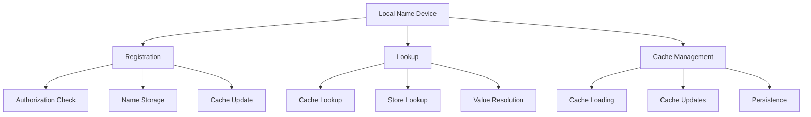
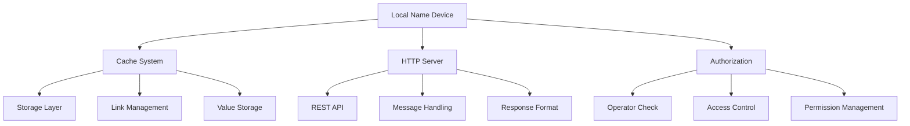

# Module: dev_local_name

## Basic Information
- **Source File:** dev_local_name.erl
- **Module Type:** Name Registration Device
- **Purpose:** Manages local name registration and lookup functionality, providing a persistent naming system with caching capabilities.

## Core Functionality

### 1. Name Management Architecture


### 2. Registration System
```erlang
% Registration handler with authorization
register(_, Req, Opts) ->
    case dev_meta:is_operator(Req, Opts) of
        false ->
            {error,
                #{
                    <<"status">> => 403,
                    <<"message">> => <<"Unauthorized.">>
                }
            };
        true ->
            direct_register(Req, Opts)
    end.

% Direct registration implementation
direct_register(Req, Opts) ->
    case hb_cache:write(Value = hb_ao:get(<<"value">>, Req, Opts), Opts) of
        {ok, MsgPath} ->
            % Link name to value
            hb_cache:link(
                MsgPath,
                LinkPath = [?DEV_CACHE, Name = hb_ao:get(<<"key">>, Req, Opts)],
                Opts
            ),
            % Update cache
            load_names(Opts),
            {ok, <<"Registered.">>};
        {error, _} ->
            not_found
    end.
```

### 3. Lookup System
```erlang
% Name lookup implementation
lookup(_, Req, Opts) ->
    Key = hb_ao:get(<<"key">>, Req, no_key_specified, Opts),
    ?event(local_name, {lookup, Key}),
    hb_ao:resolve(
        find_names(Opts),
        Key,
        Opts
    ).

% Default lookup handler
default_lookup(Key, _, Req, Opts) ->
    lookup(Key, Req#{ <<"key">> => Key }, Opts).
```

## Key Features

### 1. Cache Management
```erlang
% Cache loading system
load_names(Opts) ->
    LocalNames =
        maps:from_list(lists:map(
            fun(Key) ->
                ?event(local_name, {loading, Key}),
                case hb_cache:read([?DEV_CACHE, Key], Opts) of
                    {ok, Value} ->
                        {Key, Value};
                    {error, _} ->
                        {Key, not_found}
                end
            end,
            hb_cache:list(?DEV_CACHE, Opts)
        )),
    update_names(LocalNames, Opts).
```

### 2. Authorization Control
- Operator verification
- Access control
- Permission management
- Secure registration
- Protected updates

### 3. Persistence Layer
- Cache storage
- Link management
- Value persistence
- Name resolution
- State preservation

## Usage Examples

### 1. Name Registration
```erlang
% Register a new name
register_example() ->
    Opts = #{
        store => [...],
        priv_wallet => Wallet
    },
    register(
        #{},
        hb_message:commit(
            #{
                <<"key">> => <<"example-name">>,
                <<"value">> => <<"example-value">>
            },
            Opts
        ),
        Opts
    ).
```

### 2. Name Lookup
```erlang
% Look up a name
lookup_example() ->
    lookup(
        #{},
        #{
            <<"key">> => <<"example-name">>
        },
        #{ local_names => LocalNames }
    ).
```

### 3. HTTP Integration
```erlang
% HTTP-based operations
http_example() ->
    % Start node
    Node = hb_http_server:start_node(Opts),
    
    % Register name
    hb_http:post(
        Node,
        <<"/~local-name@1.0/register">>,
        RegisterMessage,
        Opts
    ),
    
    % Look up name
    hb_http:get(
        Node,
        <<"/~local-name@1.0/lookup?key=name1">>,
        Opts
    ).
```

## Integration Points

### 1. System Integration


### 2. Dependencies
- hb_cache: Cache operations
- hb_ao: Message handling
- dev_meta: Authorization
- hb_http: HTTP integration
- hb_message: Message formatting

### 3. Event System
- Registration events
- Lookup events
- Cache updates
- Error handling
- State changes

## Error Handling

### 1. Registration Errors
- Unauthorized access
- Invalid values
- Storage failures
- Cache errors
- Link failures

### 2. Lookup Errors
- Missing names
- Cache misses
- Resolution failures
- Invalid keys
- System errors

### 3. System Errors
- Storage errors
- Cache failures
- HTTP errors
- Authorization failures
- State corruption

## Performance Considerations

### 1. Cache Optimization
- Efficient loading
- Quick lookups
- Memory management
- Update strategy
- Cache invalidation

### 2. Storage Efficiency
- Link management
- Value storage
- Name resolution
- State persistence
- Resource usage

### 3. Operation Impact
- Registration overhead
- Lookup performance
- Cache updates
- HTTP handling
- Error recovery

## Future Enhancements

### 1. Feature Extensions
- Advanced caching
- Bulk operations
- Pattern matching
- Name validation
- Value verification

### 2. Integration
- External systems
- Monitoring tools
- Analytics support
- Backup systems
- Recovery tools

### 3. Development
- Testing tools
- Debug support
- Documentation
- Examples
- Utilities

## Security Considerations

### 1. Access Control
- Operator verification
- Permission checks
- Request validation
- Resource protection
- Error handling

### 2. Data Protection
- Secure storage
- Safe transmission
- Value protection
- Cache security
- Link integrity

### 3. System Security
- Authorization flow
- Error handling
- Resource limits
- Input validation
- State protection
